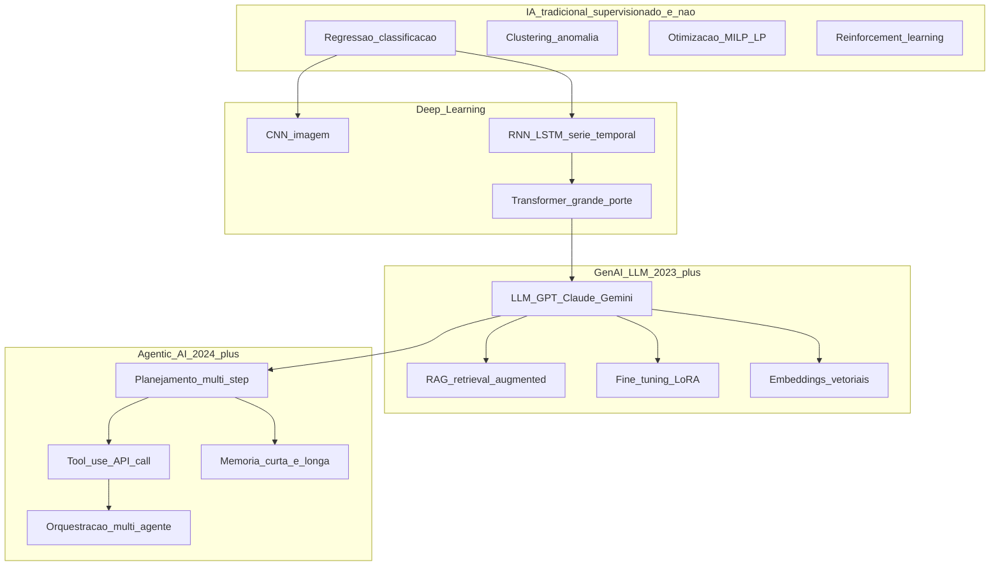

# IA na *supply chain*: casos de uso, governança e risco — modelo não é dono da decisão (ainda)

**IA** na *supply chain* aparece em **forecast** (demanda, lead time), **otimização** (rede, estoque, rota, *picking*), **detecção de anomalia** (fraude, qualidade, fadiga ativo), **classificação de risco** (fornecedor, cliente, rota), **NLP em contratos** (CLM com *clause extraction*), **assistente generativo** (*guided buying*, *RAG* sobre manuais e contratos), e — fronteira 2026 — **agentes** (*agentic AI*) que **executam tarefas** com guardrails. **Governança** responde: **quem aprova** o modelo, **com que dado**, **como se audita viés/drift**, **quando o humano intervém**, **como se desliga** em crise (*kill switch*), **quem responde** se decisão prejudica terceiro (cliente, fornecedor, funcionário, sociedade).

Esta aula é **literacia estratégica + governança** — implementação técnica detalhada (Python, MLOps, *fine-tuning*) pertence à trilha **Automação e Digitalização**. Aqui ensina-se a **decidir com IA** sem cair em hype nem em paralisia.

---

## Objetivos e resultado de aprendizagem

Ao final desta aula, você será capaz de:

- Mapear **8 casos de uso** de IA na SC com **maturidade**, **dado pré-condição**, **decisor**.
- Diferenciar **ML clássico**, **deep learning**, **GenAI/LLM**, **RAG** e **agentes**.
- Aplicar **governança em 6 etapas** (data → modelo → validação → produção → monitoramento → desligamento).
- Reconhecer **EU AI Act** (high-risk vs limitado), **NIST AI RMF**, **ISO 42001**, **ANPD** e jurisprudência BR.
- Estabelecer **HITL** (human-in-the-loop), **HOTL** (human-on-the-loop), **HOOTL** (human-out-of-the-loop) por nível de criticidade.
- Reconhecer **viés**, ***drift***, **alucinação**, ***prompt injection***, ***data poisoning***, **caixa-preta**.

**Duração sugerida:** 75 minutos. **Pré-requisitos:** aulas 4.1 (maturidade) e 4.2 (IoT/twin) recomendadas.

---

## Mapa do conteúdo

1. **Gancho TechLar** — modelo «odeia» região + assistente que inventou fornecedor.
2. **8 casos de uso** com maturidade, ROI, pré-condição, risco.
3. **Taxonomia IA**: ML clássico, deep learning, GenAI, RAG, agentes.
4. **Governança em 6 etapas** — data → modelo → validação → produção → monitor → desligamento.
5. **Regulação**: EU AI Act, NIST AI RMF, ISO 42001, ANPD/LGPD, OECD AI Principles.
6. **Risco específico GenAI**: alucinação, *prompt injection*, *data poisoning*, *jailbreak*, IP/copyright.
7. **HITL / HOTL / HOOTL** — política por criticidade.
8. **Casos**: Walmart Element, Amazon GenAI seller, Maersk Contract AI, fracasso McDonald's drive-thru AI.

---

## Gancho — TechLar e dois experimentos com IA

### Experimento 1 — modelo de alocação «odeia» região Norte

A TechLar lançou em maio 2024 um modelo de **alocação dinâmica de estoque** para reduzir capital de giro. Treinado com 36 meses de dados ERP. Função objetivo: minimizar excesso/ruptura. Em 90 dias, ***o modelo recomendou cortar 38% do estoque do CD-Manaus***.

Comitê iria aprovar quando uma analista — recém-vinda de Belém — perguntou: **«por que tão agressivo no Norte?»**.

Auditoria descobriu:

| Causa raiz | Descoberta |
|---|---|
| Dado histórico Norte 2019–2022 | vendas baixas por **falha comercial** (sem rep, sem campanha, fora de logística), não por baixa demanda real |
| Dado de Manaus enviesado | 47% pedidos perdidos eram **stock-out** registrado como «sem demanda» |
| Mercado Norte 2024 | crescendo **+19% a/a** (boom indústria 4 polo de Manaus), invisível ao modelo |
| Demanda reprimida | levantamento qualitativo com 12 distribuidores AM/PA/RR mostrou **R$ 14 mi/ano não capturados** |

O modelo **profetizou o passado distorcido**. **Bias amplificado.** Sem **auditoria** humana e **revisão ética/comercial**, «objetividade matemática» viraria **discriminação comercial regional + auto-sabotagem + redução de mercado**. Teria custado **−R$ 22 mi/ano** em receita. CSCO **derrubou** a recomendação; lançou *retraining* com dado **corrigido por causa raiz** + variável **«stock-out histórico»** + **Comitê de Revisão Humana** para qualquer decisão >R$ 1 mi.

### Experimento 2 — assistente GenAI que **inventou fornecedor**

Em paralelo, a área de Compras testou um **assistente GenAI** (LLM via SaaS) para responder dúvidas sobre fornecedores aprovados, condições contratuais e benchmarks. Sem RAG configurado, com prompt aberto.

| Pergunta do comprador | Resposta do LLM |
|---|---|
| «Qual é o prazo médio de pagamento do fornecedor *Acme PCB*?» | «O prazo é de 60 dias para pedidos acima de R$ 200k.» |
| **Realidade** | **Acme PCB não existe** no cadastro; LLM **inventou** com confiança total. **Alucinação clássica.** |

| Pergunta | Resposta |
|---|---|
| «Posso aprovar PO para fornecedor não homologado em emergência?» | «Sim, com aprovação verbal do gerente.» |
| **Realidade** | Procedimento exige aprovação escrita Diretor + auditoria pós-fato. **Risco compliance + Lei 14.133/2021 (se setor público) + auditoria SOX (se subsidiária).** |

Sem **guardrails** (prompt restrito, RAG sobre fonte autorizada, validação resposta), assistente vira **gerador de conselho perigoso com voz autoritária**. Foi pausado, redesenhado com **RAG sobre catálogo SRM oficial** + **disclaimer obrigatório** + **logging completo**.

**Analogia do espelho torto:** maquiagem perfeita em reflexo errado — o problema não é o pincel (algoritmo), é o **ângulo** (dado).

**Analogia do estagiário com confiança de CEO:** GenAI é como **estagiário brilhante** que **fala com confiança de CEO** — sem **supervisão**, **fonte verificada** e ***disclaimer***, dará conselho perigoso com cara de certeza.

**Analogia do GPS que mandou para o lago:** automação cega, mesmo com tecnologia certa, com dado/contexto errado leva ao desastre. Humano deveria ter olhado pelo retrovisor.

---

## Conceito-núcleo

### Taxonomia IA aplicada à SC

**Legenda:** maturidade técnica vai **da esquerda (estável, 30+ anos)** à **direita (fronteira, 2024–2026)**. Risco regulatório também cresce.

### **8 casos de uso de IA na SC** com maturidade

| # | Caso de uso | Tipo IA | Maturidade | ROI típico | Pré-condição dado | Decisor |
|---|---|---|---|---|---|---|
| 1 | **Forecast demanda** (statistical + ML) | regressão, ARIMA, Prophet, LightGBM | madura | erro −15 a −30% vs naive | 24m+ histórico limpo, promoção marcada | planejamento |
| 2 | **Otimização rede / inventário** | MILP, MEIO, RL | madura | capital giro −10 a −20% | rede modelada, custos confiáveis | CSCO + S&OP |
| 3 | **Detecção fraude / atraso / qualidade** | clustering, isolation forest, anomaly | madura | recovery R$ x cyber/qualidade | eventos integrados, label histórico | torre + qualidade |
| 4 | **Roteamento dinâmico** (VRP + ML) | metaheurística + ML | madura | km/parada −8 a −15% | OD, restrições, telemetria | logística |
| 5 | **Score risco fornecedor** | classification + ensemble | em maturação | rupturas −20 a −40% | financeiro + qualidade + news + ESG | SRM + compliance |
| 6 | **Visão computacional** (qualidade, *picking*, segurança) | CNN | madura industrial | refugo −X%, acidente −Y% | imagens labeladas em volume | qualidade + segurança |
| 7 | **GenAI assistente** (compras, planejamento, atendimento) com **RAG** | LLM + RAG | emergente | produtividade +10–30% | corpus oficial digital, RAG configurado | usuário + governança |
| 8 | **Agentic AI** (executa tarefas multi-step) | LLM + tools + planning | fronteira (alto risco) | ainda incerto | guardrails robustos, sandbox | piloto monitorado |

### Governança em 6 etapas — *AI Lifecycle*

```mermaid
flowchart LR
  subgraph e1[1_Dado]
    D1[Coleta_consentimento_LGPD]
    D2[Limpeza_curadoria]
    D3[Detec_vies_e_lacuna]
    D4[Versionamento_lineage]
  end
  subgraph e2[2_Modelo]
    M1[Algoritmo_escolhido]
    M2[Treino_com_split_temporal]
    M3[Hiperparametros_documentados]
    M4[Versao_em_registry]
  end
  subgraph e3[3_Validacao]
    V1[Backtest_baseline_humano]
    V2[Bias_test_subgrupos]
    V3[Explainability_SHAP_LIME]
    V4[Adversarial_test]
    V5[Aprovacao_comite]
  end
  subgraph e4[4_Producao]
    P1[Deploy_canary_AB]
    P2[Logging_input_output]
    P3[Latencia_e_custo]
    P4[Disclaimer_ao_usuario]
  end
  subgraph e5[5_Monitoramento]
    MO1[Drift_dado_e_concept]
    MO2[Performance_realtime]
    MO3[Bias_drift]
    MO4[Incidente_e_RCA]
    MO5[Retreino_cadenciado]
  end
  subgraph e6[6_Desligamento]
    K1[Kill_switch_ativo]
    K2[Rollback_versao]
    K3[Sunset_planejado]
    K4[Auditoria_pos_morte]
  end
  e1 --> e2 --> e3 --> e4 --> e5
  e5 -.drift_critico.-> e6
  e5 -.retreino.-> e2
  e6 -.relancamento.-> e1
```

**Legenda:** ciclo **fechado** com **6 etapas**, cada uma com **responsável** (RACI). Falha em qualquer = **risco**.

### **HITL / HOTL / HOOTL** — política por criticidade

| Nível | Definição | Exemplo SC | Quando usar |
|---|---|---|---|
| **HITL** (human-in-the-loop) | humano **aprova** cada decisão antes ação | aprovação PO >R$ 100k sugerido por GenAI; *award* fornecedor | decisão financeira/legal/segurança |
| **HOTL** (human-on-the-loop) | humano **monitora** e **pode intervir** | roteirização dinâmica TMS; *guided buying* sugestões | decisão operacional |
| **HOOTL** (human-out-of-the-loop) | sistema autônomo, humano só em exceção | *picking robotizado*, *demand forecast* baseline | decisão técnica de baixo impacto unitário |

**Regra prática (EU AI Act compatível):** classifique cada caso de uso em **alto/médio/baixo risco** e mapeie **HITL/HOTL/HOOTL**. **Nunca HOOTL em alto risco.**

---

## Frameworks-chave

### 1. **EU AI Act** (Regulamento UE 2024/1689)

**4 níveis de risco**:

- **Inaceitável** (proibido): manipulação subliminar, scoring social estilo China, identificação biométrica em tempo real em espaço público (com exceções).
- **Alto risco**: emprego, crédito, infra crítica, justiça, biométrica em controle migratório. **Obrigações**: documentação técnica, logging, transparência, supervisão humana, robustez, registro UE.
- **Limitado**: chatbots, deepfake — obrigação **transparência** (informar IA).
- **Mínimo**: filtros spam, recomendação simples — sem obrigação.

**SC clássico** (forecast, otimização, anomalia) é **mínimo a limitado**. **Score de crédito a fornecedor PME** que decide acesso ao mercado pode ser **alto-risco**. Cronograma: aplicação progressiva 2025–2027.

### 2. **NIST AI Risk Management Framework** (AI RMF 1.0)

4 funções: **Govern**, **Map**, **Measure**, **Manage**. Voluntário, referência mundial.

### 3. **ISO/IEC 42001** (2023) — *AI Management System*

Primeira norma certificável de gestão IA. Análoga à ISO 9001/27001.

### 4. **OECD AI Principles** (2019, atualizada 2024)

5 valores: crescimento inclusivo, valores humanos, transparência, robustez, accountability.

### 5. **ANPD Brasil** (Resolução CD/ANPD nº 4/2023)

Tratamento de dado pessoal por IA com decisão automatizada — direito a revisão humana (Art. 20 LGPD).

### 6. **PL 2338/2023 BR** (Marco Legal IA Brasil — em tramitação)

Inspirado em EU AI Act; classificação por risco; SIA (Sistema Nacional Regulação IA).

### 7. **EDPB Opinion 28/2024** — uso LLM com dado pessoal UE

### 8. **NYC Local Law 144** (2023) — bias audit obrigatório IA em RH (referência)

### 9. **Singapore Model AI Governance Framework** (referência asiática)

### 10. **Davenport — *Cognitive Enterprise*** + **Brynjolfsson — *Generally Capable Machines***

---

## Aprofundamentos — variações setoriais e geográficas

### Brasil — particularidades

- **LGPD Art. 20**: titular tem direito a **revisão humana** de decisão automatizada que afete interesses. Score de fornecedor PF (MEI) ou cliente PF pode acionar.
- **PL 2338/2023** em tramitação Senado; pressão pela aprovação 2026.
- ***Marco Civil da Internet*** + LGPD = base.
- ***Custo de compute*** GPU em BR alto + ICMS sobre serviço SaaS — Reforma Tributária 2026 pode aliviar.
- ***Soberania de dado***: SaaS US (OpenAI, Anthropic) tem subprocessador em jurisdição com tratado EUA-BR; bancos centrais e setor regulado migrando para **on-prem** ou **cloud BR** (Azure São Paulo, AWS São Paulo, Oracle).
- ***Maturidade GenAI BR*** (2024–2025): adoção **rápida em PoC** (60% empresas); **<8% em produção governada**; gap = governança.

### Casos globais

- ***Walmart Element***: plataforma interna ML serve forecast, replenishment, pricing. *In-house* + open source + cloud híbrido.
- ***Amazon Bedrock*** + assistant para sellers — recomendação produto, escrita listing, suporte.
- ***Maersk + Contract AI***: NLP em CLM (extração cláusula, alerta vencimento, scoring risco contrato) — referência.
- ***Procter & Gamble + Microsoft Copilot for SC***: *guided buying*, análise spend.
- ***Unilever + GenAI***: marketing + R&D + SC.
- ***Coca-Cola FEMSA***: forecast + roteirização IA, América Latina.
- ***JBS / BRF***: visão computacional qualidade + classificação cortes — referência BR.
- ***Mercado Livre / Magalu***: forecast + recomendação + GenAI atendimento.
- **Fracasso a estudar — *McDonald's drive-thru AI*** (2024): assistente AI desligado em 100+ unidades por **ordem errada repetida** (sundae 9.000 pratos, bacon não pedido em sorvete) — caso clássico **HOTL falhou** sem **kill switch automático** quando *false positive* ultrapassou limiar.
- ***IBM Watson Health* (encerrado)**: lição de **promessa exagerada vs entrega real**.

### Geopolítica IA 2025–2026

- ***Export controls* GPU* (NVIDIA H100/Blackwell) US→CN restritos** — afeta cloud asiática.
- **Soberania**: UE (Mistral), CN (Qwen, DeepSeek, Doubao), US (OpenAI, Anthropic, Google) competem.
- ***Trump 2026 e tarifas*** sobre eletrônica e datacenter — pressão upstream.

---

## Trade-offs estratégicos

| Decisão | A favor | Contra |
|---|---|---|
| **Automatizar decisão** (HOOTL) | escala | rigidez em crise, viés invisível |
| **HITL** | controle | gargalo, lentidão |
| **Modelo *in-house*** | controle, IP, customização | capex talento + GPU + MLOps |
| **Modelo SaaS** (OpenAI, Anthropic) | velocidade, qualidade fronteira | dado vai p/ vendor, dependência |
| ***Open source*** (Llama, Mistral, DeepSeek) | flexibilidade, custo, soberania | suporte, atualização |
| ***Explicabilidade alta* (linear, árvore)** | regulador, operação confia | precisão menor às vezes |
| ***Black-box* (deep learning, ensemble)** | precisão | resistência operação, regulador questiona |
| **Dado real interno** | contexto | viés, lacuna |
| **Dado sintético** | privacidade, volume | viés diferente, validação difícil |
| **GenAI sem RAG** | rápido | alucinação, sem fonte |
| **GenAI com RAG** | grounded, citável | engenharia, custo |
| **Agentic AI** | promessa enorme | risco, imaturo, governança incipiente |

---

## Caso prático — TechLar com 3 casos de uso IA governados

| # | Caso uso | Tipo IA | Investimento | Benefício/ano | Governança |
|---|---|---|---|---|---|
| 1 | **Forecast demanda ML** (LightGBM) substitui ARIMA | ML supervisionado | R$ 280k (plataforma + dado + 2 FTE 12m) | erro WAPE 23% → 14%; estoque −R$ 1,8 mi capital | HOTL — planejamento aprova quinzenalmente; comitê IA mensal |
| 2 | **Score risco fornecedor** | classification | R$ 180k | rupturas −38%, claim −R$ 480k | HITL para score >70 (alto risco); revisão humana obrigatória |
| 3 | **GenAI assistente compras com RAG** sobre CRM, SRM, contratos, política | LLM + RAG | R$ 220k (RAG + LLM API + governança) | 18% redução tempo cotação; *guided buying* compliance | HITL para PO >R$ 100k; logging + auditoria + disclaimer |

**Comitê IA TechLar** (mensal): CSCO + CIO + Compliance + DPO + Jurídico. Charter: aprovar novo modelo, revisar drift, autorizar desligamento.

***AI Risk Register*** vivo: 12 modelos com classificação risco (UE AI Act + NIST), data próximo *audit*, *kill switch* documentado, *fallback* humano.

---

## Erros comuns e armadilhas

1. ***PoC* sem owner** e sem **linha de base humana** — não dá para comparar ROI.
2. **Treinar com dado ERP sujo** «porque é o que temos» — TechLar 2024 caso 1.
3. **IA comprada como substituto** de política clara de estoque/compra — vira opacidade.
4. **Alucinação GenAI** sem RAG, sem disclaimer — TechLar 2024 caso 2.
5. **Sem *kill switch*** — modelo erra em público, ninguém sabe desligar.
6. **Caixa-preta** sem explicação para operação — resistência + erro.
7. **Vendor lock-in** SaaS US sem *exit strategy* + soberania.
8. **EU AI Act + ANPD ignorados** — risco multa + reputacional.
9. **Bias não auditado** em subgrupos (região, gênero, fornecedor PME) — TechLar 2024 caso 1.
10. **Drift não monitorado** — modelo envelhece em silêncio.
11. ***Prompt injection / data poisoning*** ignorados — *attack vector* novo.
12. ***Shadow AI*** (funcionários usando ChatGPT pessoal com dado da empresa) — vazamento Samsung 2023 caso paradigmático.

---

## Risco e governança específicos GenAI

| Risco | Descrição | Mitigação |
|---|---|---|
| **Alucinação** | resposta confiante mas falsa | RAG + grounding + disclaimer + temp baixa |
| ***Prompt injection*** | usuário manipula prompt para sair guardrail | input sanitization + system prompt blindado + monitoring |
| ***Jailbreak*** | tenta contornar safety | red team contínuo + filtros |
| ***Data poisoning*** | dado treino contaminado | curadoria + assinatura + reproducibility |
| ***Membership inference*** | atacante descobre se dado X estava no treino | privacy preserving ML, DP |
| **IP / copyright** | LLM treinado com obra protegida | due diligence vendor + indenização contratual |
| **Vazamento confidencial** | usuário cola dado sensível em prompt SaaS | DLP + uso aprovado + on-prem para sensível |
| ***Model collapse*** | LLM treinado em saída de LLM degrada | curadoria dado treino |
| ***Shadow AI*** | uso não autorizado pessoal | política + ferramenta corporativa + treinamento |

---

## KPIs estratégicos

| KPI | Pergunta | Dono | Fonte | Cadência | Playbook |
|---|---|---|---|---|---|
| **WAPE / MAPE / sMAPE vs baseline** | modelo melhor que naive? | Data Science | model registry | Mensal | retrain ou rollback |
| **Valor econômico (R$) do modelo** | ROI real? | CFO | A/B test | Trimestral | kill se negativo |
| ***Fairness/Bias score* por subgrupo** | discriminação? | Comitê Ética | bias test | Trimestral | retrain com correção |
| ***Drift score*** (feature/concept) | mundo mudou? | MLOps | monitoring | Diário | retrain trigger |
| **Tempo médio intervenção humana (HITL)** | gargalo? | Operações | logging | Mensal | UX, threshold |
| **Taxa de incidente modelo (FN/FP críticos)** | risco operacional? | RCA | log + ticket | Mensal | RCA + correção |
| ***Explainability coverage* (% decisões com SHAP/LIME)** | aceitação? | Data Science | log | Mensal | aumentar |
| ***Hallucination rate* GenAI** | alucinação? | GenAI ops | red team | Semanal | RAG melhor + filter |
| ***Prompt injection attempts blocked* (%)** | cyber AI? | Security | WAF + log | Diário | refinar guardrail |
| **% modelos com kill switch testado nos 90d** | governança? | Comitê IA | audit | Trimestral | testar |
| **% modelos classificados por EU AI Act/NIST** | compliance? | Compliance | registry | Anual | classificar 100% |
| ***Time-to-rollback* (s/min)** | crise pronta? | MLOps | drill | Semestral | reduzir |

---

## Tecnologias e ferramentas habilitadoras

- **ML platform**: **Databricks ML**, **AWS SageMaker**, **Azure ML**, **Google Vertex AI**, **DataRobot**, **Dataiku**, **H2O.ai**.
- **MLOps**: **MLflow**, **Weights & Biases**, **Kubeflow**, **Comet**, **Neptune.ai**.
- **GenAI / LLM**: **OpenAI GPT-4o/o1/o3**, **Anthropic Claude 3.5 / 4 Sonnet/Opus**, **Google Gemini 2/3**, **Meta Llama 3.x**, **Mistral**, **DeepSeek-V3**, **Qwen 2.5**.
- **GenAI enterprise**: **Microsoft Copilot for Supply Chain**, **Microsoft Copilot Studio**, **Salesforce Einstein**, **SAP Joule**, **Oracle AI Apps**, **AWS Bedrock**, **Google Vertex AI Agent Builder**.
- **RAG / Vector DB**: **Pinecone**, **Weaviate**, **Qdrant**, **ChromaDB**, **PostgreSQL pgvector**, **Elasticsearch**, **OpenSearch**.
- **Orquestração agentes**: **LangChain**, **LangGraph**, **LlamaIndex**, **AutoGen (Microsoft)**, **CrewAI**, **Haystack**.
- **Bias / Explainability**: **SHAP**, **LIME**, **Fairlearn**, **AIF360 (IBM)**, **What-If Tool (Google)**, **Aequitas**.
- **Drift / Monitoring**: **Evidently AI**, **Arize AI**, **Fiddler AI**, **WhyLabs**, **Datadog ML monitoring**.
- **Red-team / Safety**: **Robust Intelligence**, **Lakera**, **Protect AI**, **HiddenLayer**.
- **CLM com NLP**: **Icertis**, **SirionLabs**, **DocuSign CLM (Insight)**, **Evisort**, **Ironclad**, **Lexion**.
- **Visão SC**: **Cogniac**, **Datalogic**, **Cognex** (industrial).
- **Forecast SC ML**: **ToolsGroup SO99+**, **John Galt Atlas**, **Logility**, **Algonomy**, **Nostradamus** (BR).

---

## Glossário rápido

- **ML / DL / GenAI / LLM**: machine learning / deep learning / generative AI / large language model.
- **RAG**: Retrieval-Augmented Generation.
- **Embedding**: vetor numérico que representa significado.
- **Fine-tuning / LoRA**: adaptação de modelo pré-treinado.
- **Agentic AI**: IA que executa tarefas multi-step com tools.
- **HITL / HOTL / HOOTL**: human-in/on/out-of-the-loop.
- ***Kill switch***: desligamento de emergência.
- ***Drift*** (data / concept): mudança da distribuição dado / relação dado-alvo.
- ***Bias***: viés sistemático.
- ***Hallucination***: invenção confiante de fato falso.
- ***Prompt injection / jailbreak / poisoning***: ataques GenAI.
- **Explainability (SHAP, LIME)**: técnicas para abrir caixa-preta.
- **EU AI Act, NIST AI RMF, ISO 42001**: marcos regulatório/normativo IA.
- **HITL** obrigatório em decisões alto-risco (UE AI Act).

---

## Aplicação — exercícios

**Exercício 1 (20 min) — Mapa de casos de uso governado.** Para sua empresa, liste **3 casos de uso** de IA. Para cada, preencha: **tipo IA**, **maturidade**, **pré-condição dado**, **risco principal**, **HITL/HOTL/HOOTL**, **classificação EU AI Act**, **owner**.

**Gabarito:** pré-condição **específica** (não «dados bons»); risco específico (não «pode dar ruim»); HITL em alto-risco; classificação EU AI Act explícita.

**Exercício 2 (15 min) — Auditoria de bias.** Para o caso de uso TechLar #1 (alocação estoque «odeia» Norte), proponha **3 ações** de remediação: dado, modelo, governança. Quem audita?

**Gabarito:** corrigir dado (variável stock-out, mercado real); modelo com restrição de fairness ou subgrupo; comitê com diversidade regional + auditoria externa.

**Exercício 3 (15 min) — Política HITL/HOTL/HOOTL.** Classifique 5 decisões SC (roteirização, aprovação PO >R$ 100k, *picking* robô, score risco fornecedor, atendimento cliente GenAI) por nível humano + justifique.

**Exercício 4 (15 min) — Plano kill switch.** Para um modelo crítico (forecast), descreva: **trigger desligamento**, **fallback** (qual baseline humano/estatística), **aprovador**, **comunicação stakeholder**, **prazo restabelecimento**.

**Exercício 5 (10 min) — Compliance EU AI Act.** Sua empresa exporta para UE com modelo IA decidindo prazo de pagamento a fornecedor PME UE. Risco? Obrigações? Ações?

---

## Pergunta de reflexão

Qual decisão da sua cadeia você **não** confiaria a um modelo **sem** auditoria externa de dado + supervisão humana documentada — e como você explicaria essa decisão a um **conselho que vem cobrando «mais IA»** sem entender o que ela é?

---

## Fechamento — takeaways

1. IA é **amplificador** de dados e política — não mágica.
2. **Governança é produto vivo** com 6 etapas: dado→modelo→validação→produção→monitor→desligamento.
3. **HITL/HOTL/HOOTL** se decide por **criticidade**, não por «cool factor».
4. **EU AI Act + NIST AI RMF + ISO 42001 + ANPD** definem moldura regulatória 2024–2027.
5. **GenAI** trouxe risco novo: alucinação, prompt injection, IP — guardrails + RAG + disclaimer obrigatórios.
6. **Casos**: Walmart Element, Maersk Contract AI, McDonald's drive-thru fail, TechLar 2024 — aprenda com sucessos *e* fracassos.
7. **Humano no loop** não é fraqueza — é **controle de risco** em decisão sensível e **conformidade legal**.

---

## Referências

1. RUSSELL, S.; NORVIG, P. *Artificial Intelligence: A Modern Approach*. Pearson, 4ª ed., 2020.
2. GOODFELLOW, I.; BENGIO, Y.; COURVILLE, A. *Deep Learning*. MIT Press, 2016.
3. BENDER, E.; GEBRU, T. et al. *On the Dangers of Stochastic Parrots*. FAccT, 2021.
4. DAVENPORT, T. H.; RONANKI, R. *Artificial Intelligence for the Real World*. *HBR*, 2018.
5. BRYNJOLFSSON, E.; ROCK, D.; SYVERSON, C. *Generally Capable Machines*. NBER, 2023.
6. UNIÃO EUROPEIA — Regulamento (UE) 2024/1689 (EU AI Act).
7. NIST — *AI Risk Management Framework 1.0* (2023).
8. ISO/IEC 42001:2023 — *AI management systems*.
9. OECD — *AI Principles* (2019, atualizado 2024).
10. ANPD — Resolução CD/ANPD nº 4/2023.
11. BRASIL — PL 2338/2023 (Marco Legal da IA).
12. GARTNER — *Hype Cycle for Generative AI* (anual); *Magic Quadrant for Cloud AI*.
13. McKINSEY — *The State of AI in 2024*; *Generative AI in the Supply Chain*.
14. SAMSUNG SECURITY INCIDENT (2023) — caso shadow AI.
15. McDONALD'S AI DRIVE-THRU (2024) — caso fracasso IA conversacional.

---

**Ponte:** trilha [Automação e Digitalização](../../trilhas.md) (Python, ML operacional, MLOps); [Previsão de demanda](../../trilha-fundamentos-e-estrategia/modulo-03-planejamento-demanda-sop/aula-01-previsao-demanda-metodos.md); aulas 4.1 (maturidade) e 4.2 (IoT/twin) desta trilha são pré-requisito conceitual; conclusão da trilha **Logística Estratégica**.
