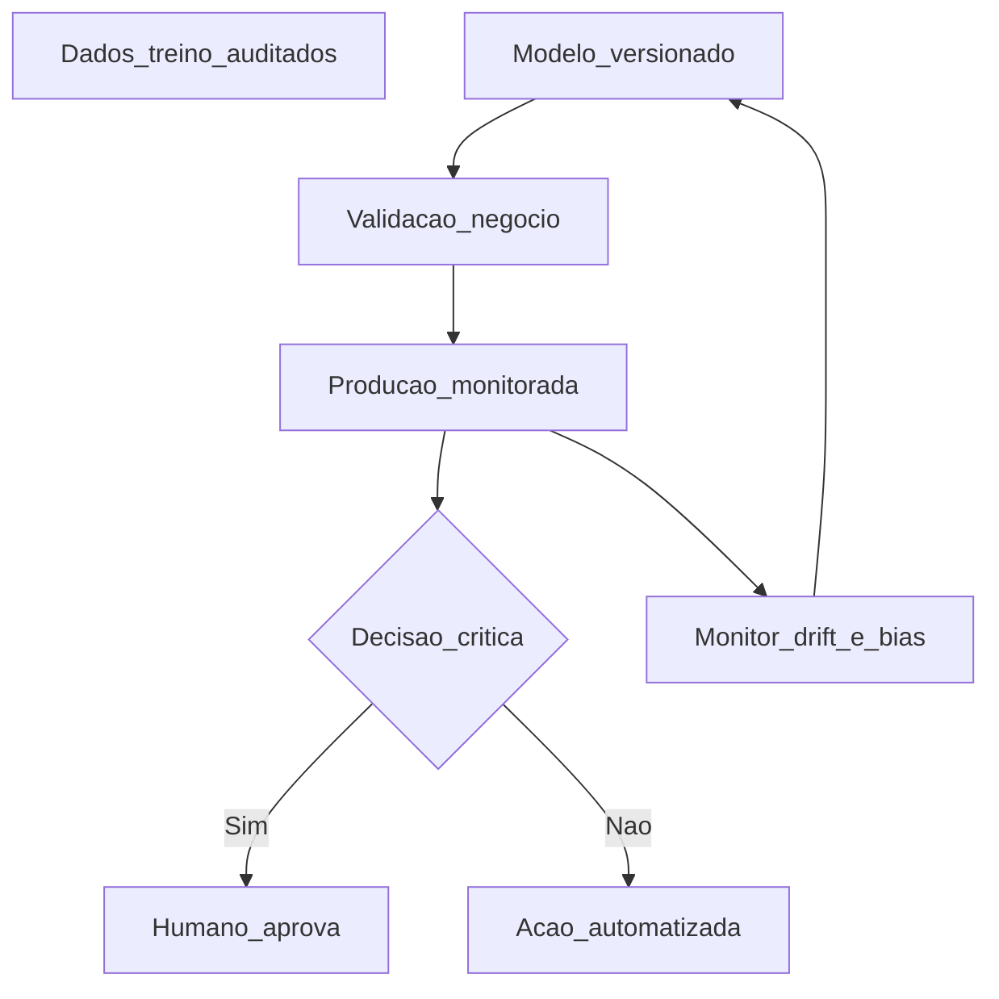

# IA: casos de uso, governança e risco — modelo não é dono da decisão (ainda)

**IA** na *supply chain* aparece em **previsão**, **otimização de estoque/rede**, **detecção de anomalia**, **classificação de risco** de fornecedor e **assistência** a compradores (*guided buying*). **Governança** responde: **quem** aprova modelo, **com que dados**, **como** se audita viés, **quando** o humano deve intervir e **como** se desliga o modelo em crise. Esta aula é **literacia estratégica** — implementação técnica (Python, MLOps) pertence à trilha **Automação e digitalização**.

---

## Objetivos e resultado de aprendizagem

**Ao final desta aula**, você será capaz de:

- Descrever **três** casos de uso com **pré-condições** de dados e processo.  
- Nomear **riscos** (viés, *drift*, dependência de terceiro, ciber).  
- Propor **human-in-the-loop** para decisões sensíveis.

**Duração sugerida:** 60–75 minutos.

---

## Gancho — a TechLar e o modelo que «odeia» região

Um modelo de **alocação de estoque** da **TechLar** treinou com dados em que **uma região** tinha historicamente **menos vendas** por **falha comercial**, não por **falta de demanda**. O sistema **sugeriu** menos estoque — **profetizou** o passado distorcido. Sem **auditoria** de dados e **revisão** ética, «objetividade» virou **discriminação comercial** e **auto-sabotagem**.

**Analogia do espelho torto:** maquiagem perfeita em reflexo errado — o problema não é o pincel, é o **ângulo** (*dados*).

---

## Mapa do conteúdo

- Casos de uso: previsão, anomalia, otimização assistida, NLP em contratos (*awareness*).  
- Viés, *drift*, explicabilidade (*consenso de mercado*: importância crescente).  
- Fornecedor de modelo em nuvem — **dado** e **soberania**.  
- *Playbook* de desligamento (*kill switch*).

---

## Conceito núcleo

**Caso de uso (template pedagógico):**

| Caso | Entrada mínima | Saída | Decisor |
|------|----------------|-------|---------|
| Previsão demanda | histórico limpo, promoções marcadas | baseline + intervalo | planejamento |
| Detecção fraude/atraso | eventos logísticos integrados | alerta priorizado | torre |
| Sugestão de ordem | lead time confiável, política de estoque | quantidade sugerida | comprador |
| Risco fornecedor | financeiro + qualidade + notícias | score | SRM + compliance |

*Hipótese pedagógica:* «Decisor» pode ser **assistido** ou **automatizado** conforme política — deve estar **escrito**.

**Legenda:** losango = **decisão de política**; `DRIFT` força **re-treino** ou **rollback** — *governança* contínua.

**Riscos nomeados:**

- **Viés** histórico (promoção, sazonalidade mal marcada).  
- ***Drift***: mundo muda; modelo envelhece.  
- **Caixa-preta** sem explicação para operação — resistência e erro.  
- **Fornecedor SaaS** com **subprocessador** em jurisdição sensível (*alto nível* — compliance detalha).

---

## Trade-offs

- **Automatizar** decisão **ganha** escala; **perde** flexibilidade em crise (guerra, pandemia).  
- **Explicabilidade** pode **reduzir** precisão marginal — negociar com regulador e operação.  
- **Mais dados** melhoram modelo; **aumentam** superfície de **privacidade** e segurança.

---

## Aplicação — exercício

Liste **três** casos de uso de IA para a sua cadeia (ou fictícia). Para cada um: **pré-condição de dado**, **um risco** (viés, *drift*, segurança) e **ponto de intervenção humana** obrigatório.

**Gabarito pedagógico:** pré-condição deve ser **específica** (não «dados bons»); risco não pode repetir genérico três vezes; humano deve aparecer em **decisão de compra grande**, **segurança alimentar**, **multa contratual** ou similar.

---

## Erros comuns e armadilhas

- **PoC** sem *owner* e sem **linha de base** humana.  
- Treinar com **dado ERP sujo** «porque é o que temos».  
- IA comprada como **substituto** de política de estoque clara.  
- Não ter **plano** quando modelo **erra** em público (cliente, imprensa).

---

## KPIs e decisão

- **WAPE/MAPE** ou erro de previsão *versus* baseline simples.  
- **Valor económico** (menos ruptura, menos estoque) com **teste A/B** ou *backtesting* honesto.  
- **Tempo** de intervenção humana médio.  
- **Incidentes** de modelo (falsos negativos/positivos críticos).  
- **Cobertura** de *explainability* aceita pela operação.

---

## Fechamento — três takeaways

1. IA é **amplificador** de dados e política — não mágica.  
2. Governança é **produto** com *lifecycle*, não slide único.  
3. Humano no loop não é fraqueza — é **controlo de risco** em decisão sensível.

**Pergunta de reflexão:** qual decisão da sua cadeia você **não** confiaria a um modelo **sem** auditoria externa dos dados?

---

## Referências

1. GOODFELLOW, I.; BENGIO, Y.; COURVILLE, A. *Deep Learning*. MIT Press — fundamentos (*não* necessário ler cap a cap para esta aula).  
2. EU *AI Act* / OECD *AI Principles* — **quadros regulatórios** em evolução (consultar texto atual ao aplicar).  
3. Davenport, T. H.; Ronanki, R. *Artificial Intelligence for the Real World*. *HBR* — casos de uso empresariais.  
4. ASCM — *technology* e analytics na cadeia — [ascm.org](https://www.ascm.org/).

**Ponte:** catálogo [Automação e digitalização](../../trilhas.md) (Python, ML operacional); [Previsão de demanda](../../trilha-fundamentos-e-estrategia/modulo-03-planejamento-demanda-sop/aula-01-previsao-demanda-metodos.md).
