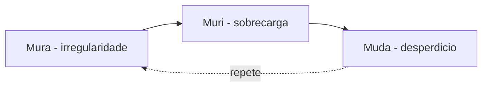
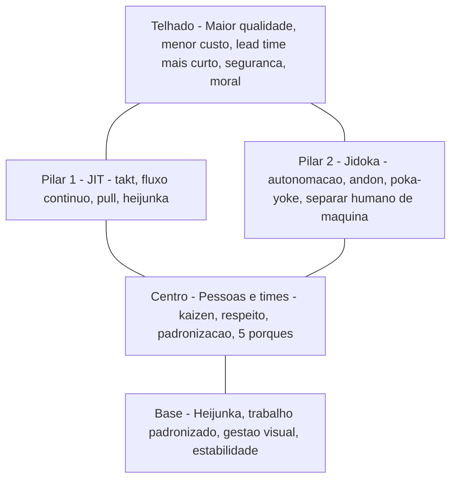

# Valor, cliente e os desperdícios na logística — o que o cliente paga *versus* o que a fábrica interna adora

**Lean** na logística começa com uma pergunta desconfortável: **desta atividade, o que o cliente está disposto a pagar (ou a esperar)?** O resto é **necessário** (compliance, segurança, fiscal) ou **desperdício** — e desperdício, em supply chain, mora em todo lado: no **CD**, no **transporte**, no **pedido**, no **dado** que viaja errado e na **decisão** que demora a ser tomada.

Esta aula dá **vocabulário comum** para reuniões entre operações, vendas e finanças, sem transformar Lean em decoração de parede. É a base do **pensamento Lean** (Womack & Jones), a antessala do **VSM** (Rother & Shook) e o ponto de partida para o módulo Six Sigma — porque você só atribui **causa** (X) a um Y bem definido pelo **cliente**.

---

## Objetivos e resultado de aprendizagem

**Ao final desta aula**, você será capaz de:

- Definir **valor** em logística a partir da perspectiva do cliente final, do contrato B2B e do P&L.
- Aplicar os **sete desperdícios clássicos** de Ohno + o **oitavo** (talento não utilizado) e o **nono** (energia/recursos), *consenso de mercado* em adaptações Lean modernas.
- Calcular **eficiência de fluxo** (*flow efficiency* = tempo de valor agregado ÷ lead time total) num exemplo numérico de pedido B2C.
- Marcar um fluxo pedido→entrega com **etiquetas** de desperdício e estimar **% de tempo** desperdiçado.
- Distinguir **atividade ocupada** (*activity*) de **criação de valor** (*throughput*) e usar essa distinção em conversa com gerência.

**Duração sugerida:** 75–90 minutos (com mini-laboratório).
**Pré-requisitos:** noções de fluxo logístico (recebimento → expedição); ideal ter visto [Estrutura de custos](../../trilha-fundamentos-e-estrategia/modulo-04-custos-logisticos-performance/aula-01-estrutura-custos-logisticos.md).

---

## Mapa do conteúdo

1. Gancho TechLar — produtividade que enganou.
2. Conceito-núcleo — valor, necessário e desperdício.
3. Os 7 + 1 + 1 desperdícios (TIM WOODS-E) com exemplos logísticos por canal.
4. Casa Lean — onde os desperdícios entram na arquitetura TPS.
5. Fluxo pedido→entrega com etiquetas e cálculo de **flow efficiency**.
6. Trade-offs (cortar desperdício *vs.* estoque/serviço).
7. Mini-lab numérico passo a passo.
8. Erros comuns, comportamento, KPIs, ferramentas, glossário.
9. Exercícios + gabarito + reflexão + referências + pontes.

---

## Gancho — a TechLar «produtiva» e irritante

O CD da **TechLar** (varejista BR de eletrodomésticos com mix B2B/B2C, ~12 000 SKUs ativos) batia meta de **140 linhas/hora·separador**, valor «de orgulho» nos rituais. O cliente B2B, porém, via **OTIF de 84%** (meta contratual 95%) e **erro de mix em 1,9%** dos pedidos. A equipe estava «ocupada» com **reprocesso**, **busca de endereço** (slotting envelhecido) e **espera na doca** (janela apertada com transportadora). O painel de produtividade **mentiu** até alguém medir **lead time interno** (pedido liberado → carregado) e **first time right**: descobriu-se que **6,8h** das **8,5h** de lead time eram **espera** — *flow efficiency* de **20%**.

> **Analogia do restaurante michelin sobrelotado:** cozinha a correr, fogões em chamas, garçons a saltar mesas — mas pratos voltam, clientes esperam, dois saem antes do café. **Ocupação ≠ valor entregue.** A *brigade de cuisine* é exemplar; o *fluxo* falhou. Lean ataca o fluxo, não acusa o cozinheiro.

> **Analogia do hospital pronto-socorro brasileiro:** triagem feita, ficha aberta, leito ocupado — mas o paciente espera 4h pelo exame que só tarda porque o porta-maca atende três alas. O médico é ótimo, a maca é boa, o sistema **não flui**.

---

## Conceito-núcleo — valor, necessário, desperdício

### 1. Definição operacional pedagógica

- **Valor** = atividade que **avança** o produto/informação na direção do que o cliente pediu, **no tempo e na qualidade acordados**, **e** pela qual ele aceitaria pagar (ou cuja remoção ele perceberia como perda).
- **Necessário não-valor** (NVA-R, *non value-added required*): inspeção fiscal, conferência regulatória ANVISA/MAPA, segurança, registo SIF, lacre. O cliente não «ama», o negócio **não dispensa**, o regulador exige.
- **Desperdício puro** (*muda* do tipo II): consome tempo, espaço, capital ou talento **sem** mudar o que o cliente valoriza nem cumprir requisito inevitável.

### 2. Os três M de Ohno

A escola Toyota olha **três** males, não só desperdício:

| M | Significado | Exemplo logístico BR |
|---|-------------|----------------------|
| **Muda** | desperdício (atividade sem valor) | conferência tripla; rebobinagem de palete |
| **Mura** | irregularidade (variabilidade artificial) | ondas de picking concentradas das 14h às 17h porque comercial libera em lote |
| **Muri** | sobrecarga (pessoas/máquinas além do limite) | doca planeada para 14 carretas, recebendo 22 nas segundas |

**Insight:** **muri** gera **muda** (gente cansada erra) e **mura** gera **muri** (pico exige horas extras). Atacar só *muda* sem nivelar (*heijunka*) é apagar fumo.

> **Legenda:** o ciclo se autoalimenta. Lean maduro ataca **mura** (nivelamento) primeiro quando o problema é sistêmico; ataca **muda** quando o ponto é pontual.

### 3. Os 7 desperdícios clássicos — TIM WOODS aplicado à logística

Mnemónico inglês original (Ohno cunhou 7; talento é o oitavo, energia/recursos o nono em escolas modernas):

| Sigla | Desperdício | Exemplo logístico BR | Sintoma visível |
|-------|-------------|----------------------|-----------------|
| **T** | Transporte excessivo | palete que cruza 3 zonas (entreposto → recebimento → trânsito → picking) por slotting ruim | empilhador rodando carregado entre 2 corredores não-adjacentes |
| **I** | Inventário (demais) | 90 dias de cobertura de SKU C com promoção cancelada | endereços ocupados, contagem cíclica grande, write-off |
| **M** | Movimento | separador caminha 12 km/turno por área de picking dispersa | pedómetro alto, fadiga, LER |
| **W** | Espera (*Waiting*) | doca esperando ASN; conferente esperando WMS responder | filas de paletes, motorista no celular, separador parado |
| **O** | *Overproduction* | separar wave inteira antes do veículo confirmar | staging cheio, paletes esperando expedição |
| **O** | *Overprocessing* | conferência dupla mesmo após FTR alto; dupla impressão de etiqueta | tempo de ciclo > média setor |
| **D** | Defeitos | picking errado, troca de SKU, etiqueta ilegível, dano em palete | devolução, abertura de ocorrência B2B |
| **S** | *Skills* (talento) — **8.º** | operador detecta gargalo há 2 anos, ninguém pergunta | turnover, sugestões zero, «sempre foi assim» |
| **E** | Energia/recursos — **9.º** | empilhador a gasolina ocioso; iluminação 24h em zona sem turno | conta CEMIG/COPEL alta, carbono |

> **Analogia da viagem rodoviária:** em uma roadtrip Curitiba→Recife, **valor** é km rodado em direção ao destino. **Desperdício** é parar em posto onde só toma café por hábito (overprocessing), dar volta porque o GPS perdeu sinal (movimento), encher tanque que ainda tem 80% (inventário), esperar 40 min na fila do banheiro (espera), trocar pneu defeituoso na estrada (defeito).

### 4. A casa Lean (TPS House) — onde tudo se encaixa

> **Legenda da casa Lean (Liker, *The Toyota Way*):** **base** = estabilidade (sem ela, pilares caem). **JIT** entrega no tempo certo; **jidoka** garante qualidade na fonte. **Pessoas** sustentam a melhoria. **Telhado** = resultados. Cortar desperdício sem **base estável** é como pôr telhado em paredes mal alicerçadas.

---

## Diagrama / Ferramenta visual principal — fluxo etiquetado pedido→entrega

> **Legenda:** cada seta carrega um *muda* candidato (W=espera, M=movimento, D=defeito, O=overproduction/overprocessing). Em cada uma, pergunte: **espera? retrabalho? movimento inútil?** A imagem mental é um **rio com tampões** — Lean remove os tampões um a um.

### Como ler o diagrama no *gemba*

1. Faça uma **caminhada de fluxo** (acompanhe **um** pedido do clique até a expedição). Cronómetro na mão.
2. Em cada caixa anote **tempo de processo** (TP) e em cada seta **tempo de espera** (TE).
3. Calcule **lead time** = ΣTP + ΣTE e **eficiência de fluxo** = ΣTP ÷ Lead Time.
4. Logística brasileira típica: **flow efficiency 8%–25%** em CD B2B; bom benchmark > 35%.

---

## Aprofundamentos — variações setoriais

| Cenário | Onde mora o muda dominante | Contramedida típica |
|---------|----------------------------|---------------------|
| **CD B2C e-commerce alto giro** | overprocessing (embalagem premium em SKU barato), defeito (troca de SKU visualmente parecidos) | foto na lista, embalagem por faixa de valor, picking por lote |
| **CD B2B indústria pesada** | espera (janela transportador), inventário (peças de manutenção) | agendamento online de doca, política min/max revista, *milk run* |
| **Varejo alimentar (distribuidora)** | defeito (ruptura de cold chain), inventário (FEFO mal feito) | sensor IoT em câmara, FEFO por sistema, picking por temperatura |
| **Farma (CD GDP)** | overprocessing fiscal (necessário regulado), defeito (lote/validade) | digitalizar conferência fiscal, *poka-yoke* lote+validade no scan |
| **Agro (insumos)** | transporte (back-haul vazio), espera (safra) | TMS com pool, janela sazonal, mais docas temporárias |
| **Manufatura discreta (linha)** | overproduction (lote grande), espera (setup) | SMED, kanban de componentes, heijunka box |
| **Serviços (3PL multicliente)** | talento (rotina não capturada), defeito (mistura entre clientes) | SOP por cliente, segregação visual, treino cruzado |

---

## Trade-offs e decisão — quando cortar desperdício *fere* outro objetivo

| Decisão | Ganho Lean | Risco se exagerado |
|---------|------------|---------------------|
| Reduzir inventário (puxar) | menos capital, expõe gargalos | ruptura, multa contratual B2B |
| Eliminar conferência | menos overprocessing | aumento de defeito se causa não tratada |
| Centralizar CD único | escala, menos transporte interno | maior lead time ao cliente final, risco logístico |
| Layout «one piece flow» em e-commerce | flow efficiency alta | perde economias de bateria/lote |
| Cortar talento «redundante» | custo curto-prazo | perde memória operacional, mata kaizen |

> **Regra prática:** Lean não é **máquina de cortar**, é **microscópio para focar capital onde o cliente percebe**. Se cortar fere serviço sem economia mensurável, **pare** e refaça VSM.

---

## Caso prático / Mini-laboratório — calculando *flow efficiency* na TechLar

### Dados (fictícios mas plausíveis BR)

Pedido B2B liberado às 09:00. Eventos cronometrados em três pedidos da onda:

| Etapa | Início | Fim | Tipo | Duração (min) |
|-------|--------|-----|------|---------------|
| Espera ERP→WMS (fila) | 09:00 | 09:25 | espera (W) | 25 |
| Validação cadastro (recebimento) | 09:25 | 09:35 | valor (V) | 10 |
| Putaway/transferência endereço | 09:35 | 09:50 | valor parcial (V) | 15 |
| Espera para liberar onda | 09:50 | 10:40 | espera (W) | 50 |
| Picking (caminhada + pega) | 10:40 | 11:20 | V (40) inclui M (12) caminhada | 40 |
| Conferência primária | 11:20 | 11:30 | NVA-R (necessário) | 10 |
| **Conferência dupla** | 11:30 | 11:42 | overprocessing (O) | 12 |
| Espera embalagem | 11:42 | 12:25 | espera (W) | 43 |
| Embalar | 12:25 | 12:50 | valor (V) | 25 |
| Staging | 12:50 | 14:10 | espera (W) | 80 |
| Carregamento | 14:10 | 14:40 | valor (V) | 30 |

### Passo 1 — somar tempos

- **Lead time total** = 09:00→14:40 = **340 min** (5h40)
- **Tempo de valor agregado puro** (V real do ponto de vista do cliente: putaway, picking efetivo descontado caminhada, embalar, carregamento): 15 + (40 − 12) + 25 + 30 = **98 min**
- **Tempo necessário não-valor** (NVA-R): 10 (validação) + 10 (conf. primária) = **20 min**
- **Tempo desperdício puro** (W + O + M dentro de picking): 25 + 50 + 43 + 80 + 12 + 12 = **222 min**

### Passo 2 — calcular eficiências

\[
\text{Flow efficiency} = \frac{T_{valor}}{T_{lead}} = \frac{98}{340} = 28{,}8\%
\]

\[
\text{Process cycle efficiency (PCE)} = \frac{T_{V} + T_{NVA-R}}{T_{lead}} = \frac{118}{340} = 34{,}7\%
\]

\[
\text{Waste ratio} = \frac{222}{340} = 65{,}3\%
\]

### Passo 3 — interpretar e priorizar

- **Maior bloco de muda:** *staging* (80 min) e espera para liberar onda (50 min) e espera embalagem (43 min) — **filas internas** dominam.
- **Conferência dupla:** 12 min × 800 pedidos/dia = **160 h-trabalho/dia** (≈ 20 FTE) gastos em **overprocessing** se a causa-raiz do erro estiver em **picking** (atacar lá com poka-yoke).
- **Caminhada (movimento):** 12 min/pedido — atacar com **slotting ABC** e **golden zone** (ver módulo 02 da trilha Operações).

### Passo 4 — meta de estado futuro

Se eliminássemos **conferência dupla** (após poka-yoke maduro) e cortássemos staging em 50%:

\[
T_{lead}^{*} = 340 - 12 - 40 = 288 \text{ min}; \quad \text{Flow eff}^{*} = \frac{98}{288} = 34\%
\]

Ganho: **+5 p.p.** de eficiência de fluxo, **−15%** de lead time, **liberação de doca** para mais 1 carreta/dia. Tudo isso é tema do A3 do projeto integrador.

---

## Erros comuns e armadilhas

1. **Lean de fachada:** workshop de 5 dias com fotos sorridentes, sem owner nem indicador 90 dias depois. Sintoma: «kaizens» nas paredes, mesma OTIF.
2. **Confundir estoque de segurança com desperdício** sem analisar **variabilidade** (tema do módulo Six Sigma). Cortar SS sem entender σ leva a ruptura.
3. **Focar só no CD** e ignorar **pedido errado upstream**. Defeito de cadastro nasce no comercial; CD apaga incêndio.
4. **«Cliente interno»** virando desculpa. Cliente final ou contrato B2B devem aparecer em cada VSM.
5. **Acusação disfarçada de Lean:** etiquetar pessoa como «desperdício» quebra cultura. Foco em **processo**, não em pessoa.
6. **Cronómetro escondido:** medir tempos sem combinar com a equipe destrói confiança e gera dados manipulados.
7. **Otimizar a média do lead time** ignorando **P90/P99** — cliente paga pela cauda, não pela média.
8. **Confundir Lean com cortar pessoas.** Toyota nunca demitiu por kaizen — releva pessoas para melhorias futuras. Cortar é receita para matar kaizen futuro.

---

## Comportamento e cultura — Lean é gente antes de método

- **Sponsor visível** no *gemba* (não só em comitê) — assina o sintoma e acompanha o ciclo.
- **Líder de área treinado em coaching** (perguntar, não responder).
- **Sugestões valorizadas** (sistema de ideias com *feedback* em ≤7 dias; Toyota recebe ~20 sugestões/funcionário/ano).
- **Linguagem comum:** treinar TIM WOODS em todos os turnos (15 min × 4 sessões funciona).
- **Reconhecimento não-monetário:** «kaizen do mês» com fotos e história — alimenta o pilar **pessoas**.
- **ADKAR (preview do módulo 3):** *Awareness, Desire, Knowledge, Ability, Reinforcement* — Lean falha sem **Reinforcement** (sustentação).

> **Armadilha cultural BR:** o «**jeitinho**» é amigo do *muda*. Padronizar não é castigar criatividade; é **liberar criatividade** para problemas novos.

---

## KPIs de melhoria — tabela operacional

| KPI | Pergunta de negócio | Dono | Fonte | Cadência | Playbook se fora da meta |
|-----|---------------------|------|-------|----------|--------------------------|
| Lead time interno (pedido→carregado) P90 | quanto demora o pedido «do meio para a cauda»? | gerente CD | WMS + ERP timestamp | diária | abrir A3 na maior espera |
| First Time Right picking | qual % de linhas separadas certas na 1.ª? | supervisor picking | WMS + conf. | diária | ver Pareto de causas, poka-yoke |
| Flow efficiency (V ÷ lead) | quanto tempo é valor puro? | excelência operacional | medição manual ou TMS+WMS | mensal (amostra) | atacar maior bloco de espera |
| % tempo em espera (queue) | onde mora a fila? | líder de turno | medição cronómetro | semanal | Heijunka, recursos compartilhados |
| Custo por linha expedida (R$) | Lean está virando dinheiro? | controladoria + ops | financeiro + WMS | mensal | revisar VSM e A3s |
| Sugestões implementadas/funcionário/ano | engajamento Lean | RH + ops | sistema de ideias | trimestral | revisar ciclo de feedback |
| Acidentes e *near-miss* | 5S e fluxo seguros? | SSMA | SESMT + relato turno | semanal | gemba seguro, kaizen segurança |

---

## Tecnologias e ferramentas — habilitadores e limites

| Categoria | Ferramenta | Quando usar | Cuidado |
|-----------|------------|-------------|---------|
| Mapeamento visual | Miro, Lucidchart, Mural, draw.io | VSM colaborativo remoto | não substituir o *gemba* físico |
| BPM/processo | Bizagi, Camunda, Heflo | desenhar fluxo «as-is/to-be» com swimlane | risco de excesso de detalhe |
| BI / Pareto | Power BI, Tableau, Looker, Qlik | dashboards de KPIs Lean | dashboards bonitos não substituem ação |
| Cronometragem | Stopwatch, MOST, MTM-2, app *time study* | medir tempo de ciclo no *gemba* | combinar com equipe; viés Hawthorne |
| Ideias/kaizen | Trello, Jira, planilha kaizen, Kainexus | *backlog* de melhoria | priorizar com WSJF (módulo 3.2) |
| WMS/TMS | SAP EWM, Oracle, Manhattan, WMS3, Mercurio | habilitar pull, scan, andon eletrônico | sistema não cria fluxo; cria dado |
| IoT | sensores temperatura, RFID, leitor RFID portal, beacon doca | medir espera real, não percebida | dados sem dono = paralisia |
| RPA | UiPath, Automation Anywhere | conferência fiscal repetitiva (NVA-R) | RPA não é Lean; é contramedida tática |

> **Princípio:** **sistema é músculo, processo é esqueleto, cultura é nervo.** Comprar WMS sem ajustar VSM é injetar músculo sem nervo — caro e ineficaz.

---

## Glossário rápido

- **Muda / Mura / Muri** — desperdício, irregularidade, sobrecarga (Toyota).
- **VA / NVA / NVA-R** — atividade de valor / sem valor / sem valor mas necessária (regulada).
- **Flow efficiency / PCE** — % do lead time que é valor (puro / + necessário).
- **TIM WOODS-E** — mnemónico dos 7+1+1 desperdícios.
- **Casa Lean / TPS House** — arquitetura do Toyota Production System (Liker).
- **Kaizen** — mudança para melhor (módulo 3).
- **Gemba** — lugar real onde o trabalho acontece (módulo 3).
- **Andon** — sinal visual de problema (luz, som) — exige resposta.
- **Poka-yoke** — à prova de erro (módulo 2.3).

---

## Aplicação — exercícios

### Exercício 1 — etiquetar fluxo (15 min)

Desenhe em **lista** (10–15 passos) o fluxo «pedido liberado → embarque» da **sua** operação (ou use o da TechLar). Para **cinco** passos, classifique: **V** (valor), **NVA-R** (necessário), **D** (desperdício) e justifique **uma linha** cada. Indique **qual** dos 9 desperdícios.

**Gabarito pedagógico:** deve aparecer pelo menos um **D** (espera, movimento ou retrabalho). Se tudo for «V», o aluno provavelmente confundiu **ocupação** com valor — refazer com cronómetro.

### Exercício 2 — calcular flow efficiency (20 min)

Use os dados do mini-lab (340 min lead, 98 min valor) e responda:

1. Qual seria a *flow efficiency* se eliminássemos só a espera de **staging** (80 min)?
2. Quantos **min/dia** a TechLar economiza em conferência dupla se 800 pedidos/dia × 12 min = 9 600 min = **160 h-trab/dia**?
3. Se cada FTE custa R$ 6 000/mês (encargos + benefícios + treino) e trabalha 176h/mês, qual o **R$/dia** liberado por eliminar conferência dupla?

**Gabarito:**
1. \( \text{Flow eff}^{*} = 98 ÷ (340 − 80) = 98 ÷ 260 = 37{,}7\% \) (+8,9 p.p.).
2. 160 h-trab/dia confirmado.
3. Custo-hora ≈ R$ 6 000 ÷ 176 ≈ R$ 34,1/h. **160 h × R$ 34,1 = R$ 5 456/dia ≈ R$ 119 000/mês**. Atenção: se não houver realocação produtiva, é só *capacity unlock*, não *cost out*.

### Exercício 3 — Mura-Muri-Muda (10 min)

Identifique no seu CD **um exemplo** de cada M (Muri, Mura, Muda) e proponha **uma** contramedida para o **Mura** (irregularidade) — porque atacar a fonte costuma render mais que apagar fogo.

**Gabarito:** Mura típico: comercial libera lotes às 14h. Contramedida: janela contínua de liberação (heijunka) ou *cap* por hora.

---

## Pergunta de reflexão

**Qual desperdício na sua operação hoje é tratado como «sempre foi assim»?** Quem você precisaria convidar para um *gemba walk* de 1 hora para nomear esse desperdício e iniciar o primeiro PDCA?

---

## Fechamento — três takeaways

1. **Valor é decisão de perspectiva** — contrato e cliente mandam; o resto é hipótese a verificar.
2. **TIM WOODS-E é checklist de conversa honesta**, não acusação de pessoa. Lean ataca processo, respeita gente.
3. **Produtividade sem fluxo é teatro com gráfico bonito.** *Flow efficiency* honesto + cronómetro no *gemba* faz Lean sair do PowerPoint.

---

## Referências

1. WOMACK, J. P.; JONES, D. T. *Lean Thinking: Banish Waste and Create Wealth in Your Corporation*. Free Press, 2003.
2. LIKER, J. K. *The Toyota Way: 14 Management Principles from the World's Greatest Manufacturer*. McGraw-Hill, 2004.
3. OHNO, T. *Toyota Production System: Beyond Large-Scale Production*. Productivity Press, 1988.
4. ROTHER, M.; SHOOK, J. *Learning to See: Value Stream Mapping to Add Value and Eliminate Muda*. Lean Enterprise Institute, 1999.
5. JONES, D. T.; HINES, P.; RICH, N. *Seven value stream mapping tools*. International Journal of Operations & Production Management.
6. CSCMP — Glossário oficial: <https://cscmp.org/CSCMP/cscmp/educate/scm_definitions_and_glossary_of_terms.aspx>
7. ASCM — *Lean & Continuous Improvement Resources*: <https://www.ascm.org/>
8. ILOS — relatórios anuais de logística no Brasil: <https://www.ilos.com.br/> (custos logísticos, *benchmark*).
9. Lean Enterprise Institute (LEI) — *Workplace*: <https://www.lean.org/>

---

## Pontes para outras trilhas

- [Estrutura de custos logísticos — Fundamentos](../../trilha-fundamentos-e-estrategia/modulo-04-custos-logisticos-performance/aula-01-estrutura-custos-logisticos.md): traduzir *muda* em **R$**.
- [Layout, zonas, fluxo e docas — Operações](../../trilha-operacoes-logisticas/modulo-02-armazenagem-e-layout-logistico/aula-01-layout-zonas-fluxo-docas.md): atacar movimento e transporte interno.
- [Master Data — Tecnologia](../../trilha-tecnologia-e-sistemas/modulo-01-master-data-para-logistica/aula-01-master-data-na-cadeia.md): fonte de defeitos *upstream*.
- [Lead time e variabilidade — Dados](../../trilha-dados-analytics-logistica/modulo-04-indicadores-logisticos-kpis/aula-02-lead-time-variabilidade-logistica.md): medir P90 e cauda.
- **Próxima aula desta trilha:** [Fluxo, *pull* e estoque como decisão de desenho](aula-02-fluxo-pull-kanban-estoque.md).
