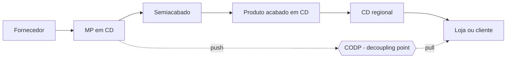
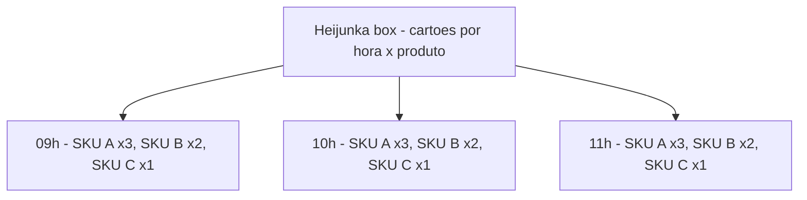

# Fluxo, *pull* e estoque como decisão de desenho — empurrar palete é fácil; puxar necessidade é política

**Push** (*empurrar*) produz ou movimenta com base em **previsão** ou em ordem **desacoplada** do consumo imediato. **Pull** (*puxar*) reabastece **apenas quando o consumo sinaliza** — com **limite explícito** de trabalho em processo (WIP). Na logística, isso aparece como **supermercado** (estoque endereçado e dimensionado por SKU), **kanban** de picking face, **cross-dock** e decisões de **onde** manter estoque na cadeia.

Esta aula liga Lean a **capital em estoque**, **serviço ao cliente** e **risco operacional** — sem dogma de «zero estoque». Você sairá capaz de calcular **takt time**, dimensionar um **kanban** simples e justificar quando um trecho da sua cadeia deve ser **push**, **pull** ou **híbrido**.

---

## Objetivos e resultado de aprendizagem

**Ao final desta aula**, você será capaz de:

- Explicar **push *versus* pull** com exemplos de CD, transporte e fornecimento, distinguindo *make-to-stock* (MTS), *make-to-order* (MTO) e *assemble-to-order* (ATO).
- Descrever **supermercado**, **kanban** (cartão, eletrónico, sinalizado) e **CONWIP** como mecanismos de sinal.
- Calcular **takt time** e número de **kanbans** num exemplo logístico.
- Posicionar o **ponto de desacoplamento** (CODP — *Customer Order Decoupling Point*) na sua cadeia.
- Identificar quando *pull* puro é **irrealista** (alta variabilidade, lead time longo, sazonalidade extrema) e desenhar **híbrido** consciente.

**Duração sugerida:** 75–90 minutos (com mini-lab de takt e kanban).
**Pré-requisitos:** [Aula 1.1 — desperdícios](aula-01-valor-desperdicios-logistica.md); noções de gestão de estoque ABC/XYZ.

---

## Mapa do conteúdo

1. Gancho TechLar — push da promoção fantasma.
2. Definições operacionais (push, pull, MTS/MTO/ATO).
3. Ponto de desacoplamento (CODP).
4. Supermercado, kanban e variantes (CONWIP, polca, drum-buffer-rope).
5. Heijunka box e nivelamento.
6. Diagrama principal — pull em CD com sinal de reabastecimento.
7. Mini-lab — takt time + dimensionamento de kanban.
8. Trade-offs, erros, KPIs, ferramentas, glossário.
9. Exercícios, gabarito, reflexão, referências, pontes.

---

## Gancho — o push da promoção fantasma

A **TechLar** «antecipou» separação de **3 200 caixas** para campanha de Black Friday: liberou onda às 02h da madrugada, com base em **forecast** comercial. Às 11h, o **mix mudou** (campanha redirecionada por marketing). **70%** das caixas separadas voltaram para reendereçamento; **8 paletes** caíram em retrabalho de etiqueta; **doca congestionou** e atrasou 3 carretas. **Empurrar** sem sinal estável é **aposta** — às vezes necessária (commodities), mas deve ser **visível** como risco no orçamento de capital e serviço.

> **Analogia do buffet de hotel:** repor bandejas pelo «*feeling*» do *chef de cuisine* (push) — sobra comida (inventário) ou falta o que cliente quer (serviço). Buffet maduro **observa o consumo** (pull) e **repõe ao limite** acordado.

> **Analogia da torneira e ralo:** *push* enche a banheira sem olhar o ralo; *pull* abre a torneira só quando vê a banheira a esvaziar abaixo da marca. Sem **marca visível**, kanban é só etiqueta colorida.

---

## Conceito-núcleo — push, pull e o ponto de desacoplamento

### 1. Definições pedagógicas

| Termo | Significado | Exemplo logístico |
|-------|-------------|-------------------|
| **Push** | upstream decide *quanto enviar* baseado em plano/MRP/hábito; downstream **recebe** | MRP empurra ordem de compra; *cross-dock* programado |
| **Pull** | consumo *retira*; sistema **reabastece** até teto acordado | supermercado de picking face; *kanban* entre células |
| **MTS** *make-to-stock* | produto pronto antes do pedido | bens de consumo, e-commerce alto giro |
| **MTO** *make-to-order* | produção dispara só com pedido firme | bens customizados, máquina pesada |
| **ATO** *assemble-to-order* | componentes em estoque, montagem sob pedido | computador configurável, pacote de cesta natalina |
| **ETO** *engineer-to-order* | engenharia + produção sob pedido | projeto industrial sob medida |

### 2. Ponto de desacoplamento (CODP) — onde o push vira pull

> **Legenda:** à esquerda do CODP, push (planeamento, lote económico). À direita, pull (consumo real). **Decisão de desenho:** quanto **mais à direita** o CODP, mais MTS (estoque alto, lead time curto ao cliente); quanto **mais à esquerda**, mais MTO (capital baixo, lead time longo). Exemplos: e-commerce de eletrónicos = CODP no CD nacional; móveis sob medida = CODP na fábrica.

> **Analogia da pizzaria:** **rodízio** = MTS extremo (forno empurra); **delivery** = MTO (massa pronta, recheio sob pedido = ATO); **pizzaria de alta gastronomia** = ETO (massa fermentada 48h por reserva).

### 3. Por que pull funciona — *Little's Law*

A **Lei de Little** (válida para qualquer sistema estável) diz:

\[
\text{WIP} = \text{Throughput} \times \text{Lead Time}
\]

Se você **fixa** o WIP (limite kanban), o **lead time cai** quando throughput sobe — e fica **previsível**. Push, ao contrário, deixa WIP livre; lead time vira função aleatória do plano.

**Exemplo:** se a capacidade do separador é 30 linhas/h e WIP máx = 60 linhas em fila, lead time médio = 60/30 = **2h**. Aumentar WIP para 120 dobra o lead time — **fila come capacidade**.

---

## Supermercado, kanban e variantes

### Supermercado

**Posição definida** (endereço) de cada SKU com **mín** e **máx**. Operador «compra» (picking) do supermercado; **reabastecedor** repõe pelo sinal (kanban).

**Dimensionamento simples (fórmula clássica):**

\[
N_{kanbans} = \frac{D \cdot LT \cdot (1 + S)}{Q}
\]

Onde:
- D = demanda média (peças/h ou caixas/dia)
- LT = lead time de reposição (horas/dias)
- S = fator de segurança (10%–30%)
- Q = quantidade por contentor/cartão

### Variantes de kanban

| Tipo | Como funciona | Quando usar |
|------|---------------|-------------|
| **Cartão físico** | retira cartão do contentor vazio, coloca no quadro | linha estável, baixa rotação SKU |
| **Eletrónico (e-kanban)** | scan/MES envia sinal automático | volume alto, multissítio |
| **Slot vazio (visual)** | espaço marcado no chão | celulares, cozinhas, doca |
| **Two-bin** | dois contentores; quando esvazia o 1.º, repõe | parafuso, embalagem |
| **CONWIP** *constant WIP* | limite global na linha (não por SKU) | mix alto e variável |
| **POLCA** | combinação CONWIP + roteamento dinâmico | produção em células |

### Heijunka box — nivelar mix e volume

> **Legenda:** Heijunka box espalha o mix ao longo do dia em vez de fazer **lote por SKU**. Em logística B2C de e-commerce, a versão moderna é **wave de picking nivelada** (não acumular 80% das ondas das 14h às 16h). Atacar **mura** primeiro reduz **muri** (sobrecarga de pico) e por consequência **muda** (erros do operador esgotado).

---

## Diagrama / Ferramenta visual principal — pull em CD com supermercado e sinal

> **Legenda:** o **consumo** (cliente/onda) puxa do supermercado; cartão vazio aciona reabastecedor da reserva; reserva é reposta por **MRP push** alinhado a forecast e contrato com fornecedor. **Híbrido honesto:** push até a reserva, pull do supermercado para a frente.

---

## Aprofundamentos — variações setoriais e setoriais BR

| Cenário | Estratégia recomendada | Motivo |
|---------|------------------------|--------|
| **E-commerce moda alta variabilidade** | ATO + pull no DC, *postponement* (etiquetar/embalar por pedido) | mix imprevisível, ciclo curto |
| **Distribuidora alimentar** | MTS + pull com FEFO + *milk run* | giro alto, validade |
| **Indústria farma (medicamentos crónicos)** | MTS regulado + *batch* obrigatório | regulação ANVISA, lote rastreado |
| **Indústria farma (clínicos personalizados)** | MTO/ETO | personalização, lote 1 |
| **Bens duráveis (linha branca)** | ATO em CD, push da fábrica para CD regional | escala fabril + customização tardia |
| **Agro (defensivos, sazonal)** | push pré-safra + pull em pico | janela de aplicação |
| **Auto-peças OEM (Tier 1)** | pull JIT (kanban com OEM) | TPS clássico, cliente exige |
| **Comodities (aço, fertilizante)** | push com lote económico transporte | densidade de carga manda |

> **Realidade BR:** *pull* puro é **raro** em cadeias longas devido a lead time de cabotagem (Manaus-Sul ~15 dias), ferrovia limitada, crise de motoristas, sazonalidade agrícola. Híbridos com **CODP móvel** (varia em Black Friday, Páscoa, safra) são mais realistas.

---

## Trade-offs e decisão

| Decisão | Lado pull | Lado push | Quando virar pull |
|---------|-----------|-----------|-------------------|
| Capital em estoque | menor | maior | quando capital de giro é restrição |
| Risco de ruptura | maior se LT alto | menor (se forecast bom) | quando variabilidade é controlável |
| Lead time ao cliente | curto se CODP perto | curto se MTS, longo se MTO | conforme promessa contratual |
| Custo de transporte | alto (entregas frequentes) | baixo (lote consolidado) | conforme densidade de carga |
| Resposta a mudança de mix | alta | baixa | mercado volátil |
| Maturidade requerida | alta (cadastro, sistema, gente) | baixa | conforme operação |

> **Regra prática Lean-aware:** comece **híbrido**, com CODP **explícito**, e mova-o para a esquerda gradualmente conforme reduz variabilidade e *lead time*.

---

## Caso prático / Mini-laboratório — takt time + dimensionar kanban

### Parte A — Takt time (para *throughput* combinado com cliente)

**Cenário TechLar — setor de embalagem B2C:**

- Demanda diária: **1 800 pedidos**
- Tempo disponível: **1 turno de 8h** com **30 min** de pausa
- Tempo disponível líquido: \( (8 \times 60) − 30 = 450 \text{ min} = 27\,000 \text{ s} \)

\[
\text{Takt time} = \frac{T_{disponível}}{D_{cliente}} = \frac{27\,000 \text{ s}}{1\,800} = 15 \text{ s/pedido}
\]

**Interpretação:** a embalagem deve concluir **um pedido a cada 15s** para acompanhar o cliente. Se o tempo de ciclo real (TC) é **22 s/pedido**, **falta capacidade** (atraso de 7s/pedido × 1 800 = ~3,5 h/dia de débito → backlog ou hora extra). Soluções:

1. Reduzir TC (kaizen no posto de embalagem, materiais à mão).
2. Adicionar **postos paralelos** (2 estações × 22s = TC efetivo 11s).
3. Nivelar **mura** (sair de pico de 17h e espalhar pelo turno).
4. Renegociar promessa SLA (último caso).

### Parte B — Dimensionar kanban no supermercado de picking face

**SKU «caixa de café 250g»:**

- Demanda média: D = **120 caixas/h**
- Lead time de reposição (reserva → supermercado): LT = **2 h**
- Fator de segurança: S = **0,2** (20%)
- Quantidade por contentor: Q = **24 caixas**

\[
N_{kanbans} = \frac{120 \times 2 \times (1 + 0{,}2)}{24} = \frac{288}{24} = 12 \text{ kanbans}
\]

Ou seja, **12 contentores** de 24 caixas (288 caixas no supermercado). Com Q = 24, o reabastecedor traz **uma carga** a cada vez que um contentor esvazia.

**Sensibilidade:** se LT cai de 2h para 1h (porque alocou-se reabastecedor dedicado), N = 6 kanbans → **metade do estoque** no supermercado, capital liberado.

### Parte C — CODP da TechLar

A TechLar opera 3 categorias:

| Categoria | Volume | Variabilidade | CODP recomendado |
|-----------|--------|---------------|------------------|
| **Branca (eletrodoméstico padrão)** | alto | baixa | CD regional (MTS) |
| **Smart home (instalação)** | médio | média | CD nacional + ATO (kit montado por pedido) |
| **Premium customizado (cor sob medida)** | baixo | alta | Fábrica (MTO) |

**Decisão:** CODP **móvel**. Não tente CODP único — perderá serviço ou capital.

---

## Erros comuns e armadilhas

1. **«Kanban digital» sem regra clara** — sistema «perde» sinal no apagão e ninguém sabe quem repõe.
2. **Confundir entrega frequente com pull** — entregar 5×/dia em push é só «push fracionado»; sem **limite de WIP**, não há pull.
3. **Ignorar capacidade de reposição** (gente, empilhador, doca) — kanban dispara sinal que ninguém atende; supermercado fica seco.
4. **«Zero estoque» como slogan** sem PDCA de causas de variabilidade — vira ruptura crónica.
5. **Heijunka teórica** com mix calculado, sem nivelar liberação comercial — mura permanece.
6. **Take time confundido com tempo de ciclo** — takt é cliente, TC é processo. Igualar é coincidência ou kaizen bem feito.
7. **Forçar pull em SKU de baixa rotação** (cauda longa) — kanban com 1 cartão/mês é ridículo. Use **MTO** ou **batch programado**.
8. **Cross-docking sem janela disciplinada** — vira armazém improvisado.
9. **Kanban como «bom comportamento»**, sem auditoria — limites perdem credibilidade.

---

## Comportamento e cultura

- **Andon** (sinal de problema) deve ser **permitido** e **valorizado**, não punido. Operador que puxa o cordão protege cliente.
- **Líder de fluxo** caminha o supermercado **diariamente** (10 min — *gemba* curto).
- **Reabastecedor** é função de prestígio em Toyota — em CD BR, frequentemente é função de baixa estima; **mude isso** ou pull morre.
- **Comercial e marketing** precisam **entender** que liberar lote concentrado destrói o sistema. Eduque-os com VSM antes/depois.
- **Sponsor** assina **limite de WIP** e protege contra «só desta vez».

---

## KPIs de melhoria

| KPI | Pergunta | Dono | Fonte | Cadência | Playbook |
|-----|----------|------|-------|----------|----------|
| Cobertura por SKU (dias) | quanto estoque acumulado por giro? | planeamento | ERP/WMS | semanal | revisar política, kanban |
| Giro de estoque | giros/ano por família | controladoria + planeamento | ERP | mensal | comparar com benchmark setor |
| **Takt time vs. TC real** | capacidade vs. demanda | gerente operação | medição + planeamento | diária | balanceamento, kaizen |
| WIP em fila (paletes em staging) | fila visível | líder de turno | contagem visual + WMS | turno | revisar limite, atacar gargalo |
| Fill rate / nível serviço | promessa cumprida? | comercial + ops | WMS + ERP | diária/semanal | revisar SS, CODP |
| Ruptura no supermercado (% SKU·dia) | kanban estourou? | supervisor picking | WMS | diária | revisar Q, S, LT |
| Linhas separadas/h | produtividade (sintoma, não meta isolada) | supervisor | WMS | turno | comparar com flow efficiency |
| % pedidos no takt | quantos pedidos saem dentro do ritmo? | ops | WMS timestamps | diária | atacar mura |

---

## Tecnologias e ferramentas

| Ferramenta | Função |
|------------|--------|
| **WMS** (SAP EWM, Oracle, Manhattan, WMS3) | parametrizar supermercado, slot, kanban eletrónico |
| **MES/SCADA** (em manufatura) | sinalização kanban entre células |
| **TMS** (Manhattan, Oracle, Mercurio) | janela de doca, *milk run* programado |
| **Demand planning** (SAP IBP, Logility, Anaplan, Slim4) | previsão para reserva (push) |
| **e-Kanban especializado** (Datalliance, Ultriva) | sinalização B2B com fornecedor |
| **IoT** (sensores de nível, RFID) | sinal automático sem cartão |
| **Power BI / Tableau** | painel de takt vs. TC, fill rate |
| **Bizagi / Lucidchart / Miro** | desenhar fluxo push/pull e CODP |
| **Heijunka físico** | quadro com bolsos por hora/SKU (impressão térmica) |

---

## Glossário rápido

- **Pull / Push** — sinal de consumo *vs.* plano upstream.
- **MTS / MTO / ATO / ETO** — estratégias de atendimento.
- **CODP** — *customer order decoupling point*, fronteira push/pull.
- **Kanban / e-Kanban / Two-bin / CONWIP / POLCA** — tipos de sinalização.
- **Heijunka** — nivelamento de mix e volume.
- **Takt time** — ritmo do cliente.
- **Tempo de ciclo (TC)** — ritmo do processo.
- **WIP** — *work in process*; trabalho em curso.
- **Little's Law** — WIP = Throughput × Lead Time.
- **Postponement** — adiar customização para reduzir variantes em estoque.

---

## Aplicação — exercícios

### Exercício 1 — escolher push/pull/híbrido (10 min)

Para os cenários abaixo, classifique e justifique em **uma linha**:

1. SKU A — vela de aniversário, alto giro, demanda estável (CV = 0,15).
2. SKU B — fone bluetooth premium, demanda média mas com pico em campanhas surpresa.
3. SKU C — adesivo personalizado para campanha promocional única.
4. SKU D — fertilizante, sazonal (90% do volume em 3 meses).

**Gabarito:**
- A: **pull** com supermercado + kanban (estável e alto giro favorece sinal).
- B: **híbrido** (push para reserva + pull no supermercado, com forecast colaborativo).
- C: **MTO** com lote único; nada em estoque.
- D: **push** sazonal pré-safra, com janela explícita; transição para *pull* fora da safra para SKUs base.

### Exercício 2 — calcular kanban (10 min)

SKU «cartucho de tinta» tem D = 80 unid/h, LT = 1,5 h, S = 0,25, Q = 10. Quantos kanbans?

\[
N = \frac{80 \times 1{,}5 \times 1{,}25}{10} = \frac{150}{10} = 15 \text{ kanbans}
\]

E se o reabastecedor for dedicado e LT cair para 0,5h?

\[
N^{*} = \frac{80 \times 0{,}5 \times 1{,}25}{10} = 5 \text{ kanbans} \quad (\text{redução de 67\% em estoque do supermercado})
\]

### Exercício 3 — calcular takt (10 min)

Centro de fulfillment recebe **3 600 pedidos/dia** em **2 turnos** de 7,5h líquidas cada. Calcule takt e diga quantos postos paralelos são necessários se TC por posto = 35s.

\[
T_{disp} = 2 \times 7{,}5 \times 3\,600 = 54\,000 \text{ s}
\]

\[
\text{Takt} = 54\,000 / 3\,600 = 15 \text{ s/pedido}
\]

\[
\text{Postos} = TC / Takt = 35/15 \approx 2{,}33 \to \textbf{3 postos paralelos} \text{ (arredondar para cima)}
\]

---

## Pergunta de reflexão

**Onde no seu plano você empurra sem ninguém assumir o risco no P&L?** Qual seria o primeiro CODP a explicitar — e quem precisaria assinar essa decisão?

---

## Fechamento — três takeaways

1. **Pull é política de sinal e limite**, não moda de software. Sem WIP máximo, é só rótulo.
2. **Estoque nem sempre é desperdício** — *estoque errado* quase sempre é. Posicione o CODP, não persiga zero.
3. **Híbrido honesto vence dogma puro** que ninguém cumpre. Lean maduro é **explícito** sobre onde push acaba e pull começa.

---

## Referências

1. WOMACK, J. P.; JONES, D. T. *Lean Thinking*. Free Press.
2. CHOPRA, S.; MEINDL, P. *Supply Chain Management: Strategy, Planning, and Operation*. Pearson. (push/pull, postponement, CODP).
3. HOPP, W. J.; SPEARMAN, M. L. *Factory Physics*. Waveland Press. (Little's Law, CONWIP).
4. SMALLEY, A. *Creating Level Pull*. Lean Enterprise Institute.
5. ROTHER, M.; HARRIS, R. *Creating Continuous Flow*. LEI.
6. ASCM/APICS Dictionary — *kanban*, *takt time*, *CODP*: <https://www.ascm.org/>
7. ABEPRO — anais sobre Lean em logística BR: <https://www.abepro.org.br/>
8. ILOS — relatórios de estoque e capital de giro: <https://www.ilos.com.br/>

---

## Pontes para outras trilhas

- [Políticas de estoque ABC, serviço, custo e capital — Operações](../../trilha-operacoes-logisticas/modulo-01-gestao-de-estoques/aula-01-politicas-abc-servico-custo-capital.md): Q, ROP, SS, CODP em detalhe.
- [Estrutura de custos logísticos — Fundamentos](../../trilha-fundamentos-e-estrategia/modulo-04-custos-logisticos-performance/aula-01-estrutura-custos-logisticos.md): traduzir capital em estoque para R$.
- [Master Data — Tecnologia](../../trilha-tecnologia-e-sistemas/modulo-01-master-data-para-logistica/aula-01-master-data-na-cadeia.md): cadastro de SKU, UoM, fornecedor — base do pull.
- [Lead time e variabilidade — Dados](../../trilha-dados-analytics-logistica/modulo-04-indicadores-logisticos-kpis/aula-02-lead-time-variabilidade-logistica.md): medir LT e CV para dimensionar kanban.
- **Próxima aula desta trilha:** [VSM e 5S no armazém e na doca](aula-03-vsm-5s-armazem-doca.md).
