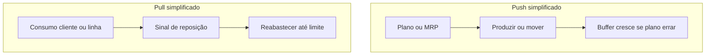

# Fluxo, *pull* e estoque como decisão de desenho — empurrar palete é fácil; puxar necessidade é política

**Push** (*empurrar*) produz ou movimenta com base em **previsão** ou em ordem **desacoplada** do consumo imediato. **Pull** (*puxar*) tenta **replenish** apenas quando o **consumo** sinaliza necessidade — com **limite** explícito de trabalho em processo (WIP). Na logística, isso aparece como **supermercado**, **kanban** de picking face, **cross-dock** e decisões de **onde** manter estoque.

Esta aula liga Lean a **capital em estoque** e **serviço** — sem dogma de «zero estoque».

---

## Objetivos e resultado de aprendizagem

**Ao final desta aula**, você será capaz de:

- Explicar **push *versus* pull** com exemplos de CD e transporte.  
- Descrever **supermercado** e **kanban** como mecanismos de sinal.  
- Relacionar *pull* com **trade-off** serviço–capital (hiperlink Fundamentos).  
- Identificar quando *pull* puro é **irrealista** (alta variabilidade, lead time longo).

**Duração sugerida:** 60–75 minutos.

---

## Gancho — o push da promoção fantasma

A **TechLar** «antecipou» separação para campanha que **mudou de mix** na véspera. Paletes voltaram, endereços **rebalançearam**, doca congestionou. **Empurrar** sem sinal estável é **aposta** — às vezes necessária, mas deve ser **visível** como risco.

**Analogia do buffet:** encher a bandeja antes de olhar o prato do cliente — sobra comida (inventário) ou falta o que ele quer (serviço).

---

## Mapa do conteúdo

- Definições operacionais de push/pull.  
- Supermercado e papel do **estoque de decoupling**.  
- Kanban conceitual (cartão, bin, min/max).  
- Limites do modelo.

---

## Conceito núcleo — push e pull

**Push (pedagógico):** o upstream decide **quanto** enviar com base em plano, MRP ou hábito — o downstream **recebe**.

**Pull (pedagógico):** o consumo **retira**; o sistema **reabastece** até um **teto** acordado (posição no supermercado, número de kanbans, tamanho da onda).

**Legenda:** na prática híbridos são comuns; o útil é **saber** qual lógica manda em cada trecho.

---

## Supermercado e kanban

**Supermercado:** posição definida de **SKU** com quantidade **máxima/mínima**; o operador «compra» do supermercado e o **reabastecedor** repõe pelo sinal.

**Kanban:** o **sinal** (cartão físico, slot vazio, sistema) autoriza a **próxima** reposição — sem sinal, **não** produzir/mover mais.

**Hipótese pedagógica:** sem **limite** de WIP, «kanban» vira só etiqueta colorida.

---

## Trade-offs

- *Pull* reduz **excesso** e expõe gargalos; exige **estabilidade** e **dados** razoáveis.  
- *Push* pode ser **óptimo** em commodities com economia de transporte forte — desde que o **risco** de mix esteja no orçamento de capital e serviço.

Ver: [gestão de estoques — políticas](../../trilha-operacoes-logisticas/modulo-01-gestao-de-estoques/aula-01-politicas-abc-servico-custo-capital.md).

---

## Aplicação — exercício

Para **dois** cenários (SKU A alto giro previsível; SKU C irregular e promocional), diga se tenderia a **push**, **pull** ou **híbrido** e **uma** condição de dados/mestre necessária para funcionar.

**Gabarito pedagógico:** C promocional sem *pull* maduro tende a **push** com **buffer** explícito e revisão diária; A estável favorece **supermercado** + *kanban*; ambos exigem **acurácia** de cadastro (trilha Tecnologia).

---

## Erros comuns e armadilhas

- Confundir **entrega frequente** com *pull* sem **limite**.  
- *Kanban* digital sem **regra** quando o sistema «perde» o sinal.  
- Ignorar **capacidade** de reposição (pessoa/docas).  
- «Zero estoque» como slogan sem **PDCA** de causas de variabilidade.

---

## KPIs e decisão

- **Giro** e **cobertura** por família (definições na trilha Dados).  
- **Fill rate** *versus* **capital** por canal.  
- **Filas** físicas (paletes em *staging*) como proxy de WIP.

---

## Fechamento — três takeaways

1. *Pull* é **política de sinal e limite**, não moda de software.  
2. Estoque nem sempre é desperdício — **estoque errado** quase sempre é.  
3. Híbrido honesto vence dogma **puro** que ninguém cumpre.

**Pergunta de reflexão:** onde o seu plano **empurra** sem alguém assumir o risco no P&L?

---

## Referências

1. WOMACK, J. P.; JONES, D. T. *Lean Thinking*.  
2. CHOPRA, S.; MEINDL, P. *Supply Chain Management*. Pearson. (push/pull na cadeia)  
3. ASCM — materiais sobre Lean / operações: https://www.ascm.org/
