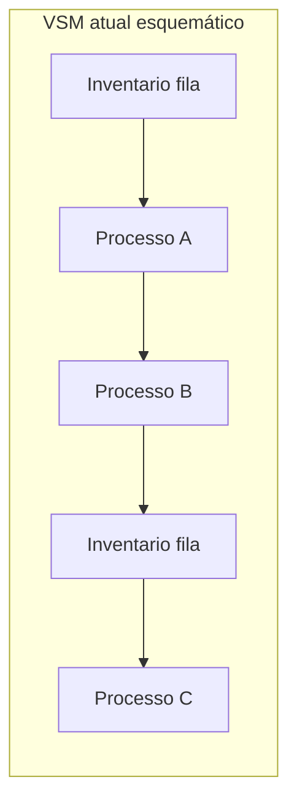

# VSM e 5S no armazém e na doca — mapa do tempo que some e disciplina que evita acidente

**VSM** (*Value Stream Mapping*) é o desenho **atual** (e depois **futuro**) do fluxo com **tempo** e **informação** — para ver onde o lead time **vaza**. **5S** (*Seiri, Seiton, Seiso, Seiketsu, Shitsuke*) é **disciplina visual** de lugar, limpeza e padrão — na doca, liga-se diretamente a **segurança**, **acurácia** e **moral**.

Juntas, evitam Lean «só filosofia»: **mapa** + **padrão** + **métrica**.

---

## Objetivos e resultado de aprendizagem

**Ao final desta aula**, você será capaz de:

- Montar um **VSM** em nível gestor (atual) com tempos e filas.  
- Definir **estado futuro** com **saltos** realistas (não *wishlist*).  
- Aplicar 5S a **zona de recebimento/expedição** com critérios auditáveis.  
- Ligar 5S a **acurácia** e segurança (PEV).

**Duração sugerida:** 75–90 minutos (inclui exercício de texto).

---

## Gancho — o mapa que derrubou a desculpa «sistema lento»

Na **TechLar**, culpavam o **ERP** pelo lead time. O VSM mostrou que **70%** do tempo era **espera** entre onda liberada e doca livre — **fila física**, não bit. O projeto virou **capacidade de *staging*** e **janela**, não «upgrade de servidor».

**Analogia do GPS:** o app não adianta se você está preso no estacionamento — o gargalo é **vaga**, não satélite.

---

## Mapa do conteúdo

- Símbolos e fluxo de informação no VSM (conceitual).  
- Lead time *versus* tempo de processo.  
- 5S com foco logístico.  
- Ponte à trilha Operações (layout).

---

## VSM — o que entra no mapa

**Mínimo pedagógico:**

1. **Início e fim** do fluxo (ex.: pedido liberado → saiu do CD).  
2. **Caixas** de processo (receber, armazenar, separar, consolidar, expedir).  
3. **Triângulos** de inventário / fila entre etapas.  
4. **Linha de informação** (quem dispara o quê: ERP, papel, rádio).  
5. **Dados** em caixa: tempo de ciclo, tempo de espera, **first time right**.

**Legenda:** cada segmento entre processos deve ter **tempo** anotado; sem tempo, é desenho decorativo.

---

## 5S na logística — além do «arrumar bonito»

| S | Significado usual | Foco logístico |
|---|-------------------|----------------|
| 1 *Seiri* | separar o necessário | SKU morto, ferramenta obsoleta na doca |
| 2 *Seiton* | tudo no lugar | endereço, *shadow board*, fluxo de um sentido |
| 3 *Seiso* | limpeza | derramamento, poeira que esconde defeito |
| 4 *Seiketsu* | padronizar | checklist abertura/fecho de turno |
| 5 *Shitsuke* | disciplina | auditoria sem humilhação, líder *gemba* |

**Consenso de mercado:** 5S que não melhora **segurança** ou **qualidade** em 90 dias costuma ser **fadiga**.

---

## Aplicação — exercício

Escreva um **VSM em texto** (8–12 linhas) do fluxo **recebimento ASN → put-away → picking → expedição** da TechLar ou da sua empresa. Para **cada** seta entre etapas, estime **espera** (h) e **processo** (h) de forma fictícia mas coerente. Proponha **uma** mudança para o estado futuro e **um** indicador de sucesso.

**Gabarito pedagógico:** deve aparecer **espera** dominante ou fila explícita; futuro com **redução** de fila ou de retrabalho; KPI = lead time interno ou FTR.

---

## Erros comuns e armadilhas

- VSM feito só com **gerentes** sem quem opera a doca.  
- Estado futuro = «**comprar WMS**» sem mudar **fila** e **padrão**.  
- 5S como **punição** — destrói *shitsuke*.  
- Confundir VSM com **layout CAD** (escalas diferentes).

---

## KPIs e decisão

- **Lead time interno** antes/depois.  
- **Acurácia** de endereço (inventário cíclico por zona 5S).  
- **Near-miss** ou incidentes na doca.

---

## Fechamento — três takeaways

1. VSM sem **tempo** é arte; com tempo, é **acusação amigável**.  
2. 5S é **infraestrutura** de segurança e qualidade, não concurso de fotos.  
3. Estado futuro precisa de **dono** e data — senão vira pôster.

**Pergunta de reflexão:** qual fila entre duas caixas do seu VSM **ninguém** mede hoje?

---

## Referências

1. ROTHER, M.; SHOOK, J. *Learning to See* (Lean Enterprise Institute — método VSM).  
2. LIKER, J. K. *The Toyota Way*.  
3. [Layout e zonas — Operações](../../trilha-operacoes-logisticas/modulo-02-armazenagem-e-layout-logistico/aula-01-layout-zonas-fluxo-docas.md).
