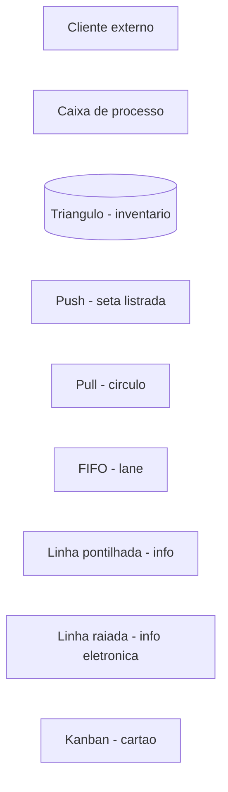
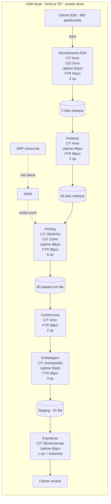
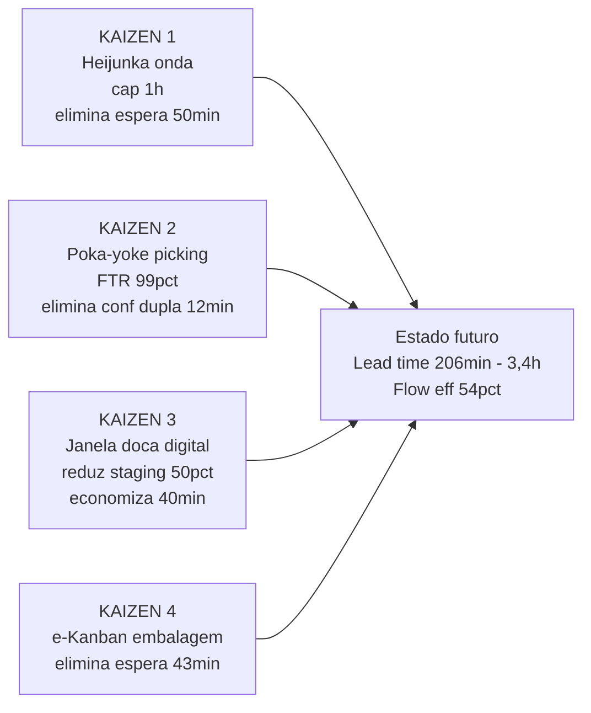
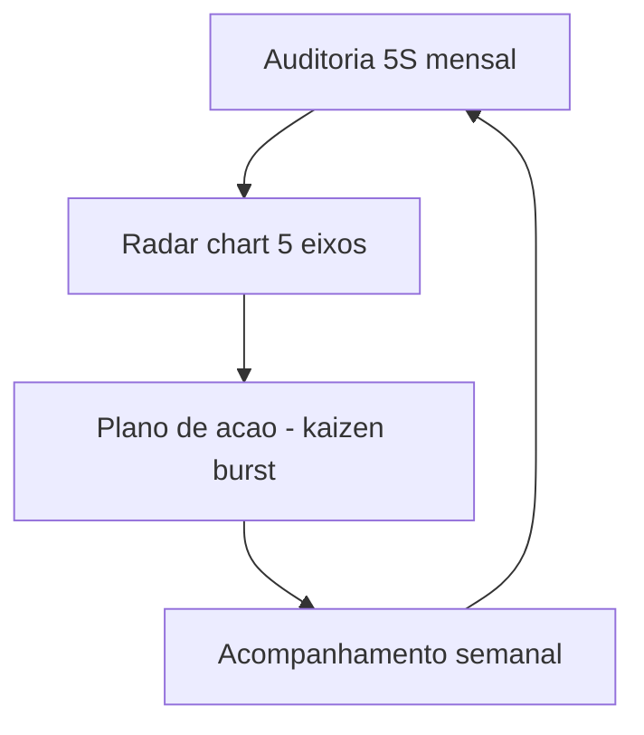

# VSM e 5S no armazém e na doca — mapa do tempo que some e disciplina que evita acidente

**VSM** (*Value Stream Mapping*, Rother & Shook 1999) é o desenho **atual** (e depois **futuro**) do fluxo com **tempo de processo**, **tempo de espera**, **fluxo de informação** e **inventário** — para ver onde o lead time **vaza** e onde a informação chega tarde, errada ou em duplicidade. **5S** (*Seiri, Seiton, Seiso, Seiketsu, Shitsuke*) é **disciplina visual** de lugar, limpeza e padrão — na doca, liga-se diretamente a **segurança** (PEV — pessoa-equipamento-veículo), **acurácia** e **moral**.

Juntas, evitam Lean «só filosofia»: **mapa** (ver), + **padrão** (sustentar) + **métrica** (provar). Esta aula entrega um **VSM real do CD da TechLar** com tempos C/T, C/O, *uptime* e ladder de lead time, mais uma **auditoria 5S** auditável de doca.

---

## Objetivos e resultado de aprendizagem

**Ao final desta aula**, você será capaz de:

- Montar um **VSM atual** com **caixas de processo** completas (C/T, C/O, uptime, FTR, n.º operadores) e **ladder** de lead time vs. tempo de valor.
- Definir **estado futuro** com **saltos realistas** (kaizen burst), datas e ROI.
- Aplicar **5S** a **zona de recebimento/expedição** com **cartão de auditoria** auditável (nota 0–4 por S).
- Ligar 5S a **acurácia** (inventário cíclico) e **segurança** (PEV, *near-miss*).
- Calcular **OEE** (*Overall Equipment Effectiveness*) na linha de embalagem como métrica complementar.

**Duração sugerida:** 90–120 minutos (com VSM em texto e mini-OEE).
**Pré-requisitos:** [Aula 1.1 — desperdícios](aula-01-valor-desperdicios-logistica.md), [Aula 1.2 — pull e kanban](aula-02-fluxo-pull-kanban-estoque.md).

---

## Mapa do conteúdo

1. Gancho TechLar — VSM derruba mito do «sistema lento».
2. Conceito-núcleo: símbolos VSM, dados de caixa, ladder.
3. VSM atual da TechLar (real, com tempos).
4. Estado futuro: 4 kaizen bursts.
5. 5S como infraestrutura — significado, foco logístico, *radar chart* de auditoria.
6. OEE em linha de embalagem (cálculo).
7. Trade-offs, erros, KPIs, ferramentas, glossário.
8. Exercícios, gabarito, reflexão, referências, pontes.

---

## Gancho — o mapa que derrubou a desculpa «sistema lento»

Na **TechLar**, gerência culpava o **ERP** pelo lead time interno alto. O VSM mostrou que **70%** do tempo era **espera** entre **onda liberada** e **doca livre** — fila **física**, não bit. Tempo de processo total: ~95 min. Lead time total: ~340 min. **Eficiência de fluxo: 28%**. O projeto mudou de «*upgrade* de servidor R$ 380 mil» para «**capacidade de *staging*** + **janela de doca**» (R$ 45 mil + redesenho de turno). Ganho de **38% em lead time** em **8 semanas**.

> **Analogia do GPS travado:** o app pode ser o melhor; se você está preso no estacionamento esperando vaga, o gargalo é **vaga**, não satélite. VSM é o **GPS do fluxo** — mostra onde se perde tempo, antes de comprar antena nova.

> **Analogia da consulta médica:** sem **anamnese** (caminhada com cronómetro), o tratamento é **chute caro**. VSM é a anamnese do CD.

---

## Conceito-núcleo — VSM em logística

### 1. Diferença entre VSM, fluxograma e *spaghetti chart*

| Ferramenta | O que mostra | Quando usar |
|------------|--------------|-------------|
| **Fluxograma** (BPM) | sequência de passos, decisões | desenhar processo isolado |
| **VSM** | fluxo de **material** + fluxo de **informação** + tempos + inventário | mapear *value stream* completo (porta a porta) |
| **Spaghetti chart** | trajeto físico do operador/produto | otimizar layout, ver movimento |
| **Diagrama de Pareto** | ranquear causas | priorizar onde atacar (módulo 2) |

### 2. Símbolos VSM essenciais (norma LEI/Rother-Shook)



> Símbolos comuns no papel: **caixa de processo** (retângulo) com **dados** (C/T, C/O, uptime, n.º op., FTR); **triângulo** com qtde e dias para inventário; **seta listrada** = push, **círculo conectado** = pull; **caixa de dados externa** = cliente/fornecedor; **kaizen burst** = explosão amarela com ideia de melhoria.

### 3. Dados de caixa (process box data)

Cada caixa de processo deve ter (no **mínimo**):

| Sigla | Significado | Exemplo logístico |
|-------|-------------|-------------------|
| **C/T** | Cycle Time (tempo de ciclo, s ou min/peça) | picking 28 s/linha |
| **C/O** | Changeover (setup, troca de SKU/onda, min) | troca de onda 12 min |
| **Uptime** | % disponibilidade do recurso/sistema | WMS 96%, empilhador 88% |
| **FTR** | First Time Right (% certo na 1.ª) | conferência 97% |
| **N op.** | número de operadores | 6 separadores |
| **Bach size** | tamanho do lote/onda | 80 pedidos/onda |
| **Tempo disp.** | janela operacional | 450 min/turno |

### 4. Ladder de lead time

Embaixo do VSM desenha-se uma **escada (ladder)** alternando:

- **Subir:** tempo de processo (VA + NVA-R) — segundos/minutos.
- **Descer:** tempo de espera/inventário — horas/dias.

Soma da ladder = **lead time total**. Soma das subidas = **tempo de processo**. **Flow efficiency** = subidas ÷ total.

---

## Diagrama / Ferramenta visual principal — VSM atual da TechLar (CD São Paulo)



### Ladder de lead time (TechLar — minutos)

| Etapa | Tempo de espera (min) | Tempo de processo (min) |
|-------|------------------------|--------------------------|
| Espera ERP→WMS | 25 | — |
| Recebimento | — | 8 |
| Inv1 (reserva 2d → fila putaway) | 30 | — |
| Putaway | — | 4 |
| Inv2 (estoque na reserva) | 0 (já pronto) | — |
| Espera liberar onda | 50 | — |
| Picking (28s × 60 linhas/pedido) | — | 28 |
| Inv3 (fila staging conf.) | 12 | — |
| Conferência | — | 4 |
| **Conferência dupla** (overprocessing) | — | 12 |
| Espera embalagem | 43 | — |
| Embalagem | — | 25 |
| Staging | 80 | — |
| Carregamento | — | 30 |
| **TOTAL** | **240 min (4h)** | **111 min (1,85h)** |

\[
\text{Lead time} = 240 + 111 = 351 \text{ min} \approx 5{,}85\text{h}
\]

\[
\text{Flow efficiency} = 111 \div 351 = 31{,}6\%
\]

> **Legenda:** *flow efficiency* de ~32% é típico em CD BR maduro. Benchmark de excelência: **>45%**. As **3 maiores filas** (staging 80, espera onda 50, espera embalagem 43) somam **173 min** = **49% do lead time** — atacar nelas tem maior ROI.

### Estado futuro — 4 kaizen bursts priorizados



> **Legenda:** estado futuro vai de **5,85h** para **3,4h** (**−42%**) e *flow efficiency* de **32% para 54%** (+22 p.p.). Cronograma realista: **8–12 semanas** com sponsor ativo. Kaizen 1 e 4 são **mura** (nivelamento); 2 é **defeito**; 3 é **espera**.

---

## Aprofundamentos — variações setoriais do VSM

| Cenário | Particularidade no VSM |
|---------|------------------------|
| **CD B2C alto giro** | adicionar caixa **fulfillment digital** (etiqueta, manifesto) e ladder de cross-sell embalagem |
| **3PL multicliente** | um VSM **por cliente** + um VSM **transversal** de doca |
| **Cold chain (alimentar/farma)** | dados de **temperatura** em cada caixa; rupturas térmicas como inventário negativo |
| **Indústria pesada (Tier 1 auto)** | VSM **porta-a-porta** com cliente OEM; janela JIT em horas |
| **Transporte/TMS** | VSM com **planeamento → embarque → trânsito → entrega → comprovante** (tempos por etapa) |
| **E-commerce omnichannel** | VSM por **canal** (loja, marketplace, próprio) — tempos divergem muito |
| **Operação portuária** | VSM com janelas marítimas, terminal, draft survey, liberação aduaneira |

---

## 5S na logística — disciplina visual auditável

### Significado e foco logístico

| S | Japonês | Tradução BR | Foco logístico | Métrica auditável |
|---|---------|--------------|----------------|-------------------|
| 1 | *Seiri* | senso de utilização | tirar SKU morto, ferramenta obsoleta | n.º itens descartados/mês |
| 2 | *Seiton* | senso de organização | endereço, *shadow board*, fluxo um sentido | % itens com endereço marcado |
| 3 | *Seiso* | senso de limpeza | derramamento, poeira, óleo | n.º incidentes ambientais |
| 4 | *Seiketsu* | senso de padronização | checklist abertura/fecho turno, foto-padrão | % checklist cumpridos |
| 5 | *Shitsuke* | senso de disciplina | auditoria periódica sem humilhação | nota média 5S na zona |

### Cartão de auditoria 5S — esqueleto (nota 0–4 por S)

| Critério | 0 — inaceitável | 1 — fraco | 2 — aceitável | 3 — bom | 4 — excelente |
|----------|------------------|-----------|----------------|----------|----------------|
| 1S Seiri | itens sem uso há 6 meses | alguns itens sem uso | poucos itens fora do uso | apenas necessário | renovação contínua |
| 2S Seiton | nada marcado | parcial | maioria | tudo demarcado | painel sombra perfeito |
| 3S Seiso | sujo, com risco | sujo, sem risco | limpo na inspeção | limpo no dia | limpeza preventiva |
| 4S Seiketsu | sem padrão | padrão informal | padrão escrito | padrão visual | padrão evolutivo |
| 5S Shitsuke | nunca auditado | auditoria pontual | mensal | semanal | diária + RCA |

**Cálculo:** soma 0–20; meta classe mundial: **≥ 18**. Em CD BR maduro: **12–15**. Acompanhar com **radar chart** mensal.



> **Consenso de mercado:** 5S que não melhora **segurança** ou **acurácia** em 90 dias costuma ser **fadiga** ou **decoração**. Métrica liga a *near-miss*, FTR e contagem cíclica.

---

## OEE na linha de embalagem — calcular passo a passo

OEE (*Overall Equipment Effectiveness*) é métrica clássica Lean para recursos automatizados (esteira, packer, *sorter*). Em CD BR, OEE típico: **65%–75%**; classe mundial: **≥ 85%**.

\[
\text{OEE} = \text{Disponibilidade} \times \text{Desempenho} \times \text{Qualidade}
\]

### Caso TechLar — sorter de embalagem

- **Tempo de turno:** 8 h = 480 min
- **Pausas planejadas:** 30 min → tempo planejado = 450 min
- **Paradas não planejadas (manut., quebra):** 60 min → tempo de operação = 390 min
- **Cadência teórica do sorter:** 30 caixas/min
- **Caixas produzidas:** 9 360 caixas
- **Caixas com defeito (re-rota):** 280 caixas

**Cálculos:**

\[
\text{Disponibilidade} = \frac{390}{450} = 86{,}7\%
\]

\[
\text{Desempenho} = \frac{9\,360}{30 \times 390} = \frac{9\,360}{11\,700} = 80{,}0\%
\]

\[
\text{Qualidade} = \frac{9\,360 - 280}{9\,360} = \frac{9\,080}{9\,360} = 97{,}0\%
\]

\[
\text{OEE} = 0{,}867 \times 0{,}800 \times 0{,}970 = 67{,}3\%
\]

**Interpretação:** desempenho (80%) é o **maior detrator** — investigar **microparadas** (atolamento, ajuste leve), confirmar com **registro de paradas**. Disponibilidade (86,7%) sugere **manutenção autónoma** (TPM básico). Qualidade já é alta. Meta T+90: **OEE 75%** com kaizen em microparadas (+5 p.p. desempenho) e TPM (+3 p.p. disponibilidade).

---

## Trade-offs e decisão

| Trade-off | Lado A | Lado B |
|-----------|--------|--------|
| VSM detalhado vs. rápido | mais decisões justificadas | mais tempo, risco de paralisia |
| Estado futuro radical vs. incremental | grande salto, alto risco | série de PDCAs, baixo risco |
| 5S radical (Big Bang) | mudança visível, energia | resistência, regressão se sem disciplina |
| 5S incremental (S por S, semestre) | sustentação melhor | demora a mostrar resultado |
| OEE como meta única | foco | esconde gargalo a montante |
| Auditoria 5S pesada | rigor | burocracia que ninguém faz |

---

## Caso prático / Mini-laboratório — desenhando VSM em texto

Use o gabarito da TechLar e adapte à sua operação. Estrutura recomendada:

```
[CLIENTE: 800 ped/dia, OTIF 95pct alvo]
          ^
          |
[ERP] -- info diaria --> [WMS]
                          |
[FORN.] -> [REC] -> (2d) -> [PUTAWAY] -> (45d) -> [PICK] -> (80p fila) -> [CONF] -> [EMB] -> (2h) -> [EXPED] -> CLIENTE

REC: C/T 8min, C/O 5min, FTR 94pct, 3 op
PICK: C/T 28s/linha, C/O 12min, FTR 95pct, 6 op
...

LADDER:
espera 25 - proc 8 - espera 30 - proc 4 - espera 50 - proc 28 - espera 12 - proc 16 - espera 43 - proc 25 - espera 80 - proc 30
TOTAL: lead 351min, proc 111min, FE 31,6pct

KAIZEN BURSTS (estado futuro):
1. Heijunka onda (cap 1h)
2. Poka-yoke picking (FTR 99pct)
3. Janela doca digital
4. e-Kanban embalagem
```

---

## Erros comuns e armadilhas

1. **VSM feito só com gerentes**, sem quem opera a doca. Mapa vira ficção.
2. **Estado futuro = «comprar WMS»** sem mudar fila e padrão. Tecnologia não substitui fluxo.
3. **5S como punição** — destrói *shitsuke* (sustentabilidade).
4. **Confundir VSM com layout CAD** — escalas e propósitos diferentes (CAD = espaço; VSM = tempo + informação).
5. **Estado futuro «*wishlist*»** sem responsável, prazo ou ROI.
6. **Auditoria 5S sem RCA** quando nota cai — vira teatro.
7. **OEE como meta isolada** — pode esconder push (produzir certo o errado).
8. **Pular ladder** — VSM sem soma de tempo é arte abstrata.
9. **VSM «porta-a-porta»** sem incluir cliente final — perde voz do cliente.

---

## Comportamento e cultura

- **Workshop de VSM** com 4–8 pessoas (incluir 2 operadores e 1 sponsor).
- **«Caminhada de fluxo»** real, com cronómetro combinado, sem foto-vigilância.
- **Foto-padrão** colado no posto após 5S (referência viva).
- **Auditoria 5S por par** (líder + operador), nota com **justificativa** — cria diálogo.
- **Reconhecimento** trimestral da **zona ouro** (nota mais alta), não punição da pior.
- **Sponsor** participa de 1 auditoria/mês — sinal cultural forte.

---

## KPIs de melhoria

| KPI | Pergunta | Dono | Fonte | Cadência | Playbook |
|-----|----------|------|-------|----------|----------|
| Lead time interno (P50, P90) | quanto tempo demora? | gerente CD | WMS timestamps | diária | atacar maior fila no VSM |
| Flow efficiency | quanto é valor? | EO | medição manual ou WMS | mensal | kaizen burst |
| Acurácia inventário (zona) | 5S funciona? | inventário | contagem cíclica | semanal | kaizen 5S na zona com pior acurácia |
| Nota 5S média (zona) | disciplina visual | líder + EO | auditoria mensal | mensal | RCA + plano de ação |
| OEE sorter / packer | recurso bem usado? | manutenção + ops | MES/SCADA | turno | TPM, microparadas, RCA |
| *Near-miss* / acidentes | doca segura? | SSMA | relato turno | semanal | gemba seguro, kaizen segurança |
| % checklists cumpridos turno | padrão funciona? | supervisor | sistema turno | diário | revisar SOP, treino |

---

## Tecnologias e ferramentas

| Categoria | Ferramenta |
|-----------|------------|
| **Mapeamento VSM** | Miro, Lucidchart, draw.io, Mural, Visio, MS Whiteboard, papel marrom + post-it |
| **Cronometragem** | apps *time study* (StopWatch+), MOST, MTM, vídeo + análise |
| **5S audit** | planilha, app (CompliantPro, GoAudits), foto antes/depois |
| **OEE** | Power BI custom, sistemas dedicados (Sensrtrx, Vorne, FactoryTalk) |
| **WMS para timestamps** | SAP EWM, Manhattan, Oracle WMS, WMS3 |
| **TPM / manutenção** | SAP PM, MaintainX, Movilitas |
| **Spaghetti chart** | RFID + heatmap, vídeo overhead, papel sobreposto à planta |
| **Gestão visual chão** | quadro andon (luz/tela), monitor de OEE em tempo real |

---

## Glossário rápido

- **VSM** — *value stream mapping*; mapa de fluxo de valor.
- **Estado atual / futuro** — diagnóstico vs. visão de melhoria.
- **C/T, C/O, FTR, Uptime** — dados de caixa de processo.
- **Ladder** — escada de lead time vs. tempo de processo.
- **Kaizen burst** — explosão amarela com ideia de melhoria no VSM.
- **OEE** — *overall equipment effectiveness* (Disp × Desemp × Qual).
- **TPM** — *total productive maintenance*.
- **5S** — Seiri, Seiton, Seiso, Seiketsu, Shitsuke.
- **PEV** — pessoa-equipamento-veículo (foco SSMA na doca).
- **Spaghetti chart** — diagrama de movimento físico.

---

## Aplicação — exercícios

### Exercício 1 — VSM em texto (25 min)

Escreva um **VSM em texto** (10–15 linhas) do fluxo **recebimento ASN → put-away → picking → expedição** da TechLar **ou** da sua operação. Para **cada** seta entre etapas, estime **espera (min)** e **processo (min)** plausíveis. Calcule **lead time, tempo de processo, flow efficiency**. Proponha **uma** mudança para o estado futuro e **um** indicador de sucesso.

**Gabarito pedagógico:** deve aparecer **espera dominante** ou fila explícita (>50% do lead). Estado futuro com **redução de fila ou retrabalho**, dono e prazo. KPI = lead time interno P90 ou FTR.

### Exercício 2 — calcular OEE (15 min)

Linha de embalagem com:
- Turno 8h (480 min); pausas 45 min; manut. não planejada 50 min.
- Cadência teórica 25 caixas/min.
- Produzido: 6 800 caixas; defeito 150.

Calcule OEE e identifique pior componente.

**Gabarito:**
- Tempo planejado = 435 min; tempo operação = 385 min.
- Disp = 385/435 = **88,5%**
- Desemp = 6800 / (25×385) = 6800/9625 = **70,6%**
- Qual = 6650/6800 = **97,8%**
- **OEE = 0,885 × 0,706 × 0,978 = 61,1%**
- **Pior:** Desempenho (microparadas, ajuste de cadência). Plano: TPM autónomo + RCA microparadas.

### Exercício 3 — auditoria 5S (10 min)

Para sua doca de expedição, atribua nota 0–4 a cada S e justifique uma linha. Calcule total e proponha **um** kaizen para o S com pior nota.

**Gabarito:** total típico CD BR = 11–14. Kaizen comum: **2S — Seiton** (demarcar zonas com tinta/fita, *shadow board* de empilhador).

---

## Pergunta de reflexão

**Qual fila entre duas caixas do seu VSM ninguém mede hoje?** Quem você convidaria amanhã para uma **caminhada de fluxo de 30 min** com cronómetro?

---

## Fechamento — três takeaways

1. **VSM sem tempo é arte**; com tempo (ladder), é **acusação amigável** que move o sponsor.
2. **5S é infraestrutura** de segurança e qualidade, não concurso de fotos. Se a nota não move OTIF/acurácia em 90 dias, refaça o sentido.
3. **Estado futuro precisa de dono, data e ROI** — senão vira pôster bonito que envelhece com a fita adesiva.

---

## Referências

1. ROTHER, M.; SHOOK, J. *Learning to See: Value Stream Mapping to Add Value and Eliminate Muda*. Lean Enterprise Institute, 1999.
2. LIKER, J. K. *The Toyota Way*. McGraw-Hill, 2004.
3. HIRANO, H. *5 Pillars of the Visual Workplace: The Sourcebook for 5S Implementation*. Productivity Press.
4. NAKAJIMA, S. *Introduction to TPM: Total Productive Maintenance*. Productivity Press. (OEE original)
5. ROTHER, M.; HARRIS, R. *Creating Continuous Flow*. LEI.
6. JONES, D. T.; HINES, P.; RICH, N. *Seven value stream mapping tools*. International Journal of Operations & Production Management.
7. ASCM/APICS Dictionary — *VSM*, *5S*, *OEE*: <https://www.ascm.org/>
8. Lean Enterprise Institute — *Workplace*: <https://www.lean.org/>
9. ABEPRO — anais sobre VSM em logística BR: <https://www.abepro.org.br/>

---

## Pontes para outras trilhas

- [Layout, zonas, fluxo e docas — Operações](../../trilha-operacoes-logisticas/modulo-02-armazenagem-e-layout-logistico/aula-01-layout-zonas-fluxo-docas.md): atacar movimento e desenhar layout.
- [Indicadores logísticos — Dados](../../trilha-dados-analytics-logistica/modulo-04-indicadores-logisticos-kpis/aula-02-lead-time-variabilidade-logistica.md): definir lead time P90.
- [Master Data — Tecnologia](../../trilha-tecnologia-e-sistemas/modulo-01-master-data-para-logistica/aula-01-master-data-na-cadeia.md): qualidade do dado por trás do VSM.
- **Próximo módulo:** [Y = f(X) — Six Sigma na Logística](../modulo-02-six-sigma-logistica/aula-01-y-igual-fx-otif-lead-time.md).
