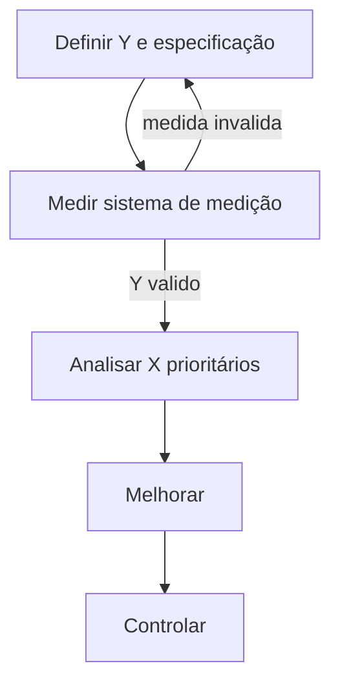

# Y = f(X) na logística — OTIF, lead time e acurácia como «saída» de um sistema

**Six Sigma** (em nível **literacia**, não certificação) ensina a escrever o problema como **Y = f(X)**: a **saída** que importa para o cliente ou o P&L é função de **causas** X (processo, pessoas, máquina, método, medição, ambiente — clássico **6M**). Em logística, Y costuma ser **OTIF**, **lead time**, **acurácia de inventário**, **dano**, **custo por entrega**.

**Regra de ouro:** **estabilizar** (reduzir causas especiais) antes de **otimizar** o alvo — senão você calibra o processo errado.

---

## Objetivos e resultado de aprendizagem

**Ao final desta aula**, você será capaz de:

- Formular um problema logístico com **Y mensurável** e hipóteses de **X**.  
- Distinguir variação **comum** *versus* **especial**.  
- Nomear as fases **DMAIC** e um **portão** de decisão entre Definir e Medir.  
- Explicar que certificação **belt** exige currículo formal (ASQ, corporativo, etc.).

**Duração sugerida:** 60–75 minutos.

---

## Gancho — «melhorar OTIF» sem definir OTIF

A **TechLar** abriu projeto Six Sigma com Y = «OTIF». Na segunda reunião, comercial, logística e TI tinham **três definições** de *on time* e *in full*. O projeto mediou **coisas diferentes** — **Y** mal definido é **DMAIC** em círculo.

**Analogia do remédio:** receitar sem diagnóstico — o paciente pode piorar.

---

## Mapa do conteúdo

- Y e X em exemplos de CD e transporte.  
- Variação comum *vs.* especial (Shewhart, ideia).  
- DMAIC com portões.  
- Quando Six Sigma **complementa** Lean.

---

## Conceito núcleo — Y = f(X)

Exemplos pedagógicos:

| Y (saída) | Possíveis X (causas) |
|-----------|----------------------|
| OTIF | *cut-off*, acurácia de estoque, integração WMS–ERP, endereço errado |
| Lead time P90 | fila doca, tamanho de onda, variabilidade de conferência |
| Acurácia de inventário | 5S, treino, master data, política de ajuste |

**Variação comum:** ruído do processo «no dia a dia» dentro do esperado.  
**Variação especial:** pico, quebra, mudança de sistema, fornecedor novo — **causa atribuível**.

**Legenda:** portão simples; na prática há mais revisões de *business case*.

---

## DMAIC em uma frase por fase

- **Define:** problema, cliente, Y, objetivo, escopo, equipe.  
- **Measure:** plano de coleta, confiabilidade da medida, linha de base.  
- **Analyze:** hipóteses, Pareto, gráficos (próxima aula).  
- **Improve:** pilotos, *poka-yoke*, mudança de padrão.  
- **Control:** SOP, plano de controlo, auditoria.

---

## Trade-offs

- Six Sigma **demora** mais que *kaizen* rápido — use quando Y é **crítico** e **dados** existem.  
- Lean **sem** Y estável pode mover **desperdício** para outro canto.

---

## Aplicação — exercício

Escreva **um** problema no formato: «Reduzir **Y** de **valor atual** para **meta** até **data**, porque **dor de negócio**». Liste **cinco** X candidatos e marque **dois** para coletar dados primeiro.

**Gabarito pedagógico:** Y deve ter **unidade** e **janela de tempo**; X deve ser **acionável** (não «clima organizacional» vago sem proxy).

---

## Erros comuns e armadilhas

- DMAIC sem **sponsor** com poder de cortar escopo.  
- Confundir **correlação** no painel com **causa** sem experimento ou lógica de processo.  
- Otimizar **média** ignorando **cauda** (P90 do lead time).  
- Terceirizar o projeto para «**o belt**» sem dono de linha.

---

## KPIs e decisão

- **Definição escrita** de Y (versão única).  
- **Baseline** e revisão quinzenal no Define/Measure.  
- **Taxa de projetos** que passam do portão Measure com dados confiáveis.

---

## Fechamento — três takeaways

1. Y claro é **metade** do Define.  
2. Estabilizar não é «perder tempo» — é **não otimizar ruído**.  
3. Six Sigma + Lean = **fluxo** + **disciplina de dados** quando o problema exige.

**Pergunta de reflexão:** qual KPI hoje tem **duas definições** vivas na empresa?

---

## Referências

1. PYZDEK, T.; KELLER, P. *The Six Sigma Handbook*. McGraw-Hill.  
2. MONTGOMERY, D. C. *Introduction to Statistical Quality Control*. Wiley. (introdutório)  
3. ASQ — corpo de conhecimento Six Sigma (tipo): https://asq.org/  
4. [OTIF — trilha Dados](../../trilha-dados-analytics-logistica/modulo-04-indicadores-logisticos-kpis/aula-01-otif-fill-rate-contrato-interno.md)
