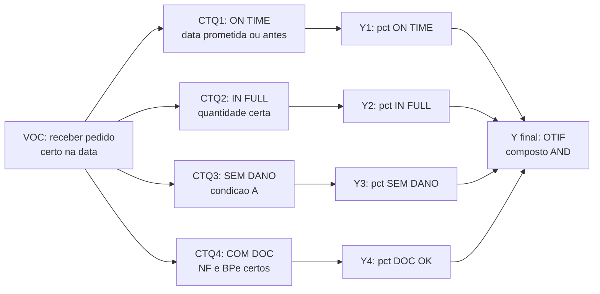
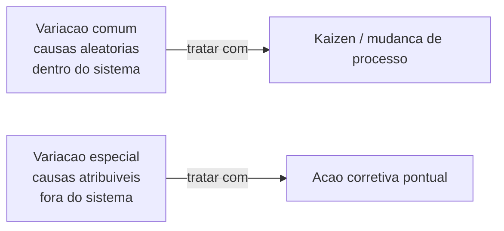
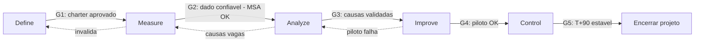

# Y = f(X) na logística — OTIF, lead time e acurácia como «saída» de um sistema

**Six Sigma** (em nível **literacia**, não certificação) ensina a escrever o problema como **Y = f(X)**: a **saída crítica** (CTQ — *Critical to Quality*) que importa para o cliente ou o P&L é função de **causas X** (processo, pessoas, máquina, método, medição, ambiente — clássico **6M** ou *fishbone*). Em logística, Y costuma ser **OTIF**, **lead time** (média e P90), **acurácia de inventário**, **dano**, **custo por entrega**, **NPS** e **devolução**.

**Regra de ouro:** **estabilizar** (reduzir causas especiais e variação) **antes** de **otimizar** o alvo — senão você calibra o processo errado. **DMAIC** (Define-Measure-Analyze-Improve-Control) é o método; **belt** (yellow/green/black) é a certificação que **não** entregamos aqui — mas você aprende a **conversar** com belts e a defender o seu Y.

---

## Objetivos e resultado de aprendizagem

**Ao final desta aula**, você será capaz de:

- Formular um problema logístico no formato **Y = f(X)** com Y mensurável (CTQ), unidade, baseline e meta.
- Distinguir variação **comum** (causa aleatória, dentro do sistema) *versus* **especial** (causa atribuível, fora do sistema) usando intuição de Shewhart.
- Calcular **DPMO** (*Defects Per Million Opportunities*) e relacionar com **nível sigma** (com tabela).
- Nomear e descrever as **5 fases DMAIC** com **portões de decisão** e **entregáveis** mínimos.
- Posicionar Six Sigma frente a **Lean** e **Kaizen rápido** — quando usar cada um.
- Esboçar uma **árvore CTQ** e um **SIPOC** para um caso logístico.

**Duração sugerida:** 75–90 minutos.
**Pré-requisitos:** [Aula 1.1](../modulo-01-lean-logistics/aula-01-valor-desperdicios-logistica.md), noções básicas de média/desvio-padrão.

---

## Mapa do conteúdo

1. Gancho — «melhorar OTIF» sem definir OTIF.
2. Y, X, CTQ e voz do cliente (VOC).
3. Variação comum vs. especial (Shewhart, intuição).
4. DPMO e nível sigma (tabela e cálculo).
5. DMAIC com portões e entregáveis.
6. SIPOC e árvore CTQ.
7. Diagrama principal (DMAIC + portões).
8. Quando Six Sigma complementa Lean (matriz).
9. Trade-offs, erros, KPIs, ferramentas, glossário.
10. Exercícios, gabarito, reflexão, referências, pontes.

---

## Gancho — «melhorar OTIF» sem definir OTIF

A **TechLar** abriu projeto Six Sigma com Y = «**OTIF**». Na segunda reunião, comercial, logística e TI apresentaram **três definições** distintas:

| Área | Definição usada |
|------|-----------------|
| Comercial | data prometida ao cliente final (com tolerância +1d) |
| Logística (CD) | data planejada de carregamento (sem tolerância) |
| TI / planejamento | data confirmada no ERP (sem garantia de pickup) |

O projeto mediu **coisas diferentes** durante 6 semanas — números «melhoraram» na visão CD enquanto pioravam para o cliente final. **Y mal definido é DMAIC em círculo**, com gente cansada e sponsor desconfiado. Refizeram o **Define** com uma **árvore CTQ** e uma **definição operacional única** assinada pelo sponsor: *OTIF = entregue (recebido pelo cliente, no local correto, na quantidade certa, sem dano) na data prometida ou anterior, com tolerância de 0 dia e janela de 4h*. Em 4 semanas o projeto destravou.

> **Analogia do médico que prescreve sem diagnóstico:** receitar antibiótico para tosse genérica pode piorar o paciente. *Define* mal feito é receita sem anamnese. **Y claro é metade da cura.**

> **Analogia do GPS sem destino:** se você não digita o endereço final, qualquer rota é certa — e você anda em círculo achando que está progredindo.

---

## Conceito-núcleo — Y = f(X), CTQ e voz do cliente

### 1. Y, X, CTQ e VOC

- **VOC** (*Voice of the Customer*): o que o cliente **diz** querer (entrevista, NPS, contrato, reclamação).
- **CTQ** (*Critical to Quality*): tradução **mensurável** do VOC. «Entregar rápido» (VOC) → «Lead time pedido→entrega ≤ 48h em 95% dos pedidos B2C» (CTQ).
- **Y**: variável **dependente** que mede o CTQ.
- **X**: variáveis **independentes** que influenciam Y.

### 2. Árvore CTQ — exemplo OTIF B2B



> **Legenda:** OTIF é **composto AND** — falha em qualquer dimensão derruba o pedido inteiro. Math: se cada Y tem 98%, OTIF = 0,98⁴ = **92,2%**, não 98%. Por isso OTIF é tão difícil — exige excelência em **todas** as dimensões.

### 3. Y e X — exemplos pedagógicos

| Y (saída) | Possíveis X (causas) |
|-----------|----------------------|
| OTIF | *cut-off* time, acurácia de estoque, integração WMS↔ERP↔TMS, endereço cadastrado, atraso transportador, janela cliente |
| Lead time P90 | fila doca, tamanho de onda, variabilidade de conferência, *batch* de embalagem, *cutoff* tardio |
| Acurácia de inventário | 5S, treino, master data, política de ajuste, contagem cíclica, integridade RF |
| Dano em transporte | embalagem, paletização, modo, motorista, distância, manuseio terminal |
| Custo por linha | produtividade, layout, tecnologia, mix, volume |
| NPS B2B | OTIF, pós-venda, comunicação, devolução, fatura |

### 4. Variação comum vs. especial (Shewhart)



| Tipo | Origem | Exemplo logístico | Como tratar |
|------|--------|--------------------|-------------|
| **Comum** | natureza do sistema atual | variação diária de lead time entre 4h e 6h | **mudar o sistema** (kaizen, projeto) |
| **Especial** | causa atribuível, evento isolado | pico de 12h por queda de WMS | **investigar e remover causa** (RCA pontual) |

> **Erro mortal de Deming:** tratar **comum** como **especial** (caçar pessoa por «má sorte») destrói moral e não muda nada. Tratar **especial** como **comum** (ignorar pico anormal) deixa risco crescer. Gráfico de controle ajuda a separar (próxima aula).

---

## DPMO e nível sigma — métrica de capacidade

### Cálculo de DPMO

\[
\text{DPMO} = \frac{D}{U \times O} \times 1\,000\,000
\]

Onde:
- D = defeitos observados
- U = unidades inspecionadas
- O = oportunidades de defeito por unidade

### Tabela de nível sigma (curto)

| Sigma | DPMO | Yield (qualidade %) | Equivalente logístico |
|-------|------|---------------------|------------------------|
| **2σ** | 308 537 | 69,1% | OTIF muito ruim |
| **3σ** | 66 807 | 93,3% | OTIF mediano BR |
| **4σ** | 6 210 | 99,38% | bom CD nacional |
| **5σ** | 233 | 99,977% | classe mundial |
| **6σ** | 3,4 | 99,99966% | Toyota/farma rigoroso |

**Exemplo TechLar — picking:**
- 800 pedidos/dia × 60 linhas/pedido = **48 000 linhas/dia**
- Defeitos (linha errada): 96 linhas/dia
- Oportunidades por linha: 1
- DPMO = 96 ÷ 48 000 × 1 000 000 = **2 000 DPMO** ≈ **4,4σ** (interpolando)

> **Insight:** picking de 4,4σ é bom; OTIF composto que depende de picking + transporte + cadastro tende a derrubar o sigma final. **Sigma do elo mais fraco** manda no resultado.

---

## DMAIC — fases, portões e entregáveis

### Visão geral



### Tabela de portões DMAIC

| Fase | Pergunta de saída | Entregáveis mínimos | Risco se pular |
|------|-------------------|---------------------|----------------|
| **Define** | problema, cliente, escopo, ROI estão claros? | charter, SIPOC, árvore CTQ, equipe, sponsor | medir o problema errado |
| **Measure** | dado é confiável? baseline é honesto? | plano de coleta, MSA (Gage R&R) ≥ aceitável, baseline Y | otimizar ruído |
| **Analyze** | causas raiz validadas com dado? | Pareto, Ishikawa, 5 porquês, regressão/teste hipóteses | atacar sintoma |
| **Improve** | piloto provou ganho > risco? | desenho contramedida, piloto, FMEA atualizado, ROI | escalar erro |
| **Control** | regressão prevenida? | SOP, plano de controlo, andon, treino, dono | volta ao baseline |

### MSA — *Measurement System Analysis* (essencial)

Antes de medir Y de verdade, **medir o medidor**. Métricas comuns:

- **Repetibilidade**: mesmo operador, mesma peça → resultado consistente?
- **Reprodutibilidade**: operadores diferentes → mesmo resultado?
- **Gage R&R %** (alvo: <10% excelente, <30% aceitável, >30% inadequado).

Em logística: o «medidor» é o **sistema** (ERP timestamp, WMS scan, TMS rastreio). Faça MSA antes de afirmar lead time:

```text
Plano MSA simples — lead time pedido→entrega:
1. 30 pedidos amostra
2. Medição A: ERP timestamp
3. Medição B: WMS timestamp expedição
4. Medição C: TMS comprovante motorista
Compare deltas; alvo: <10% de variação injustificada.
```

---

## SIPOC — uma página para alinhar

| **S**uppliers | **I**nputs | **P**rocess | **O**utputs | **C**ustomers |
|---------------|------------|-------------|-------------|---------------|
| Fornecedor MP, comercial | pedido, ASN, MP, master data | receber → armazenar → separar → embalar → expedir → entregar | pedido entregue OTIF, NF, comprovante | cliente B2B, cliente final, comercial, finanças |

**SIPOC** é o «mapa rápido» de Define — uma folha que mostra **fronteiras** do projeto. Inestimável para evitar **scope creep**.

---

## Aprofundamentos — variações setoriais

| Setor | Y dominante | X críticos típicos |
|-------|-------------|---------------------|
| **B2C e-commerce** | lead time P90, devolução, NPS | cutoff, fulfillment, transportadora, embalagem |
| **B2B distribuição** | OTIF, fill rate, devolução fiscal | cadastro, doca, integração TMS, contrato |
| **Farma** | acurácia lote/validade, GDP compliance | sistema, treino, FEFO, temperatura |
| **Cold chain** | rupturas térmicas, validade | sensor, manuseio, equipamento, SOP |
| **Manufatura linha** | OEE, scrap, refugo | máquina, setup, MP, operador |
| **3PL** | SLA por cliente, faturamento corretο | contrato, sistema, treino, integração |
| **Transporte** | OTD (*on time delivery*), avaria | motorista, rota, frota, manutenção |

---

## Quando Six Sigma complementa Lean — matriz de decisão

| Situação | Lean (kaizen) | Six Sigma (DMAIC) | Kaizen rápido |
|----------|----------------|---------------------|---------------|
| Problema **simples**, causa **conhecida**, ROI rápido | ✅ | ❌ | ✅ |
| Problema **estável**, causa **suspeita** | ✅ | ⚠️ | ✅ |
| Problema **estável**, causa **desconhecida**, dado **disponível** | ❌ | ✅ | ❌ |
| Problema **estável**, causa **desconhecida**, dado **frágil** | ❌ | ✅ (foco em Measure/MSA) | ❌ |
| Problema **instável** (causas especiais) | ⚠️ (estabilizar primeiro) | ⚠️ (não otimize ruído) | ✅ ataca causa especial |
| Problema **estratégico** (capital, infra) | ❌ | ⚠️ | ❌ — usar **projeto** (módulo 4) |

> **Regra:** **Lean + Six Sigma = Lean Six Sigma**. Lean dá **fluxo**, Six Sigma dá **disciplina de dados**. Em logística madura, são **complementares**, não rivais.

---

## Trade-offs e decisão

| Trade-off | Lado A | Lado B |
|-----------|--------|--------|
| Rigor estatístico | confiança alta no resultado | demora, custo |
| Velocidade kaizen | ganho rápido, motivação | risco de tratar sintoma |
| Treinar belts internos | autonomia de longo prazo | investimento alto, risco de retenção |
| Belt externo (consultoria) | conhecimento maduro | dependência, transferência fraca |
| Foco P50 vs. P90 | P50 = média confortável | P90 = experiência cliente real |
| 6σ como meta | qualidade extrema | custo proibitivo se não crítico |

---

## Caso prático / Mini-laboratório — escrever um Define honesto

### Problem statement (formato Y = f(X) padrão)

> «Reduzir o **lead time interno** (pedido liberado → carregado) **P90** do CD São Paulo TechLar de **8,5h** (mar/2026) para **5h** até **set/2026**, porque a janela de transporte negociada com o cliente premium B2B exige cut-off às 16h e atualmente perdemos **18%** das janelas (custo de R$ 240k/mês em re-envio).»

### Componentes do problem statement

| Componente | Exemplo | Por que importa |
|-----------|---------|------------------|
| Y | Lead time interno P90 | mensurável, alinhado a contrato |
| Métrica | hora (timestamp ERP→WMS) | unidade clara |
| Baseline | 8,5h | dado registrado |
| Meta | 5h | desafiadora mas plausível |
| Prazo | set/2026 | gera urgência |
| Dor de negócio | R$ 240k/mês | conecta a P&L |
| Escopo | CD SP, B2B premium | evita scope creep |

### Top 5 X candidatos (hipótese pré-Measure)

1. Tempo de espera ERP→WMS (fila integração).
2. Tamanho de onda (mura de liberação comercial).
3. FTR picking (defeito → retrabalho).
4. Conferência dupla (overprocessing).
5. Janela de doca (espera transportador).

### Plano de Measure (resumido)

- Coletar 3 semanas de timestamps ERP, WMS, TMS.
- MSA simples: validar 30 pedidos com cronómetro vs. timestamp.
- Baseline P50, P90 e DPMO de janela perdida.

### Cálculo de DPMO da janela

- Pedidos B2B premium / mês: 4 200
- Janelas perdidas: 756 (18%)
- Oportunidade: 1 por pedido
- DPMO = 756 / 4200 × 1 000 000 = **180 000** → **~2,4σ** (muito ruim, justifica projeto Black Belt).

---

## Erros comuns e armadilhas

1. **DMAIC sem sponsor** com poder de cortar escopo, ajustar prioridades, alocar recurso. Projeto morre no Analyze.
2. **Confundir correlação com causa** — painel mostra que dia chuvoso correlaciona com OTIF baixo; pode ser também dia de pico de pedido. Use lógica de processo + experimento.
3. **Otimizar média ignorando cauda** (P90 do lead time é o que cliente sente).
4. **Terceirizar o projeto para «o belt»** sem dono operacional. Belt facilita; **dono entrega**.
5. **Pular MSA** porque «o sistema mede certo». Em CD BR, divergência ERP↔WMS↔TMS é regra.
6. **Define eterno** — equipe revisa charter por meses sem coletar dado.
7. **Six Sigma onde **Lean** simples resolveria** (overkill estatístico).
8. **Belt sem voz no executivo** — projeto vira lista de boa intenção.
9. **«Sigma alto»** como vaidade — qual o **custo** para ir de 4σ a 5σ vs. retorno?
10. **Definição operacional muda no meio** do projeto — baseline e meta perdem sentido.

---

## Comportamento e cultura

- **Champion** (executivo) patrocina o programa Six Sigma e abre portas.
- **Master Black Belt** treina e mentoreia belts; raro em empresas BR < 500 colaboradores.
- **Black Belt** lidera projeto complexo (3–6 meses, ROI alto).
- **Green Belt** lidera projeto local (3 meses, ROI médio).
- **Yellow Belt** participa, conhece vocabulário, executa coleta.
- **White Belt** = literacia (esta aula).
- **Cultura crítica:** Six Sigma sem **dado honesto** é teatro estatístico. Quem manipula número para «fechar gate» destrói o programa.
- **Recompensa por aprendizado** (não só por ganho R$): projeto que mostra que a hipótese estava errada é vitória.

---

## KPIs de melhoria

| KPI | Pergunta | Dono | Fonte | Cadência | Playbook |
|-----|----------|------|-------|----------|----------|
| Y do projeto (definição única) | Y melhora? | belt + dono área | sistema validado | semanal | revisar X conforme dado |
| % projetos com MSA aprovado | dado é confiável? | EO | base de projetos | mensal | treinar belts em MSA |
| % projetos que passam G1 (charter assinado) | sponsor presente? | PMO | base | mensal | reforçar champion |
| Taxa de projetos com regressão T+90 | controle eficaz? | EO | revisão T+90 | trimestral | reforçar plano de controlo |
| ROI realizado / ROI prometido | benefício chega? | controladoria | financeiro | trimestral | gate de benefícios PMO |
| Nível sigma do elo crítico | qualidade integrada | EO | DPMO | mensal | atacar elo mais fraco |

---

## Tecnologias e ferramentas

| Categoria | Ferramenta |
|-----------|------------|
| Estatística | **Minitab**, JMP, R, Python (scipy, statsmodels), **SigmaXL** (Excel add-in) |
| Mapeamento | Lucidchart, Visio, Bizagi (para SIPOC/fluxo) |
| Coleta | Power Query, KNIME, Power BI, Excel + macro |
| Gestão de projeto | Smartsheet, MS Project, Jira (kanban DMAIC) |
| Treino belt | ASQ, *Six Sigma Academy*, **FM2S** (BR), Vanzolini, Setec, Lean Institute Brasil |
| WMS/TMS para Y | SAP EWM, Oracle, Manhattan, Mercurio, WMS3 |
| Documentação | Confluence, SharePoint, OneNote |
| Dashboards | Power BI, Tableau, Qlik, Looker |

---

## Glossário rápido

- **VOC / CTQ / Y / X** — voz cliente / crítico para qualidade / saída / causa.
- **DMAIC** — Define-Measure-Analyze-Improve-Control.
- **SIPOC** — *suppliers, inputs, process, outputs, customers*.
- **DPMO** — *defects per million opportunities*.
- **MSA / Gage R&R** — análise do sistema de medição.
- **Variação comum / especial** — Shewhart; sistema vs. atribuível.
- **Yield / Sigma level** — qualidade de saída em escala σ.
- **Belt** — yellow/green/black/master black/champion (níveis Six Sigma).
- **FMEA** — *failure mode and effect analysis* (módulo 2.3).
- **Charter** — documento que abre o projeto (módulo 4).

---

## Aplicação — exercícios

### Exercício 1 — escrever um Define (15 min)

Escreva **um** problema **da sua operação** no formato:

> «Reduzir/Aumentar **Y** de **valor atual** para **meta** até **data**, porque **dor de negócio R$**.»

Liste **5 X candidatos**. Marque **2** para coletar dados primeiro (justifique).

**Gabarito:** Y deve ter **unidade**, **janela** e **escopo**. X deve ser **acionável** (não «clima organizacional» vago sem proxy mensurável).

### Exercício 2 — calcular DPMO e sigma (10 min)

Em um mês: 12 000 pedidos B2B; 168 com falha de OTIF; 1 oportunidade por pedido.
- Calcule DPMO.
- Estime nível sigma.
- Comente se justifica projeto Six Sigma ou Lean rápido.

**Gabarito:**
- DPMO = 168 / 12 000 × 1 000 000 = **14 000 DPMO** ≈ **3,7σ**
- Espaço claro de melhoria; se OTIF = CTQ contratual com multa, **vale Six Sigma**. Se for processo simples e causa óbvia, kaizen rápido pode bastar.

### Exercício 3 — árvore CTQ (10 min)

Para um cliente B2B varejista que pede «entrega previsível», desenhe uma árvore CTQ com 3 ramos e 1 Y mensurável por ramo.

**Gabarito sugerido:**
- Ramo 1: ON TIME → Y1 = % entregas no slot ±30 min.
- Ramo 2: COMUNICAÇÃO → Y2 = % notificações automáticas <2h pré-entrega.
- Ramo 3: COMPROVANTE → Y3 = % POD digital recebido <24h.

---

## Pergunta de reflexão

**Qual KPI hoje na sua empresa tem duas (ou mais) definições vivas em áreas diferentes?** Quem precisaria assinar a versão única — e qual seria o primeiro passo para alinhar?

---

## Fechamento — três takeaways

1. **Y claro é metade do Define.** Sem CTQ mensurável, DMAIC anda em círculo.
2. **Estabilizar não é «perder tempo»** — é **não otimizar ruído**.
3. **Six Sigma + Lean = fluxo + disciplina de dados** quando o problema exige rigor que a intuição não dá.

---

## Referências

1. PYZDEK, T.; KELLER, P. *The Six Sigma Handbook*. McGraw-Hill, 4.ª ed.
2. MONTGOMERY, D. C. *Introduction to Statistical Quality Control*. Wiley.
3. GEORGE, M. L. *Lean Six Sigma for Service*. McGraw-Hill.
4. HARRY, M. J.; SCHROEDER, R. *Six Sigma: The Breakthrough Management Strategy*. Random House.
5. DEMING, W. E. *Out of the Crisis*. MIT Press. (variação comum vs. especial)
6. ASQ — corpo de conhecimento Six Sigma: <https://asq.org/>
7. Lean Six Sigma Institute (BR): <https://www.fm2s.com.br/> / <https://www.setec.com.br/>
8. Vanzolini — Programa Lean Six Sigma USP: <https://vanzolini.org.br/>
9. ABEPRO — anais Six Sigma BR: <https://www.abepro.org.br/>

---

## Pontes para outras trilhas

- [OTIF, Fill rate e contrato — Dados](../../trilha-dados-analytics-logistica/modulo-04-indicadores-logisticos-kpis/aula-01-otif-fill-rate-contrato-interno.md): definição contratual de OTIF.
- [Lead time e variabilidade — Dados](../../trilha-dados-analytics-logistica/modulo-04-indicadores-logisticos-kpis/aula-02-lead-time-variabilidade-logistica.md): P90, cauda, MSA.
- [Master Data — Tecnologia](../../trilha-tecnologia-e-sistemas/modulo-01-master-data-para-logistica/aula-01-master-data-na-cadeia.md): X de cadastro.
- [Estrutura de custos — Fundamentos](../../trilha-fundamentos-e-estrategia/modulo-04-custos-logisticos-performance/aula-01-estrutura-custos-logisticos.md): conectar Y a R$.
- **Próxima aula desta trilha:** [Medir e analisar — Pareto, gráficos e amostragem](aula-02-medir-analisar-pareto-amostragem.md).
