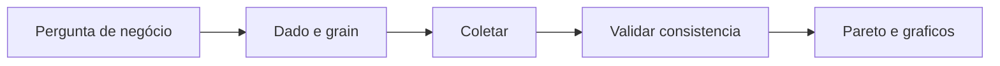

# Medir e analisar — Pareto, gráficos e amostragem no chão

A fase **Measure** garante que o número **reflete** a realidade; **Analyze** transforma dados em **prioridade** — em geral com **Pareto** (poucos X com grande impacto) e gráficos simples (*run chart*, histograma). Em logística, a armadilha é **amostragem** enviesada: medir só segunda-feira de manhã ou só o melhor operador.

Esta aula **não** substitui estatística inferencial completa; prepara para **conversar** com *belts* e analistas.

---

## Objetivos e resultado de aprendizagem

**Ao final desta aula**, você será capaz de:

- Desenhar um **plano de coleta** mínimo para Y ou defeito logístico.  
- Interpretar **Pareto** de causas de falha.  
- Ler *run chart* para suspeita de **causa especial**.  
- Remeter definições de KPI à trilha Dados.

**Duração sugerida:** 60–90 minutos.

---

## Gancho — o Pareto que culpou o motorista

Na **TechLar**, 60% das atrasos foram atribuídos a «**motorista**» no brainstorming. O Pareto com **código de causa** (janela doca, endereço, lista de picking, sistema) mostrou que **metade** era **espera interna** antes do caminhão sequer ser chamado. **Causa conveniente** obscureceu X de processo.

**Analogia do hospital:** culpar o paciente pelo congestionamento na emergência — às vezes o gargalo é **triagem**.

---

## Mapa do conteúdo

- Plano de coleta (operacionalização).  
- Pareto e regra 80/20 pedagógica.  
- *Run chart* e histograma (intuição).  
- Amostragem e viés.

---

## Plano de coleta — checklist mínimo

1. **Definição operacional** do defeito ou do Y (ligação à trilha Dados).  
2. **Granularidade** (pedido, linha, viagem, dia).  
3. **Responsável** e **onde** o dado nasce (WMS, TMS, planilha).  
4. **Período** que inclui **variação** real (picos).  
5. **Regras** de exclusão documentadas (ex.: greve, *downtime* de sistema).

**Legenda:** pular **V** gera história bonita e decisão errada.

---

## Pareto

Ordenar causas ou categorias de falha **decrescente**; acumular **%**; focar nas **primeiras** barras que explicam a maior parte do efeito.

**Exercício (dados fictícios):** em 200 falhas de OTIF: espera doca 80, picking errado 50, integração 35, transportador 20, outros 15. Construa a narrativa: **primeiro** atacar doca e picking **se** validado no *gemba*.

**Gabarito pedagógico:** Pareto diz **onde olhar**, não **prova causalidade** — confirmação com observação ou experimento.

---

## *Run chart* e histograma (intuição)

- ***Run chart*:** Y no tempo — **saltos** ou **padrões** sugerem causa especial ou mudança de regime.  
- **Histograma:** forma da distribuição — **cauda longa** em lead time é comum em logística; melhorias podem mirar **P90**, não só média.

---

## Erros comuns e armadilhas

- **Definição** de defeito muda no meio do projeto.  
- Amostra **só** de um turno ou de um canal.  
- Pareto com categoria **«outros»** gigante — mistura demais.  
- Confiar em **média** do TMS sem **timestamp** alinhado ao ERP.

---

## KPIs e decisão

- **% dados** coletados no prazo do plano.  
- **Estabilidade** visual do Y antes de melhorias grandes.  
- **Revisão** de definição de KPI com dono único (ver trilha Dados).

---

## Fechamento — três takeaways

1. Medir mal é **otimizar alucinação**.  
2. Pareto é **bússola**, não sentença.  
3. Logística sem **P90** muitas vezes mente na média.

**Pergunta de reflexão:** qual causa hoje está no Pareto por **hábito de classificação**, não por dado?

---

## Referências

1. MONTGOMERY, D. C. *Introduction to Statistical Quality Control*. Wiley.  
2. [Lead time e variabilidade — Dados](../../trilha-dados-analytics-logistica/modulo-04-indicadores-logisticos-kpis/aula-02-lead-time-variabilidade-logistica.md)  
3. [Qualidade e viés — Dados](../../trilha-dados-analytics-logistica/modulo-01-data-analytics-para-logistica/aula-02-qualidade-vies-demanda-fantasma.md)
