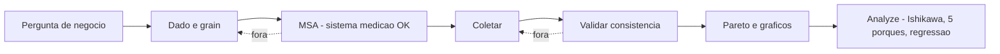
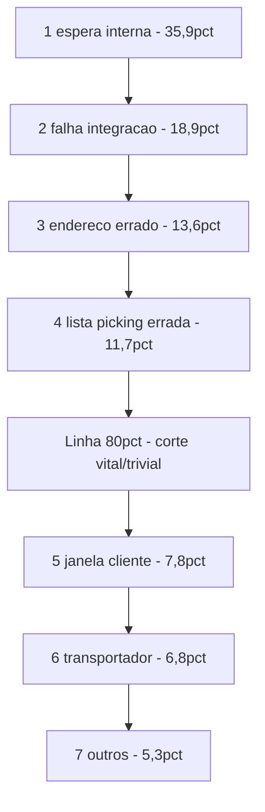
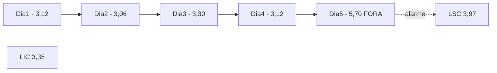
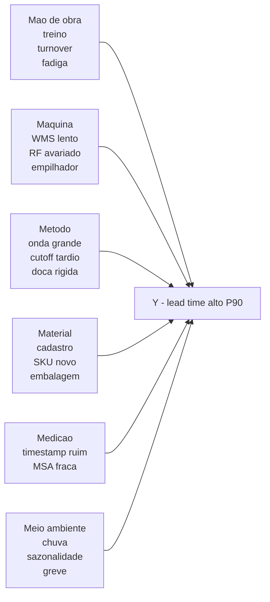

# Medir e analisar — Pareto, gráficos e amostragem no chão (com Cpk e gráfico de controle)

A fase **Measure** garante que o número **reflete** a realidade (medindo o medidor — MSA — e definindo plano de coleta sem viés). **Analyze** transforma dados em **prioridade** com **Pareto** (poucos X explicam a maior parte do efeito), **histograma** (forma da distribuição), **run chart** e **gráficos de controle** (Xbar-R, p-chart) para separar variação **comum** vs. **especial**, e **Ishikawa + 5 Por Quês** para causa-raiz. Em logística, a armadilha clássica é a **amostragem enviesada** — medir só na manhã de segunda-feira ou só com o melhor operador.

Esta aula **não substitui** estatística inferencial completa; prepara para **conversar com belts**, **defender o seu Y** e **construir o gráfico de controle do seu lead time** com fórmulas mostradas passo a passo. Inclui **Cpk** (capabilidade) e **regras de Western Electric** para detectar tendências.

---

## Objetivos e resultado de aprendizagem

**Ao final desta aula**, você será capaz de:

- Desenhar um **plano de coleta** mínimo (definição operacional, *grain*, dono, período, exclusão) para Y ou defeito logístico.
- Construir e interpretar **Pareto** com cálculo de **% acumulado** e regra 80/20.
- Calcular **média** (\(\bar{x}\)), **desvio-padrão** (s), **percentis** (P50, P90, P99) com dados manuais.
- Construir **gráfico de controle Xbar-R** passo a passo, com LSC/LIC e limites de Western Electric.
- Calcular **Cp/Cpk** (capabilidade) e interpretar resultado contra alvo 1,33.
- Aplicar **Ishikawa (6M)** + **5 Por Quês** disciplinado, evitando saltos lógicos.
- Distinguir **viés** comum de amostragem (turno, operador, sazonalidade, sobrevivência).

**Duração sugerida:** 90–120 minutos (com mini-lab numérico de 30 min).
**Pré-requisitos:** [Aula 2.1 — Y = f(X)](aula-01-y-igual-fx-otif-lead-time.md); literacia básica em Excel/planilha.

---

## Mapa do conteúdo

1. Gancho — Pareto que culpou o motorista.
2. Plano de coleta — checklist operacional.
3. Pareto com cálculo passo a passo.
4. Histograma, run chart, intuição.
5. **Gráfico de controle Xbar-R** com fórmulas.
6. **Cp/Cpk** com cálculo.
7. Ishikawa (6M) + 5 Por Quês — caso TechLar.
8. Amostragem e viés (Hawthorne, sobrevivência, turno).
9. Trade-offs, erros, KPIs, ferramentas, glossário.
10. Exercícios, gabarito, reflexão, referências, pontes.

---

## Gancho — o Pareto que culpou o motorista

Na **TechLar**, na primeira reunião de DMAIC sobre atrasos B2B, o brainstorming atribuiu **60%** das ocorrências a «**motorista**» (causa conveniente, externa, fácil de culpar). O sponsor pediu **dado real**. A equipe instituiu **código de causa** registrado em cada ocorrência e amostrou 4 semanas (n = 412 atrasos):

| Categoria | Ocorrências | % | % acumulado |
|-----------|-------------|---|--------------|
| Espera interna (onda/staging) | 148 | 35,9% | 35,9% |
| Falha integração ERP↔WMS | 78 | 18,9% | 54,8% |
| Endereço incorreto cadastro | 56 | 13,6% | 68,4% |
| Lista picking errada | 48 | 11,7% | 80,1% |
| Janela cliente inflexível | 32 | 7,8% | 87,9% |
| Atraso transportador | 28 | 6,8% | 94,7% |
| Outros | 22 | 5,3% | 100% |

**Resultado:** «motorista» (transportador) era **6,8%**, não 60%. **Causa conveniente** obscureceu **X de processo interno**. As **3 primeiras causas** somam **68%** — atacar nelas tem ROI real. A categoria «Outros» = **5,3%** está dentro do aceitável (alvo: <10%); se fosse 30%, o código de causa estaria mal desenhado.

> **Analogia do hospital pronto-socorro:** culpar o paciente pelo congestionamento — às vezes o gargalo é **triagem**, **macas**, ou **regulação de leito**. Pareto sem dado é **palpite com gráfico**.

> **Analogia do detective:** Sherlock não acusa pelo gosto pessoal; Sherlock segue **evidência**. Six Sigma é Sherlock disciplinado.

---

## Plano de coleta — checklist mínimo (Measure)

| Elemento | Pergunta a responder | Exemplo TechLar |
|----------|----------------------|-----------------|
| **Definição operacional** | o que é exatamente um defeito? | atraso = entregue após data prometida + tolerância 0d |
| **Granularidade (grain)** | unidade de medida | linha, pedido, viagem, dia |
| **Onde nasce o dado** | sistema fonte único | WMS para FTR; ERP para data prometida; TMS para entrega |
| **Responsável pela coleta** | quem opera o registro | supervisor de turno + analista CD |
| **Período** | inclui pico, vale, todos os turnos? | 4 semanas cobrindo 1 quinzena fiscal e 1 promoção |
| **Frequência** | turno, dia, semana | turno (3×/dia) |
| **Tamanho amostral** | n suficiente para estatística | n ≥ 30 por subgrupo para CLT |
| **Regras de exclusão** | o que descartar e por quê | greve, *downtime* WMS > 4h, deslizamento natural |
| **MSA** | sistema de medição validado? | MSA realizado: Gage R&R 8% (aceitável) |

> **Legenda:** **MSA** entre D e C é o passo que mais se pula — e o que mais derruba projeto. Pular **V** gera história bonita e decisão errada.

---

## Pareto — passo a passo

**Princípio de Pareto (Vilfredo Pareto, ~1900):** ~80% dos efeitos vêm de ~20% das causas. Empírico, não lei rígida.

### Algoritmo

1. Listar **categorias de causa**.
2. Contar ocorrências (ou somar custo, tempo).
3. Ordenar **decrescente**.
4. Calcular **% individual** e **% acumulado**.
5. Plotar **barras (% individual)** + **linha (% acumulado)**.
6. Marcar **corte 80%** com linha horizontal.
7. As categorias à esquerda do corte são as **vitais**; à direita, **triviais**.

### Exemplo numérico — atrasos TechLar (acima)

**Decisão:** atacar X1, X2, X3 (e X4 que está no limite). X5–X7 entram em backlog se houver capacidade. **Pareto-de-Pareto:** depois de atacar X1, fazer **novo Pareto** apenas das causas **dentro** de X1 (o que faz a fila? operador, sistema, comercial?).

---

## Histograma e percentis — ler distribuição

### Por que importa

Em logística, **lead time** raramente é **gaussiano**. É **assimétrico positivo** (cauda longa): a maior parte dos pedidos sai em 2–4h, mas alguns demoram 12h. **Média mente; mediana e P90 não.**

### Cálculo de percentis (manual, n = 20)

Lead times (h) ordenados crescente: 1,2; 1,5; 1,8; 2,0; 2,1; 2,2; 2,4; 2,5; 2,6; 2,8; 3,0; 3,1; 3,3; 3,5; 3,8; 4,2; 4,8; 5,5; 7,2; **11,5**.

- **Média** \(\bar{x}\) = 76,2 / 20 = **3,81 h**
- **Mediana (P50)** = (2,8 + 3,0)/2 = **2,9 h**
- **P90** = posição 18 (90% × 20) = **5,5 h**
- **P99** ≈ posição 19,8 → **~9,4 h** (interpolado)
- **Max** = 11,5 h

> **Interpretação:** cliente B2B percebe **5,5h** (P90), não 3,81h. Se cut-off é 4h, **20% dos pedidos** estão fora — projeto Six Sigma justificado. Atacar **cauda** (outliers) com RCA, não a média.

---

## Run chart e gráfico de controle Xbar-R — separar comum de especial

### Run chart — versão simples

Plotar Y no tempo. Procurar:
- **Tendência** (subida/queda sustentada de 7+ pontos);
- **Salto** abrupto (mudança de regime);
- **Ciclos** (sazonalidade);
- **Padrão** alternado (causa especial estrutural).

### Gráfico de controle Xbar-R (variável contínua, subgrupos)

Usado para **monitorar processo estável**. Subgrupos de tamanho **n = 4 ou 5** (clássico). Para cada subgrupo:
- \(\bar{X}_i\) = média do subgrupo
- \(R_i\) = amplitude (max − min)

Após **k ≥ 25 subgrupos**:

\[
\bar{\bar{X}} = \frac{\sum \bar{X}_i}{k}, \quad \bar{R} = \frac{\sum R_i}{k}
\]

\[
\text{LSC}_{\bar{X}} = \bar{\bar{X}} + A_2 \bar{R}, \quad \text{LIC}_{\bar{X}} = \bar{\bar{X}} - A_2 \bar{R}
\]

\[
\text{LSC}_R = D_4 \bar{R}, \quad \text{LIC}_R = D_3 \bar{R}
\]

**Constantes (n=5):** A₂ = 0,577; D₃ = 0; D₄ = 2,114.
**(n=4):** A₂ = 0,729; D₃ = 0; D₄ = 2,282.

### Mini-cálculo (n=5, k=5 subgrupos)

Lead time (h) em 5 dias com 5 amostras/dia:

| Dia | x1 | x2 | x3 | x4 | x5 | \(\bar{X}\) | R |
|-----|----|----|----|----|----|---|---|
| 1 | 3,0 | 3,2 | 2,8 | 3,5 | 3,1 | 3,12 | 0,7 |
| 2 | 2,9 | 3,3 | 3,0 | 2,7 | 3,4 | 3,06 | 0,7 |
| 3 | 3,4 | 3,2 | 3,5 | 3,1 | 3,3 | 3,30 | 0,4 |
| 4 | 3,2 | 3,1 | 2,9 | 3,0 | 3,4 | 3,12 | 0,5 |
| 5 | **5,8** | **5,5** | **5,9** | **5,6** | **5,7** | **5,70** | 0,4 |

\[
\bar{\bar{X}} = (3,12+3,06+3,30+3,12+5,70)/5 = 3,66 \text{ h}
\]
\[
\bar{R} = (0,7+0,7+0,4+0,5+0,4)/5 = 0,54 \text{ h}
\]
\[
\text{LSC}_{\bar{X}} = 3,66 + 0,577 \times 0,54 = 3,66 + 0,31 = 3,97 \text{ h}
\]
\[
\text{LIC}_{\bar{X}} = 3,66 - 0,31 = 3,35 \text{ h}
\]
\[
\text{LSC}_R = 2,114 \times 0,54 = 1,14 \text{ h}; \quad \text{LIC}_R = 0
\]

**Interpretação:** Dia 5 com \(\bar{X}\) = 5,70 está **acima da LSC** = 3,97 → **causa especial** (investigar: foi mudança de WMS? troca de turno? promoção? falha de integração?). Removida a causa, refazer o gráfico.

### Regras de Western Electric (suplemento)

- **Regra 1:** 1 ponto fora de ±3σ (LSC/LIC).
- **Regra 2:** 2 de 3 pontos consecutivos fora de ±2σ (mesmo lado).
- **Regra 3:** 4 de 5 fora de ±1σ.
- **Regra 4:** 8 pontos consecutivos do mesmo lado da linha central.

> **Por que são úteis:** detectam **tendência** ou **deslocamento** antes de cair fora dos limites. Defendem você de surpresas.

### p-chart (atributo) — defeitos por amostra

Para defeito (FTR, OTIF), use **p-chart**:

\[
\bar{p} = \frac{\sum d_i}{\sum n_i}, \quad \text{LSC}_p = \bar{p} + 3\sqrt{\frac{\bar{p}(1-\bar{p})}{n}}
\]

---

## Cp e Cpk — capabilidade do processo

**Cp:** capacidade potencial (centrado).
**Cpk:** capacidade real (considerando descentramento).

\[
C_p = \frac{\text{LSE} - \text{LIE}}{6\sigma}
\]

\[
C_{pk} = \min\left(\frac{\text{LSE} - \mu}{3\sigma}, \frac{\mu - \text{LIE}}{3\sigma}\right)
\]

**Onde:** LSE/LIE = limite superior/inferior de **especificação** (do **cliente/contrato**); μ = média do processo; σ = desvio-padrão.

### Tabela de interpretação

| Cpk | Interpretação | Equivalente sigma |
|-----|---------------|--------------------|
| < 1,00 | **inadequado** — processo não atende | < 3σ |
| 1,00–1,33 | aceitável marginal | 3σ–4σ |
| **1,33** | **alvo industrial padrão** | 4σ |
| 1,67 | bom | 5σ |
| 2,00 | excelente | 6σ |

### Mini-cálculo (TechLar — lead time B2B)

- Especificação cliente: lead time interno **2h–6h**.
- Processo medido: μ = 3,8h; σ = 0,9h.

\[
C_p = \frac{6 - 2}{6 \times 0{,}9} = \frac{4}{5{,}4} = 0{,}74
\]

\[
C_{pk} = \min\left(\frac{6-3{,}8}{2{,}7}, \frac{3{,}8-2}{2{,}7}\right) = \min(0{,}81; 0{,}67) = 0{,}67
\]

**Interpretação:** Cpk = 0,67 → **processo inadequado**, ~3% pedidos fora de especificação superior. Para chegar a Cpk = 1,33 com mesma média, precisa **σ ≤ 0,55h** (redução de 39% na variação) **ou** centrar processo em μ = 4h e reduzir σ.

> **Insight:** atacar **variação** (σ) costuma render mais que atacar **média** (μ) — porque cauda mata.

### Pp / Ppk vs. Cp / Cpk

- **Cp/Cpk** = capacidade de **curto prazo** (subgrupos racionais).
- **Pp/Ppk** = performance de **longo prazo** (todos os dados).

Diferença esperada: Cp ≥ Pp porque longo prazo inclui deslocamentos. Belt experiente reporta **ambos**.

---

## Ishikawa (6M) + 5 Por Quês — causa-raiz disciplinada

### Diagrama de Ishikawa (espinha de peixe)

Os **6M** clássicos:

> **Legenda:** o **Y** (ponta direita) é o efeito; cada **M** é uma família de causas. Use brainstorming **com gente do gemba**, depois **dado** para confirmar quais espinhas têm músculo.

### 5 Por Quês — exemplo TechLar

**Problema:** lead time aumentou de 4h para 8h em 3 semanas.

1. **Por que** o lead time subiu? → porque a **fila de staging** dobrou.
2. **Por que** a fila dobrou? → porque **3 carretas** chegaram juntas no slot da tarde.
3. **Por que** chegaram juntas? → porque o **TMS** consolidou janela 14h–17h em janela única 15h–16h.
4. **Por que** o TMS consolidou? → porque o **planeador** aceitou desconto da transportadora sem revisar **capacidade da doca**.
5. **Por que** o planeador não consultou? → porque **não há SOP** que obrigue **handoff** entre planeamento de transporte e operação de doca.

**Causa-raiz: ausência de SOP de handoff transporte↔doca + governança fraca.**
**Contramedida:** SOP + reunião diária 15 min entre planejamento e líder de doca; alerta TMS quando consolidação afetar slot >50%.

> **Cuidado:** **5 Por Quês mal feito vira opinião em loop**. Boas regras:
> - cada «por quê» exige **evidência** (dado, observação);
> - parar quando chegar a algo **sob controle do projeto** (não a «cultura nacional»);
> - **diferentes ramos** podem ter causas diferentes — é normal expandir para 5 Por Quês × 3 ramos.

### A3 entra aqui (preview módulo 3)

Ishikawa + 5 Por Quês alimentam a **seção Análise** do **A3** (módulo 3.2). Cuidado: A3 sem dado vira ficção.

---

## Amostragem e viés — armadilhas

| Viés | Descrição | Antídoto |
|------|------------|----------|
| **Hawthorne** | gente medida muda comportamento | medir contínuo; comunicar propósito; usar timestamp automático |
| **Sobrevivência** | só medir pedidos «que chegaram» | incluir cancelados, devoluções |
| **Sazonal/turno** | só amostrar segunda manhã | estratificar por dia/turno/canal |
| **Operador** | só medir o melhor | aleatorizar; medir variabilidade entre operadores (ANOVA) |
| **Auto-seleção** | dado vem só de quem reporta | reporting obrigatório no sistema |
| **Confirmação** | procurar dado que confirma hipótese | desafiar; teste estatístico cego |
| **Survivorship sistémico** | só medir pedidos que ERP processou | incluir pedidos travados na integração |

---

## Aprofundamentos — variações setoriais

| Setor | Particularidade Pareto / análise |
|-------|----------------------------------|
| **B2C grande volume** | Pareto por **SKU** + por **transportadora** + por **CEP** (3 dimensões) |
| **B2B contratual** | Pareto por **cliente** + por **causa**; pode ter um cliente como 30% das ocorrências |
| **Farma / GDP** | Pareto por **lote** e **temperatura**; rigor estatístico maior |
| **3PL** | Pareto **por cliente** dentro do mesmo armazém; cuidado com mistura |
| **Cold chain** | Pareto de **rupturas térmicas** por trecho (recebimento, câmara, expedição, trânsito) |
| **Manufatura linha** | Pareto de **microparadas** com sensor IoT |

---

## Trade-offs e decisão

| Trade-off | Lado A | Lado B |
|-----------|--------|--------|
| Amostra grande | mais confiança | mais custo, demora |
| Coleta automática (sistema) | sem viés humano | depende de master data |
| Coleta manual | flexível | viés Hawthorne, custo |
| Pareto rápido | decisão ágil | risco de categoria mal definida |
| Pareto rigoroso | base sólida | demora |
| Cpk em projeto pequeno | rigor | overkill se Y simples |

---

## Caso prático / Mini-laboratório consolidado

### Dataset: 30 lead times de pedidos B2B (h)

`2,1; 2,3; 2,5; 2,8; 2,9; 3,0; 3,1; 3,2; 3,3; 3,4; 3,5; 3,5; 3,6; 3,7; 3,8; 3,9; 4,0; 4,1; 4,2; 4,3; 4,5; 4,8; 5,0; 5,2; 5,5; 5,8; 6,2; 6,8; 7,5; 9,2`

**Cálculos manuais:**

- n = 30; soma = 124,7; **média** = 124,7 / 30 = **4,16h**
- Mediana = (3,9 + 4,0)/2 = **3,95h**
- P90: posição 27 = **6,2h**
- P99 ≈ posição 29,7 → **~8,7h**
- Variância = Σ(xᵢ-x̄)²/(n-1); cálculo direto ≈ 2,72; **σ = √2,72 = 1,65h**

**Cpk (especificação 2h–6h):**
\[
C_p = \frac{6-2}{6 \times 1{,}65} = \frac{4}{9{,}9} = 0{,}40
\]
\[
C_{pk} = \min\left(\frac{6-4{,}16}{4{,}95}, \frac{4{,}16-2}{4{,}95}\right) = \min(0{,}37; 0{,}44) = 0{,}37
\]

**Interpretação:** processo **muito incapaz** (Cpk = 0,37 vs. alvo 1,33). 6 dos 30 pedidos (20%) acima de 6h. Atacar **σ** (variação) é prioritário.

**Pareto das causas (hipotético):** dos 6 acima de 6h, 4 ocorreram em segundas, 2 em pós-promoção → **mura de liberação** explica 67% da cauda. Ataque: **heijunka** + janela de cutoff distribuída.

---

## Erros comuns e armadilhas

1. **Definição de defeito muda no meio do projeto** — baseline e ganho perdem sentido.
2. **Amostra só de um turno ou canal** — viés sistemático.
3. **Pareto com categoria «outros» gigante** (>20%) — código mal desenhado.
4. **Confiar em média do TMS** sem timestamp alinhado ao ERP/WMS.
5. **Cpk sem MSA** — mede a regulagem do termómetro, não o processo.
6. **5 Por Quês sem evidência** — vira opinião do mais alto cargo na sala.
7. **Ishikawa exaustivo sem priorização** — 60 causas, 0 dados.
8. **Gráfico de controle sem subgrupo racional** (misturar linhas, turnos, SKUs) — limites inflam, perde sensibilidade.
9. **Pp = Ppk = Cpk = Cp** sem distinção — mostra confusão no time.
10. **Otimizar média e ignorar P90** — clássico de logística BR.

---

## Comportamento e cultura

- **Treinar líderes a ler histograma e Pareto** — não delegar tudo ao belt.
- **Compartilhar o Pareto** com a equipe da causa principal (não esconder).
- **Reconhecer descoberta de viés** — quem aponta «a amostra está enviesada» merece elogio, não dor.
- **Controle estatístico não é vigilância** — é **diagnóstico**. Comunicar antes de instalar gráfico no chão.
- **Linguagem comum:** treinar terms (P90, Cpk, σ) com gerência operacional (60 min basta).

---

## KPIs de melhoria

| KPI | Pergunta | Dono | Fonte | Cadência | Playbook |
|-----|----------|------|-------|----------|----------|
| % dados coletados no prazo do plano | Measure executando? | belt + área | sistema/coleta | semanal | escalar para sponsor |
| Estabilidade visual do Y (n pontos no run chart estáveis) | processo sob controle? | EO + belt | gráfico de controle | semanal | RCA causas especiais |
| MSA Gage R&R % | medidor confiável? | qualidade + EO | estudo MSA | inicial + revisão anual | recalibrar timestamp/sistema |
| Cpk do Y crítico | processo capaz? | belt + EO | dados + cálculo | mensal | atacar σ ou μ |
| Pareto mensal — % das 3 causas top | causas vitais ainda dominam? | EO + belt | Pareto | mensal | RCA na #1 |
| % projetos com 5 Por Quês validados | causa-raiz disciplinada? | PMO Six Sigma | revisão de A3 | trimestral | treinar facilitadores |

---

## Tecnologias e ferramentas

| Categoria | Ferramenta | Uso |
|-----------|------------|-----|
| Estatística | **Minitab**, JMP, **SigmaXL**, R, Python (pandas, scipy, matplotlib) | Pareto, Cpk, Xbar-R, MSA |
| Excel + add-in | **SigmaXL**, QI Macros, Real Statistics | Cpk, Pareto rápido, gráficos de controle |
| Coleta automática | WMS/TMS APIs, Power Query, KNIME, Power Automate | timestamps |
| Visualização | **Power BI** (custom visuals: Pareto, control chart), Tableau, Looker | dashboards de Y |
| Ishikawa colaborativo | Miro, Lucidchart, Mural, draw.io | workshop remoto |
| 5 Por Quês | template Excel, Confluence, Notion | registro disciplinado |
| MSA | Minitab Gage R&R wizard, Six Sigma Excel templates | repetibilidade/reprodutibilidade |
| IoT / sensor | sensor de temperatura, RFID gates, scanner com timestamp | dado primário sem viés humano |

---

## Glossário rápido

- **Pareto** — 80/20; vital few vs. trivial many.
- **Histograma / Run chart / Control chart (Xbar-R, p-chart)** — gráficos diagnósticos.
- **Cp / Cpk / Pp / Ppk** — capabilidade curto/longo prazo, com/sem centramento.
- **Ishikawa / 6M** — espinha de peixe, mão de obra, máquina, método, material, medição, meio ambiente.
- **5 Por Quês** — escada de causa-raiz disciplinada.
- **Western Electric Rules** — regras para detectar tendência em gráfico de controle.
- **MSA / Gage R&R** — análise do sistema de medição.
- **Subgrupo racional** — amostra homogénea (mesmo turno, mesmo SKU) para Xbar-R.
- **P50/P90/P99** — percentis: mediana, percentil 90 e 99.
- **Hawthorne / sobrevivência** — vieses clássicos de amostragem.

---

## Aplicação — exercícios

### Exercício 1 — Pareto + decisão (15 min)

Em 200 falhas de OTIF: espera doca 80, picking errado 50, falha integração 35, transportador 20, outros 15.

1. Calcule % individual e acumulado.
2. Identifique vital few (linha 80%).
3. Proponha **um** RCA inicial (5 Por Quês) para a causa #1.

**Gabarito:**

| Causa | n | % | % acum |
|-------|---|---|---------|
| Espera doca | 80 | 40% | 40% |
| Picking errado | 50 | 25% | 65% |
| Falha integração | 35 | 17,5% | 82,5% |
| Transportador | 20 | 10% | 92,5% |
| Outros | 15 | 7,5% | 100% |

Vital few: espera doca + picking errado + falha integração (3 causas, 82,5%). RCA inicial: 5 Por Quês na espera doca (rede de causa em janela, capacidade, comercial).

### Exercício 2 — Cpk + decisão (15 min)

Lead time medido: μ = 5,2h; σ = 0,8h. Cliente especifica 3h–7h.

1. Calcule Cp e Cpk.
2. Para chegar a Cpk = 1,33 mantendo μ, qual σ máximo?
3. Se centrar μ = 5h, qual Cpk com σ atual?

**Gabarito:**
- Cp = (7−3)/(6×0,8) = **0,83**
- Cpk = min((7−5,2)/(2,4); (5,2−3)/(2,4)) = min(0,75; 0,92) = **0,75**
- Para Cpk=1,33 com μ=5,2: σ = (7−5,2)/(3×1,33) = 1,8/3,99 = **0,45h** (redução 44%)
- Centrando μ=5: Cpk = min((7−5)/2,4; (5−3)/2,4) = min(0,83; 0,83) = **0,83** (ganho 11%)

### Exercício 3 — 5 Por Quês (10 min)

Defeito: 12% dos pedidos B2B saem com etiqueta de transporte errada.

Aplique 5 Por Quês com a equipe (escreva 5 perguntas e respostas plausíveis); chegue a contramedida sob controle do CD.

**Gabarito plausível:** 1) etiqueta errada → 2) confusão visual entre cliente A e B → 3) lista de picking não destaca diferença → 4) sistema imprime layout único → 5) parametrização WMS sem regra de cor por cliente. **Contramedida:** parametrização cor por cliente + poka-yoke visual + atualização SOP picking.

---

## Pergunta de reflexão

**Qual causa hoje no Pareto da sua operação está lá por hábito de classificação, não por dado?** Quem precisaria revisar o **dicionário de causas** para a próxima rodada?

---

## Fechamento — três takeaways

1. **Medir mal é otimizar alucinação.** MSA + plano de coleta vêm antes de qualquer Pareto.
2. **Pareto é bússola, não sentença.** Confirma onde olhar; causa-raiz exige observação + 5 Por Quês + dado.
3. **Cpk e cauda mandam — média mente.** Logística sem P90 mente na média.

---

## Referências

1. MONTGOMERY, D. C. *Introduction to Statistical Quality Control*. Wiley.
2. PYZDEK, T.; KELLER, P. *The Six Sigma Handbook*. McGraw-Hill.
3. ISHIKAWA, K. *Guide to Quality Control*. Asian Productivity Organization.
4. SHEWHART, W. A. *Economic Control of Quality of Manufactured Product*. Van Nostrand.
5. WHEELER, D. J. *Understanding Variation: The Key to Managing Chaos*. SPC Press.
6. AIAG — *Measurement Systems Analysis (MSA) Reference Manual*.
7. ASQ — *Statistical Process Control Handbook*: <https://asq.org/>
8. **Minitab Knowledge Base** — tutoriais Cpk, control chart: <https://support.minitab.com/>
9. ABEPRO — anais SPC e MSA em logística BR.

---

## Pontes para outras trilhas

- [Lead time e variabilidade — Dados](../../trilha-dados-analytics-logistica/modulo-04-indicadores-logisticos-kpis/aula-02-lead-time-variabilidade-logistica.md): definição rigorosa de P90, cauda.
- [Qualidade e viés — Dados](../../trilha-dados-analytics-logistica/modulo-01-data-analytics-para-logistica/aula-02-qualidade-vies-demanda-fantasma.md): viés de demanda fantasma.
- [Visualização e narrativa — Dados](../../trilha-dados-analytics-logistica/modulo-01-data-analytics-para-logistica/aula-03-visualizacao-narrativa-logistica.md): apresentar Pareto e Cpk para gerência.
- [Master Data — Tecnologia](../../trilha-tecnologia-e-sistemas/modulo-01-master-data-para-logistica/aula-01-master-data-na-cadeia.md): qualidade do dado coletado.
- **Próxima aula desta trilha:** [Melhorar e controlar — poka-yoke, SOP e plano de controlo](aula-03-melhorar-controlar-poka-yoke-sop.md).
