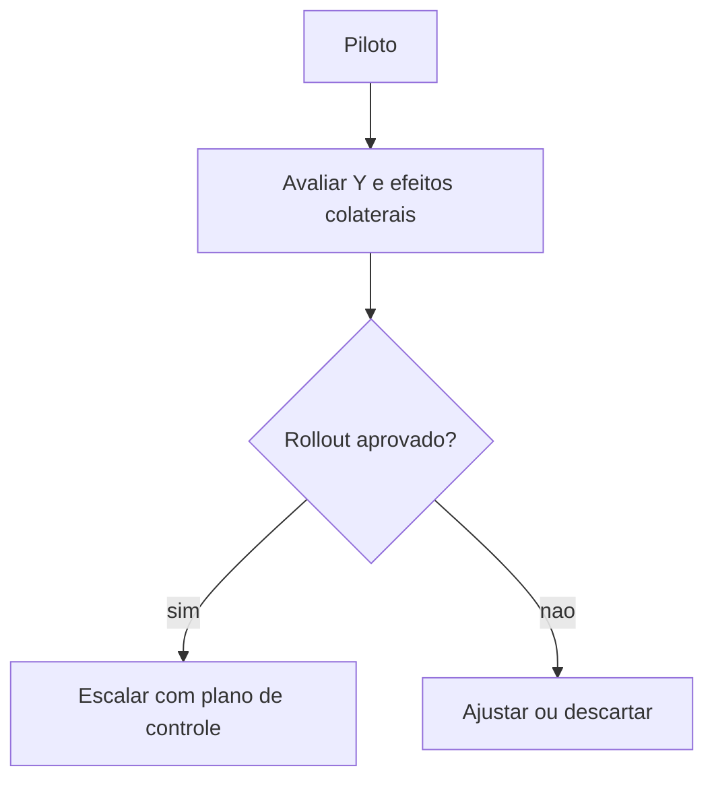

# Melhorar e controlar — *poka-yoke*, SOP e plano de controlo

**Improve** testa contramedidas (piloto, *kaizen* focado, mudança de layout leve). **Control** impede **regressão** ao estado antigo: **SOP**, treino, **plano de controlo** (*control plan*), *poka-yoke* (à prova de erro) e auditoria com **frequência** definida. Em logística, o controle falha quando «**todo mundo sabe**» mas o **turno novo** não foi treinado.

Esta aula faz a ponte para o módulo de **Continuous Improvement** — institucionalizar o que funcionou.

---

## Objetivos e resultado de aprendizagem

**Ao final desta aula**, você será capaz de:

- Descrever **piloto** e critérios de sucesso antes do *rollout*.  
- Listar elementos de um **plano de controlo** (o quê, como, quem, frequência, ação).  
- Dar **três** exemplos de *poka-yoke* em CD/expedição.  
- Explicar por que SOP sem **treino** e **auditoria** não sustenta ganho.

**Duração sugerida:** 60–75 minutos.

---

## Gancho — o ganho que sumiu em 60 dias

A **TechLar** reduziu erro de mix com **conferência dupla** no piloto. Após *rollout*, voltaram ao **volume antigo** sem segunda pessoa — o processo **regrediu**; não havia **controle** nem *mistake-proofing*. O belt fechou o projeto; a operação **abriu** outro igual seis meses depois.

**Analogia da dieta:** resultado na balança sem **hábito** — o efeito rebota.

---

## Mapa do conteúdo

- Melhorar com piloto e decisão de escala.  
- *Poka-yoke* logístico.  
- SOP e plano de controlo.  
- Handoff para CI.

---

## Melhorar — piloto

**Piloto:** escopo **pequeno**, **métrica** clara, **duração** fixa, **critério** de passar/falhar.  
**Rollout:** só após **estabilidade** no piloto e **capacidade** (pessoas, sistema, doca).

**Legenda:** *rollout* sem **E** é esperança.

---

## *Poka-yoke* — exemplos logísticos

- **Scan** obrigatório de SKU **e** endereço antes de confirmar quantidade.  
- **Separador físico** de pedidos em consolidação (cor, carrinho, tapete).  
- **Etiqueta** que só cabe no tipo certo de embalagem.  
- Lista de picking com **foto** do item para SKU confusos (*consenso de mercado* em e-commerce).

**Hipótese pedagógica:** *poka-yoke* bom **reduz** culpa individual e **exige** desenho de processo.

---

## Plano de controlo (esqueleto)

| Elemento | Pergunta |
|----------|----------|
| Característica | O que medimos (Y ou defeito)? |
| Método | Como medimos (sistema, amostra)? |
| Frequência | Diário, semanal, por turno? |
| Responsável | Nome do dono |
| Ação | O que fazer se sair do limite? |

---

## Aplicação — exercício

Para **um** defeito (ex.: linha faltante no pedido B2B), proponha **duas** contramedidas: uma **comportamental** (SOP) e uma ***poka-yoke***. Escreva **cinco** linhas de plano de controlo.

**Gabarito pedagógico:** *poka-yoke* deve ser **físico ou sistêmico** quando possível; controlo deve ter **frequência** e **escalação**.

---

## Erros comuns e armadilhas

- «**Conscientização**» no lugar de controle.  
- SOP de 40 páginas que **ninguém** abre na doca.  
- Indicador no painel **sem** dono de ação.  
- Remover *poka-yoke* porque «**atrapalha velocidade**» sem medir **erro**.

---

## KPIs e decisão

- Y **30/60/90** dias pós-*rollout*.  
- **Auditorias** de aderência ao SOP.  
- **Taxa de regressão** de projetos Six Sigma (meta: baixa).

---

## Fechamento — três takeaways

1. Melhorar sem controlar é **empréstimo** com juro alto.  
2. *Poka-yoke* é **respeito** ao humano cansado.  
3. Controle é **produto** do projeto, não apêndice.

**Pergunta de reflexão:** qual melhoria do ano passado **ninguém audita** hoje?

---

## Referências

1. PYZDEK, T.; KELLER, P. *The Six Sigma Handbook*.  
2. SHINGO, S. *Zero Quality Control: Source Inspection and the Poka-yoke System* (conceito de à prova de erro).  
3. ASCM — qualidade e operações: https://www.ascm.org/
