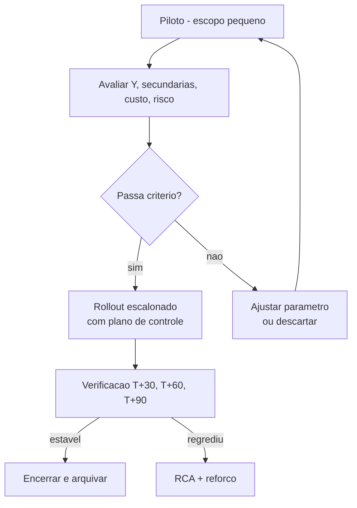

# Melhorar e controlar — *poka-yoke*, SOP e plano de controlo (com FMEA e DOE-lite)

**Improve** testa contramedidas (piloto, *kaizen* focado, mudança de layout leve, *poka-yoke* — à prova de erro de Shingo). **Control** impede **regressão**: SOP, treino, **plano de controlo** (*control plan*), **FMEA** (*Failure Mode and Effects Analysis*) e auditoria com **frequência** definida. Em logística, o controle falha quando «**todo mundo sabe**» mas o **turno noturno** não foi treinado, ou quando o **rodízio** apaga a memória do projeto.

Esta aula inclui **FMEA** com cálculo de **RPN**, um catálogo de **15 *poka-yokes*** logísticos, plano de controlo completo e introdução a **DOE-lite** (experimentos rápidos para escolher parâmetro). Faz a ponte para o módulo de **Continuous Improvement** — institucionalizar o que funcionou.

---

## Objetivos e resultado de aprendizagem

**Ao final desta aula**, você será capaz de:

- Desenhar **piloto** com critérios de passa/falha, escopo, métricas e duração.
- Construir **FMEA** com cálculo de **RPN** (Severidade × Ocorrência × Detecção) e priorização de modos de falha.
- Diferenciar **3 categorias** de *poka-yoke* (controle, advertência, prevenção) e dar 5 exemplos logísticos de cada.
- Estruturar **plano de controlo** completo (característica, método, frequência, dono, ação, escalação).
- Introduzir **DOE-lite** (experimento fatorial 2² simples) para escolher parâmetro operacional.
- Especificar **SOP** legível (1–2 páginas, com fotos, fluxo, *do/don't*).
- Planejar **handoff** para Continuous Improvement (auditoria, lição, próximo PDCA).

**Duração sugerida:** 75–90 minutos.
**Pré-requisitos:** [Aula 2.1 (Y=f(X))](aula-01-y-igual-fx-otif-lead-time.md), [Aula 2.2 (Pareto e Cpk)](aula-02-medir-analisar-pareto-amostragem.md).

---

## Mapa do conteúdo

1. Gancho — ganho que sumiu em 60 dias.
2. Improve com piloto — desenho e portões.
3. FMEA com cálculo de RPN.
4. *Poka-yoke* — taxonomia (controle/advertência/prevenção) e 15 exemplos logísticos.
5. SOP útil — anatomia e formato.
6. Plano de controlo — modelo completo.
7. DOE-lite (fatorial 2²) — escolher parâmetro.
8. Handoff para Continuous Improvement.
9. Trade-offs, erros, KPIs, ferramentas, glossário.
10. Exercícios, gabarito, reflexão, referências, pontes.

---

## Gancho — o ganho que sumiu em 60 dias

A **TechLar** reduziu erro de mix B2B de **2,1% para 0,4%** com **conferência dupla** no piloto (3 semanas, n = 1 200 pedidos). Sponsor festejou; rolaram out para 2 CDs adicionais. Após **60 dias**, retornaram ao **volume antigo** (sem fôlego para 2.ª pessoa em pico) e o erro voltou para **1,8%**. O belt fechou o projeto formalmente; a operação **abriu projeto idêntico** seis meses depois — perdeu R$ 180k em retrabalho e dois clientes B2B premium reclamaram com NPS −15.

**Diagnóstico pós-mortem:** Improve usou **contramedida humana** (conferência dupla) sem **poka-yoke** estrutural; **plano de controlo** existia mas só auditava aderência (sim/não), não Y. **Reincidência** previsível — 70% dos projetos Six Sigma sem plano de controlo regridem em 12 meses (consenso de mercado).

> **Analogia da dieta com hipnose:** balança baixa porque «motivação acordou» — sem **mudança de hábito** (estrutura), peso volta. *Poka-yoke* é a **geladeira sem porta para doce** — não depende de força de vontade.

> **Analogia do alarme do carro:** se cinto não detecta, motorista esquece. **Sistema beep** é poka-yoke de **advertência**; **carro que não anda sem cinto** é poka-yoke de **prevenção**.

---

## Improve — piloto e decisão de escala

### Estrutura do piloto

| Elemento | Detalhe |
|----------|---------|
| **Escopo** | menor unidade representativa (1 zona, 1 turno, 1 cliente) |
| **Duração** | 2–4 semanas, com pico incluído |
| **Tamanho amostral** | n suficiente para detectar diferença (cálculo *power*) |
| **Métrica primária (Y)** | igual ao Define |
| **Métrica secundária** | efeitos colaterais (custo, segurança, NPS, OEE) |
| **Critério de passa** | Y melhora ≥ X% **e** sem efeito colateral relevante |
| **Critério de falha** | Y não melhora ou piora qualquer secundária |
| **Plano de rollback** | como reverter em <4h se algo correr mal |

### Diagrama de decisão

> **Legenda:** rollout direto sem **E** (avaliação) e sem **V** (verificação T+30/60/90) é **esperança**, não engenharia. Plano de rollback existe em **todos** os pilotos — só não é usado se passar.

### Exemplos de pilotos logísticos bem desenhados

1. **Slotting golden zone** — piloto em 1 corredor por 2 semanas; Y = caminhada e produtividade.
2. **Heijunka box B2C** — piloto em wave da tarde por 3 semanas; Y = lead time P90.
3. **e-Kanban supermercado** — piloto em 5 SKUs alto giro por 4 semanas; Y = ruptura supermercado.
4. **Janela doca digital** — piloto em 3 transportadores por 4 semanas; Y = tempo carreta na doca.

---

## FMEA — *Failure Mode and Effects Analysis* com cálculo de RPN

### O que é

Método estruturado para **antecipar** modos de falha **antes** de implementar (FMEA de processo) ou **operar** (FMEA reativa). Saída: **RPN** (Risk Priority Number) por modo de falha.

\[
\text{RPN} = S \times O \times D
\]

- **S — Severidade:** impacto da falha no cliente (1=leve a 10=catastrófico).
- **O — Ocorrência:** frequência esperada (1=remota a 10=quase certa).
- **D — Detecção:** capacidade de detectar antes de impactar (1=detecção certa a 10=detecção impossível).

**Alvo:** atacar primeiro RPN ≥ **100** ou S = 9–10 (graves).

### Tabela de FMEA — projeto «poka-yoke picking TechLar»

| Modo de falha | Efeito no cliente | S | Causa | O | Controle atual | D | RPN | Ação |
|---------------|-------------------|---|-------|---|----------------|---|-----|------|
| Picker pega SKU vizinho parecido | erro de mix, devolução | 8 | embalagens visuais similares | 7 | conferência manual | 6 | **336** | foto na lista; scan obrigatório SKU |
| Picker confirma quantidade errada | item faltando | 7 | digitação rápida | 6 | conferência | 5 | 210 | scan-quantidade automática (peso) |
| Etiqueta de embalagem trocada | pedido vai para cliente errado | 9 | impressão batch sem associação | 4 | conferência | 7 | **252** | impressão sob demanda + scan vincular |
| Cadastro endereço errado WMS | putaway errado | 6 | digitação manual | 5 | inventário cíclico | 7 | 210 | RF obrigatório; sem RF = não confirma |
| Operador cansado (turno 12h) | erro geral aumenta | 7 | sobrecarga (muri) | 6 | rodízio informal | 5 | 210 | rodízio formal; cap 8h em zona crítica |

**Priorização:** atacar primeiro **336** (poka-yoke visual), depois **252** (impressão sob demanda).

### Re-avaliar RPN pós-Improve

Após implementar contramedida, **re-pontuar** O e D (S não muda — cliente continua sentindo igual). Meta: cair RPN para **<60** nos modos atacados.

---

## *Poka-yoke* — taxonomia e catálogo logístico

### Três tipos (Shingo)

| Tipo | Como age | Exemplo logístico |
|------|----------|-------------------|
| **Controle (físico)** | impede a falha de ocorrer | etiqueta que só cabe no tipo certo de embalagem |
| **Advertência** | alerta operador antes do erro completar | beep do scanner se SKU diferente do esperado |
| **Prevenção (sistema)** | sistema bloqueia ação errada | WMS não confirma sem scan + endereço |

### 15 *poka-yokes* logísticos (catálogo prático)

1. **Scan obrigatório SKU + endereço** antes de confirmar quantidade (controle).
2. **Foto do produto** na lista de picking digital (advertência).
3. **Etiqueta com formato exclusivo** por tipo de embalagem (controle).
4. **Cor por cliente** em embalagem multissítio 3PL (advertência).
5. **Pista de gravidade** (rampa) para FIFO automático (controle).
6. **Quantidade por peso** (balança verifica) na embalagem (controle).
7. **Carrinho com slots numerados** = pedidos diferentes não se misturam (controle).
8. **Andon visual** no posto (luz vermelha bloqueia próxima onda) (prevenção).
9. **Validação cross-sistema** (ASN ERP vs. ASN WMS = bloqueio se divergir) (prevenção).
10. **Sensor de temperatura** que bloqueia carregamento se cold chain rompido (controle).
11. **Lacre numerado** com leitura obrigatória no fechamento da carreta (controle).
12. **Sequência de picking forçada** pelo WMS (não permite pular) (prevenção).
13. **Confirmação por dupla** apenas em SKU de alto valor (prevenção seletiva).
14. **Bloqueio físico** de empilhador em zona pedonal sem permissão (controle — segurança).
15. **Login biométrico** em estação crítica (prevenção contra acesso indevido).

> **Hipótese pedagógica:** *poka-yoke* bom **reduz culpa individual** e **exige desenho de processo**. Quando a resposta a um erro é «treinar mais», pergunte se um *poka-yoke* não eliminaria a possibilidade.

---

## SOP — *Standard Operating Procedure* útil

### Anatomia de SOP que funciona (1–2 páginas)

| Seção | Conteúdo | Por que importa |
|-------|----------|------------------|
| Cabeçalho | título, dono, versão, data, área | rastreabilidade |
| Propósito | em 2 linhas | foco |
| Escopo | onde se aplica e onde não | evita uso indevido |
| Pré-requisitos | EPI, sistema, treino | segurança e qualidade |
| Passos | numerados; ≤12 passos; com **fotos** | clareza |
| Pontos de atenção (do/don't) | 3–5 itens | evita erros comuns |
| Critérios de aceitação | o que é «certo» | controle visual |
| Escalação | quando parar e chamar quem | autonomia segura |
| Métrica | indicador associado | conexão com KPI |
| Rodapé | controle de revisão (ISO-style) | governança |

### Anti-SOP

SOP de 40 páginas em PDF na pasta de rede que **ninguém abre**. Substituir por:
- SOP **visual** plastificado no posto;
- vídeo curto (90s) acessível por QR-code;
- treino pratíco com observação e *signoff*.

---

## Plano de controlo — modelo completo

### Estrutura mínima

| Característica | Especificação | Método de medição | Frequência | Tamanho amostra | Responsável | Registro | Reação fora controle | Escalação |
|----------------|---------------|--------------------|------------|------------------|-------------|----------|----------------------|------------|
| FTR picking | ≥ 99% | scan + comparação WMS | turno | 100% | supervisor | dashboard | parar zona, RCA, retreinar | gerente CD em 30min |
| Lead time interno P90 | ≤ 5h | timestamp ERP→WMS | diário | 100% | analista CD | dashboard | abrir A3 se 3 dias seguidos fora | sponsor em 24h |
| Acurácia inventário | ≥ 99,5% | contagem cíclica | semanal | 1% endereços | inventário | sistema | recontagem + RCA | gerente em 24h |
| Temperatura câmara | 2°C–8°C | sensor IoT | contínua | 100% | TPM + qualidade | log + alarme | bloqueio carregamento | qualidade em 1h |
| Lacre integro | sim | inspeção visual + scan | embarque | 100% | conferente | TMS | não embarcar | supervisor imediato |

### Princípios

1. **Toda melhoria** que muda Y deve gerar **uma linha** no plano de controlo.
2. **Reação** é **ação concreta** (não «notificar»).
3. **Escalação** tem **prazo** e **nome**.
4. **Frequência** é **suficiente** para detectar antes de impacto sentido pelo cliente.
5. **Revisão** do plano: trimestral ou pós-incidente significativo.

---

## DOE-lite — experimento fatorial 2² para escolher parâmetro

### Quando usar

Você sabe que **2 fatores** influenciam Y (ex.: tamanho da onda × número de separadores) e quer escolher a **combinação ótima** sem testar tudo.

### Desenho 2² (4 combinações)

| Run | Fator A (tamanho onda) | Fator B (n. separadores) | Y (lead time h) |
|-----|------------------------|---------------------------|------------------|
| 1 | 30 (−) | 4 (−) | 4,1 |
| 2 | 60 (+) | 4 (−) | 5,8 |
| 3 | 30 (−) | 6 (+) | 3,2 |
| 4 | 60 (+) | 6 (+) | 4,2 |

### Cálculo de efeitos

\[
\text{Efeito A} = \bar{Y}_{A+} - \bar{Y}_{A-} = \frac{5{,}8+4{,}2}{2} - \frac{4{,}1+3{,}2}{2} = 5{,}0 - 3{,}65 = +1{,}35 \text{h}
\]

\[
\text{Efeito B} = \bar{Y}_{B+} - \bar{Y}_{B-} = \frac{3{,}2+4{,}2}{2} - \frac{4{,}1+5{,}8}{2} = 3{,}7 - 4{,}95 = -1{,}25 \text{h}
\]

\[
\text{Interação AB} = \frac{(Y_4 - Y_3) - (Y_2 - Y_1)}{2} = \frac{(4{,}2-3{,}2) - (5{,}8-4{,}1)}{2} = \frac{1{,}0 - 1{,}7}{2} = -0{,}35 \text{h}
\]

### Interpretação

- **A (onda grande)** **piora** lead time em +1,35h.
- **B (mais separadores)** **melhora** em −1,25h.
- **Interação** pequena (−0,35h): efeitos quase independentes.
- **Combinação ótima:** **A− B+** (onda pequena + 6 separadores) → 3,2h.

> **Cuidado:** DOE-lite assume Y razoavelmente reprodutível; se variação alta, replicar runs (DOE 2² × 3 réplicas = 12 runs). Belts experientes usam Minitab/JMP para fatorial completo + replicação + análise de variância (ANOVA).

---

## Handoff para Continuous Improvement

Quando Six Sigma fecha, CI **assume**. Checklist de handoff:

1. **Plano de controlo** ativo, com responsável de turno treinado.
2. **SOP** publicado, plastificado e treinado em **3 turnos**.
3. **FMEA** atualizada e arquivada.
4. **A3** finalizado e na biblioteca de A3 (módulo 3.2).
5. **Auditoria T+30/60/90** agendada com nome.
6. **Revisão do dicionário de KPI** com trilha Dados.
7. **Lições aprendidas** registradas (o que repetir / evitar).
8. **Sponsor** comunicado do encerramento.

---

## Aprofundamentos — variações setoriais

| Setor | Improve/Control particularidade |
|-------|--------------------------------|
| **Farma GDP** | FMEA obrigatória regulatória; SOP versionada e auditada por GxP |
| **Cold chain** | poka-yoke = sensor IoT + bloqueio embarque; control plan inclui calibração |
| **Manufatura linha** | DOE clássico (Taguchi, fatorial completo); SPC online |
| **B2C grande volume** | poka-yoke automatizado (foto, scan, peso); dashboards realtime |
| **3PL multicliente** | SOP **por cliente** + transversal; FMEA por contrato |
| **Operação portuária / aduaneira** | controle regulatório forte; rollback impossível em alguns casos (carga zarpou) |
| **Transporte** | poka-yoke = telemetria (cinto, velocidade, frenagem) + bloqueio remoto |

---

## Trade-offs e decisão

| Trade-off | Lado A | Lado B |
|-----------|--------|--------|
| *Poka-yoke* físico vs. comportamental | sustenta sozinho | barato, rápido |
| Controle 100% vs. amostral | confiança total | custo proibitivo se volume alto |
| SOP detalhado vs. enxuto | cobre exceções | mais lido e seguido |
| Auditoria pesada vs. visual | rigor | velocidade, autonomia |
| Rollout big bang vs. escalonado | velocidade | risco controlado |
| FMEA exaustiva vs. focada | cobre tudo | foco em RPN > 100 |

---

## Caso prático / Mini-laboratório — projeto OTIF TechLar até Control

### Improve

- Contramedidas:
  1. **Heijunka box** para ondas (ataca mura).
  2. **Poka-yoke** picking: scan obrigatório SKU+endereço + foto; bloqueio se divergir.
  3. **Janela doca digital** com cap 4 carretas/slot.
- Piloto: 4 semanas, zona Y, n = 8 600 pedidos.
- Resultado piloto: OTIF de 84% → **94,8%** (alvo 95%); FTR picking 95% → **99,2%**; lead time P90 8,5h → **5,2h**.

### Control plan (resumido)

| Y/X | Spec | Método | Frequência | Dono | Reação |
|-----|------|--------|------------|------|--------|
| OTIF | ≥ 95% | TMS + ERP | diário | gerente CD | A3 se 3 dias <95% |
| FTR | ≥ 99% | WMS | turno | supervisor | parar zona, RCA |
| Lead time P90 | ≤ 5,5h | timestamp | diário | analista | revisar onda |
| Aderência heijunka | ≥ 90% | quadro físico | turno | supervisor | reorganizar imediato |
| Aderência poka-yoke (scan%) | 100% | WMS log | diário | TI + supervisor | bloqueio sistémico |

### Verificação

- T+30: OTIF 94,5%, FTR 99,3% — estável.
- T+60: OTIF 95,1%, FTR 99,4% — sustentado.
- T+90: OTIF 95,3%, FTR 99,5% — sucesso. Encerramento formal com sponsor + benefício R$ 380k/ano.

---

## Erros comuns e armadilhas

1. **«Conscientização»** no lugar de controle. Cartaz não muda comportamento sob pressão.
2. **SOP de 40 páginas** PDF na pasta — ninguém abre.
3. **Indicador no painel sem dono de ação** — vermelho cosmético.
4. **Remover *poka-yoke* porque «atrapalha velocidade»** sem medir erro.
5. **FMEA superficial** — RPN inflado para tudo, ninguém prioriza.
6. **Piloto otimista** — n insuficiente, sem pico, conclusão não generalizável.
7. **Rollout sem rollback** — se der errado, ficam horas de operação parada.
8. **Auditoria que humilha** — destrói cultura, esconde defeitos para «proteger time».
9. **Esquecer turno noturno** no treinamento — defeito reaparece à noite.
10. **Plano de controlo sem revisão** — envelhece em 6 meses.

---

## Comportamento e cultura

- **Belt presente no piloto** todos os dias — não delegar para «sistema vai medir».
- **Operadores envolvidos** no desenho do *poka-yoke* — eles enxergam falhas que belt não vê.
- **Sponsor anuncia o sucesso** com nome do time (não com nome do belt apenas).
- **Festa pequena** mas real ao encerramento (almoço, certificado simbólico).
- **Falha do piloto não é culpa** — é aprendizado. Belt que nunca falha não está testando hipótese.
- **Rotação de papel «auditor» plano de controlo** entre operadores qualificados — engaja.

---

## KPIs de melhoria

| KPI | Pergunta | Dono | Fonte | Cadência | Playbook |
|-----|----------|------|-------|----------|----------|
| Y do projeto T+30/60/90 | benefício sustentou? | sponsor + EO | sistema | mensal | RCA + reforço |
| Aderência ao plano de controlo | controle ativo? | supervisor + EO | auditoria | semanal | conversa, treino, revisão |
| % poka-yokes implementados vs. planejados | improve completo? | belt + EO | base de projetos | trimestral | priorizar gap |
| Taxa de regressão T+90 | melhorias sustentam? | EO | revisão | trimestral | reforçar plano de controlo |
| FMEA RPN médio top-10 | risco residual? | EO + qualidade | FMEA | semestral | atacar maior |
| Tempo médio Improve→Control | velocidade Six Sigma | PMO Six Sigma | base | trimestral | identificar gargalo |

---

## Tecnologias e ferramentas

| Categoria | Ferramenta |
|-----------|------------|
| FMEA | Excel template, **APIS IQ-FMEA**, Minitab, **PLATO SCIO** |
| SPC / control plan | Minitab, JMP, SigmaXL, **Sensrtrx**, dashboards Power BI |
| DOE | Minitab, JMP, Design Expert |
| SOP / SOP visual | Confluence, **SwipeGuide**, Notion, Tervene |
| Auditoria | GoAudits, CompliantPro, app personalizado |
| WMS para enforce poka-yoke | SAP EWM regras, Manhattan SCALE, Oracle WMS Cloud |
| IoT | sensores temperatura (Tive, Sensitech), telemetria frota |
| Visão computacional | foto verificação SKU (sistemas Cognex, Datalogic) |
| Treino | LMS interno (Workday, Cornerstone, Moodle), micro-learning, vídeos |

---

## Glossário rápido

- **Piloto / Rollout / Hypercare** — teste pequeno / escala / suporte intensivo pós-go-live.
- **FMEA / RPN / S / O / D** — análise de falha, risco prioritário, severidade × ocorrência × detecção.
- **Poka-yoke** — à prova de erro (Shingo).
- **SOP** — *standard operating procedure*.
- **Control plan / plano de controlo** — característica + método + frequência + reação.
- **DOE / DOE-lite / Fatorial 2²** — experimento desenhado.
- **Hypercare** — período pós-rollout com suporte reforçado.
- **Andon** — sinal visual de problema (luz/tela).
- **Western Electric** — regras de detecção de tendência (módulo 2.2).

---

## Aplicação — exercícios

### Exercício 1 — duas contramedidas (10 min)

Para o defeito «**linha faltante no pedido B2B**» (12 ocorrências/dia em 800 pedidos):

1. Proponha **uma contramedida comportamental** (SOP).
2. Proponha **uma poka-yoke** (controle ou prevenção).
3. Escreva 5 linhas de plano de controlo (caracter / método / frequência / dono / reação).

**Gabarito sugerido:**
- **SOP:** sequência forçada de leitura RF + assinatura digital ao final.
- **Poka-yoke:** balança que verifica peso esperado vs. real (bloqueia se diverge >5%).
- **Plano:** característica = % linhas faltantes; método = WMS log + balança; freq = turno; dono = supervisor; reação = parar zona se >2 ocorrências/h, retreinar.

### Exercício 2 — calcular RPN (10 min)

Modo de falha: «motorista carrega carreta com lacre errado».
- Severidade S = 8 (cliente recebe carga divergente, NF errada, multa).
- Ocorrência O = 4 (4× no último trimestre).
- Detecção D = 7 (descoberto só na entrega).

Calcule RPN. Após implementar **scan obrigatório de lacre vs. romaneio** + **bloqueio TMS**: nova O = 1, nova D = 2.

**Gabarito:**
- RPN inicial = 8 × 4 × 7 = **224** (alto, prioritário).
- RPN após = 8 × 1 × 2 = **16** (residual baixo, aceitável).
- Severidade não cai (cliente continua sentindo igual se ocorrer); O e D caem com poka-yoke.

### Exercício 3 — DOE-lite (15 min)

Para a TechLar, testar **2 fatores** no embalo:
- A: tipo de embalagem (padrão −, premium +)
- B: postos paralelos (1 −, 2 +)

Resultados Y = lead time embalo (min/pedido):
| Run | A | B | Y |
|---|---|---|---|
| 1 | − | − | 4,2 |
| 2 | + | − | 5,1 |
| 3 | − | + | 2,3 |
| 4 | + | + | 2,9 |

Calcule efeitos de A, B e interação. Que combinação escolher?

**Gabarito:**
- Efeito A = ((5,1+2,9)/2) − ((4,2+2,3)/2) = 4,0 − 3,25 = **+0,75** (premium piora 0,75 min)
- Efeito B = ((2,3+2,9)/2) − ((4,2+5,1)/2) = 2,6 − 4,65 = **−2,05** (paralelo melhora 2,05 min)
- Interação = ((2,9−2,3) − (5,1−4,2))/2 = (0,6 − 0,9)/2 = **−0,15** (pequena)
- **Combinação ótima:** A− B+ (padrão + 2 postos) = **2,3 min**.

---

## Pergunta de reflexão

**Qual melhoria do ano passado na sua operação ninguém audita hoje?** Como você desenharia o **plano de controlo simples** (5 linhas) que teria evitado a regressão?

---

## Fechamento — três takeaways

1. **Melhorar sem controlar é empréstimo com juro alto** — devolução em 60–90 dias.
2. ***Poka-yoke* é respeito ao humano cansado**, não desconfiança. E é mais barato a longo prazo que treinar contra a fadiga.
3. **Controle é produto do projeto**, não apêndice. Plano de controlo entra **antes** do encerramento, com nome, frequência e reação.

---

## Referências

1. PYZDEK, T.; KELLER, P. *The Six Sigma Handbook*. McGraw-Hill.
2. SHINGO, S. *Zero Quality Control: Source Inspection and the Poka-yoke System*. Productivity Press.
3. AIAG — *FMEA Reference Manual* (4.ª ed.) / **AIAG-VDA FMEA Handbook** (2019).
4. STAMATIS, D. H. *Failure Mode and Effect Analysis: FMEA from Theory to Execution*. ASQ Quality Press.
5. MONTGOMERY, D. C. *Design and Analysis of Experiments*. Wiley. (DOE clássico)
6. GEORGE, M. L. *Lean Six Sigma for Service*. McGraw-Hill.
7. ASQ — Standard Operating Procedure best practices: <https://asq.org/>
8. FM2S, Setec, Vanzolini — formação Lean Six Sigma BR.
9. ASCM/APICS Dictionary — *poka-yoke*, *control plan*, *FMEA*: <https://www.ascm.org/>

---

## Pontes para outras trilhas

- [Master Data — Tecnologia](../../trilha-tecnologia-e-sistemas/modulo-01-master-data-para-logistica/aula-01-master-data-na-cadeia.md): cadastro como base de poka-yoke sistémico.
- [WMS — ondas e expedição — Tecnologia](../../trilha-tecnologia-e-sistemas/modulo-03-wms/aula-03-onda-picking-expedicao.md): parametrização de poka-yoke no WMS.
- [Indicadores — Dados](../../trilha-dados-analytics-logistica/modulo-04-indicadores-logisticos-kpis/aula-01-otif-fill-rate-contrato-interno.md): definição estável para o plano de controlo.
- [Camada operacional — Operações](../../trilha-operacoes-logisticas/README.md): padronização do trabalho.
- **Próximo módulo:** [PDCA, gemba e patrocinador — Continuous Improvement](../modulo-03-continuous-improvement/aula-01-pdca-gemba-sponsor.md).
