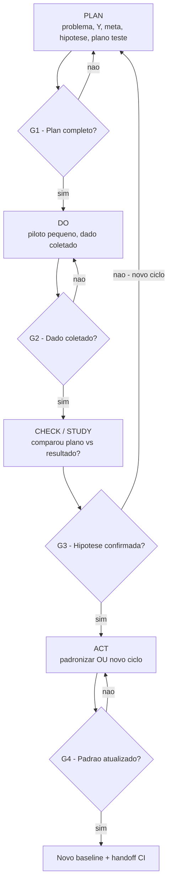
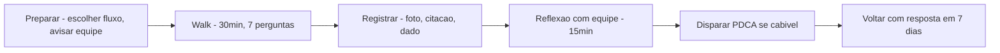
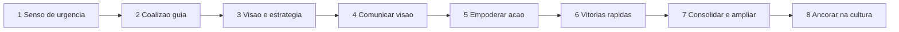
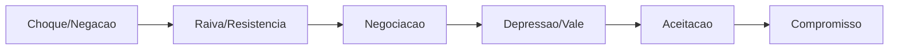

# PDCA, *gemba* e o patrocinador que não pode faltar — círculo com saída, não PowerPoint infinito

**PDCA** (*Plan-Do-Check-Act*, Deming/Shewhart) só funciona quando cada fase tem **critério de saída**: o que precisa ser **verdade** antes de virar a roda? ***Gemba*** (genchi genbutsu — «vá ver com seus olhos») é onde o processo **acontece** — não o auditório. O **sponsor** (patrocinador) desbloqueia **recurso**, **escopo** e **conflito** entre áreas; sem ele, PDCA vira grupo de estudo. Esta aula trata Continuous Improvement (CI) como **disciplina** com **rituais** (Hoshin Kanri, Obeya, *gemba walks*, *daily kaizen*), **papéis** (sponsor, líder de melhoria, *change agent*) e **gestão de mudança** (ADKAR, Kotter 8 passos), não como slogan de mural.

A passagem de Six Sigma (módulo 2) para CI (este módulo) é a transição do **projeto** para o **sistema**: melhoria não acontece em sprint isolada — acontece em **rotina cultural**.

---

## Objetivos e resultado de aprendizagem

**Ao final desta aula**, você será capaz de:

- Descrever **PDCA** com **portões de saída** explícitos por fase.
- Distinguir **PDCA** (operacional) de **PDSA** (Deming, com Study) e de **DMAIC** (projeto Six Sigma).
- Conduzir **gemba walk** com **roteiro de 7 perguntas** disciplinado.
- Definir **papel mínimo do sponsor** e usar matriz **commitment** (consciência → defesa).
- Aplicar **ADKAR** e **Kotter 8 passos** a uma mudança logística (CD novo, novo SOP, *cut-over* WMS).
- Diferenciar **PDCA de reunião semanal** sem hipótese.
- Posicionar PDCA dentro de **Hoshin Kanri** (alinhamento estratégico) e **Obeya** (sala de gestão visual).

**Duração sugerida:** 75–90 minutos.
**Pré-requisitos:** [Módulo 1 (Lean)](../modulo-01-lean-logistics/README.md), [Módulo 2 (Six Sigma)](../modulo-02-six-sigma-logistica/README.md).

---

## Mapa do conteúdo

1. Gancho — TechLar nunca chegou ao Act.
2. PDCA com portões + comparação PDSA / DMAIC.
3. Gemba walk — roteiro de 7 perguntas.
4. Sponsor — papel, commitment grid, anti-padrões.
5. **Gestão de mudança: ADKAR + Kotter 8 passos** (com exemplo logístico).
6. Hoshin Kanri (X-Matrix) e Obeya — onde PDCA mora no sistema.
7. Daily kaizen e *standup* operacional.
8. Trade-offs, erros, KPIs, ferramentas, glossário.
9. Exercícios, gabarito, reflexão, referências, pontes.

---

## Gancho — o PDCA da TechLar que nunca chegou ao *Act*

A equipe da **TechLar** documentou **dez** ciclos de «PDCA» na fila da doca em 2025 — todos pararam no **Do** com remendo operacional («colocou Maria do estoque para ajudar», «liberou onda mais cedo na sexta»). **Check** não comparou com **meta** baseline; **Act** não virou **padrão** nem treino. O problema **voltou** a cada pico. **Círculo sem Act é spiral de retrabalho** — *muri* (sobrecarga) crónico para os mesmos veteranos, *muda* (desperdício) recorrente, *mura* (irregularidade) permanente.

Diagnóstico do líder de excelência operacional: **ausência de portões** entre fases, **sponsor distante** (apareceu só no kickoff e na foto), **gemba** feito como auditoria-vistoria (e não como diagnóstico), **sem ritual** de revisão, **sem matriz X** (Hoshin) — o PDCA estava órfão.

> **Analogia da academia sem progressão:** treinar peito todo dia com a mesma carga (Do), sem medir RM (Check) nem progressar (Act) — suor, sem hipertrofia. **Volume sem método = fadiga.**

> **Analogia do laboratório:** experimento sem **caderno** (Plan), sem **medição** (Check) e sem **publicação** (Act) é só «entrei no lab». PDCA é o **método científico** aplicado à operação.

---

## PDCA, PDSA, DMAIC — irmãos com personalidades diferentes

### Comparação rápida

| Método | Origem | Foco | Quando usar |
|--------|--------|------|-------------|
| **PDCA** | Shewhart → Deming → Toyota | melhoria operacional rápida (1–4 sem) | rotina, daily kaizen, problemas locais |
| **PDSA** | Deming (substituiu Check por **Study**) | aprendizagem com hipótese explícita | melhoria com componente de aprendizado |
| **DMAIC** | Six Sigma | projeto estatístico (3–6 meses) | Y crítico, dado disponível, ROI alto |

> **Insight:** Deming preferia **PDSA** (Study), porque «Check» soa a verificação burocrática. **Study** força perguntar: *o que aprendemos?* Em CI maduro, faça **PDSA** mentalmente mesmo escrevendo «PDCA».

### PDCA com portões — versão operacional

### Saídas mínimas pedagógicas (portões)

| Fase | Saída mínima | Anti-padrão |
|------|--------------|--------------|
| **Plan** | problema escrito (Y, meta, baseline, hipótese, plano de teste, dono) | reunião sem hipótese; «vamos ver o que dá» |
| **Do** | piloto executado **pequeno**; dado **coletado** | escala sem teste; sem dado |
| **Check** | comparação honesta; decisão registrada; lição extraída | dado «interpretado» para confirmar hipótese |
| **Act** | padrão atualizado **ou** novo ciclo com aprendizado | «vamos ver na próxima»; sem SOP, sem treino |

### Cadência típica em logística

- **PDCA diário** (15 min, daily kaizen): problema do turno anterior, contramedida testada hoje.
- **PDCA semanal** (1h, time de melhoria): ciclo curto de 1–2 semanas.
- **PDCA mensal** (2h, líderes + sponsor): ciclos maiores ligados ao Hoshin.

---

## Gemba walk — roteiro de 7 perguntas (15–30 min)

***Gemba*** = «o lugar real» (japonês). ***Genchi genbutsu*** = «vá e veja por si mesmo» (Toyota). Não é vistoria; é **diagnóstico humano**.

### As 7 perguntas (adaptadas de Imai e Toyota)

1. **«Pode mostrar o fluxo de uma unidade do início ao fim?»** (segue 1 pedido/palete)
2. **«Onde estão as esperas visíveis?»** (filas, sistemas lentos, aprovações pendentes)
3. **«Qual é o padrão publicado deste posto e o que vejo?»** (gap padrão vs. prática)
4. **«O que aconteceu no último problema aqui? Como ficou registado?»** (cultura de RCA)
5. **«Quem decide o que fazer quando algo dá errado?»** (autonomia, escalação)
6. **«Pode me mostrar o sistema 5S/visual deste posto?»** (condição do lugar)
7. **«O que você mudaria amanhã se pudesse?»** (escuta de ideia)

### Princípios do gemba walk

- **Caminhar com quem opera**, não com quem chefia.
- **Perguntar, não responder.** Líder fala 30%, opera fala 70%.
- **Anotar dado, não opinião.** Foto, número, citação literal.
- **Sem julgamento**: o objetivo é **aprender**, não corrigir na hora.
- **Compromisso de retorno**: combinar quando volta com proposta.
- **Nunca** levar visita externa para «inspecionar» — destrói confiança.

### Diagrama do walk

> **Analogia do médico de família:** examinar **no leito**, não só pelo prontuário resumido na sala da chefia. **Genchi genbutsu** é a anamnese de quem está vivo no processo.

---

## Sponsor — o papel que faz ou quebra CI

### Funções essenciais

| Função | O que fazer | Sinal de ausência |
|--------|--------------|-------------------|
| **Proteger escopo** | dizer «não» a «só desta vez» | escopo crescer 30% sem revisão |
| **Decidir trade-offs** | aprovar parar linha, contratar belt, capex | decisão escala para CFO |
| **Validar encerramento** | assinar lições e benefícios T+90 | projeto fica zumbi |
| **Visible commitment** | aparecer no gemba mensalmente | projeto perde prioridade |
| **Defender em comitê** | bloquear realocação de gente | equipe é diluída |
| **Comunicar narrativa** | contar a história em fórum | equipe sente isolamento |

### Commitment Grid — diagnosticar nível do sponsor

| Nível | Característica | O que falta para subir |
|-------|----------------|------------------------|
| 1. **Awareness** | sabe que existe | comunicar dor + visão |
| 2. **Understanding** | entende o impacto | dado + cliente |
| 3. **Acceptance** | concorda | mostrar viabilidade |
| 4. **Support** | aloca recurso | pedir explicitamente |
| 5. **Adoption** | participa rituais | convidar para gemba |
| 6. **Internalization** | defende sozinho | reconhecer publicamente |

> **Diagnóstico:** sponsor em **Acceptance** (3) **não basta** para projeto difícil. Mire em **Adoption** (5) ou superior.

### Anti-padrões de sponsor

1. **«Assinador-fantasma»** — assina charter e some.
2. **«Microgerente»** — entra no detalhe técnico e bloqueia equipe.
3. **«Sponsor de slide»** — só aparece em comitê com dashboard pronto.
4. **«Sponsor sem poder»** — concorda mas não consegue parar uma linha.

---

## Gestão de mudança — ADKAR + Kotter 8 passos

CI é **mudança organizacional contínua**. Conhecer 2 modelos clássicos diferencia líder de melhoria.

### ADKAR (Prosci) — modelo individual

| Letra | Significado | Pergunta |
|-------|-------------|----------|
| **A** | Awareness | a pessoa sabe **por quê** mudar? |
| **D** | Desire | a pessoa **quer** mudar? (motivação pessoal) |
| **K** | Knowledge | a pessoa **sabe como** mudar? |
| **A** | Ability | a pessoa **consegue** aplicar? (treino + ferramentas) |
| **R** | Reinforcement | a mudança é **sustentada**? (incentivo, ritual) |

> **Diagnóstico:** se equipe sabe (A) mas não quer (D), comunicar mais não resolve — descobrir o que **bloqueia desejo** (medo, perda de status, sobrecarga). Se quer (D) mas não consegue (A), **treino + ferramenta**, não palestra.

### Kotter 8 passos — modelo organizacional

### Aplicação cruzada — caso TechLar (cut-over WMS novo)

| Kotter | ADKAR | Ação concreta |
|--------|-------|----------------|
| 1. Urgência | A — Awareness | mostrar OTIF caindo, multas, churn de cliente |
| 2. Coalizão | — | sponsor + 2 líderes operacionais + TI + RH |
| 3. Visão | A — Awareness | story «CD 30% mais rápido em 6 meses» |
| 4. Comunicar | A — Awareness | town hall + email + cartaz no refeitório |
| 5. Empoderar | D + K | treino, autonomia, remover bloqueio |
| 6. Vitórias rápidas | A | piloto em 1 zona com ganho mensurável em 4 sem |
| 7. Consolidar | A — Ability | rolar para 5 zonas, capturar lições |
| 8. Ancorar | R — Reinforcement | KPIs no painel, ritual semanal, reconhecer |

> **Realidade BR:** **passo 8 (ancorar)** é o mais negligenciado. Sem **R** do ADKAR, mudança regride em 6 meses. Padrão: «projeto entregou, agora vão para outra coisa» — destrói cultura CI.

### Curva de mudança (Kübler-Ross adaptada)

> **Insight:** equipe passa por **vale** (S4) entre 2–6 semanas pós-rollout — **sponsor presente** atravessa o vale; sponsor ausente perde gente nesse momento.

---

## Hoshin Kanri e Obeya — onde PDCA mora no sistema

### Hoshin Kanri — alinhamento de norte verdadeiro

**Hoshin** (compass) **Kanri** (management) = «desdobramento da estratégia». Conecta:

- **Objetivos breakthrough** (3–5 anos): «ser o CD mais rápido do BR (lead time P90 < 4h)».
- **Anuais**: cada nível desdobra em metas anuais.
- **Iniciativas/projetos**: cada meta tem 2–4 iniciativas.
- **Indicadores**: cada iniciativa tem Y mensurável.
- **Catchball**: revisão **bidirecional** (chefia propõe, equipe contrapõe, ajusta).

### X-Matrix (esquema simplificado)

| Objetivos (esq) | Estratégias (cima) | Iniciativas (dir) | KPIs (baixo) | Donos (centro) |
|-----------------|---------------------|--------------------|---------------|------------------|
| OTIF 95% | Lean CD | Heijunka onda; janela doca | Lead time P90; FTR | Gerente CD |
| Custo/linha −12% | Automação | Sorter; WMS update | R$/linha; OEE | Operações + TI |
| Engajamento +20% | Cultura CI | Daily kaizen; sugestões | n.º sugestões/colab. | RH + EO |

### Obeya — sala de gestão visual

«Big room» (japonês). Sala física (ou virtual) com **paredes de status**:

- Norte verdadeiro (Hoshin).
- KPIs do mês (semáforos).
- Status de A3s e PDCAs em curso.
- Gemba walks programados.
- Sugestões da equipe.
- Lições aprendidas.

**Ritual:** reunião **diária** (15 min) ou **semanal** (60 min) **em pé** na sala. Decisão é tomada **na frente do dado**, não depois em sala fechada.

---

## Daily kaizen e standup operacional

### Estrutura de standup de 15 min (chão de CD)

| Min | Item |
|-----|------|
| 0–3 | resultado de ontem (Y vs. meta) |
| 3–6 | top 3 desvios, código de causa, dono do RCA |
| 6–10 | iniciativas em curso (status, bloqueio) |
| 10–13 | nova ideia / sugestão / risco |
| 13–15 | compromissos do dia, próximos passos |

### Local

Em frente ao **quadro físico** (Obeya local), no chão da operação, com líder e operadores. **Em pé** (mantém ritmo). Cadência consistente (sempre 7h45, por exemplo).

### Escalação

- Resolvido no time = ✓
- Precisa de outro turno/área = leva para reunião 9h (gerentes)
- Precisa de sponsor = leva para Obeya semanal

---

## Aprofundamentos — variações setoriais

| Cenário | Particularidade do CI |
|---------|------------------------|
| **Multi-CD nacional** | Hoshin desdobra **nacional → CD → zona**; ritual padronizado entre CDs |
| **3PL multicliente** | PDCA **por cliente** + transversal; KPI por contrato |
| **Operação 24/7** | daily kaizen **em todos os turnos**; lider de turno presente |
| **Sazonal (agro)** | foco PDCA na entressafra (capacidade de mudança); rituais reduzidos no pico |
| **Cold chain / farma** | PDCA com restrição regulatória (validação GxP antes de mudar SOP) |
| **Pequena operação (<50 colab)** | Hoshin minimalista (1 página); Obeya = mural na cozinha |

---

## Trade-offs e decisão

| Trade-off | Lado A | Lado B |
|-----------|--------|--------|
| PDCA local rápido | autonomia, motivação | risco de subotimizar |
| PDCA enterprise (Hoshin) | alinhamento | demora, burocracia |
| Sponsor sénior | poder | distância |
| Sponsor próximo | foco | sem alavancagem |
| Gemba walk frequente | conhecimento | custo de tempo |
| Gemba walk raro | foco gerencial | cegueira |
| Mudança radical (big bang) | velocidade | resistência |
| Mudança incremental | aceitação | demora |

---

## Caso prático / Mini-laboratório — PDCA real TechLar (fila de doca)

### PLAN (semana 1)

- **Problema:** fila média de doca às segundas = 2,8h vs. meta 1h.
- **Y:** tempo médio de espera carreta na doca (h).
- **Baseline (4 segundas):** 2,8h.
- **Meta:** 1,5h em 4 semanas; 1h em 8 semanas.
- **Hipótese:** consolidação de janela TMS (15h–16h) gera pico não absorvido.
- **Plano:** distribuir janela em 14h, 15h, 16h, 17h (cap 3 carretas/slot).
- **Dono:** planejador transporte + supervisor doca.
- **Sponsor:** gerente CD, presente no daily kaizen das próximas 2 segundas.

### DO (semanas 2–3)

- Configurar TMS com novos slots (1 dia).
- Comunicar transportadores (3 dias).
- Operar com novo padrão (10 dias).
- Coletar tempo de espera (timestamp TMS) em todas as segundas.

### CHECK / STUDY (fim semana 3)

- Tempo de espera nas 3 segundas: 1,9h, 1,5h, 1,2h (média 1,53h).
- **Hipótese confirmada parcialmente** — meta T+4 atingida; refinar para chegar a 1h.
- Lição: 16h ainda concentra; mover 1 carreta para 14h reduz pico.

### ACT (semana 4)

- Atualizar **SOP** de janela TMS (cap 3 + balanceamento).
- **Treinar** novos planejadores e backups.
- **Plano de controlo:** medir tempo médio diário; alarme se >1,5h por 3 dias.
- **Próximo PDCA:** atacar segundo gargalo (espera embalagem).

---

## Erros comuns e armadilhas

1. **Gemba como visita-vistoria** com humilhação — destrói confiança.
2. **Sponsor que só assina** charter e some.
3. **PDCA sem dado** — opinião em loop.
4. **Misturar 10 problemas** num único ciclo.
5. **Saltar do Plan para Act** sem Do nem Check (pressão por «ação»).
6. **«Check» otimista** que ignora número ruim.
7. **Daily kaizen vira reunião** de 1h — perde ritmo.
8. **Hoshin como exercício anual** sem catchball — não desdobra.
9. **Obeya virtual sem ritual** = confluência morta.
10. **Aplicar Kotter** sem ADKAR — passos certos em pessoas erradas.
11. **Rotação rápida de gerente** mata CI — quebra continuidade.

---

## Comportamento e cultura

- **Líder no gemba** **toda semana** (gerente CD; mensal o sponsor).
- **Reconhecimento de ideias** com retorno em ≤7 dias (mesmo «não, porque»).
- **Erros tratados como dado**, não falha pessoal.
- **Linguagem comum**: treinar PDCA, A3, ADKAR em 4 sessões de 30 min para gerência.
- **Promoção interna** privilegia quem **mostra ciclos** completos, não quem «apaga incêndio».
- **História da TechLar** (sucessos e fracassos) viva no onboarding — cultura é narrativa repetida.

---

## KPIs de melhoria

| KPI | Pergunta | Dono | Fonte | Cadência | Playbook |
|-----|----------|------|-------|----------|----------|
| Ciclos PDCA concluídos com Act / mês | CI funcionando? | EO | base de PDCA | mensal | revisar bloqueios |
| Tempo médio de ciclo (Plan→Act) | velocidade CI | EO | base | mensal | identificar gargalo (Check, Sponsor) |
| Reincidência mesmo defeito após Act | Act resolve? | EO + qualidade | sistema | trimestral | reforçar plano de controlo |
| n.º gemba walks / líder / mês | liderança presente? | EO | agenda + log | mensal | bloqueio agenda, ritual |
| ADKAR score por mudança | mudança absorvida? | RH + EO | survey | pós-rollout | reforçar etapa fraca |
| Aderência Hoshin (Obeya semanal) | sistema vivo? | EO | log Obeya | semanal | reforçar ritual com sponsor |
| Sugestões / colaborador / ano | engajamento | RH + EO | sistema ideias | trimestral | revisar tempo de feedback |

---

## Tecnologias e ferramentas

| Categoria | Ferramenta |
|-----------|------------|
| PDCA / A3 digital | **i-nexus**, **Kainexus**, **TipQA**, Trello, Jira, Notion, Confluence |
| Sugestões / kaizen | KaiNexus, **Beneform**, planilha + Power Automate |
| Hoshin / X-matrix | i-nexus, **Strategex**, Excel template, Lucidchart |
| Obeya digital | **Miro**, Mural, MS Loop, Confluence |
| Gemba walk | apps (Tervene, GoAudits, **iAuditor**), formulário Forms |
| Survey ADKAR | Prosci toolkit, Forms/Typeform, **Qualtrics** |
| Treino mudança | LMS (Cornerstone, Workday, Moodle), Prosci certified |
| BI | Power BI, Tableau (KPIs Hoshin) |

---

## Glossário rápido

- **PDCA / PDSA** — Plan-Do-Check-Act / Plan-Do-Study-Act (Deming).
- **DMAIC** — projeto Six Sigma (módulo 2).
- **Gemba** — lugar real do trabalho.
- **Genchi genbutsu** — vá e veja por si.
- **Sponsor / Champion** — patrocinador executivo.
- **Hoshin Kanri** — desdobramento estratégico (X-matrix).
- **Obeya** — sala de gestão visual (big room).
- **Catchball** — revisão bidirecional Hoshin.
- **Daily kaizen / standup** — ritual diário de 15 min.
- **ADKAR** — modelo individual de mudança (Prosci).
- **Kotter 8 passos** — modelo organizacional de mudança.
- **Curva de mudança** — Kübler-Ross adaptada.
- **Commitment Grid** — diagnóstico de adesão.

---

## Aplicação — exercícios

### Exercício 1 — escrever PDCA (15 min)

Escreva **um** problema da sua doca em **quatro** parágrafos (Plan/Do/Check/Act) como roteiro de 30 dias. Em cada parágrafo, **uma métrica ou critério de saída**.

**Gabarito:**
- Plan: Y, baseline, meta, hipótese, dono, prazo.
- Do: piloto, n, dado coletado.
- Check: comparação, decisão.
- Act: SOP/treino atualizado **OU** próximo ciclo. Se Act for vazio, refazer.

### Exercício 2 — gemba walk (10 min)

Escolha uma zona (recebimento, picking, expedição). Liste as **7 perguntas** com adaptação ao contexto. Indique **uma** pergunta extra que ajudaria seu caso.

**Gabarito:** as 7 + (ex.) «Quando foi o último treinamento formal aqui?» (mostra reinforcement do ADKAR).

### Exercício 3 — diagnosticar sponsor (10 min)

Pense em projeto recente. Posicione o sponsor no **commitment grid (1–6)** e proponha **uma ação** para subir um nível.

**Gabarito sugerido:** sponsor em Acceptance (3). Subir para Support (4) → pedir explicitamente alocação de 2 FTE belt e 1h/sem na agenda dele para Obeya.

### Exercício 4 — mapear ADKAR + Kotter (15 min)

Para mudança «substituir conferência manual por scan obrigatório»:
1. Identifique etapa Kotter mais fraca.
2. Identifique etapa ADKAR mais fraca.
3. Proponha **2 ações concretas** para cada.

**Gabarito plausível:**
- Kotter fraco: 6 (vitórias rápidas) — fazer piloto em 1 zona com OTIF +5 p.p. em 2 sem.
- ADKAR fraco: D (Desejo) — operadores temem «sistema vai cobrar erros» → reforçar narrativa «poka-yoke evita culpa pessoal».

---

## Pergunta de reflexão

**Qual melhoria hoje na sua área está presa faltando UMA decisão de patrocinador?** O que você precisaria preparar para a próxima reunião com ele/ela em 30 min?

---

## Fechamento — três takeaways

1. **PDCA sem Check honesto é teatro**, sem Act é hobby.
2. ***Gemba* é respeito ao trabalho real**; sponsor é alavancagem do sistema.
3. **Sem ADKAR + Kotter**, mudança regride no vale (sem 8.º passo, sem reinforcement, sem cultura).

---

## Referências

1. IMAI, M. *Gemba Kaizen: A Commonsense Approach to a Continuous Improvement Strategy*. McGraw-Hill, 2.ª ed.
2. DEMING, W. E. *Out of the Crisis*. MIT Press. (PDSA na tradição da qualidade)
3. LIKER, J. K.; CONVIS, G. L. *The Toyota Way to Continuous Improvement*. McGraw-Hill.
4. KOTTER, J. P. *Leading Change*. Harvard Business Review Press.
5. HIATT, J. *ADKAR: A Model for Change in Business, Government, and our Community*. Prosci Research.
6. JACKSON, T. L. *Hoshin Kanri for the Lean Enterprise*. Productivity Press.
7. ROTHER, M. *Toyota Kata: Managing People for Improvement, Adaptiveness, and Superior Results*. McGraw-Hill.
8. ASCM/APICS Dictionary — *kaizen*, *Hoshin Kanri*: <https://www.ascm.org/>
9. Lean Enterprise Institute — *Daily Management*: <https://www.lean.org/>
10. Prosci Change Management Methodology: <https://www.prosci.com/>

---

## Pontes para outras trilhas

- [S&OP — Fundamentos](../../trilha-fundamentos-e-estrategia/modulo-03-planejamento-demanda-sop/aula-03-sop-processo-alinhamento.md): Hoshin → S&OP → execução.
- [Indicadores logísticos — Dados](../../trilha-dados-analytics-logistica/modulo-04-indicadores-logisticos-kpis/README.md): Y para PDCA.
- [Camada de operação — Operações](../../trilha-operacoes-logisticas/README.md): gemba walk em armazenagem e transporte.
- **Próxima aula desta trilha:** [Kaizen, A3 e priorização do backlog](aula-02-kaizen-a3-backlog-priorizacao.md).
