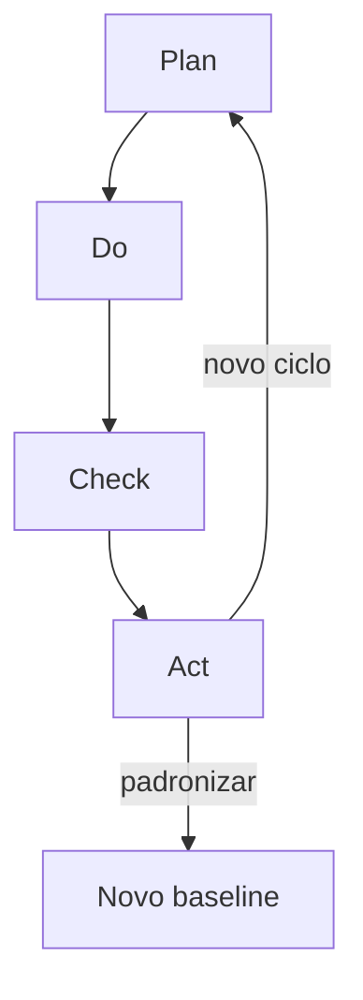

# PDCA, *gemba* e o patrocinador que não pode faltar — círculo com saída, não PowerPoint infinito

**PDCA** (*Plan-Do-Check-Act*) só funciona quando cada fase tem **critério de saída**: o que precisa ser **verdade** antes de virar roda? ***Gemba*** (lugar real) é onde o processo **acontece** — não o auditório. O **sponsor** (patrocinador) desbloqueia **recurso**, **escopo** e **conflito** entre áreas; sem ele, PDCA vira grupo de estudo.

Esta aula trata CI como **disciplina**, não como slogan de mural.

---

## Objetivos e resultado de aprendizagem

**Ao final desta aula**, você será capaz de:

- Descrever PDCA com **portões** entre fases.  
- Facilitar (ou participar de) **gemba** com checklist útil.  
- Definir **papel mínimo** do sponsor (decisão, orçamento, escalação).  
- Distinguir PDCA de **reunião semanal** sem hipótese.

**Duração sugerida:** 60–75 minutos.

---

## Gancho — o PDCA da TechLar que nunca chegou ao *Act*

A equipe da **TechLar** documentou **dez** ciclos de «PDCA» na fila da doca — todos pararam no **Do** com remendo operacional. **Check** não comparou com **meta**; **Act** não virou **padrão** nem treino. O problema **voltou** a cada pico. **Círculo sem Act** é **spiral** de retrabalho.

**Analogia da academia:** treinar sem medir carga nem progressão — suor sem resultado.

---

## Mapa do conteúdo

- PDCA com critérios de saída.  
- *Gemba*: o que observar e o que perguntar.  
- Sponsor e líder de melhoria.  
- Anti-padrões.

---

## PDCA com portões

| Fase | Saída mínima (pedagógica) |
|------|---------------------------|
| **Plan** | problema definido, Y ou defeito, meta, hipótese, plano de teste |
| **Do** | piloto executado com dados coletados |
| **Check** | comparação honesta plano *vs.* resultado; decisão documentada |
| **Act** | padrão atualizado **ou** novo ciclo com aprendizado explícito |

**Legenda:** seta de **Act** para **Plan** é **melhoria contínua** real; sem **Act**, o fluxo quebra.

---

## *Gemba* — checklist curto

1. **Fluxo** de uma unidade (pedido/palete) do início ao fim.  
2. **Esperas** visíveis (filas, sistemas, aprovações).  
3. **Padrão** publicado *vs.* prática (gap).  
4. **Segurança** e 5S (condição do lugar).  
5. **Perguntar «por quê?»** sem julgamento (técnica de *coaching* operacional).

**Analogia do médico:** examinar no leito, não só pelo prontuário resumido.

---

## Sponsor — o que precisa fazer

- **Proteger** o escopo contra «prioridade do dia» infinita.  
- **Decidir** trade-offs (custo, pessoal, parada de linha).  
- **Validar** encerramento ou extensão do ciclo.  
- **Visible commitment** — aparecer no *gemba* em marcos.

---

## Aplicação — exercício

Escreva **um** problema de doca em **quatro** parágrafos (Plan/Do/Check/Act) como **roteiro** de 30 dias: em cada parágrafo, **uma** métrica ou critério de saída.

**Gabarito pedagógico:** **Act** deve incluir **SOP/treino** ou **escopo** para novo ciclo; se **Act** for vazio, refazer.

---

## Erros comuns e armadilhas

- *Gemba* como **visita vistoria** com humilhação.  
- Sponsor que **só assina** o *charter* e some.  
- PDCA **sem dados** — opinião em loop.  
- Misturar **dez** problemas num único ciclo.

---

## KPIs e decisão

- **Ciclos PDCA** concluídos com Act documentado / mês.  
- **Tempo médio** do ciclo por classe de problema.  
- **Reincidência** do mesmo defeito após Act.

---

## Fechamento — três takeaways

1. PDCA sem **Check** honesto é teatro.  
2. *Gemba* é **respeito** ao trabalho real.  
3. Sponsor ausente = **projeto órfão** — estatisticamente morre.

**Pergunta de reflexão:** qual melhoria hoje está **presa** faltando **uma decisão** de patrocinador?

---

## Referências

1. IMAI, M. *Gemba Kaizen: A Commonsense Approach to a Continuous Improvement Strategy*. McGraw-Hill.  
2. DEMING, W. E. *Out of the Crisis* (PDSA/PDCA na tradição da qualidade). MIT Press.  
3. LIKER, J. K.; CONVIS, G. L. *The Toyota Way to Continuous Improvement*. McGraw-Hill.
