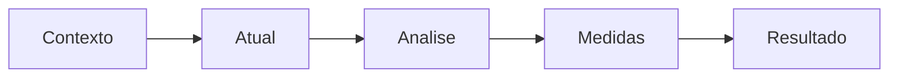

# Kaizen, A3 e priorização do *backlog* de melhoria — evento com data, fila com dono

**Kaizen** é mudança para melhor em **pequenos passos** ou em **evento** concentrado (blitz). **A3** é **uma folha** (referência ao tamanho do papel) que conta a história do problema: contexto, condição atual, análise, contramedidas, plano e resultados — para **alinhar** sem apresentação de cinquenta slides. O ***backlog*** de melhoria precisa de **priorização** transparente; senão, vence quem grita mais na segunda-feira.

Esta aula liga ferramenta a **governança**.

---

## Objetivos e resultado de aprendizagem

**Ao final desta aula**, você será capaz de:

- Comparar **micro-kaizen**, **evento** e **projeto**.  
- Esboçar um **A3** com seções mínimas.  
- Usar matriz **impacto × esforço** (ou similar) para ordenar iniciativas.  
- Definir **WIP** máximo de melhorias simultâneas por área.

**Duração sugerida:** 60–90 minutos.

---

## Gancho — a lista de 47 «prioridades»

A **TechLar** publicou lista de melhorias no SharePoint; **47** itens «prioritários». Nada terminou em **90 dias**. Introduziram **limite** de **três** iniciativas ativas por CD + **revisão quinzenal** com sponsor — throughput subiu. **Fila infinita** não é priorização; é **negação** de capacidade.

**Analogia do Wi-Fi:** cinquenta dispositivos num roteador doméstico — todos perdem.

---

## Mapa do conteúdo

- Tipos de kaizen.  
- Estrutura A3 (flexível, não dogmática).  
- *Backlog* e priorização.  
- WIP de melhoria.

---

## Kaizen — escalas

| Forma | Quando tender a servir |
|-------|-------------------------|
| Micro-kaizen | ajuste rápido com equipe de base |
| Evento 3–5 dias | problema multifuncional, dados disponíveis, sponsor presente |
| Projeto | investimento, TI, layout grande — ver módulo 4 |

---

## A3 — seções úteis (modelo pedagógico)

1. **Título** e **autor** / equipe.  
2. **Contexto** (negócio, cliente, urgência).  
3. **Condição atual** (fatos, dados, *gemba*).  
4. **Análise** (Pareto, 5 porquês *com cuidado* — evitar achismo).  
5. **Contramedidas** e **plano** (quem/quando).  
6. **Resultado** e **padronização** (*Act*).

**Legenda:** narrativa **esquerda → direita**; A3 é **história**, não relatório de laboratório.

---

## Priorização — impacto × esforço

**Impacto:** em Y de negócio (OTIF, custo, segurança).  
**Esforço:** pessoas, capital, risco operacional.

**Hipótese pedagógica:** *quick wins* (alto impacto, baixo esforço) primeiro **se** não quebrarem **estratégia** de longo prazo.

---

## Aplicação — exercício

Preencha um **esqueleto de A3** (títulos de seção + 3 bullets cada) para «**fila na doca na segunda manhã**». Liste **cinco** itens de *backlog* hipotéticos e posicione **dois** em quadrantes da matriz impacto × esforço.

**Gabarito pedagógico:** A3 deve ter **dado** na condição atual; *backlog* deve ter **no máximo** um item «gigante» sem desmembramento.

---

## Erros comuns e armadilhas

- A3 de **15 páginas** disfarçado.  
- Kaizen **sem** métrica antes/depois.  
- Priorização só por **volume de reclamação** sem custo/benefício.  
- Equipe em **burnout** de eventos sem *Act*.

---

## KPIs e decisão

- **Throughput** de melhorias concluídas / trimestre.  
- **Lead time** médio do *backlog* à conclusão.  
- **Satisfação** da equipe (survey simples) pós-evento.

---

## Fechamento — três takeaways

1. Kaizen sem **fecha** é hobby.  
2. A3 alinha **cabeça e mão** na mesma folha.  
3. *Backlog* sem WIP é **lista de culpa** coletiva.

**Pergunta de reflexão:** quantas melhorias **ativas** sua área aguenta **bem**?

---

## Referências

1. SOBEK, D. K.; SMALLEY, A. *Understanding A3 Thinking: A Critical Component of Toyota's PDCA Management System*. Lean Enterprise Institute.  
2. IMAI, M. *Kaizen: The Key to Japan's Competitive Success*. McGraw-Hill.  
3. ASCM — melhoria contínua (tipo): https://www.ascm.org/
