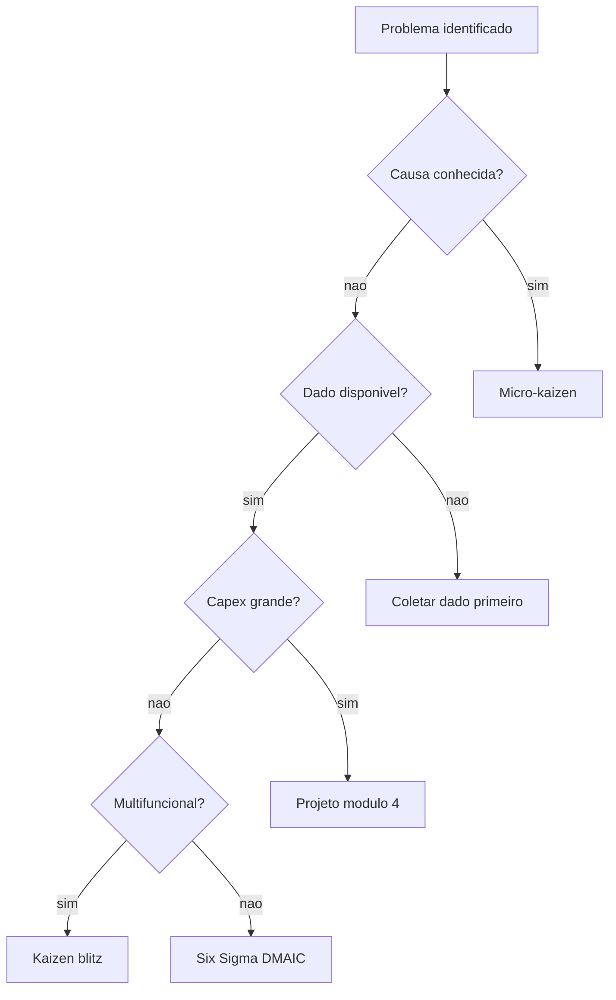
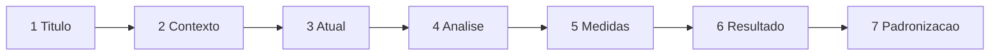
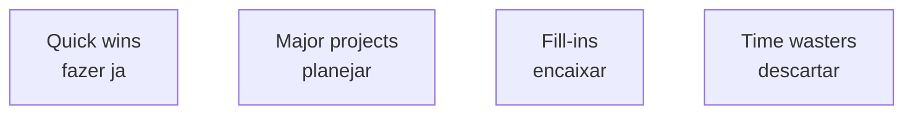
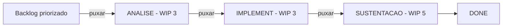

# Kaizen, A3 e priorização do *backlog* de melhoria — evento com data, fila com dono, decisão com critério

**Kaizen** (改善, «mudança para melhor») é melhoria contínua em **pequenos passos** ou em **evento concentrado** (*kaizen blitz* / *kaizen event* — 3 a 5 dias). **A3** é a **uma folha** (referência ao tamanho A3 — 297×420 mm) que conta a história inteira do problema: contexto, condição atual, análise, contramedidas, plano, resultados, padronização — para **alinhar** sem apresentação de cinquenta slides. O ***backlog*** de melhoria precisa de **priorização explícita** com critério (ICE, RICE, WSJF, matriz impacto×esforço); senão, vence quem grita mais na segunda-feira.

Esta aula liga **ferramenta** (A3) a **governança** (backlog priorizado, WIP máximo) e oferece **modelo A3 completo** + **comparação de 4 métodos de priorização** (impacto×esforço, ICE, RICE, WSJF) + **template de evento kaizen** de 5 dias.

---

## Objetivos e resultado de aprendizagem

**Ao final desta aula**, você será capaz de:

- Comparar **micro-kaizen**, **kaizen blitz** (evento) e **projeto** (módulo 4) com critério de escolha.
- Esboçar um **A3** completo com 7 seções e exemplo logístico real (TechLar — fila de doca).
- Aplicar **4 métodos de priorização**: impacto×esforço, **ICE**, **RICE**, **WSJF** com cálculo passo a passo.
- Definir **WIP máximo** de melhorias simultâneas por área e justificar com **Little's Law**.
- Estruturar **evento kaizen** de 5 dias (preparação → evento → sustentação).
- Conectar A3 aprovado ao **plano de controlo** (módulo 2.3) e à **biblioteca de A3s** (knowledge management).

**Duração sugerida:** 90–120 minutos (com cálculo de 3 priorizações no mini-lab).
**Pré-requisitos:** [Aula 3.1 (PDCA, gemba)](aula-01-pdca-gemba-sponsor.md), [módulo 1 e 2](../README.md).

---

## Mapa do conteúdo

1. Gancho — lista de 47 prioridades.
2. Tipos de kaizen (micro, blitz, projeto).
3. **A3** — anatomia completa + exemplo TechLar.
4. **4 métodos de priorização** com cálculo (impacto×esforço, ICE, RICE, WSJF).
5. **Evento kaizen 5 dias** — agenda detalhada.
6. WIP de melhoria — Little's Law aplicado a backlog.
7. Biblioteca de A3 e knowledge management.
8. Trade-offs, erros, KPIs, ferramentas, glossário.
9. Exercícios, gabarito, reflexão, referências, pontes.

---

## Gancho — a lista de 47 «prioridades»

A **TechLar** publicou lista de melhorias no SharePoint corporativo: **47** itens marcados como «**prioritários**» (todos com prioridade «alta» — sintoma clássico). Em 6 meses, **5** terminaram, **12** abandonados, **30** zumbis em status «em andamento». Frustração alta, sponsor descrédito, equipe cínica.

A líder de excelência operacional introduziu **3 mudanças de governança**:

1. **Limite WIP**: 3 iniciativas ativas por CD.
2. **Priorização WSJF** mensal com sponsor.
3. **Revisão quinzenal** de 60 min em Obeya com decisão registrada.

Resultado em 4 meses: throughput de melhorias subiu de **5 → 14 / semestre**; tempo médio de ciclo caiu de **5 → 2,5 meses**; engajamento (sugestões) +37%. **Fila infinita não é priorização — é negação de capacidade.**

> **Analogia do Wi-Fi residencial sobrecarregado:** cinquenta dispositivos no roteador doméstico — todos perdem velocidade. **Limite de WIP** é como **escolher** o que fica conectado.

> **Analogia da gôndola de supermercado:** se tudo é «promoção», nada é. Priorização é o **rótulo amarelo** com **regra**.

---

## Kaizen — escalas e quando usar

| Forma | Duração | Equipe | Investimento | Quando tender a servir |
|-------|---------|--------|--------------|------------------------|
| **Micro-kaizen** (Just-Do-It) | horas a 2 dias | 2–4 (chão) | < R$ 5k | ajuste rápido com equipe de base; ROI rápido, baixo risco |
| **Kaizen blitz / evento** | 3–5 dias intensivos | 6–10 | R$ 10–50k | problema multifuncional, dados disponíveis, sponsor presente, ganho médio em 30d |
| **Projeto Six Sigma** | 3–6 meses | 8–12 | R$ 50–500k | Y crítico, causa desconhecida, dado profundo (módulo 2) |
| **Projeto** (módulo 4) | 6–18 meses | 10–30 | R$ > 500k | investimento, TI, layout grande, capex, mudança organizacional |

### Decisão rápida (árvore)



---

## A3 — anatomia completa

O A3 é **mais que template**: é um **diálogo escrito**. Toyota usa A3 para **mentoreado e mentor** trocarem ideias num **ciclo PDCA** documentado. Há vários estilos (Sobek-Smalley, Shook); todos com 7 elementos comuns.

### Estrutura padrão (7 seções)

| # | Seção | Conteúdo | Erro comum |
|---|-------|----------|-------------|
| 1 | **Título + autor + data** | nome do problema, dono, sponsor, equipe, versão | título vago «melhoria CD» |
| 2 | **Contexto** | por que importa? cliente, dor, conexão a Hoshin | contar história sem dado |
| 3 | **Condição atual** | dado, fluxo, fato, gemba; gráfico/foto | descrever solução em vez de problema |
| 4 | **Análise** | causa-raiz: Pareto, Ishikawa, 5 Por Quês com **dado** | listar opiniões sem evidência |
| 5 | **Contramedidas + plano** | quem, o quê, quando, custo, risco | plano sem dono ou data |
| 6 | **Resultado esperado e medido** | meta + curva de sucesso + ROI | esquecer de revisar pós-implementação |
| 7 | **Padronização e próximos passos** | SOP, treino, plano de controlo, próximo PDCA | encerrar sem padrão |

### Diagrama do fluxo A3



> **Legenda:** narrativa **esquerda → direita** numa folha A3 (paisagem). Lado esquerdo = entendimento do **problema** (1–4); lado direito = **solução** (5–7). A3 é **história**, não relatório de laboratório.

### Exemplo completo — A3 da fila de doca TechLar

```
┌─────────────────────────────────────────────────────────────────┐
│ TÍTULO: Reducao da fila de carretas no slot 14h-17h - CD SP    │
│ Autor: Maria L. (analista CD)  Sponsor: J. Ferreira (gerente)  │
│ Equipe: 1 lider doca, 1 planejador transporte, 1 TI            │
│ Versao: 2.1   Data: 2026-04-19                                  │
├──────────────────────────────────┬──────────────────────────────┤
│ 2. CONTEXTO                       │ 5. CONTRAMEDIDAS + PLANO     │
│ Cliente B2B premium exige slot    │ A. Distribuir janela TMS em  │
│ ate 16h. 18% dos pedidos ficam    │    14h, 15h, 16h, 17h        │
│ fora (R$240k/mes em re-envio).    │    (cap 3 carretas/slot)     │
│ Conecta a Hoshin OTIF 95%.        │ B. Comunicar transportadores │
│                                    │ C. Treinar planejador       │
│ 3. CONDICAO ATUAL                 │ D. Plano controle (P-chart)  │
│ Fila media segundas: 2,8h         │                              │
│ Pico: 14 carretas em 1h           │ Cronograma:                   │
│ [grafico de fila por hora]        │ Sem 1: config TMS, comunicar │
│ Lead time interno P90: 8,5h       │ Sem 2-3: piloto + medicao    │
│ Acuracia ASN: 92%                 │ Sem 4: ajuste + handoff      │
│                                    │                              │
│ 4. ANALISE                        │ 6. RESULTADO                  │
│ Pareto causas (4 sem):            │ Meta T+30: fila < 1,5h       │
│  - consolidacao TMS  41%           │ Meta T+90: fila < 1h         │
│  - cadastro endereco 23%           │ Resultado piloto sem 3:       │
│  - falta forecast    18%           │   1,9h - 1,5h - 1,2h          │
│  - outros            18%           │   media 1,53h (+45% vs base) │
│                                    │ ROI estimado: R$240k/mes      │
│ 5 Por Que (causa #1):             │                              │
│ 1. fila > 1h ?                    │ 7. PADRONIZACAO              │
│ 2. consolidacao em 1 slot         │ - SOP janela TMS v2.1         │
│ 3. desconto transp aceito         │ - Treino 3 turnos             │
│ 4. sem revisao capacidade doca    │ - Plano controle: tempo      │
│ 5. SOP de handoff inexistente     │   medio diario, alarme >1,5h │
│                                    │ - Proximo PDCA: espera       │
│ Causa-raiz: ausencia de SOP +     │   embalagem (43min)          │
│ governanca handoff TMS-doca       │ - Lições no repositorio       │
└──────────────────────────────────┴──────────────────────────────┘
```

### Princípios do A3

- **Cabe em 1 folha** (A3, paisagem). Se não cabe, **não está pronto**.
- **História em ordem de leitura** (esq→dir, cima→baixo).
- **Dado em todo lado** (gráfico, número, citação).
- **Foto ou Mermaid** para fluxo.
- **Versão** sempre — A3 é **vivo**, não final.
- **Mentor reage** com perguntas, não com correções («e se?», «como sabe?»).

---

## 4 Métodos de priorização — comparação e cálculo

### 1. Matriz Impacto × Esforço (clássica Lean)

| Quadrante | Característica | Ação |
|-----------|----------------|------|
| **Quick wins** (alto impacto, baixo esforço) | ✓ fazer já | priorizar |
| **Major projects** (alto impacto, alto esforço) | planejar | módulo 4 |
| **Fill-ins** (baixo impacto, baixo esforço) | encaixar | preencher capacidade |
| **Time wasters** (baixo impacto, alto esforço) | ✗ não fazer | descartar |



> **Limite:** subjetivo. Bom para **discussão inicial**, fraco para **fila ordenada**.

### 2. ICE (Impact, Confidence, Ease) — para starts rápidos

\[
\text{Score ICE} = I \times C \times E
\]

Cada dimensão de **1 a 10**.

| Iniciativa | I | C | E | Score |
|------------|---|---|---|-------|
| Heijunka onda | 9 | 8 | 6 | **432** |
| Poka-yoke picking | 8 | 9 | 5 | **360** |
| Janela doca digital | 7 | 7 | 7 | **343** |
| Reorganizar slotting | 6 | 6 | 4 | 144 |
| Foto na lista de picking | 5 | 9 | 9 | **405** |

**Decisão:** ordem ICE → 1) Heijunka, 2) Foto, 3) Poka-yoke, 4) Doca, 5) Slotting. Foto entra alta porque é **fácil + confiável**.

### 3. RICE (Reach, Impact, Confidence, Effort)

\[
\text{Score RICE} = \frac{R \times I \times C}{E}
\]

- R = quantas pessoas/pedidos afetados
- I = magnitude do impacto (0,25 / 0,5 / 1 / 2 / 3)
- C = confiança (0–100%)
- E = esforço (pessoa-semana)

| Iniciativa | R (ped/sem) | I | C | E (p-sem) | Score |
|------------|-------------|---|---|------------|-------|
| Heijunka onda | 4000 | 2 | 0,8 | 6 | (4000×2×0,8)/6 = **1067** |
| Poka-yoke picking | 4000 | 3 | 0,9 | 12 | (4000×3×0,9)/12 = **900** |
| Foto na lista | 4000 | 0,5 | 0,9 | 1 | (4000×0,5×0,9)/1 = **1800** |
| Janela doca | 3000 | 1 | 0,7 | 4 | (3000×1×0,7)/4 = **525** |

**Decisão RICE:** 1) Foto (1800), 2) Heijunka (1067), 3) Poka-yoke (900), 4) Doca (525). Foto sobe ainda mais por **alto reach + baixo esforço**.

### 4. WSJF (Weighted Shortest Job First) — SAFe / Lean Portfolio

\[
\text{WSJF} = \frac{\text{Cost of Delay (CoD)}}{\text{Job Size}}
\]

CoD = **Business Value + Time Criticality + Risk/Opportunity Reduction** (cada 1–10 ou Fibonacci).

| Iniciativa | BV | TC | RR | CoD | Size | WSJF |
|------------|----|----|----|-----|------|------|
| Heijunka onda | 8 | 8 | 6 | 22 | 5 | **4,4** |
| Poka-yoke picking | 9 | 7 | 8 | 24 | 8 | 3,0 |
| Foto na lista | 5 | 6 | 4 | 15 | 1 | **15** |
| Janela doca | 6 | 8 | 5 | 19 | 3 | **6,3** |
| Slotting | 7 | 4 | 5 | 16 | 8 | 2,0 |

**Decisão WSJF:** 1) Foto (15), 2) Doca (6,3), 3) Heijunka (4,4), 4) Poka-yoke (3,0), 5) Slotting (2,0).

> **Comparação dos métodos:** os 4 métodos **concordam** que «foto na lista» é vencedor (ROI rápido). Divergem em ordem de Heijunka vs. Doca vs. Poka-yoke. Use **um** método consistentemente; rituais valem mais que método «perfeito».

> **Quando usar qual?** Impacto×Esforço para discussão visual; ICE para sprint pequeno; RICE para produto/feature com alcance variável; **WSJF para portfólio** (SAFe / Lean Portfolio Management).

---

## Evento kaizen — agenda 5 dias detalhada

### Estrutura clássica (Imai / Kaizen Institute)

| Dia | Foco | Atividades | Entregável |
|-----|------|------------|--------------|
| **Pré (1–2 sem)** | preparação | escopo, dados, equipe, gemba, materiais, comunicação | charter de evento |
| **Dia 1 — segunda** | entender | treino Lean (4h), gemba caminhada, VSM atual | mapa atual + dados |
| **Dia 2 — terça** | analisar | brainstorming, Pareto, Ishikawa, 5 Por Quês | causas-raiz priorizadas |
| **Dia 3 — quarta** | desenhar | VSM futuro, contramedidas, layout, mock-up | desenho de estado futuro |
| **Dia 4 — quinta** | implementar | piloto físico, mover, etiquetar, treinar | mudança aplicada |
| **Dia 5 — sexta** | medir + apresentar | medir Y, padronizar, apresentar a sponsor | A3 + plano sustentação |
| **Pós (30 dias)** | sustentar | auditoria semanal, RCA se regredir, biblioteca | revisão T+30 |

### Critérios de sucesso

- Y melhora ≥ X% em 5 dias.
- Equipe **operadora** lidera apresentação final (não consultor).
- Plano de sustentação com **dono** + **data** das auditorias.
- A3 publicado na biblioteca interna.

### Composição da equipe (6–10 pessoas)

- **Líder do evento** (facilitador interno ou consultor) — 1
- **Sponsor** — comparece dia 1 (kickoff) e dia 5 (apresentação) — 1
- **Operadores da área** — 3–5 (essenciais)
- **Apoio técnico** (TI, manutenção, qualidade) — 1–2
- **Cliente do processo** (próximo elo da cadeia) — 1

> **Regra Toyota:** 50% da equipe deve ser do **chão**. Sem operador, vira oficina de gerência.

---

## WIP de melhoria — limite por área (Little's Law aplicado)

### Por que importar

\[
\text{Lead time melhoria} = \frac{\text{WIP}}{\text{Throughput}}
\]

Se uma área completa **2 melhorias/mês** (throughput) e tem **47** em curso (WIP), lead time médio = 47/2 = **23,5 meses** — quase nada termina.

### Regra prática

- Área operacional típica: **3–5** iniciativas ativas máximo.
- Equipe pequena (10–15 colab): **2–3**.
- 1 sponsor não deve patrocinar mais de **5 projetos** simultâneos com atenção real.

### Pull system de melhorias (kanban de iniciativas)



> **Insight:** quando **DONE** acelera, abre espaço em **Sustentação** → libera vaga em **Implementação** → **Análise** puxa do **Backlog**. **Pull** evita overbooking.

---

## Biblioteca de A3 e knowledge management

### Por que importa

A3 isolado é **um** aprendizado. Biblioteca de A3 é **memória organizacional**. Empresas Lean maduras (Toyota, Danaher, Boeing) têm milhares de A3 indexados.

### Estrutura mínima

| Atributo | Exemplo |
|----------|---------|
| ID | A3-2026-CDSP-014 |
| Título | Reducao fila doca slot 14h-17h |
| Área | CD São Paulo |
| Y | Tempo médio fila (h) |
| Resultado | 2,8h → 1,2h (−57%) |
| ROI | R$ 240k/ano |
| Status | Sustentado T+90 |
| Tags | doca, transporte, TMS, mura |
| Lições | distribuir slot funciona se cap < 3 |
| Reutilização | aplicado em CD-RJ em 2026-Q3 |

### Onde guardar

- **Confluence / SharePoint / Notion** com taxonomia.
- **Index pesquisável** por tag, área, problema.
- **Revisão anual** para arquivar obsoletos.
- **Gemba walk** começa lendo A3 da zona — herança de conhecimento.

---

## Aprofundamentos — variações setoriais

| Cenário | Particularidade A3 / kaizen |
|---------|------------------------------|
| **Manufatura tradicional** | kaizen de redução de setup (SMED), com cronómetro |
| **CD B2C grande volume** | kaizen rápido (1 dia) em embalagem; alta cadência |
| **3PL multicliente** | A3 **por cliente** + transversal; biblioteca segregada |
| **Farma / GDP** | A3 com **revisão regulatória**; mudança de SOP exige validação |
| **Cold chain** | kaizen com sensor IoT antes/depois (provar ganho térmico) |
| **Operação portuária / aduana** | kaizen com janelas curtíssimas (6h); planejamento intenso pré-evento |
| **Pequena operação BR** | A3 simplificado em 1 página A4; ICE em vez de WSJF |

---

## Trade-offs e decisão

| Trade-off | Lado A | Lado B |
|-----------|--------|--------|
| A3 detalhado | aprendizado profundo | demora, risco de paralisia |
| A3 enxuto | velocidade | superficial |
| WSJF rigoroso | priorização justa | demora a calcular |
| Impacto×esforço | ágil | subjetivo |
| Kaizen blitz | ganho rápido | exige preparação |
| Micro-kaizen contínuo | engajamento | falta de visão sistémica |
| Sponsor 1 projeto/mês | foco | gargalo |
| Sponsor 5 projetos/mês | escala | superficial |

---

## Caso prático / Mini-laboratório — priorizar 5 iniciativas TechLar

Use os scores ICE/RICE/WSJF acima e preencha o quadro:

| Iniciativa | ICE | RICE | WSJF | Decisão final | Justificativa |
|------------|-----|------|------|----------------|----------------|
| Foto na lista | 405 | 1800 | 15 | **#1** | unanimidade entre métodos; quick win |
| Heijunka onda | 432 | 1067 | 4,4 | #2 ou #3 | alto impacto, esforço médio |
| Poka-yoke picking | 360 | 900 | 3,0 | #3 ou #4 | alto valor, esforço alto |
| Janela doca | 343 | 525 | 6,3 | #2 ou #3 | dependência de TMS |
| Slotting | 144 | — | 2,0 | #5 ou descartar | esforço alto, ROI menor |

**Decisão consolidada (mediana):**
1. Foto (sprint 2 sem)
2. Janela doca (sprint 4 sem)
3. Heijunka (kaizen blitz 5 dias)
4. Poka-yoke (projeto Six Sigma 3 meses)
5. Slotting (avaliar se entra em projeto módulo 4 com layout)

---

## Erros comuns e armadilhas

1. **A3 de 15 páginas** disfarçado em PowerPoint.
2. **Kaizen sem métrica antes/depois** — story bonita sem prova.
3. **Priorização só por volume de reclamação** sem custo/benefício.
4. **Equipe em burnout** de eventos sem **Act/sustentação**.
5. **Sponsor ausente no evento** — perde autoridade em decisões dia 5.
6. **«Backlog do CD» de 80 itens** sem revisão mensal — ninguém sabe ordem.
7. **Confundir A3 com slide deck** — A3 é colaborativo; slide é unidirecional.
8. **WSJF sem catchball** — números viram briga interna.
9. **Biblioteca de A3 morta** — pasta com 200 PDFs sem search.
10. **Kaizen blitz sem preparação** — vira reunião improdutiva de 5 dias.

---

## Comportamento e cultura

- **Mentor de A3**: alguém sénior dá feedback no rascunho **antes** de subir ao sponsor — formação de novos líderes.
- **Apresentação dia 5** lidera operador — eleva moral.
- **Reconhecimento** público dos 3 melhores A3s do trimestre.
- **Banco de horas para kaizen** (ex.: 10% do tempo de cada colaborador) — estrutural.
- **Sponsor lê A3** **antes** da reunião (regra Toyota: A3 chega 24h antes).
- **Cultura de aprendizado**: A3 «fracasso» (hipótese errada) com mesma honra que sucesso.

---

## KPIs de melhoria

| KPI | Pergunta | Dono | Fonte | Cadência | Playbook |
|-----|----------|------|-------|----------|----------|
| Throughput melhorias / trimestre | velocidade CI | EO | base PDCA/A3 | trimestral | identificar gargalo (sponsor, TI) |
| Lead time backlog → conclusão | velocidade do sistema | EO | base | mensal | reduzir WIP |
| WIP médio por área | governança WIP | EO | base | semanal | aplicar limite |
| % A3s com Act sustentado T+90 | qualidade do CI | EO + qualidade | revisão | trimestral | reforçar plano de controlo |
| Score satisfação equipe pós-evento | engajamento | RH + EO | survey | pós-evento | revisar agenda, sponsor |
| % iniciativas no top WSJF executadas | priorização cumprida? | sponsor + EO | base | mensal | confronto político se desviar |
| ROI realizado / ROI prometido | benefício chega? | controladoria | financeiro | trimestral | gate T+90 |

---

## Tecnologias e ferramentas

| Categoria | Ferramenta |
|-----------|------------|
| A3 digital | **Kainexus**, i-nexus, Lucidchart template, **Miro** A3 board, Google Slides A3 |
| Backlog priorizado | **Jira**, Trello, Asana, Monday, ClickUp |
| WSJF / RICE | Productboard, **Jira Advanced Roadmaps**, Excel custom |
| Gestão de evento | **Smartsheet**, MS Project lite, planilha |
| Knowledge / biblioteca A3 | Confluence, SharePoint, Notion, GitBook |
| Mapeamento (Ishikawa, VSM) | Lucidchart, Miro, Mural, draw.io |
| Reconhecimento / sugestões | KaiNexus, Beneform, MS Viva Engage |
| Survey pós-evento | Forms, Typeform, Qualtrics |

---

## Glossário rápido

- **Kaizen** — mudança para melhor; pequenos passos.
- **Kaizen blitz / kaizen event** — evento concentrado 3–5 dias.
- **A3** — folha A3 com história PDCA do problema.
- **Backlog** — fila de iniciativas.
- **WIP** — *work in process*; limite recomendado.
- **ICE / RICE / WSJF** — métodos de priorização.
- **CoD** — *cost of delay* (componente do WSJF).
- **Catchball** — revisão bidirecional Hoshin/priorização.
- **Just-Do-It (JDI)** — micro-kaizen.
- **Lean Portfolio Management** — gestão de portfólio Lean (SAFe).

---

## Aplicação — exercícios

### Exercício 1 — esqueleto de A3 (20 min)

Preencha esqueleto de A3 (títulos + 3 bullets cada seção) para «**fila na doca segunda manhã**».

**Gabarito:** Contexto = cliente B2B, R$/mês perdido. Atual = fila X h, Pareto. Análise = 5 Por Quês. Medidas = 2–3 ações com dono. Resultado = meta T+30/60/90. Padronização = SOP, controle, próximo PDCA.

### Exercício 2 — priorização ICE (15 min)

Dado:

| Iniciativa | I | C | E | Score |
|------------|---|---|---|-------|
| A | 8 | 7 | 6 | ? |
| B | 6 | 9 | 9 | ? |
| C | 9 | 5 | 4 | ? |
| D | 4 | 8 | 8 | ? |

Calcule e ordene.

**Gabarito:**
- A = 8×7×6 = **336**
- B = 6×9×9 = **486**
- C = 9×5×4 = **180**
- D = 4×8×8 = **256**

Ordem ICE: B (486) > A (336) > D (256) > C (180).

### Exercício 3 — WSJF (20 min)

Para 3 iniciativas calcule WSJF e proponha sequência:

| Iniciativa | BV | TC | RR | Size |
|------------|----|----|----|------|
| X | 9 | 8 | 7 | 8 |
| Y | 6 | 5 | 4 | 2 |
| Z | 7 | 9 | 6 | 5 |

**Gabarito:**
- X: CoD = 24, WSJF = 24/8 = **3,0**
- Y: CoD = 15, WSJF = 15/2 = **7,5**
- Z: CoD = 22, WSJF = 22/5 = **4,4**

Sequência: **Y (7,5) → Z (4,4) → X (3,0)**. Y é menor mas valioso e rápido.

### Exercício 4 — agenda de blitz (15 min)

Esboce agenda de evento kaizen 5 dias para problema «erro de mix em embalagem B2B (1,9%)». Indique 1 entregável por dia.

**Gabarito:** Pré: dado de erro 4 sem, equipe (2 embaladores, 1 supervisor, 1 TI, 1 qualidade, 1 cliente B2B). D1: VSM atual da embalagem. D2: Pareto + Ishikawa + 5 Por Quês. D3: poka-yoke desenhado (foto, scan, balança). D4: piloto em 1 estação. D5: medição (FTR), apresentação a sponsor, A3 final.

---

## Pergunta de reflexão

**Quantas melhorias ativas a sua área aguenta bem?** Como você convenceria sponsor e pares a reduzir WIP — qual seria o argumento (Little's Law? throughput?) e qual seria o **piloto**?

---

## Fechamento — três takeaways

1. **Kaizen sem fechamento (Act + sustentação) é hobby caro.**
2. **A3 alinha cabeça e mão na mesma folha** — quem escreve, pensa.
3. ***Backlog* sem WIP é lista de culpa coletiva.** Limite + ritual + priorização explícita = throughput.

---

## Referências

1. SOBEK, D. K.; SMALLEY, A. *Understanding A3 Thinking: A Critical Component of Toyota's PDCA Management System*. Lean Enterprise Institute.
2. SHOOK, J. *Managing to Learn: Using the A3 Management Process*. LEI.
3. IMAI, M. *Kaizen: The Key to Japan's Competitive Success*. McGraw-Hill.
4. SUZAKI, K. *The New Manufacturing Challenge: Techniques for Continuous Improvement*. Free Press.
5. JEFFRIES, R.; ANDERSON, D. *Kanban: Successful Evolutionary Change for Your Technology Business*. Blue Hole Press. (WIP, kanban em melhoria)
6. LEFFINGWELL, D. *SAFe Reference Guide* (WSJF, Lean Portfolio Management).
7. INTERCOM. RICE scoring framework: <https://www.intercom.com/blog/rice-simple-prioritization-for-product-managers/>
8. MCKINSEY. *Continuous improvement* artigos: <https://www.mckinsey.com/>
9. ASCM/APICS Dictionary — *kaizen*, *A3*: <https://www.ascm.org/>
10. Lean Enterprise Institute — A3 thinking: <https://www.lean.org/>

---

## Pontes para outras trilhas

- [Indicadores logísticos — Dados](../../trilha-dados-analytics-logistica/modulo-04-indicadores-logisticos-kpis/README.md): Y para A3.
- [Master Data — Tecnologia](../../trilha-tecnologia-e-sistemas/modulo-01-master-data-para-logistica/aula-01-master-data-na-cadeia.md): poka-yoke sistémico.
- [Layout e zonas — Operações](../../trilha-operacoes-logisticas/modulo-02-armazenagem-e-layout-logistico/aula-01-layout-zonas-fluxo-docas.md): kaizen de movimento.
- **Próxima aula desta trilha:** [CI na cadeia — S&OP, dados e mudança de sistema](aula-03-ci-cadeia-sop-dados-ti.md).
