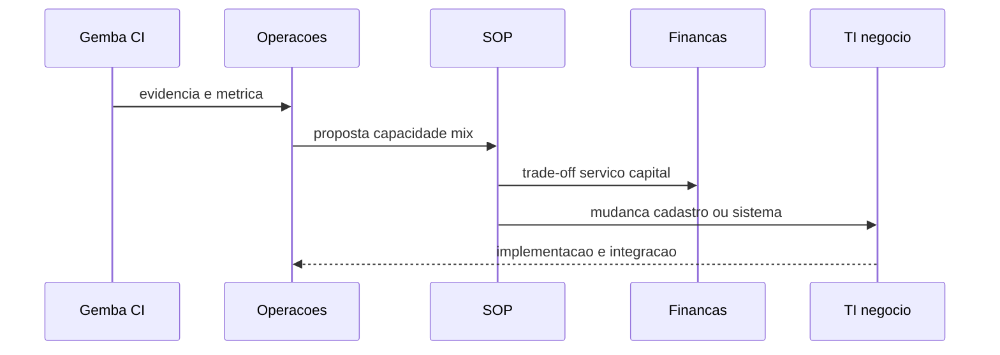

# CI na cadeia — S&OP, dados e mudança de sistema

**Melhoria contínua** que ignora **planejamento integrado**, **definição de KPI** e **cadastro** costuma **regredir** na primeira promoção ou *cut-over* de WMS. Nesta aula, CI deixa de ser «só CD» e passa a conversar com **S&OP**, **finanças** e **TI de negócio** — com handoffs explícitos.

---

## Objetivos e resultado de aprendizagem

**Ao final desta aula**, você será capaz de:

- Posicionar iniciativas de CI como **entradas** ou **saídas** do ciclo S&OP (conceitual).  
- Exigir **dono de dado** quando a solução toca master data ou integração.  
- Descrever **sequência** CI → decisão de portfólio → execução com TI.  
- Listar anti-padrões «melhoria sem sistema».

**Duração sugerida:** 60–75 minutos.

---

## Gancho — o kaizen que derrubou o ATP

A **TechLar** «ganhou» 12% de produtividade em picking mudando **roteiro** físico. Ninguém atualizou **tempos padrão** e **capacidade** no modelo usado pelo **ATP** — promessa comercial **divergiu** da doca. CI **local** sem **mapa de dados** virou **custo** no call center.

**Analogia do relógio:** ajustar o ponteiro sem engrenagem — hora errada na parede certa.

---

## Mapa do conteúdo

- CI e S&OP (demanda, capacidade, exceções).  
- KPIs e definição única (ponte Dados).  
- Mudança de WMS/ERP/cadastro como parte da solução.  
- Sequência e papéis.

---

## CI e S&OP — interface

**S&OP** integra planos de demanda, suprimento e recursos — ver [processo de S&OP](../../trilha-fundamentos-e-estrategia/modulo-03-planejamento-demanda-sop/aula-03-sop-processo-alinhamento.md). **CI** alimenta o S&OP com:

- **capacidade real** após melhorias;  
- **gargalos** persistentes que exigem decisão de mix ou investimento;  
- **riscos** de serviço descobertos no *gemba*.

Reciprocamente, decisões de S&OP (promoção, mix, abertura de CD) **criam** *backlog* de CI.

**Legenda:** simplificação; na vida há política e prioridade.

---

## Dados e KPI — uma definição

Toda melhoria que muda **OTIF**, **lead time** ou **cobertura** deve **registrar** a definição no **dicionário** (trilha Dados). **Hipótese pedagógica:** CI maduro trata definição de KPI como **ativo** tão importante quanto SOP físico.

---

## TI e master data

Quando a solução envolve **endereço**, **UoM**, **roteiro de transporte** ou **evento WMS**, inclua no A3 ou *charter*:

- **Objeto mestre** afetado;  
- **Dono** de negócio;  
- **Teste** em homologação;  
- **Plano de rollback**.

Ver: [Master Data](../../trilha-tecnologia-e-sistemas/modulo-01-master-data-para-logistica/README.md), [Integrações](../../trilha-tecnologia-e-sistemas/modulo-02-erp-aplicado-supply-chain/aula-03-integracoes-batch.md).

---

## Aplicação — exercício

Liste **seis** handoffs entre «**equipe de melhoria do CD**» e «**resto da cadeia**» (planejamento, comercial, TI, financeiro) para um projeto que **reduz** lead time interno em **20%**. Para cada handoff: **artefato** (doc, reunião, sistema).

**Gabarito pedagógico:** deve aparecer **atualização de promessa/ATP**, **comunicação a cliente B2B** se aplicável, e **treino**; mínimo **dois** envolvendo dado ou sistema.

---

## Erros comuns e armadilhas

- CI **só** em Q1 quando o budget «libera».  
- Otimizar CD **empurrando** inventário para **fornecedor** sem contrato.  
- Ignorar **S&OP** na Black Friday.  
- «**Depois** ajustamos o sistema» virar **nunca**.

---

## KPIs e decisão

- **% melhorias** com atualização de **definição** de KPI ou SOP sistêmico.  
- **Incidentes** pós-melhoria ligados a dado/sistema (meta: baixo).  
- **Participação** de planejamento nas revisões de *backlog*.

---

## Fechamento — três takeaways

1. CI na cadeia é **política** tanto quanto técnica.  
2. Dado sem dono **desfaz** ganho físico.  
3. S&OP é **mesa** onde CI ganha ou perde prioridade.

**Pergunta de reflexão:** qual melhoria recente **não** passou pelo filtro de dados e promessa ao cliente?

---

## Referências

1. LIKER, J. K.; CONVIS, G. L. *The Toyota Way to Continuous Improvement*.  
2. [S&OP — Fundamentos](../../trilha-fundamentos-e-estrategia/modulo-03-planejamento-demanda-sop/aula-03-sop-processo-alinhamento.md)  
3. [Trilha Tecnologia — README](../../trilha-tecnologia-e-sistemas/README.md)
