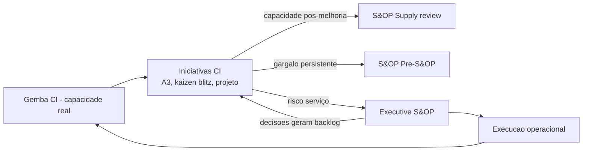
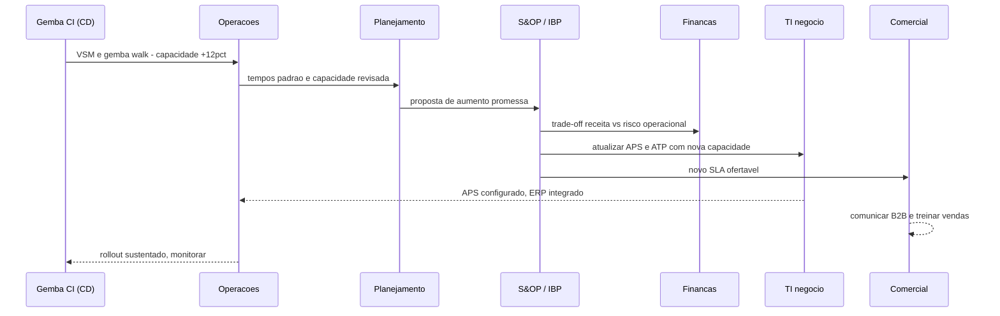
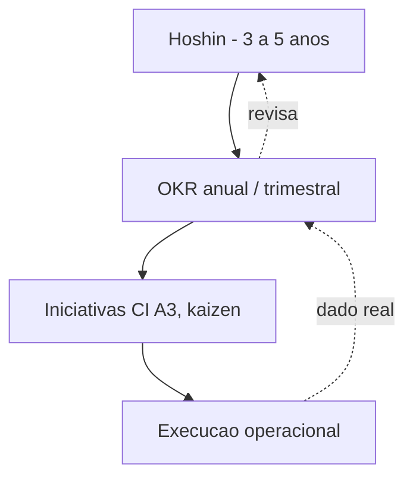
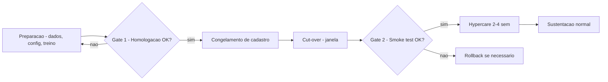
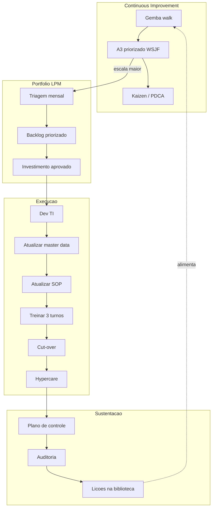

# CI na cadeia — S&OP, dados e mudança de sistema

**Melhoria contínua** que ignora **planeamento integrado**, **definição de KPI** e **cadastro/integração** costuma **regredir** na primeira promoção, *cut-over* de WMS ou abertura de novo CD. Nesta aula, CI deixa de ser «só CD» e passa a conversar com **S&OP** (*Sales & Operations Planning*), **finanças**, **IBP** (*Integrated Business Planning*) e **TI de negócio** — com **handoffs explícitos**, **OKR** alinhado e **governança de dado** ativa.

A logística do futuro próximo (BR e global, 2026+) é **digital, integrada e governada** — CI tem de subir para o nível **portfolio**, **OKR** e **arquitetura**, não ficar só no chão da doca.

---

## Objetivos e resultado de aprendizagem

**Ao final desta aula**, você será capaz de:

- Posicionar iniciativas de CI como **entradas** ou **saídas** do ciclo S&OP/IBP (5 fases mensais).
- Exigir **dono de dado** quando a solução toca **master data** (SKU, fornecedor, cliente, endereço, UoM, roteiro) ou **integração** (ASN, EDI, API).
- Estruturar **handoff CI → portfólio → execução TI** com 6 artefactos mínimos.
- Aplicar **OKR** (Objectives & Key Results) em supply chain com exemplo TechLar.
- Usar **DAMA-DMBoK** (categorias de governança de dado) para CI sustentável.
- Listar **anti-padrões** «melhoria sem sistema» e «sistema sem melhoria».
- Articular CI com **Lean Portfolio Management** e **PMO** (módulo 4).

**Duração sugerida:** 75–90 minutos.
**Pré-requisitos:** [Aulas 3.1 e 3.2](aula-01-pdca-gemba-sponsor.md), conceito básico de S&OP (trilha Fundamentos).

---

## Mapa do conteúdo

1. Gancho — kaizen que derrubou o ATP.
2. Conceito S&OP/IBP — 5 fases e onde CI entra.
3. CI ↔ S&OP — interface bidirecional.
4. **OKR para SC** — exemplo TechLar.
5. Master data e governança (DAMA-DMBoK).
6. TI / sistema — *change management* técnico, integração, rollback.
7. Diagrama principal — sequência CI → portfólio → execução.
8. Lean Portfolio Management — onde CI vira investimento.
9. Trade-offs, erros, KPIs, ferramentas, glossário.
10. Exercícios, gabarito, reflexão, referências, pontes.

---

## Gancho — o kaizen que derrubou o ATP

A **TechLar** «ganhou» **+12%** de produtividade em picking (140 → 157 linhas/h·sep) mudando **roteiro físico** + slotting golden zone. Vitória do CD. Kaizen blitz festejado. Foto no comitê.

Ninguém atualizou:
- **Tempos padrão** no ERP/APS (cálculo de capacidade);
- **Capacidade** no modelo usado pelo **ATP** (*Available-to-Promise*);
- **Dicionário de KPI** (definição de «produtividade» mudou de base);
- **SOP de transporte** (janela seria mais flexível agora).

**Resultado em 6 semanas:**
- Comercial **continuou** prometendo lead time conservador antigo → perdeu **R$ 320k em vendas** que poderiam ser fechadas com promessa nova.
- **Inversamente**, em pico (Black Friday), comercial **superpromessou** baseado em produtividade «média» que excluía custos de retrabalho — **OTIF caiu** para 78% por 2 semanas, R$ 180k em multas.
- **Call center** abriu **+40% de chamados** sobre datas de entrega. Custo de atendimento R$ 95k/mês.

CI **local** sem **mapa de dados** virou **passivo**. O kaizen estava certo — a **integração** estava errada.

> **Analogia do relógio mecânico:** ajustar o ponteiro **sem** ajustar a engrenagem — hora errada na parede certa. Ou pior: **uma engrenagem** ajustada e outras paradas — relógio para.

> **Analogia do navio com timão isolado:** capitão (CD) gira o timão, mas o **leme** (S&OP) não conecta — navio (cadeia) anda em círculos.

---

## S&OP / IBP — onde CI entra na cadeia

### As 5 fases do ciclo S&OP mensal (clássico)

| Fase | Pergunta | Quem lidera | Saída |
|------|----------|--------------|-------|
| 1. **Demand review** | quanto vendemos / vamos vender? | comercial + demand planning | forecast consensual |
| 2. **Supply review** | conseguimos atender? capacidade? | operações + suprimentos | plano de suprimento |
| 3. **Pre-S&OP / reconciliation** | onde há lacuna? cenários? | planeamento integrado | cenários de gap |
| 4. **Executive S&OP** | qual decisão? | C-level | plano único aprovado |
| 5. **Execução + monitoramento** | estamos no plano? | operação | KPIs + ajustes |

### IBP (Integrated Business Planning) — evolução

IBP é S&OP «com finanças e estratégia» — horizonte 18–36 meses, integração com FP&A, capex, M&A. Em empresas BR maduras (Ambev, Natura, BRF, Unilever), IBP é mensal e considera **iniciativas de CI** como **entradas** de capacidade futura.

### Onde CI entra

> **Insight:** CI **alimenta** S&OP com **capacidade real pós-melhoria** e **gargalos persistentes** que exigem decisão de mix ou capex. S&OP **alimenta** CI com **decisões** (promoção, abertura de CD, lançamento) que **geram backlog**.

### Sequência completa CI → cadeia (TechLar exemplo)

---

## OKR para Supply Chain — alinhamento estratégico

### O que é

**OKR** (*Objectives & Key Results*) — método popularizado por Andy Grove (Intel) e Google. Conecta **estratégia** a **execução** com:

- **Objective** — qualitativo, inspirador, com prazo (trimestre/ano).
- **Key Results** — quantitativos, mensuráveis, 3–5 por O.

### Diferença vs. KPI

| Atributo | KPI | OKR |
|----------|-----|-----|
| Natureza | indicador rotina | meta com prazo |
| Cadência | contínua | trimestral/anual |
| Aspiração | manter saudável | estender (60–70% atingido = bom) |
| Dono | função | time multifuncional |

### Exemplo OKR — TechLar 2026 Q3

**Objective 1:** Tornar o CD São Paulo o mais rápido do Brasil B2B premium.
- **KR1.1:** Reduzir lead time interno P90 de 8,5h para 5h.
- **KR1.2:** Atingir OTIF 95% sustentado por 8 semanas consecutivas.
- **KR1.3:** Manter custo/linha ≤ R$ 1,80 (baseline R$ 2,10).

**Objective 2:** Estabelecer cultura CI viva.
- **KR2.1:** Concluir 12 ciclos PDCA com Act sustentado.
- **KR2.2:** 80% dos colaboradores com ≥1 sugestão registrada.
- **KR2.3:** Score satisfação CI ≥ 4,2/5,0 em survey trimestral.

### Conexão CI ↔ OKR ↔ Hoshin

> **Insight:** Hoshin é **norte verdadeiro** (3–5 anos); OKR é **trimestre** ágil; CI é **execução** semanal. Sem alinhamento, CI vira pet project; sem CI, OKR vira aspiração.

---

## Master data e governança — DAMA-DMBoK em CI

Toda melhoria que muda **OTIF**, **lead time**, **cobertura**, **acurácia** ou **NPS** **toca dado**. Sem governança, ganho físico **regride** com cadastro errado.

### Categorias DAMA-DMBoK relevantes para logística

| Categoria | O que cobre | Exemplo aplicável a CI |
|-----------|-------------|------------------------|
| **Data Governance** | políticas, dono, comité | quem aprova mudança de cadastro? |
| **Data Architecture** | modelo de dado | SKU.id é mestre em qual sistema? |
| **Data Modeling & Design** | esquemas, atributos | UoM, dimensões, peso |
| **Data Storage** | bancos, warehouses, data lake | onde mora histórico de pedidos? |
| **Data Integration** | ETL, API, EDI | ERP↔WMS↔TMS↔ATP |
| **Reference & Master Data** | SKU, cliente, fornecedor, endereço | cadastro mestre |
| **Data Quality** | regras, MSA, score | acurácia, completude, oportunidade |
| **Metadata** | dicionário | definição de OTIF, lead time |
| **Document & Content** | NF, BPe, doc fiscal | regulado |
| **Data Security** | acesso, LGPD | dados pessoais B2C |

### Checklist de governança ao abrir A3 que toca dado

| Pergunta | Resposta esperada |
|----------|-------------------|
| Qual objeto mestre é afetado? | SKU? cliente? endereço? UoM? roteiro? |
| Quem é dono **de negócio** desse objeto? | nome (não departamento) |
| Quem é dono **técnico**? | TI/dados |
| Existe **definição operacional** documentada? | sim/não → atualizar |
| Quais sistemas leem/escrevem? | mapa simples (5 sistemas típicos) |
| Há **integração batch** ou **real-time** afetada? | latência típica |
| Plano de teste em **homologação**? | sim/não |
| Plano de **rollback**? | sim/não |
| Comunicação ao cliente B2B se promessa muda? | quem, quando |

---

## Mudança de sistema — change management técnico

### Princípios de *cut-over* logístico

1. **Big bang** vs. **piloto/escalonado** vs. **paralelo** — escolher conforme risco.
2. **Janela** de menor risco (não pico, não fim de semana de promoção).
3. **Plano de rollback** com critérios objetivos (RTO/RPO).
4. **Hypercare** 2–4 semanas pós go-live (suporte intensivo, plantão).
5. **Treino antes** (não só material; simulação prática).
6. **Cadastro congelado** durante cut-over (pré e pós).

### Tipos de cut-over

| Tipo | Risco | Tempo | Exemplo |
|------|-------|-------|---------|
| **Big bang** | alto | 1 noite/dia | upgrade ERP em CD único |
| **Piloto + rollout** | médio | semanas | nova funcionalidade WMS em zona Y, depois A,B,C |
| **Paralelo** | baixo | semanas | sistema antigo + novo simultaneamente; comparar |
| **Strangler / fatiado** | baixo | meses | substituir módulo a módulo |

### Diagrama de cut-over com gates

---

## Diagrama principal — sequência CI → portfólio → execução

> **Legenda:** ciclo completo. Onde frequentemente **quebra**: handoff **Inv → Dev** (TI prioriza outro projeto), handoff **Cut → Hyper** (sponsor desliga cedo), handoff **Aud → Lic** (lições não são capturadas).

---

## Lean Portfolio Management — CI no nível investimento

### O que é

**Lean Portfolio Management (LPM)** vem do **SAFe** (*Scaled Agile Framework*) e do **Lean Enterprise**. É a camada que conecta **estratégia** a **execução de iniciativas** numa **cadência periódica** (trimestre).

### Estrutura mínima

| Camada | Cadência | Conteúdo |
|--------|----------|----------|
| **Portfolio Vision** | anual | onde queremos estar em 3–5 anos (Hoshin) |
| **Portfolio Backlog** | trimestral | iniciativas grandes (epics) priorizadas |
| **Investment Funding** | trimestral | budget por value stream |
| **Lean Budgets / Guardrails** | trimestral | limites e regras |
| **Portfolio Kanban** | semanal/mensal | pipeline de epics (funnel → analisando → portfolio backlog → implementando → done) |

### Por que importa para logística

Antes do LPM:
- 47 iniciativas de melhoria abertas, 30 zumbis.
- TI prioriza por «quem grita mais».
- Sponsor não consegue defender capacidade.

Com LPM:
- **WIP** explícito por value stream (CD, transporte, supply).
- **Catchball** mensal entre operação e finanças.
- **WSJF** decide ordem.
- **Funding** por **value stream**, não por **projeto** isolado — gera continuidade.

---

## Aprofundamentos — variações setoriais

| Cenário | Particularidade CI ↔ S&OP |
|---------|----------------------------|
| **Indústria de bens de consumo** | S&OP mensal estável; CI alimenta capacidade pós-promoção |
| **Farma** | regulação GxP exige validação de mudança; ciclo lento |
| **Agro / fertilizante** | sazonalidade extrema; CI focado fora do pico, com janela de mudança curta |
| **3PL multicliente** | CI por contrato; S&OP do **cliente** dispara backlog do 3PL |
| **E-commerce / marketplace** | velocidade alta; OKR trimestral; LPM com cadência mensal |
| **Distribuidora alimentar** | FEFO + cold chain; mudança de cadastro é crítica |
| **Setor público (Correios, hospitais)** | governança rígida; CI institucionalizado mais lento |

---

## Trade-offs e decisão

| Trade-off | Lado A | Lado B |
|-----------|--------|--------|
| CI local autônomo | velocidade | sub-otimização |
| CI alinhado a S&OP | impacto | demora |
| Atualizar master data | cadastro vivo | risco de quebra |
| Cadastro congelado | estabilidade | atraso de melhoria |
| OKR ambicioso (60–70%) | esticar | risco moral se ler como fracasso |
| OKR conservador (>90%) | sucesso aparente | sem stretch |
| LPM rigoroso | governança | burocracia |
| LPM enxuto | velocidade | risco de portfólio incoerente |

---

## Caso prático / Mini-laboratório — handoff CI → S&OP → TI

### Cenário

CI da TechLar reduz **lead time interno** de 8,5h para 5,2h num projeto de 8 semanas. Defina os **6 handoffs** essenciais para que o ganho **chegue ao cliente** e não vire passivo.

### Tabela de handoffs

| # | De | Para | Artefacto | Conteúdo | Risco se faltar |
|---|----|----|-----------|----------|-----------------|
| 1 | EO/CI | Planeamento | nota técnica de capacidade | nova produtividade, nova janela, novos tempos padrão | APS desatualizado, capacidade subdeclarada |
| 2 | Planeamento | S&OP | proposta cenário | aumentar promessa B2B; impacto receita | comercial não vê oportunidade |
| 3 | S&OP | Comercial | novo SLA ofertável | comunicar B2B, treinar vendas, ajustar contrato | superpromessa ou subpromessa |
| 4 | S&OP | TI | request mudança APS/ATP | parametrizar nova capacidade, nova janela | ATP «mente» |
| 5 | TI | Operação | comunicação cut-over | data, hipercare, treino | desalinhamento |
| 6 | Operação | EO/CI | feedback pós-rollout | sustentação, lições | regressão silenciosa |

> **Realidade BR:** os handoffs **3 (Comercial)** e **4 (TI)** são os mais frequentemente esquecidos. Resultado: kaizen «invisível» do CD para o cliente final.

---

## Erros comuns e armadilhas

1. **CI só em Q1** quando o budget «libera» — ano todo improdutivo.
2. **Otimizar CD empurrando inventário** para fornecedor sem contrato — vira problema externo.
3. **Ignorar S&OP** na Black Friday/Natal — kaizen «engulido» pelo pico.
4. **«Depois ajustamos o sistema»** vira **nunca**.
5. **Atualizar master data sem governança** — quebra integração.
6. **OKR sem revisão** — meta vira slogan.
7. **LPM como aspas burocrática** — ritual sem decisão.
8. **CI não comunicar à comercial** — promessa errada.
9. **TI prioriza só CI grande** — micro-kaizen sistémico fica órfão.
10. **Esquecer LGPD** ao mudar cadastro de cliente B2C.
11. **Mudança de sistema sem rollback** — risco existencial em pico.
12. **Dicionário de KPI fora do dia a dia** — definição vira folclore.

---

## Comportamento e cultura

- **EO + Demand Planner + IT BP (business partner)** numa **cabeça única** (mesa próxima ou daily de 15 min).
- **Sponsor** participa S&OP **mensal** e Obeya **semanal**.
- **Comercial** convidado para **gemba walk** trimestral — vê CI por dentro.
- **Linguagem comum**: **glossário SC** acessível (definição de OTIF, lead time, cobertura, acurácia).
- **Premiação cruzada**: melhor handoff S&OP↔CI do trimestre.
- **História compartilhada**: ATP da TechLar é case interno de o que **não fazer** sem governança.

---

## KPIs de melhoria

| KPI | Pergunta | Dono | Fonte | Cadência | Playbook |
|-----|----------|------|-------|----------|----------|
| % melhorias com atualização de definição/cadastro | governança ativa? | data steward + EO | base de A3 | mensal | gate no handoff |
| Incidentes pós-melhoria ligados a dado/sistema | qualidade integração? | TI + ops | sistema | mensal | RCA, reforçar gate |
| Participação planeamento em revisão CI backlog | integração CI↔S&OP? | EO + planeamento | log Obeya | mensal | reforçar ritual |
| % OKRs com check-in semanal | OKR vivo? | EO + sponsor | sistema OKR | semanal | Obeya OKR |
| Lead time handoff (de A3 aprovado a Cut-over) | velocidade portfólio | LPM | base | trimestral | atacar gargalo (TI, dado) |
| % iniciativas de CI com **dono de dado** atribuído | governança | EO + data steward | base | mensal | obrigatório no charter |
| Taxa de regressão pós-cut-over | sustentação | EO + TI | sistema | trimestral | reforçar hypercare |

---

## Tecnologias e ferramentas

| Categoria | Ferramenta |
|-----------|------------|
| **S&OP / IBP** | SAP IBP, Oracle IBP, Anaplan, **Kinaxis RapidResponse**, o9, Logility, Slim4 |
| **APS / planeamento** | SAP APO, OMP, Quintiq, **AspenTech** |
| **OKR** | Workboard, Ally, Perdoo, Lattice, Notion |
| **Lean Portfolio Mgmt** | **Jira Align**, Targetprocess, Planview, AgilityHealth |
| **Master Data Management** | **SAP MDG**, **Informatica MDM**, Stibo, Reltio, Profisee |
| **Governança de dado** | Collibra, Alation, **Microsoft Purview**, IBM IGC |
| **Integração** | **MuleSoft**, Boomi, Azure Logic Apps, AWS EventBridge, Apache Kafka |
| **EDI** | OpenText, IBM Sterling, **GXS**, TPS BR (CelerX) |
| **Documentação CI ↔ TI** | Confluence, Notion, GitBook |
| **Catálogo de iniciativas** | Jira (Advanced Roadmaps), Productboard, ProductPlan |

---

## Glossário rápido

- **S&OP** — *Sales & Operations Planning*; ciclo mensal.
- **IBP** — *Integrated Business Planning*; S&OP com finanças e estratégia.
- **APS** — *Advanced Planning & Scheduling*.
- **ATP / CTP** — *Available-to-Promise / Capable-to-Promise*.
- **Master Data** — cadastro mestre (SKU, cliente, fornecedor, endereço).
- **DAMA-DMBoK** — *Data Management Body of Knowledge*.
- **OKR** — *Objectives & Key Results* (Grove/Doerr/Google).
- **LPM** — *Lean Portfolio Management* (SAFe).
- **Cut-over / Hypercare** — virada de sistema / suporte intensivo pós.
- **EDI** — *Electronic Data Interchange*.
- **RTO / RPO** — *Recovery Time / Point Objective*.
- **LGPD** — Lei Geral de Proteção de Dados (BR).
- **GxP** — boas práticas (regulado farma).

---

## Aplicação — exercícios

### Exercício 1 — handoffs (15 min)

Liste **6 handoffs** entre «equipe de melhoria do CD» e «resto da cadeia» (planeamento, comercial, TI, financeiro) para projeto que **reduz lead time interno em 20%**. Para cada: **artefacto** (doc, reunião, sistema) + **risco se faltar**.

**Gabarito:** ver tabela do mini-lab acima. Mínimo: atualização de capacidade (planeamento), atualização ATP (TI), comunicação B2B (comercial), atualização SOP (operação), revisão definição KPI (data steward), revisão de benefícios (controladoria).

### Exercício 2 — OKR (15 min)

Defina **1 Objective + 3 Key Results** para a **sua área** (real ou TechLar) com horizonte trimestre.

**Gabarito esperado:** O qualitativo + KRs quantitativos com **baseline, meta, prazo**. Cuidado: KRs devem ser **outcome** (resultado), não **output** (atividade). Ex.: «realizar 5 kaizens» é output; «reduzir lead time em 25%» é outcome.

### Exercício 3 — governança de dado (10 min)

Para o A3 «**heijunka onda**» (módulo 3.2), preencha checklist de governança: que objeto mestre, dono de negócio, sistemas afetados, plano de teste, rollback.

**Gabarito esperado:** objeto = parâmetros de wave no WMS; dono = supervisor picking + planeamento; sistemas = WMS + APS + ERP; teste em homologação WMS; rollback = retornar parâmetro padrão em 1h via TI plantão.

### Exercício 4 — sequência CI → S&OP → execução (15 min)

Desenhe (em texto ou Mermaid) a sequência completa para um projeto de **automação de conferência na expedição** (R$ 1,2 mi capex). Identifique camadas LPM, OKR, S&OP, CI, execução.

**Gabarito sugerido:** epic no portfolio backlog → priorizado WSJF → funding LPM Q3 → A3 expandido → handoff TI (RFP fornecedor) → integração WMS → cut-over piloto 1 doca → hypercare → rollout 4 docas → KR atingido OTIF +3 p.p.

---

## Pergunta de reflexão

**Qual melhoria recente na sua operação NÃO passou pelo filtro de dados e promessa ao cliente?** Quanto custou o silêncio (estimar valor) — e qual seria o **primeiro handoff** a institucionalizar?

---

## Fechamento — três takeaways

1. **CI na cadeia é política tanto quanto técnica.** Sem S&OP/IBP, kaizen vira pet project.
2. **Dado sem dono desfaz ganho físico.** Governança não é luxo — é **sustentação**.
3. **S&OP é a mesa onde CI ganha ou perde prioridade.** OKR + LPM dão **fôlego trimestral** para o que a operação precisa.

---

## Referências

1. LIKER, J. K.; CONVIS, G. L. *The Toyota Way to Continuous Improvement*. McGraw-Hill.
2. PALMATIER, G. E.; CRUM, C. *Enterprise Sales and Operations Planning: Synchronizing Demand, Supply and Resources for Peak Performance*. J. Ross Publishing.
3. WALLACE, T. F.; STAHL, R. A. *Sales and Operations Planning: The How-To Handbook*.
4. DOERR, J. *Measure What Matters*. Penguin. (OKR, Google, Intel)
5. LEFFINGWELL, D. *SAFe Reference Guide* — Lean Portfolio Management.
6. **DAMA International**. *DMBoK 2 — Data Management Body of Knowledge*. Technics Publications.
7. APICS — *S&OP curriculum*: <https://www.ascm.org/>
8. Gartner — IBP maturity research.
9. Lean Enterprise Institute — *Strategy Deployment*.
10. **Logística & Supply Chain Brasil — ILOS**: <https://www.ilos.com.br/>
11. CSCMP — *Supply Chain Process Standards*: <https://cscmp.org/>

---

## Pontes para outras trilhas

- [S&OP — processo e alinhamento — Fundamentos](../../trilha-fundamentos-e-estrategia/modulo-03-planejamento-demanda-sop/aula-03-sop-processo-alinhamento.md): processo S&OP em detalhe.
- [Trilha Tecnologia — README](../../trilha-tecnologia-e-sistemas/README.md): WMS, ERP, integrações.
- [Master Data — Tecnologia](../../trilha-tecnologia-e-sistemas/modulo-01-master-data-para-logistica/aula-01-master-data-na-cadeia.md): governança de dado.
- [Integrações batch — Tecnologia](../../trilha-tecnologia-e-sistemas/modulo-02-erp-aplicado-supply-chain/aula-03-integracoes-batch.md): ERP↔WMS↔TMS↔ATP.
- [Indicadores logísticos — Dados](../../trilha-dados-analytics-logistica/modulo-04-indicadores-logisticos-kpis/README.md): definição estável de KPIs.
- **Próximo módulo:** [Charter, RACI e WBS — Gestão de Projetos](../modulo-04-gestao-de-projetos-logisticos/aula-01-charter-raci-wbs.md).
