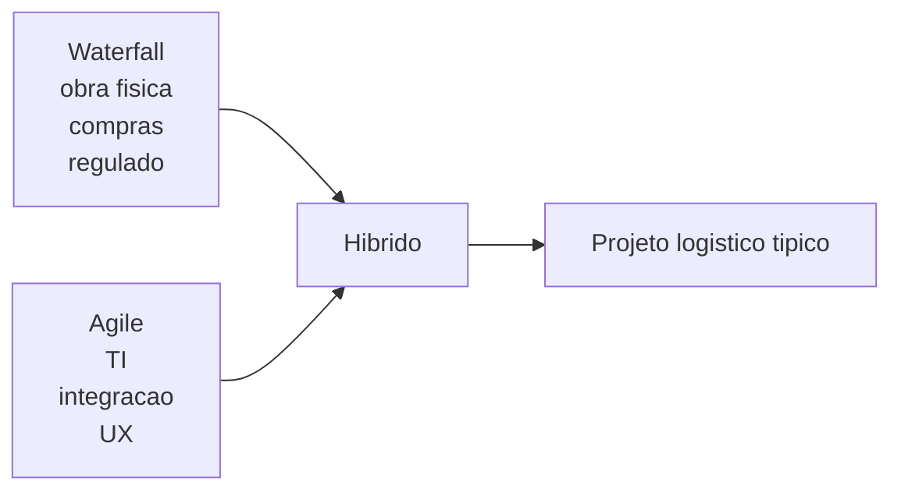
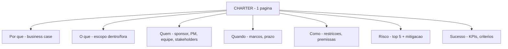
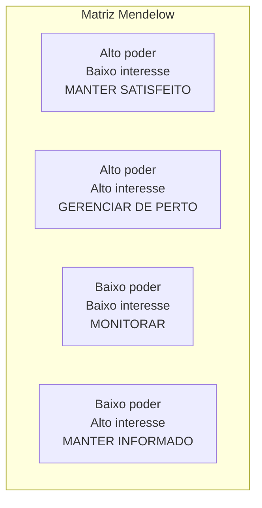

# *Charter*, stakeholders, RACI e WBS no CD — projeto é mudança com dono, não lista de desejos

**Projeto** (PMI, *PMBOK*) é esforço **temporário** com início e fim para entregar **mudança única** ou produto/serviço/resultado **único**: nova zona de picking, *go-live* de módulo WMS, reorganização de docas, *playbook* de pico, abertura de CD regional, integração TMS↔3PL. Diferente de **operação** (contínua, repetitiva), projeto **acaba** — e tem que **encerrar bem** (módulo 4.3).

O ***charter*** (TAP — termo de abertura) fixa **por quê**, **o quê**, **até quando**, **com quanto**, e **quem manda**; **stakeholders** mapeiam **interesses** e **influências** (Mendelow); **RACI** evita «**todos responsáveis = ninguém**»; **WBS** (*Work Breakdown Structure*) quebra o trabalho em pacotes **entregáveis** — em logística, muitas vezes por **fluxo físico** (zona, doca, sistema, dado), não só por fase de TI.

Esta aula entrega **template completo de charter**, **matriz de stakeholders Mendelow**, **RACI 5×5 da TechLar** e **WBS hierárquico de 3 níveis** com pacotes físicos.

---

## Objetivos e resultado de aprendizagem

**Ao final desta aula**, você será capaz de:

- Redigir **charter completo** (15 elementos PMI) com escopo, métricas, restrições, riscos top-5, marcos, *business case*.
- Mapear **stakeholders** com matriz **Mendelow** (poder × interesse) e definir estratégia de engajamento por quadrante.
- Construir **RACI** para projeto típico de CD com **regras de qualidade** (1 A por linha, sem A duplo, sem orfã).
- Construir **WBS** hierárquica em 3 níveis (entregável → pacote → atividade) com **pacotes físicos** ligados a marcos operacionais (doca, inventário, treino, sistema, dado).
- Diferenciar **estratégias de cut-over** (big bang, paralelo, escalonado, *strangler fig*).
- Aplicar **PRINCE2** (controle por exceção, *Tailoring*) e **híbrido waterfall+agile** quando faz sentido.

**Duração sugerida:** 90–120 minutos (com construção de RACI + WBS no mini-lab).
**Pré-requisitos:** literacia básica em gestão de projetos; recomenda-se módulo 3 desta trilha.

---

## Mapa do conteúdo

1. Gancho — projeto «nova zona» sem dono de estoque.
2. Conceito-núcleo: projeto vs. operação; PMBOK 7 vs. 6; PRINCE2; Agile/híbrido.
3. **Charter** com 15 elementos (template completo + exemplo TechLar).
4. **Stakeholders Mendelow** (poder × interesse) com 4 estratégias.
5. **RACI** — regras, anti-padrões, exemplo TechLar 5×5.
6. **WBS** hierárquica + dicionário WBS.
7. **Cidade gêmea / cut-over paralelo** e estratégias de virada.
8. Trade-offs, erros, KPIs, ferramentas, glossário.
9. Exercícios, gabarito, reflexão, referências, pontes.

---

## Gancho — o projeto «nova zona» sem dono de estoque

A **TechLar** aprovou projeto de **nova zona de picking automatizado** (capex R$ 4,8 mi, prazo 9 meses) para suportar Black Friday. TI e instalador (mecânica de pista) avançaram cronograma. Charter foi assinado, mas:

- **RACI** não atribuiu **A (Accountable)** explicitamente para **inventário** (movimentação de SKUs entre zonas) — virou «todos somos responsáveis».
- **WBS** tinha pacote «design», «obra», «integração WMS», «treino» — **mas não tinha pacote «congelamento de cadastro»** nem «conciliação inventário pré/pós».
- **Stakeholder** principal — gerente de inventário — apareceu na lista mas **sem estratégia de engajamento** (estava em «manter informado», deveria estar em «gerenciar de perto»).

**Resultado no go-live (semana antes da Black Friday):**
- Acurácia de inventário despencou de **99,1% para 84,7%** em 3 dias.
- Picking começou a errar 8% das linhas.
- OTIF caiu para **62%** por **3 semanas**; multas R$ 580k; cliente premium A1 saiu (ARR R$ 12 mi/ano).
- **2 meses** de operação parcial em zona antiga + nova.

Diagnóstico no pós-mortem: **WBS sem pacote físico de dados é projeto pela metade**; **RACI sem A explícito gera órfão no momento crítico**; **stakeholder mal classificado** = comunicação errada na hora errada.

> **Analogia da reforma de cozinha residencial:** trocar bancada e fogão sem **desligar gás e água** — obra «no prazo», casa **inabitável** por dois meses. Charter sem WBS físico é projeto que se esquece da infraestrutura.

> **Analogia do transplante de órgão:** equipe cirúrgica perfeita, mas sem **logística de órgão**, sem **paciente preparado**, sem **UTI no pós** — cirurgia «sucesso», paciente morre.

---

## Conceito-núcleo — projeto, operação, e os métodos

### Projeto vs. operação

| Atributo | Projeto | Operação |
|----------|---------|----------|
| Duração | temporária (início e fim) | contínua |
| Resultado | único | repetitivo |
| Recursos | dedicados, alocados | permanentes |
| Risco | alto (inovação) | controlado (rotina) |
| Governança | charter, sponsor, PM | hierarquia funcional |
| Encerramento | formal | inexistente |

### PMBOK 6.ª vs. 7.ª edição (PMI)

- **PMBOK 6** (2017): 49 processos, 5 grupos, 10 áreas de conhecimento — modelo prescritivo «processo».
- **PMBOK 7** (2021): **12 princípios** + **8 domínios de performance** — modelo orientado a **value delivery**, agnóstico de método (waterfall, agile, híbrido).

### PRINCE2 — alternativa britânica

7 princípios + 7 temas + 7 processos. Foco em **business case contínuo**, **controle por exceção** (escala só se sair de tolerância), **tailoring** (adaptar ao contexto). Forte em projetos governamentais e regulados.

### Agile / Scrum / Híbrido

- **Scrum** clássico: sprints de 1–4 semanas, *product owner*, *scrum master*, *backlog*.
- **Híbrido** (mais comum em logística): WBS waterfall para **obra física** + sprints agile para **TI/integração** + cut-over coordenado.
- **SAFe** para portfólio de projetos (ver módulo 3.3 — LPM).

> **Realidade BR:** projeto logístico **raramente é puro**. Obra de mezanino é waterfall (lead time, contrato fixo); customização WMS é agile (sprints com PO de operação). Híbrido é a norma.

---

## Charter — 15 elementos (template completo)

| # | Campo | Conteúdo | Exemplo TechLar |
|---|-------|----------|-----------------|
| 1 | **Título** | nome curto e único | «Nova zona picking auto — CD SP» |
| 2 | **Patrocinador (sponsor)** | nome, cargo | José Ferreira, Diretor Operações |
| 3 | **PM (Project Manager)** | nome | Maria Lima |
| 4 | **Propósito / business case** | problema, oportunidade, R$ | suportar Black Friday +40% volume; payback 22 meses |
| 5 | **Objetivos SMART** | específico, mensurável, prazo | reduzir lead time picking 35%; OTIF +5 p.p. |
| 6 | **Escopo (dentro)** | o que entrega | obra mecânica, integração WMS, treino, hipercare |
| 7 | **Escopo (fora)** | o que NÃO entrega | reforma de docas, novo TMS |
| 8 | **Premissas** | hipóteses assumidas | cadastro mestre íntegro pré-projeto |
| 9 | **Restrições** | tempo, custo, qualidade, regulatório | finalizar antes de 1.º nov; capex R$ 4,8 mi |
| 10 | **Marcos (milestones)** | datas-chave | M1 design (1 mês); M2 obra (5 mês); M3 cut-over (8 mês); M4 hipercare (9 mês) |
| 11 | **Riscos top-5** | identificados na abertura | atraso fornecedor rack; congelamento cadastro mal feito; pico Black Friday; treino insuficiente; integração WMS instável |
| 12 | **Stakeholders chave** | nomes, papéis | gerente CD, gerente inventário, TI, comercial, qualidade, fornecedor |
| 13 | **Equipe central** | nomes, FTE alocado | PM 100%, líder TI 50%, líder operacional 30%, especialistas |
| 14 | **Indicadores de sucesso** | quem mede e como | OTIF, lead time, acurácia, custo |
| 15 | **Critérios de aceitação** | quando é considerado entregue | OTIF estável ≥ 95% por 4 semanas pós cut-over |

### Diagrama do charter

> **Regra:** charter **cabe em 1–2 páginas**. Mais que isso, vira documento de planejamento (não charter). Charter é **contrato social** — assinado pelo sponsor e PM.

---

## Stakeholders — matriz Mendelow (poder × interesse)

Não basta listar stakeholders; é preciso **estratégia por quadrante**.

### Estratégia por quadrante

| Quadrante | Cadência | Canal | Conteúdo |
|-----------|----------|-------|----------|
| **Gerenciar de perto** (Q2) | semanal/diário | reunião 1:1, Obeya | dados, decisões, riscos |
| **Manter satisfeito** (Q1) | mensal | reunião executiva, dashboard | progresso, riscos críticos |
| **Manter informado** (Q4) | quinzenal | newsletter, mural, Teams | status, próximos marcos |
| **Monitorar** (Q3) | trimestral | relatório breve | mudanças significativas |

### Exemplo TechLar — projeto nova zona

| Stakeholder | Poder | Interesse | Quadrante | Estratégia |
|-------------|-------|-----------|------------|------------|
| Diretor Operações (sponsor) | Alto | Alto | Q2 | Daily standup; semanal Obeya |
| Gerente CD | Alto | Alto | Q2 | Daily; gemba walks |
| Gerente Inventário | Médio | Alto | Q2/Q4 | semanal — gap a corrigir após pós-mortem |
| CFO | Alto | Médio | Q1 | mensal dashboard + business case |
| Gerente TI | Alto | Alto | Q2 | semanal técnico |
| Cliente B2B premium | Alto | Médio | Q1 | mensal — comunicação de mudança de SLA |
| Fornecedor de rack | Médio | Alto | Q4 | semanal cronograma |
| RH (treino) | Baixo | Alto | Q4 | quinzenal — preparação treino |
| Comercial | Médio | Alto | Q2 | quinzenal — janela de promessa |
| Qualidade / SSMA | Baixo | Alto | Q4 | quinzenal — segurança e SOP |
| Auditoria interna | Baixo | Médio | Q3 | trimestral |

> **Erro comum TechLar:** Gerente Inventário foi posto em **Q4 (manter informado)** mas pertencia a **Q2 (gerenciar de perto)** — falha de classificação custou cara.

---

## RACI — regras de qualidade

### Definições (revisão)

- **R — Responsible** — quem **executa** a atividade. Pode haver vários.
- **A — Accountable** — quem **decide** e **responde** pelo resultado. **Apenas UM** por linha.
- **C — Consulted** — opinião **bidirecional** antes/durante. Pode haver vários.
- **I — Informed** — comunicação **unidirecional** após. Pode haver vários.

### 7 regras de qualidade do RACI

1. **Cada linha tem 1 e apenas 1 A.**
2. **Toda linha tem ao menos 1 R** (mesmo se A=R).
3. **Sem linhas órfãs** (sem A): atividade «de ninguém» é gargalo.
4. **Não confundir A com R**: A pode delegar execução (R), mas não responsabilidade.
5. **C bidirecional**: opinião que pode mudar a decisão.
6. **I unidirecional**: comunicação posterior.
7. **Validar com cada R/A**: gente concorda com sua atribuição?

### RACI exemplo TechLar — projeto nova zona (5×5)

| Atividade ↓ / Pessoa → | Gerente CD | TI Negócio | Planejamento | Comercial | Qualidade |
|------------------------|------------|------------|---------------|------------|------------|
| Preparar endereços e master data | C | A | R | I | C |
| Treinar equipe operacional | A | C | I | I | R |
| Cut-over WMS | C | A | C | I | I |
| Primeira semana operação (hipercare) | A | R | C | C | C |
| Comunicar clientes B2B | C | I | C | A | I |

### Verificação contra as regras

✅ Cada linha tem **1 A**.
✅ Cada linha tem ao menos **1 R**.
✅ Sem linhas sem A (sem órfão).
✅ TI **não é A** em «treinar equipe» (correto — RH/qualidade lidera).
✅ CD **não é A sozinho** em «endereços» (correto — master data é corporativo, A=TI Negócio com R=Planejamento).
⚠️ «Planejamento» é R em endereços mas não aparece no time central — adicionar ao charter.

---

## WBS — hierárquica em 3 níveis

### Princípios

1. **100% rule:** WBS contém **todo** o trabalho do projeto, e **só** o trabalho do projeto. Sem trabalho fora, sem trabalho extra.
2. **Decomposição por entregável** (nome substantivo: «zona instalada», «WMS configurado», «equipe treinada»), não por verbo.
3. **3–4 níveis** suficientes: nível 1 = projeto; nível 2 = entregáveis; nível 3 = pacotes; nível 4 (opcional) = atividades.
4. **Pacotes físicos** em logística (não só fases): doca, zona, inventário, sistema, dado, treino, comunicação.
5. **Dicionário WBS**: cada pacote tem ID, nome, descrição, dono, critério de aceitação, dependências.

### WBS exemplo TechLar (nova zona picking)

```mermaid
flowchart TB
  N1[1.0 Nova zona picking auto]
  N2A[1.1 Design e engenharia]
  N2B[1.2 Obra fisica]
  N2C[1.3 Sistema WMS]
  N2D[1.4 Master data e inventario]
  N2E[1.5 Treino e mudanca]
  N2F[1.6 Cut-over e hipercare]
  N2G[1.7 Encerramento]
  N1 --> N2A
  N1 --> N2B
  N1 --> N2C
  N1 --> N2D
  N1 --> N2E
  N1 --> N2F
  N1 --> N2G
  N2A --> P1A[1.1.1 Layout aprovado]
  N2A --> P1B[1.1.2 Spec mecanica]
  N2B --> P2A[1.2.1 Mezanino instalado]
  N2B --> P2B[1.2.2 Pista pickup]
  N2B --> P2C[1.2.3 Iluminacao e PEV]
  N2C --> P3A[1.3.1 Config WMS zona]
  N2C --> P3B[1.3.2 Integracao ERP]
  N2D --> P4A[1.4.1 Cadastro endereco]
  N2D --> P4B[1.4.2 Conciliacao inventario]
  N2D --> P4C[1.4.3 Congelamento]
  N2E --> P5A[1.5.1 Material treino]
  N2E --> P5B[1.5.2 Treino 3 turnos]
  N2F --> P6A[1.6.1 Smoke test]
  N2F --> P6B[1.6.2 Cut-over]
  N2F --> P6C[1.6.3 Hipercare 4 sem]
  N2G --> P7A[1.7.1 Aceite formal]
  N2G --> P7B[1.7.2 Licoes aprendidas]
```

### Dicionário WBS — exemplo de 3 pacotes

| ID | Nome | Descrição | Dono (R) | Critério de aceitação | Dependências |
|----|------|-----------|----------|------------------------|---------------|
| 1.4.1 | Cadastro endereço | criar 4 320 endereços novos no WMS | analista master data | 100% endereços validados em smoke test; FTR cadastro 99,5% | 1.1.1 layout aprovado |
| 1.4.2 | Conciliação inventário | mover SKU da zona antiga para nova | inventário + supervisor | divergência ≤0,5% em contagem cíclica pós-mudança | 1.2.1 mezanino + 1.4.1 cadastro |
| 1.6.2 | Cut-over | virada operacional zona antiga → nova | PM + gerente CD | sistema operacional na nova zona; OTIF ≥ 90% no D+1 | todos os anteriores |

> **Insight WBS BR:** o pacote **1.4.2 Conciliação inventário** é o que TechLar **esqueceu**. WBS sem pacote físico de **dado/inventário** = projeto pela metade.

---

## Cidade gêmea / cut-over paralelo — estratégias de virada

### 4 estratégias

| Estratégia | Como funciona | Risco | Quando usar |
|------------|----------------|-------|-------------|
| **Big bang** | switch num momento único; antigo desligado | alto | sistema simples, janela curta, dados estáveis |
| **Paralelo (cidade gêmea)** | antigo + novo simultâneo; comparar; migrar gradual | baixo | crítico; permite rollback fácil |
| **Escalonado (rollout faseado)** | piloto em 1 zona/cliente, depois ampliar | médio | sistema multissítio; aprende com piloto |
| **Strangler fig** | substituir módulo por módulo; legado morre lentamente | baixo | refactor lento; sistemas grandes legados |

### Cut-over paralelo — fluxo

> **Custo:** paralelo é **caro** (dupla operação) — dura 2–8 semanas. Mas evita risco existencial em projeto crítico (WMS, TMS).

---

## Aprofundamentos — variações setoriais

| Cenário | Particularidade gestão de projeto |
|---------|-----------------------------------|
| **CD greenfield** | WBS forte em obra civil, energia, instalação; cronograma 12–24 meses |
| **Brownfield (CD existente)** | WBS forte em **disrupção mínima**; janelas noturnas; WIP operacional |
| **Implementação WMS multissítio** | rollout escalonado (template + adaptação); 4–8 trimestres |
| **Integração TMS↔3PL** | foco em integração, EDI, contratos; fast-track 3–6 meses |
| **Automação (sorter, AS/RS)** | capex alto, lead time fornecedor 6–12 meses; WBS com FAT/SAT |
| **Black Friday / pico** | projeto em 90 dias; risco extremo se atrasa |
| **Farma / GxP** | validação CSV, IQ/OQ/PQ obrigatória; cronograma triplica |
| **3PL — abertura de cliente** | onboarding 30–60 dias; risco contratual alto |

---

## Trade-offs e decisão

| Trade-off | Lado A | Lado B |
|-----------|--------|--------|
| Charter detalhado | governança, alinhamento | demora, burocracia |
| Charter enxuto | velocidade | risco escopo crescer |
| RACI rígido | clareza | inflexibilidade |
| Sem RACI | flexibilidade | conflito, gargalo |
| WBS detalhado | controle | esforço de manutenção |
| WBS leve | velocidade | risco de pacote esquecido |
| Cut-over big bang | velocidade | risco alto |
| Cut-over paralelo | segurança | custo dupla operação |
| PM dedicado | foco | custo |
| PM em paralelo | flexível | sobrecarga |

---

## Caso prático / Mini-laboratório — RACI 5×5 para «nova zona de picking»

### Tarefa

Construa **RACI 5×5** completo: linhas = atividades; colunas = papéis.

**Linhas (5):**
1. Preparar endereços e master data
2. Treinar equipe (3 turnos)
3. Cut-over WMS
4. Primeira semana operação (hipercare)
5. Comunicar clientes B2B

**Colunas (5):**
- Gerente CD, TI Negócio, Planejamento, Comercial, Qualidade

### Critérios de validação do gabarito

- ✅ **1 A por linha**: TI não pode ser A em «treinar equipe» (RH/qualidade lidera).
- ✅ **CD não pode ser A sozinho em «endereços»** se master data é corporativo (TI Negócio é A, Planejamento R, CD C).
- ✅ Cliente B2B (comercial é A) — não é responsabilidade isolada do CD.

| Atividade | Gerente CD | TI Negócio | Planejamento | Comercial | Qualidade |
|-----------|------------|------------|---------------|------------|------------|
| 1. Preparar endereços + master data | C | **A** | R | I | C |
| 2. Treinar equipe | A* | C | I | I | R |
| 3. Cut-over WMS | C | **A** | C | I | I |
| 4. Hipercare semana 1 | **A** | R | C | C | C |
| 5. Comunicar clientes B2B | C | I | C | **A** | I |

*Atividade 2: Gerente CD é A pelo resultado «equipe treinada e operando bem»; Qualidade R porque executa o treino formal.

---

## Erros comuns e armadilhas

1. **Escopo crente** sem *change control* — projeto cresce 40% sem revisão.
2. **RACI com vários A** ou **nenhum A** — gargalo ou órfão.
3. **WBS só «fase 1 design»** sem **pacote físico** (dado, inventário, treino).
4. **Ignorar inventário e congelamento** no cut-over — caso TechLar.
5. **Charter genérico** copiado de outro projeto.
6. **Stakeholders mal classificados** Mendelow — comunicação errada na hora errada.
7. **Cronograma sem buffer** (módulo 4.2) — atraso em 1 atividade derruba tudo.
8. **PM sem autoridade** — só «coordena» reuniões.
9. **Sponsor que assina e some** (módulo 3.1).
10. **Cut-over sem rollback** — risco existencial.
11. **Treino só na véspera** — equipe não absorve.
12. **Esquecer comunicação com cliente B2B** — promessa quebrada.
13. **WBS por atividade (verbo)** em vez de entregável (substantivo) — dificulta aceitação.
14. **Dicionário WBS inexistente** — pacotes interpretados diferentemente.

---

## Comportamento e cultura

- **Charter assinado** em cerimónia (não por email) — sponsor + PM presentes, equipe convidada.
- **RACI revisado** trimestralmente — papéis mudam.
- **Stakeholders re-mapeados** após eventos significativos (promoção, mudança organizacional).
- **PM no gemba** semanalmente — não só em sala de reunião.
- **Equipe celebra marcos** (M1, M2…) — energia para próximo.
- **Lições registradas** em **cada marco**, não só no encerramento.
- **Cliente interno** (próximo elo) convidado para revisão de marco — alinha expectativa.

---

## KPIs de melhoria

| KPI | Pergunta | Dono | Fonte | Cadência | Playbook |
|-----|----------|------|-------|----------|----------|
| Marcos no prazo (*milestone burn*) | cronograma OK? | PM | MS Project / Jira | semanal | revisão crítica de risco |
| Variação de escopo (n. mudanças formais) | escopo controlado? | PM + sponsor | base | mensal | reforçar change control |
| Preparação de dados (% endereços validados pré go-live) | qualidade técnica | TI + dados | sistema | semanal | bloqueio se <100% pré cut-over |
| % entregáveis aceitos no D+0 | qualidade entrega | sponsor | aceite formal | por entregável | RCA se fora |
| Aderência RACI (atividades sem A) | governança ativa? | PMO | revisão RACI | mensal | redistribuir |
| Stakeholder engagement score | engajamento | PM | survey | mensal | reclassificar quadrante |
| Risk burn (riscos abertos vs. mitigados) | risco controlado? | PM + risk owner | matriz risco | semanal | escalar top 3 |

---

## Tecnologias e ferramentas

| Categoria | Ferramenta |
|-----------|------------|
| **Cronograma / WBS** | MS Project, **Smartsheet**, **Jira Advanced Roadmaps**, Asana, ClickUp, Monday |
| **Charter** | template PMI/PMBOK, Confluence, Notion, SharePoint |
| **Stakeholders** | Excel template, Stakeholder Map app, Lucidchart |
| **RACI** | Excel/Sheets template, **RACI Matrix Generator**, Confluence |
| **Risco** | Risk Register Excel, **Risk Register**, Jira Risk plugin |
| **Comunicação** | Teams, Slack, Confluence, newsletter |
| **Gestão de mudança** | Prosci toolkit, Workday, Cornerstone |
| **Documentação** | Confluence, SharePoint, Notion |
| **EVM (módulo 4.3)** | MS Project, Primavera, Smartsheet |
| **Agile** | Jira, Azure DevOps, Trello |
| **Híbrido** | Smartsheet (waterfall + agile), Jira Align, ClickUp |

---

## Glossário rápido

- **Charter / TAP** — termo de abertura.
- **Stakeholder** — parte interessada.
- **Mendelow Matrix** — poder × interesse.
- **RACI** — responsible / accountable / consulted / informed.
- **WBS** — *work breakdown structure*.
- **WP** — *work package*; pacote de trabalho.
- **Dicionário WBS** — descrição detalhada de cada WP.
- **Marco / milestone** — ponto significativo do cronograma.
- **Cut-over / hypercare** — virada / suporte intensivo.
- **PMBOK** — *Project Management Body of Knowledge* (PMI).
- **PRINCE2** — *PRojects IN Controlled Environments* (UK).
- **Tailoring** — adaptar método ao contexto (PRINCE2/PMI 7).
- **Strangler fig** — substituição gradual de legado.

---

## Aplicação — exercícios

### Exercício 1 — charter mínimo (20 min)

Escreva charter de **1 página** para projeto «**implementar e-Kanban entre fornecedor e CD**» (capex R$ 180k, 4 meses). Inclua os **15 elementos**.

**Gabarito esperado:** business case (R$ economizado em ruptura/excesso), escopo dentro/fora claro (3 SKUs piloto), marcos M1–M4 mensais, riscos top 5 (aceitação fornecedor, cadastro mestre, treino, integração API, BC do fornecedor).

### Exercício 2 — Mendelow (15 min)

Liste **8 stakeholders** do projeto «nova zona picking TechLar» e classifique no quadrante Mendelow. Defina 1 ação para cada quadrante.

**Gabarito sugerido:**
- Q2: sponsor, gerente CD, TI Negócio, gerente inventário (ação: Obeya semanal).
- Q1: CFO, cliente B2B premium (ação: dashboard mensal).
- Q4: RH, fornecedor de rack, qualidade (ação: newsletter quinzenal).
- Q3: auditoria interna (ação: relatório trimestral).

### Exercício 3 — RACI (15 min)

Construa RACI 5×5 (5 atividades, 5 papéis) para projeto «**substituir TMS legado por novo TMS cloud**».

**Gabarito esperado:** atividades = inventário de rotas, configuração TMS, integração ERP, treino motoristas, cut-over. Papéis = gerente transporte, TI, supply, contábil, PM. Cada linha 1 A. Treino motoristas: A=gerente transporte, R=RH/treino, C=motoristas chefes.

### Exercício 4 — WBS (20 min)

Construa **WBS de 3 níveis** (8 pacotes mín.) para projeto «**abrir doca de expedição expansão (4 berços novos)**».

**Gabarito esperado pacotes nível 2:** 1.1 design, 1.2 obra civil, 1.3 sistema TMS, 1.4 cadastro slot, 1.5 treino, 1.6 cut-over, 1.7 hipercare, 1.8 encerramento. Cada um com 2–3 sub-pacotes nível 3.

---

## Pergunta de reflexão

**Qual pacote do seu projeto favorito sempre fica sem dono?** Se você fosse PM amanhã, qual seria o **primeiro RACI** que reescreveria — e quem precisaria assinar?

---

## Fechamento — três takeaways

1. **Charter é contrato social do projeto** — curto, assinado, vivo.
2. **RACI é antialérgico a reunião circular** — 1 A por linha, sem órfão.
3. **WBS em CD sem pacote de estoque/endereço/dado é fantasia** — pacote físico ≠ pacote de TI.

---

## Referências

1. Project Management Institute. *A Guide to the Project Management Body of Knowledge (PMBOK Guide)* — 6.ª e 7.ª edições.
2. Project Management Institute. *Standard for Program Management*.
3. Office of Government Commerce (UK). *Managing Successful Projects with PRINCE2*.
4. KERZNER, H. *Project Management: A Systems Approach to Planning, Scheduling, and Controlling*. Wiley.
5. MENDELOW, A. *Stakeholder Mapping*. Proceedings of the 2nd International Conference on Information Systems.
6. SMITH, P. *Project Sponsorship*. Routledge.
7. APM (Association for Project Management) — *Body of Knowledge*.
8. **AXELOS** — PRINCE2 official: <https://www.axelos.com/>
9. PMI Brasil — capítulos regionais e PMI-RJ/SP/BSB: <https://brasil.pmi.org/>
10. ABEPRO — anais sobre PM em logística BR.

---

## Pontes para outras trilhas

- [Master Data — Tecnologia](../../trilha-tecnologia-e-sistemas/modulo-01-master-data-para-logistica/aula-01-master-data-na-cadeia.md): cadastro como pacote WBS.
- [WMS — ondas e expedição — Tecnologia](../../trilha-tecnologia-e-sistemas/modulo-03-wms/aula-03-onda-picking-expedicao.md): integração WMS no cut-over.
- [S&OP — Fundamentos](../../trilha-fundamentos-e-estrategia/modulo-03-planejamento-demanda-sop/aula-03-sop-processo-alinhamento.md): janela de projeto vs. ciclo de planeamento.
- [PDCA, gemba, sponsor](../modulo-03-continuous-improvement/aula-01-pdca-gemba-sponsor.md): sponsor commitment grid.
- **Próxima aula desta trilha:** [Tempo, caminho crítico e buffer](aula-02-caminho-critico-buffer-riscos.md).
