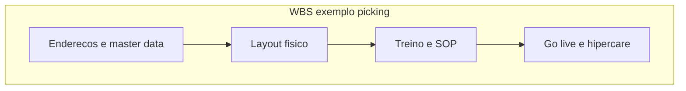

# *Charter*, stakeholders, RACI e WBS no CD — projeto é mudança com dono, não lista de desejos

**Projeto** (nesta trilha) é esforço **temporário** para entregar **mudança única**: nova zona de picking, *go-live* de módulo WMS, reorganização de docas, *playbook* de pico. O ***charter*** fixa **por quê**, **o quê**, **até quando** e **quem manda**; **RACI** evita «**todos** responsáveis = ninguém»; **WBS** (*Work Breakdown Structure*) quebra o trabalho em pacotes **entregáveis** — em logística, muitas vezes por **fluxo físico**, não só por fase de TI.

---

## Objetivos e resultado de aprendizagem

**Ao final desta aula**, você será capaz de:

- Redigir um **mini-charter** com escopo, métricas e riscos iniciais.  
- Montar **RACI** para projeto típico de CD (recebimento, armazém, TI, comercial).  
- Construir **WBS** com pacotes ligados a **marcos** operacionais (doca, inventário, treino).  
- Explicar **cidade gêmea** ou operação paralela como estratégia de *cut-over*.

**Duração sugerida:** 60–90 minutos.

---

## Gancho — o projeto «nova zona» sem dono de estoque

A **TechLar** aprovou projeto de **nova zona de picking**; TI e instalador avançaram; **ninguém** ficou **accountable** no RACI pelo **inventário** e pelo **congelamento** de endereços. No *go-live*, **acurácia** colapsou por **dois** meses. **WBS** sem **pacote físico** de dados é **projeto pela metade**.

**Analogia da reforma:** trocar cozinha sem desligar gás e água — obra «no prazo», casa inabitável.

---

## Mapa do conteúdo

- *Charter* (elementos mínimos).  
- Stakeholders e matriz RACI.  
- WBS por entregável e por fluxo.  
- Ponte a master data e WMS.

---

## *Charter* — esqueleto

| Campo | Conteúdo |
|-------|----------|
| Propósito | problema de negócio |
| Objetivos | mensuráveis (OTIF, lead time, acurácia) |
| Escopo | **dentro** e **fora** |
| Restrições | doca, pico, orçamento, regulatório |
| Sponsor e PM | nomes |
| Riscos iniciais | top 5 |
| Marcos | datas de decisão |

---

## RACI

- **R** *Responsible* — executa.  
- **A** *Accountable* — **um** por tarefa (decisão final).  
- **C** *Consulted* — opinião bidirecional.  
- **I** *Informed* — comunicação unidirecional.

**Legenda:** cada pacote deve ter **R** e **A** explícitos no RACI detalhado (tabela fora do diagrama).

---

## Aplicação — exercício

Monte **RACI** (tabela 5×5) para projeto «**nova zona de picking**»: linhas = preparar endereços, treinar equipe, *cut-over* WMS, primeira semana operação, comunicar clientes B2B; colunas = gerente CD, TI negócio, planejamento, comercial, qualidade.

**Gabarito pedagógico:** **um A** por linha; TI não pode ser A em «treinar equipe»; CD não pode ser A sozinho em «endereços» se master data é corporativo.

---

## Erros comuns e armadilhas

- Escopo **crente** sem *change control*.  
- RACI com **vários A** ou **nenhum A**.  
- WBS só «**fase 1 design**» sem **pacote físico**.  
- Ignorar **inventário** e **congelamento** no *cut-over*.

---

## KPIs e decisão

- **Marcos** no prazo (*milestone burn*).  
- **Variação de escopo** (nº de mudanças formais).  
- **Preparação** de dados (% endereços validados pré *go-live*).

---

## Fechamento — três takeaways

1. *Charter* é **contrato social** do projeto — curto e assinado.  
2. RACI é **antialérgico** a reunião circular.  
3. WBS em CD sem **estoque/endereço** é **fantasia**.

**Pergunta de reflexão:** qual pacote do seu projeto favorito **sempre** fica sem dono?

---

## Referências

1. Project Management Institute. *A Guide to the Project Management Body of Knowledge (PMBOK Guide)* — conceitos de escopo e stakeholders (edição vigente da PMI).  
2. [Master Data — Tecnologia](../../trilha-tecnologia-e-sistemas/modulo-01-master-data-para-logistica/aula-01-master-data-na-cadeia.md)  
3. [WMS — ondas](../../trilha-tecnologia-e-sistemas/modulo-03-wms/aula-03-onda-picking-expedicao.md)
