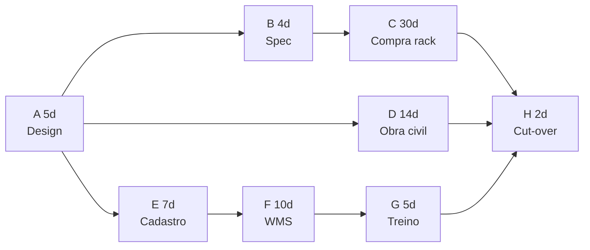
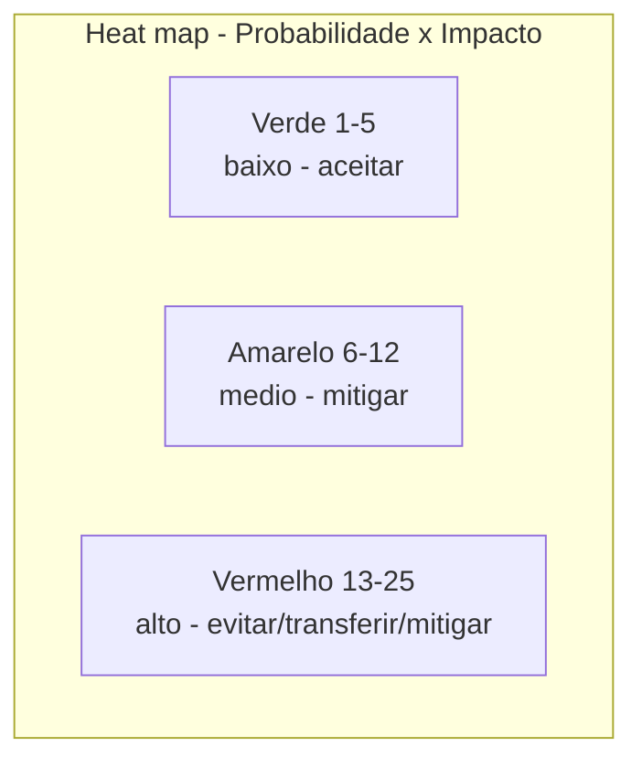
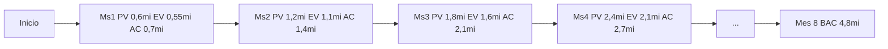
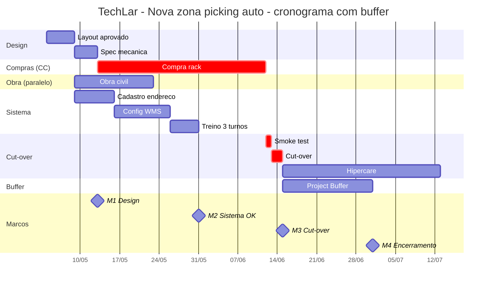

# Tempo, caminho crítico e *buffer* de projeto — calendário que respeita pico, doca e turno

Projetos logísticos **compartilham recursos** com a operação: **mesma doca**, **mesma equipe**, **mesmo sistema, mesma rede**. **Caminho crítico** (CPM — *Critical Path Method*) é a sequência de atividades **mais longa** que **determina** a duração mínima do projeto — atraso em qualquer atividade do caminho crítico atrasa **todo** o projeto. ***Buffer*** (contingência de tempo ou recurso, conceito da **Critical Chain** de Goldratt) absorve **incerteza** sem **esconder** a verdade no cronograma «otimista demais».

Esta aula entrega **CPM com cálculo passo a passo** (forward/backward pass, folga, identificação do caminho), **CCPM** (*Critical Chain Project Management*) com **buffers** (project, feeding, resource), **EVM** (*Earned Value Management*) com cálculo de SPI/CPI/SV/CV/EAC, **matriz de risco PMI** com pontuação probabilidade × impacto, **Monte Carlo lite** para simulação, e **gantt** Mermaid completo da TechLar.

Fica em nível **gestor maduro**, complementar a software (MS Project, Primavera, Smartsheet, Jira) e a certificação **PMI-SP** (*Scheduling Professional*) ou **PMI-RMP** (*Risk Management Professional*) — sem substituí-los.

---

## Objetivos e resultado de aprendizagem

**Ao final desta aula**, você será capaz de:

- Construir **rede de precedências** (PERT/CPM) e calcular **forward/backward pass**, **folgas (slack)** e **caminho crítico** num exemplo de 8 atividades.
- Diferenciar **PERT** (3 estimativas: O, M, P) de **CPM** (estimativa única) e calcular **TE** = (O + 4M + P)/6.
- Aplicar **CCPM** (Goldratt): identificar **buffer de projeto**, **feeding buffer**, **resource buffer** e tamanho recomendado (~50% do CC).
- Construir **matriz de risco** com pontuação P × I e definir **estratégias de resposta** (evitar, transferir, mitigar, aceitar).
- Calcular **EVM** (PV, EV, AC, SV, CV, SPI, CPI, EAC, ETC, VAC) num cenário logístico.
- Esboçar **gantt** com marcos, dependências e buffers explícitos.
- Identificar **riscos típicos** logísticos (Black Friday, greve, atraso de fornecedor, integração) e plano de mitigação.

**Duração sugerida:** 90–120 minutos.
**Pré-requisitos:** [Aula 4.1 (charter, RACI, WBS)](aula-01-charter-raci-wbs.md); literacia básica em Excel.

---

## Mapa do conteúdo

1. Gancho — go-live na semana errada.
2. Rede de precedências, PERT, CPM (cálculo passo a passo).
3. CCPM (Goldratt) — buffers e cadeia crítica.
4. **Matriz de risco PMI** — P × I, estratégias de resposta.
5. **EVM** completo — PV, EV, AC, SPI, CPI, EAC.
6. Monte Carlo lite — simulação de cronograma com 3 estimativas.
7. Gantt Mermaid — TechLar.
8. Trade-offs, erros, KPIs, ferramentas, glossário.
9. Exercícios, gabarito, reflexão, referências, pontes.

---

## Gancho — o *go-live* na semana errada

A **TechLar** fixou *go-live* de WMS em **6 de novembro de 2025** — mesma semana da **promoção pré-Black Friday** (volume +60%). Sponsor argumentou: «**queremos fechar o trimestre com o ganho de produtividade no número».** Caminho crítico foi **comprimido** (CPM previa 12 sem; cronograma «forçado» 9 sem); cronograma sem **buffer** explícito; *padding* escondido em cada tarefa («folga de 1 dia aqui, 2 dias ali») para «proteger» o gerente.

**Resultado:**
- Caminho crítico **estourou** em 6 dias (atraso fornecedor de servidor + bug integração).
- Operação voltou parcialmente para processo paralelo (manual) por 11 dias.
- **OTIF** caiu de 89% para **63%** durante 2 semanas.
- 3 grandes clientes B2B abriram chamados de qualidade; 1 saiu (R$ 8 mi ARR).
- **Custo total da decisão**: R$ 1,4 mi em multas + redirecionamento + perda de cliente. **Buffer político** (mover para fevereiro) teria custado **R$ 0**.

> **Analogia da estrada:** programar **obra de pavimentação na BR-101** em **feriado de 7 de setembro** com previsão de chuva — engenharia perfeita, decisão suicida. Cronograma é **engenharia × calendário do mundo real**.

> **Analogia do casamento:** marcar **6 de janeiro** (resaca pós-festas, gente viajando, fornecedor em férias) — pode dar certo, mas custa o dobro e o estresse triplo. Janela importa.

---

## Rede de precedências, PERT, CPM — passo a passo

### Tipos de relação de precedência

| Sigla | Nome | Significado |
|-------|------|-------------|
| **FS** | *Finish-to-Start* | B começa quando A termina (mais comum) |
| **SS** | *Start-to-Start* | B começa quando A começa |
| **FF** | *Finish-to-Finish* | B termina quando A termina |
| **SF** | *Start-to-Finish* | B termina quando A começa (raro) |

### Diferença PERT vs. CPM

- **CPM** (Kelley & Walker, 1957): estimativa **única** por atividade; usado quando duração é conhecida.
- **PERT** (Marinha EUA, 1958): **3 estimativas** (Otimista, Mais provável, Pessimista); útil em projetos novos/inovadores.

\[
\text{TE (PERT)} = \frac{O + 4M + P}{6}, \quad \sigma = \frac{P - O}{6}
\]

### Exemplo CPM — projeto TechLar (8 atividades)

| ID | Atividade | Duração (dias) | Predecessores |
|----|-----------|----------------|----------------|
| A | Design layout | 5 | — |
| B | Spec mecânica | 4 | A |
| C | Compra rack | 30 | B |
| D | Obra civil | 14 | A |
| E | Cadastro endereço | 7 | A |
| F | Config WMS | 10 | E |
| G | Treino equipe | 5 | F |
| H | Cut-over | 2 | C, D, G |

### Forward pass (ES, EF — *Early Start, Early Finish*)

\[
EF = ES + \text{Duração}, \quad ES_j = \max(EF_i \text{ dos predecessores})
\]

| ID | ES | EF |
|----|----|----|
| A | 0 | 5 |
| B | 5 | 9 |
| C | 9 | 39 |
| D | 5 | 19 |
| E | 5 | 12 |
| F | 12 | 22 |
| G | 22 | 27 |
| H | max(EF C=39, D=19, G=27) = 39 | 41 |

**Duração mínima do projeto = 41 dias.**

### Backward pass (LS, LF — *Late Start, Late Finish*)

\[
LS = LF - \text{Duração}, \quad LF_i = \min(LS_j \text{ dos sucessores}), \quad LF_{último} = EF_{último}
\]

| ID | LF | LS |
|----|----|----|
| H | 41 | 39 |
| G | 39 | 34 |
| F | 34 | 24 |
| E | 24 | 17 |
| C | 39 | 9 |
| D | 39 | 25 |
| B | 9 | 5 |
| A | min(LS B=5, D=25, E=17) = 5 | 0 |

### Folga (Total Slack = LS − ES = LF − EF)

| ID | Folga (dias) | No CC? |
|----|---------------|--------|
| A | 0 | **SIM** |
| B | 0 | **SIM** |
| C | 0 | **SIM** |
| D | 20 | não |
| E | 12 | não |
| F | 12 | não |
| G | 12 | não |
| H | 0 | **SIM** |

### Caminho crítico

**A → B → C → H** com duração total **5+4+30+2 = 41 dias**.

> **Insight:** D, E, F, G têm folgas significativas — atrasar até 12–20 dias **não atrasa o projeto**. Mas **A, B, C, H** não toleram **um único dia** de atraso. A compra de rack (**C**) com 30 dias é o **risco maior** — fornecedor único? subcontratar? *expedite* (frete aéreo)?

### Diagrama da rede

> **Legenda:** caminho crítico **A-B-C-H** (cinza ou vermelho). Demais caminhos têm folga.

---

## CCPM — Critical Chain Project Management (Goldratt)

### Diferença vs. CPM

| Critério | CPM | CCPM (Critical Chain) |
|----------|-----|------------------------|
| Foco | precedência | precedência **+ recurso** |
| *Padding* | escondido em cada tarefa | **agregado** em buffers visíveis |
| Buffer | implícito | **explícito** (project, feeding, resource) |
| Estimativas | conservadoras | **agressivas** (sem padding) + buffer |
| Multitarefa | aceita | **proíbe** (single-task focused) |

### Tipos de buffer

| Buffer | Posição | Tamanho típico |
|--------|---------|----------------|
| **Project Buffer (PB)** | fim da cadeia crítica | 50% do CC |
| **Feeding Buffer (FB)** | onde caminho não-crítico se junta ao CC | 50% do caminho não-crítico |
| **Resource Buffer (RB)** | alerta antes de recurso crítico ser necessário | tempo de aviso |

### Exemplo aplicado a TechLar

**Cadeia crítica original (CPM):** 41 dias.

Comprimir estimativas removendo padding:
- A 4d (era 5)
- B 3d (era 4)
- C 24d (era 30, sem padding)
- H 1,5d (era 2)
- **Cadeia crítica «pura»:** 32,5 dias.

**Buffer de projeto:** 50% × 32,5 = **16,25 dias**.

**Cronograma CCPM total:** 32,5 + 16,25 = **48,75 dias** (vs. 41 do CPM).

> **Aparente paradoxo:** CCPM dá **mais** dias totais — mas distribuídos como **buffer visível** que sponsor vê e protege. CPM com padding escondido vira **brigas locais** e atrasos misteriosos.

### Diagrama buffer visível

---

## Matriz de risco PMI — probabilidade × impacto

### Pontuação 1–5 (ou 1–10)

| Categoria | 1 | 3 | 5 |
|-----------|---|---|---|
| **Probabilidade** | <10% | 30%–70% | >90% |
| **Impacto custo** | <1% capex | 5–15% | >25% |
| **Impacto prazo** | <1 sem | 2–4 sem | >2 meses |
| **Impacto serviço** | sem efeito | OTIF -2 a -5 p.p. | OTIF -10 p.p.+ |

\[
\text{Score risco} = P \times I
\]

### Estratégias de resposta (PMI)

| Estratégia | Quando usar | Exemplo |
|------------|--------------|---------|
| **Evitar** | risco alto e crítico | mudar fornecedor; redesenhar |
| **Transferir** | risco financeiro | seguro; cláusula contratual de multa |
| **Mitigar** | reduzir P ou I | duplicar fornecedor; treinar mais cedo |
| **Aceitar (passivo)** | risco baixo, custo de mitigação alto | apenas monitorar |
| **Aceitar (ativo)** | risco médio | reservar contingência (R$ ou tempo) |
| **Explorar/Realçar** | oportunidade positiva | aproveitar feriado para cut-over |

### Risk register — TechLar projeto nova zona

| # | Risco | P | I | Score | Estratégia | Plano | Dono |
|---|-------|---|---|-------|------------|-------|------|
| R1 | Atraso fornecedor rack (lead time 30d) | 4 | 5 | **20** | mitigar + transferir | 2 fornecedores; cláusula multa; expedite frete aéreo | Suprimentos |
| R2 | Cadastro endereço errado pré cut-over | 3 | 5 | **15** | mitigar | smoke test 100% endereços; congelamento 48h pré | TI Negócio |
| R3 | Pico Black Friday durante hipercare | 5 | 4 | **20** | evitar | mover go-live para fev (NÃO foi aceito — TechLar pagou caro) | Sponsor |
| R4 | Treino insuficiente turno noturno | 4 | 3 | 12 | mitigar | 3 sessões dedicadas + simulação 2 sem antes | RH + Qualidade |
| R5 | Bug integração WMS↔ERP | 4 | 5 | **20** | mitigar | parallel run 2 sem; plano rollback; plantão TI 24×7 | TI Negócio |
| R6 | Greve transporte SP | 2 | 3 | 6 | aceitar | monitorar sindicato; SLA flexível |  Logística |
| R7 | Acidente PEV nova zona | 2 | 5 | 10 | mitigar | treino segurança; sinalização; auditoria SSMA | SSMA |

> **Top 3 (score ≥ 15):** R1, R3, R5 — atenção semanal do sponsor. R3 foi o que **explodiu**.

### Mapa de calor (heat map)

---

## EVM — Earned Value Management (cálculo passo a passo)

### Métricas básicas

| Sigla | Nome | Significado |
|-------|------|-------------|
| **PV** | Planned Value (Budgeted Cost of Work Scheduled) | quanto deveria estar gasto até agora |
| **EV** | Earned Value (Budgeted Cost of Work Performed) | quanto vale o trabalho **feito** até agora |
| **AC** | Actual Cost (Actual Cost of Work Performed) | quanto **foi gasto** até agora |
| **BAC** | Budget at Completion | orçamento total |

### Variâncias

\[
\text{SV (Schedule Variance)} = EV - PV
\]
\[
\text{CV (Cost Variance)} = EV - AC
\]

### Índices

\[
\text{SPI (Schedule Performance Index)} = \frac{EV}{PV}
\]
\[
\text{CPI (Cost Performance Index)} = \frac{EV}{AC}
\]

| SPI | Interpretação |
|-----|----------------|
| > 1,0 | adiantado |
| = 1,0 | no prazo |
| < 1,0 | atrasado |

| CPI | Interpretação |
|-----|----------------|
| > 1,0 | abaixo do orçamento |
| = 1,0 | no orçamento |
| < 1,0 | acima do orçamento |

### Projeções

\[
\text{EAC (Estimate at Completion)} = \frac{BAC}{CPI}
\]
\[
\text{ETC (Estimate to Complete)} = EAC - AC
\]
\[
\text{VAC (Variance at Completion)} = BAC - EAC
\]
\[
\text{TCPI} = \frac{BAC - EV}{BAC - AC} \quad (\text{eficiência necessária para terminar no orçamento})
\]

### Exemplo TechLar — projeto nova zona, mês 4 (de 8 planejados)

- BAC = R$ 4 800 000
- PV (até mês 4) = R$ 2 400 000 (50% do tempo)
- EV (trabalho feito até mês 4, valorado pelo orçamento) = R$ 2 100 000
- AC (gasto real até mês 4) = R$ 2 700 000

**Cálculos:**

\[
SV = 2\,100 - 2\,400 = -300 \text{ k} \quad (\text{atrasado em R\$ 300k})
\]
\[
CV = 2\,100 - 2\,700 = -600 \text{ k} \quad (\text{R\$ 600k acima do orçamento})
\]
\[
SPI = 2\,100 / 2\,400 = 0{,}875 \quad (\text{12,5% atrasado})
\]
\[
CPI = 2\,100 / 2\,700 = 0{,}778 \quad (\text{22% acima do orçamento})
\]
\[
EAC = 4\,800 / 0{,}778 = R\$ 6\,170 \text{ k} \quad (\text{estimado de fim})
\]
\[
ETC = 6\,170 - 2\,700 = R\$ 3\,470 \text{ k} \quad (\text{ainda a gastar})
\]
\[
VAC = 4\,800 - 6\,170 = -1\,370 \text{ k} \quad (\text{R\$ 1,37 mi acima do plano})
\]
\[
TCPI = (4\,800 - 2\,100) / (4\,800 - 2\,700) = 2\,700 / 2\,100 = 1{,}29
\]

**Interpretação:**
- Projeto **atrasado** (SPI = 0,875) e **caro** (CPI = 0,778).
- Para terminar no orçamento original, precisa atingir **CPI = 1,29** no restante (eficiência **alta** difícil) — sponsor deve **reaprovar budget** ou **cortar escopo**.
- **EAC R$ 6,17 mi** vs. BAC R$ 4,8 mi = +28% — sinal vermelho.

### Diagrama curva S de EVM

---

## Monte Carlo lite — simular cronograma

Use 3 estimativas (O, M, P) para cada atividade do caminho crítico. Em vez de uma estimativa única, simule **1 000 cronogramas** com Excel/Python amostrando triangulares ou betas. Saídas:

- **P50, P80, P95** da duração total.
- **Sensibilidade** (qual atividade contribui mais para variância).

### Exemplo manual (sem software) — TechLar CC = A-B-C-H

| Atividade | O | M | P | TE PERT | σ |
|-----------|---|---|---|---------|---|
| A | 4 | 5 | 8 | (4+20+8)/6 = 5,33 | (8-4)/6 = 0,67 |
| B | 3 | 4 | 7 | (3+16+7)/6 = 4,33 | 0,67 |
| C | 25 | 30 | 45 | (25+120+45)/6 = 31,67 | 3,33 |
| H | 1 | 2 | 4 | (1+8+4)/6 = 2,17 | 0,5 |

\[
TE_{total} = 5{,}33 + 4{,}33 + 31{,}67 + 2{,}17 = 43{,}5 \text{ dias}
\]

\[
\sigma_{total} = \sqrt{0{,}67^2 + 0{,}67^2 + 3{,}33^2 + 0{,}5^2} = \sqrt{0{,}449 + 0{,}449 + 11{,}089 + 0{,}25} = \sqrt{12{,}24} = 3{,}5 \text{ dias}
\]

**P50:** 43,5 dias (média).
**P80:** 43,5 + 0,84·3,5 ≈ **46,4 dias**.
**P95:** 43,5 + 1,645·3,5 ≈ **49,3 dias**.

> **Insight:** **C (compra rack)** é responsável por **>90% da variância** — atacar lá: 2 fornecedores, expedite, contrato com cláusula.

---

## Gantt — TechLar projeto nova zona

> **Legenda:** atividades **críticas** marcadas (em vermelho no render). **Project Buffer** explícito antes de marco final M4. Hipercare e buffer rodam em paralelo (hipercare é operacional; buffer é segurança de prazo).

---

## Aprofundamentos — variações setoriais

| Cenário | Particularidade cronograma |
|---------|----------------------------|
| **Black Friday / pico** | janelas indisponíveis 90 dias antes; cut-over deve ser >60 dias antes ou após |
| **Operação 24/7** | cronograma com janelas noturnas, finais de semana; risco fadiga |
| **Operação sazonal (agro)** | projeto na entressafra (jan–jul); sazonalidade dura janelas curtas |
| **Multissítio** | rollout escalonado; piloto + waves; cronograma multinível |
| **Farma / GDP** | validação CSV (IQ/OQ/PQ) triplica cronograma; aprovação ANVISA |
| **Construção física (CD novo)** | cronograma 12–24 meses; clima e licença ambiental |
| **TI puro (ERP/WMS)** | sprints + cut-over; contingência para integração |
| **3PL + cliente novo** | onboarding 30–60 dias; SLA de penalidade desde D+1 |

---

## Trade-offs e decisão

| Trade-off | Lado A | Lado B |
|-----------|--------|--------|
| Cronograma agressivo | velocidade | risco alto |
| Cronograma conservador | segurança | custo de oportunidade |
| Buffer explícito | transparência | sponsor pressiona a usar |
| Buffer escondido | confiança aparente | corrói cultura |
| CCPM puro | foco em CC | demanda mudança organizacional |
| CPM clássico | familiar | padding escondido |
| Risk register denso | governança | esforço |
| Risk register enxuto | velocidade | risco esquecido |
| Monte Carlo | rigor | complexo |
| 3 cenários | balanceado | aproximação |

---

## Caso prático / Mini-laboratório consolidado

### Tarefa

Use o mesmo projeto TechLar e responda:

1. Qual atividade do CC tem **maior risco** se atrasar 5 dias?
2. Se o fornecedor da atividade **C (compra rack)** confirmar entrega em **35 dias** (não 30), qual o impacto no projeto?
3. Calcular SPI/CPI fictício com PV=R$ 3 mi, EV=R$ 2,5 mi, AC=R$ 3,1 mi.

**Gabarito:**
1. **Qualquer** atividade do CC; mas C tem mais variância (Monte Carlo). 5 dias de atraso = 5 dias no projeto. Mitigar: 2.º fornecedor pré-contratado, frete aéreo se atraso confirmado >3 dias.
2. CC original 41d → 46d (+5). Total com PB 16d = **62 dias**. Sem CCPM, projeto atrasaria **+5d**; com PB, ainda há margem mas reduz buffer disponível.
3. SPI = 2,5/3 = 0,833; CPI = 2,5/3,1 = 0,806. Atrasado e caro. EAC = 4,8/0,806 = **R$ 5,96 mi**.

---

## Erros comuns e armadilhas

1. **Cronograma sem dono de atualização** semanal — vira ficção.
2. ***Go-live* sem plano de hipercare** (reforço de plantão).
3. **Ignorar folga de fim de semana** em operação 24/7.
4. **Misturar projeto ágil de software com obra física** sem marcos físicos compatíveis.
5. **Padding escondido** em cada tarefa — corrói cultura.
6. **Buffer agregado mas usado sem critério** — vira «folga geral».
7. **Risk register estático** — não revisado.
8. **Ignorar risco positivo** (oportunidade) — perde aceleração.
9. **EVM sem coleta automática** — dado vira opinião.
10. **Sponsor que «não quer ouvir** EVM ruim — vira surpresa no fim.
11. **CCPM mal aplicado** — equipe agressiva sem cultura — buffer some no primeiro mês.
12. **Confiar 100% no fornecedor** sem plano B — clássico R1 da TechLar.

---

## Comportamento e cultura

- **Atualização semanal** do cronograma com **causa do desvio** (não só status).
- **Buffer protegido** — sponsor não autoriza «consumir buffer» sem RCA.
- **Risk owner** designado por risco (não PM faz tudo).
- **EVM honesto** — relatar SPI/CPI ruim cedo é virtude, não fraqueza.
- **Cerimónia de marco** — equipe celebra; vira ritual.
- **Lições de risco** capturadas em **cada bandeira amarela** (não só pós-projeto).
- **Sponsor e PM 1:1** semanais durante CC e hipercare.

---

## KPIs de melhoria

| KPI | Pergunta | Dono | Fonte | Cadência | Playbook |
|-----|----------|------|-------|----------|----------|
| % marcos no prazo | cronograma OK? | PM | MS Project / Jira | semanal | revisão CC |
| Desvio acumulado vs. linha de base (dias) | desvio total | PM | base | semanal | RCA por bloco |
| SPI / CPI | EVM | PM + controladoria | sistema | mensal | reaprovar budget se <0,9 |
| Buffer consumido (% do PB) | buffer saudável? | PM | base | semanal | ação se >80% pré M3 |
| Riscos abertos com score >12 | risco residual | PM + risk owner | matriz | semanal | escalar |
| Incidentes operacionais na janela go-live | impacto operação | gerente CD | sistema | diário | hipercare reforçado |
| Aderência a cronograma de testes | qualidade técnica | TI | base testes | semanal | atrasar cut-over se <100% |

---

## Tecnologias e ferramentas

| Categoria | Ferramenta |
|-----------|------------|
| **Cronograma / CPM** | **MS Project**, **Primavera P6**, Smartsheet, **Jira Advanced Roadmaps**, OpenProj |
| **CCPM** | **Sciforma**, **Concerto** (Realization), Exepron |
| **Risco** | Risk Register Excel, **@Risk** (Palisade), **Predict! Risk**, **Risky Project** |
| **Monte Carlo** | @Risk, **Crystal Ball**, Python (NumPy/SciPy), R |
| **EVM** | MS Project (built-in), Primavera, **Deltek Cobra**, Smartsheet |
| **Gantt visual** | Smartsheet, MS Project, Asana, Monday, Jira Roadmap, **TeamGantt**, draw.io |
| **Diagrama de rede (PERT)** | Lucidchart, Visio, **Edraw** |
| **Plataforma integrada** | **Planview**, **Microsoft Project Web**, Wrike |

---

## Glossário rápido

- **CPM** — *Critical Path Method*; método caminho crítico.
- **PERT** — *Program Evaluation and Review Technique*; 3 estimativas.
- **CCPM** — *Critical Chain PM* (Goldratt); buffers explícitos.
- **CC** — cadeia crítica (caminho crítico ajustado por recurso).
- **PB / FB / RB** — buffers de projeto / alimentação / recurso.
- **ES / EF / LS / LF** — early/late start/finish.
- **Folga (slack/float)** — folga de uma atividade.
- **EVM** — *Earned Value Management*.
- **PV / EV / AC** — planned/earned/actual value.
- **SV / CV / SPI / CPI** — variâncias e índices EVM.
- **EAC / ETC / VAC / TCPI** — projeções EVM.
- **BAC** — *budget at completion*.
- **Risk register** — matriz de risco.
- **Heat map** — mapa de calor de risco.
- **Hipercare** — suporte intensivo pós cut-over.
- **Padding** — folga escondida em cada tarefa (anti-padrão).

---

## Aplicação — exercícios

### Exercício 1 — CPM (20 min)

Para 6 atividades:

| ID | Dur | Pred |
|----|----|------|
| A | 4 | — |
| B | 6 | A |
| C | 3 | A |
| D | 5 | B |
| E | 4 | C, D |
| F | 2 | E |

Calcule ES/EF/LS/LF, identifique CC e folgas.

**Gabarito:**
- A: ES=0, EF=4
- B: ES=4, EF=10
- C: ES=4, EF=7
- D: ES=10, EF=15
- E: ES=15, EF=19 (max de D=15, C=7)
- F: ES=19, EF=21

CC = A-B-D-E-F = 4+6+5+4+2 = **21 dias**.
Folga: A,B,D,E,F = 0; **C = 8 dias**.

### Exercício 2 — Riscos (15 min)

Liste **7 riscos** para projeto «**nova doca de expedição**» com probabilidade (1–5) × impacto (1–5), score, e **estratégia** (uma linha cada). Indique qual ataca o CC mais provável.

**Gabarito esperado:** clima (chuva atrasa obra civil), atraso fornecedor portão, mão de obra licença, falha integração TMS, treino motoristas insuficiente, greve transporte, mudança de regulamentação ambiental. Estratégia inclui buffer/data, não só «vigilar».

### Exercício 3 — EVM (15 min)

Projeto com BAC = R$ 800k. Mês 6 (de 12): PV = R$ 400k, EV = R$ 350k, AC = R$ 460k.

Calcule SV, CV, SPI, CPI, EAC. Avalie.

**Gabarito:**
- SV = 350-400 = **-50k**
- CV = 350-460 = **-110k**
- SPI = 0,875; CPI = 0,761
- EAC = 800/0,761 = **R$ 1 050k** (+31% sobre BAC)
- Avaliação: atrasado, caro, sinal vermelho — sponsor decide cortar escopo ou injetar capital.

### Exercício 4 — Monte Carlo lite (15 min)

CC com 3 atividades:
- A: O=3, M=5, P=10
- B: O=8, M=12, P=20
- C: O=2, M=3, P=6

Calcule TE PERT total e σ total. Estime P80.

**Gabarito:**
- TE_A = (3+20+10)/6 = 5,5; σ = (10-3)/6 = 1,17
- TE_B = (8+48+20)/6 = 12,67; σ = 2,0
- TE_C = (2+12+6)/6 = 3,33; σ = 0,67
- TE_total = 21,5; σ_total = √(1,17² + 2² + 0,67²) = √(1,37+4+0,45) = √5,82 = 2,41
- P80 = 21,5 + 0,84·2,41 = **23,5 dias**

---

## Pergunta de reflexão

**Qual recurso compartilhado nunca entra no seu cronograma?** Como você convenceria o sponsor a alocar **buffer político** (atrasar projeto para evitar pico) — qual seria o **business case**?

---

## Fechamento — três takeaways

1. **Caminho crítico é onde o medo deve morar** no calendário — atacar com mitigação (não otimismo).
2. **Buffer visível protege reputação**; *padding* escondido **destrói confiança**.
3. **Projeto logístico sem pico no radar é aposta** — calendário do cliente é sagrado.

---

## Referências

1. PMI — *PMBOK Guide* (gestão de cronograma e risco).
2. PMI — *Practice Standard for Scheduling*.
3. PMI — *Practice Standard for Project Risk Management*.
4. GOLDRATT, E. M. *Critical Chain*. North River Press.
5. KELLEY, J.; WALKER, M. R. *Critical Path Planning and Scheduling*. (CPM original)
6. KERZNER, H. *Project Management Metrics, KPIs, and Dashboards*. Wiley.
7. CHAPMAN, C.; WARD, S. *Project Risk Management: Processes, Techniques, and Insights*. Wiley.
8. **PMI-SP / PMI-RMP** certification handbooks.
9. AXELOS — PRINCE2 Risk theme.
10. ABEPRO — anais sobre cronograma e risco em logística BR.

---

## Pontes para outras trilhas

- [Integrações batch — Tecnologia](../../trilha-tecnologia-e-sistemas/modulo-02-erp-aplicado-supply-chain/aula-03-integracoes-batch.md): risco de integração.
- [WMS — Tecnologia](../../trilha-tecnologia-e-sistemas/modulo-03-wms/README.md): cronograma de implementação WMS.
- [S&OP — Fundamentos](../../trilha-fundamentos-e-estrategia/modulo-03-planejamento-demanda-sop/aula-03-sop-processo-alinhamento.md): sazonalidade no cronograma.
- [Charter, RACI, WBS](aula-01-charter-raci-wbs.md): base do cronograma.
- **Próxima aula desta trilha:** [PMO enxuto, benefícios, encerramento](aula-03-pmo-beneficios-encerramento.md).
