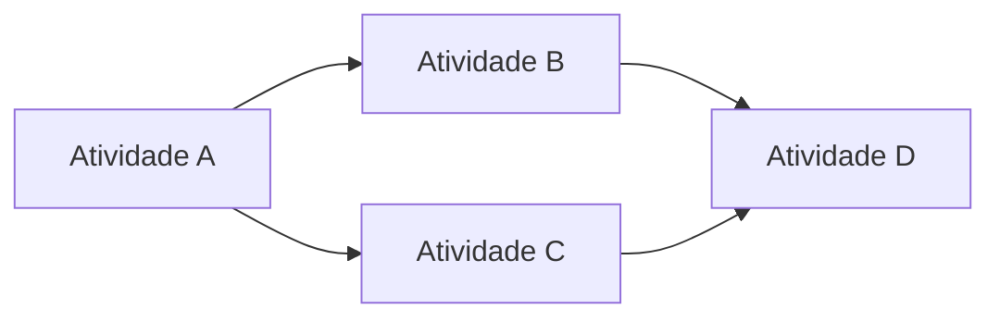

# Tempo, caminho crítico e *buffer* de projeto — calendário que respeita pico e doca

Projetos logísticos **compartilham recursos** com a operação: **mesma doca**, **mesma equipe**, **mesmo sistema**. **Caminho crítico** é a sequência de atividades que **determina** a duração mínima do projeto — atraso nele atrasa **tudo**. ***Buffer*** (contingência de tempo ou recurso) absorve **incerteza** sem esconder a verdade no cronograma «otimista demais».

Esta aula fica em nível **gestor** — não substitui software de scheduling nem certificação PMI.

---

## Objetivos e resultado de aprendizagem

**Ao final desta aula**, você será capaz de:

- Desenhar uma **rede simples** de precedências e identificar o **caminho crítico** em exemplo pequeno.  
- Explicar **buffer** de projeto *versus* *padding* em cada tarefa (transparência).  
- Listar **riscos** típicos (Black Friday, greve, atraso de fornecedor de *rack*).  
- Relacionar **marcos** a decisões *go/no-go*.

**Duração sugerida:** 60–75 minutos.

---

## Gancho — o *go-live* na semana errada

A **TechLar** fixou *go-live* de WMS na **mesma** semana do **pico** promocional — patrocinador «queria fechar o trimestre». O caminho crítico **estourou**; operação **voltou** parcialmente para processo paralelo. **Buffer** político (data) teria custado menos que **reputação**.

**Analogia da estrada:** obra de pista em feriado longo — previsível o congestionamento.

---

## Mapa do conteúdo

- Precedência e duração.  
- Caminho crítico (ideia).  
- Buffer e risco.  
- Marcos e *hypercare*.

---

## Rede e caminho crítico — exemplo mínimo

Atividades (fictícias): A (5d), B (3d após A), C (4d após A), D (2d após B e C). **Caminho crítico:** A→C→D = 5+4+2 = **11d** *vs.* A→B→D = 10d — crítico é **A-C-D**.

**Legenda:** em projetos reais use ferramenta; aqui a ideia é **ler** dependências.

---

## *Buffer* e transparência

- **Buffer** explícito no fim do caminho crítico ou antes de marco chave — **visível** na governança.  
- ***Padding*** oculto em cada tarefa — corrói confiança e aprendizado.

**Recursos compartilhados:** reserve **capacidade** de doca/equipe ou aceite **parada** formal da operação.

---

## Riscos logísticos típicos

- Picos sazonais e **promoções** não alinhadas ao projeto.  
- **Lead time** de equipamento (*rack*, *mezanino*).  
- **Integração** atrasada (fila de mensagens).  
- **Treino** insuficiente por turno.

---

## Aplicação — exercício

Liste **sete** riscos para projeto «**nova doca de expedição**» com **mitigação** (uma linha cada). Indique **qual** risco atacaria o **caminho crítico** mais provável.

**Gabarito pedagógico:** deve incluir **clima**, **fornecedor**, **mão de obra**, **sistema**; pelo menos uma mitigação é **data** ou **buffer**, não só «vigilar».

---

## Erros comuns e armadilhas

- Cronograma **sem** dono de atualização semanal.  
- *Go-live* sem **plano de *hypercare*** (reforço de plantão).  
- Ignorar **folga** de fim de semana na operação 24/7.  
- Misturar **projeto ágil** de software com **obra física** sem marcos físicos.

---

## KPIs e decisão

- **% marcos** no prazo.  
- **Desvio** acumulado *vs.* linha de base.  
- **Incidentes** operacionais na janela de *go-live*.

---

## Fechamento — três takeaways

1. Caminho crítico é **onde o medo deve morar** no calendário.  
2. Buffer visível **protege** reputação; *padding* escondido **destrói** confiança.  
3. Projeto logístico sem **pico no radar** é **aposta**.

**Pergunta de reflexão:** qual recurso compartilhado **nunca** entra no seu cronograma?

---

## Referências

1. PMI — *PMBOK Guide* (gestão de cronograma e risco — conceitos).  
2. GOLDRATT, E. M. *Critical Chain* (ideia de *buffer* e recurso — leitura opcional, perspectiva Teoria das Restrições).  
3. [Integrações — Tecnologia](../../trilha-tecnologia-e-sistemas/modulo-02-erp-aplicado-supply-chain/aula-03-integracoes-batch.md)
