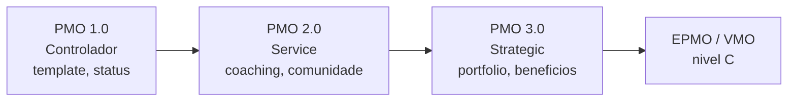
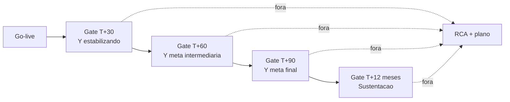
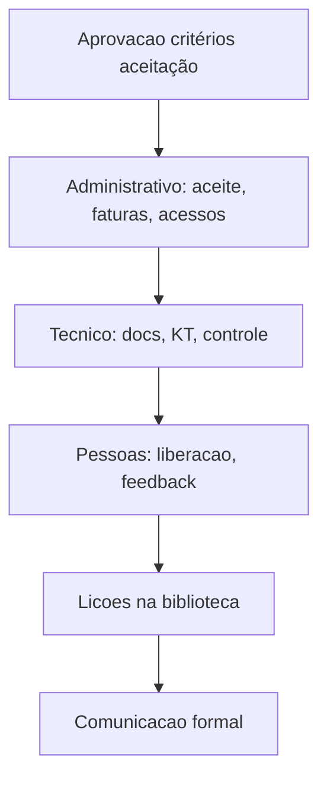
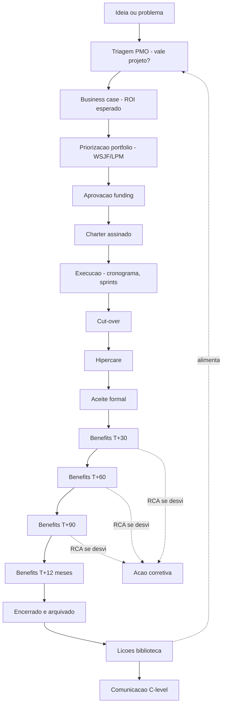

# PMO enxuto, realização de benefícios e encerramento — projeto que não vira lucro é hobby caro

**PMO** (*Project Management Office*) em supply chain pode ser **pesado** (governança corporativa, métodos, auditoria) ou **enxuto** (padrões mínimos, priorização, **uma** visão de portfólio, transparência). Em logística BR moderna, PMO **enxuto** + **ágil** vence — entrega valor sem afogar em template. O que **não pode faltar**: **benefícios rastreados** **depois** do *go-live* (*benefits realization*) — *cash*, OTIF, segurança, capital — e **encerramento formal** que **libera gente**, **captura lições**, **arquiva conhecimento** e **comunica fim** à operação (não deixa projeto-zumbi).

Esta aula entrega **modelos de PMO** (PMO 1.0 controlador, 2.0 service, 3.0 strategic), **template de benefits realization plan** com gates T+30/60/90, **EPMO** e **PMO ágil** (alinhado a SAFe/LPM), checklist completo de **encerramento** (administrativo, contratual, técnico, organizacional), e **lições aprendidas estruturadas** (Stop/Start/Continue, 5 perguntas, post-mortem). Encerra a trilha com a ponte para **certificação PMI** (PMP, PgMP, PfMP, PMI-ACP) — sem substituí-la.

---

## Objetivos e resultado de aprendizagem

**Ao final desta aula**, você será capaz de:

- Descrever **3 modelos de PMO** (controlador, *service*, strategic) e escolher o adequado ao contexto.
- Diferenciar **PMO**, **EPMO** (*Enterprise PMO*) e **VMO** (*Value Management Office*).
- Diferenciar **entrega** (output) de **benefício realizado** (outcome) com exemplos.
- Estruturar **benefits realization plan** com gates **T+30, T+60, T+90, T+12 meses** e dono financeiro.
- Listar e executar checklist de **encerramento** (10 itens administrativos, contratuais, técnicos).
- Conduzir **lições aprendidas** com 3 técnicas (Stop/Start/Continue, post-mortem 5 questões, retrospectiva ágil).
- Posicionar **PMO ágil vs. tradicional** e híbrido (logística raramente é puro).
- Conectar PMO a **OKR**, **Hoshin** e **LPM** (módulo 3.3).

**Duração sugerida:** 75–90 minutos.
**Pré-requisitos:** [Aulas 4.1, 4.2](aula-01-charter-raci-wbs.md), [Aula 3.3 (CI na cadeia)](../modulo-03-continuous-improvement/aula-03-ci-cadeia-sop-dados-ti.md).

---

## Mapa do conteúdo

1. Gancho — WMS «entregue» sem benefício.
2. PMO 1.0/2.0/3.0; PMO vs. EPMO vs. VMO.
3. **Benefits realization plan** completo (gates, donos, métricas).
4. Diferença output vs. outcome — armadilhas.
5. **Encerramento** — checklist 10 itens.
6. **Lições aprendidas** — 3 técnicas estruturadas.
7. PMO ágil, tradicional e híbrido.
8. Diagrama principal — fluxo PMO ideia → benefícios.
9. Trade-offs, erros, KPIs, ferramentas, glossário.
10. Exercícios, gabarito, reflexão, referências, pontes.

---

## Gancho — o WMS «entregue» sem benefício

A **TechLar** deu **verde** no projeto de implementação de **WMS novo** (R$ 8,5 mi capex, 14 meses) na data prometida. Champagne no auditório. Sponsor recebeu menção em comitê executivo. Fornecedor foi pago (última parcela 30 dias após go-live). PM realocado para próximo projeto.

**Doze meses depois, no fechamento orçamentário:**
- Acurácia inventário: medida **uma vez** (T+0) com 99,1%; **nunca mais medida** com a definição do charter (mudou de granularidade).
- Linhas/hora: comercial reportou +18%; gerente CD reportou +9%; controladoria não conseguiu replicar nenhum dos dois.
- **Benefício** no P&L (custo/linha previsto cair R$ 0,32): **não apareceu** — nem positiva nem negativamente; **não foi medido**.
- Sponsor mudou de área (promovido). Novo diretor pediu a auditoria. Resposta: «o projeto entregou, está rodando».

**Diagnóstico do auditor independente:**
- Ausência de **benefits realization plan** com gates T+30/60/90 + responsável **financeiro**.
- Encerramento foi **administrativo** (faturas, acessos), **não operacional** (lições, transferência).
- KPI redefinido pós go-live (mudaram numerador) — **comparação impossível**.
- PM saiu sem **handoff documentado** para operação.

**«Encerramento sem benefício é encerramento de fatura, não de valor.»** — frase que virou regra interna na TechLar pós-pós-mortem.

> **Analogia da academia:** cancelar mensalidade mas **nunca** subir na balança — «treinou». Sem **medição persistente**, qualquer projeto vira «foi bom para a equipe».

> **Analogia do enxoval:** fechar contrato com decorador, pagar fatura, mover móveis para a casa nova — mas **nunca convidar amigos para ver**, e nunca confirmar que **vive** lá. Encerramento é **mudar para a casa**, não só **comprar**.

---

## Modelos de PMO — 1.0, 2.0, 3.0

### Evolução clássica (Hobbs & Aubry, Gartner)

| Geração | Foco | Atividades | Risco |
|---------|------|-------------|-------|
| **PMO 1.0 — Controlador** | conformidade, padrões, auditoria | template, gate, status report | virar burocracia; ódio operacional |
| **PMO 2.0 — *Service / Coach*** | apoio, mentoria, ferramentas | treinar PMs, comunidade prática, coach | sem mandato, depende de demanda |
| **PMO 3.0 — Strategic / Value** | estratégia, portfólio, OKR, benefícios | LPM, Hoshin, benefits realization | alta complexidade, requer C-level |

### EPMO vs. PMO local

| Tipo | Escopo | Reporta a | Foco |
|------|--------|-----------|------|
| **PMO local** (departamental) | 1 área (ex.: PMO supply chain) | gerente/diretor da área | execução de projetos da área |
| **EPMO** (*Enterprise PMO*) | empresa toda | C-level (CEO/COO) | portfólio corporativo, alinhamento estratégico |
| **VMO** (*Value Management Office*) | value streams | C-level | benefícios, OKR, LPM |
| **Agile CoE** (*Center of Excellence*) | método ágil | EPMO ou C-level | adoção de Agile/Scrum/SAFe |

### Diagrama de evolução

> **Realidade BR:** muitas empresas tentam «pular» de PMO 1.0 para PMO 3.0 — fracassam por falta de método. Caminho típico: 1→2→3 em **3 anos**. Tamanho razoável: **1 PMO para cada R$ 50–100 mi de capex anual**.

### Funções típicas de PMO enxuto

| Função | Descrição | Cadência |
|--------|-----------|----------|
| **Portfólio** | priorizar projetos vs. capacidade da operação (módulo 3.3) | trimestral |
| **Método** | templates de charter, risco, status, benefits | revisão anual |
| **Transparência** | painel de marcos e «vermelho cedo» | semanal |
| **Gates** | aprovação por estágio (idea → planejamento → execução → close) | por projeto |
| **Pós-entrega** | gate de benefícios T+30/60/90 | por projeto |
| **Mentoria** | apoio a PMs juniores | sob demanda |
| **Lições** | biblioteca, post-mortem | por projeto + síntese trimestral |
| **Comunicação** | newsletter, town hall trimestral | mensal/trimestral |

---

## Benefits realization plan — completo

### Por que a maioria dos PMOs falha

- 70% dos projetos entregam **output** mas **não tracam benefícios** (Standish Group, KPMG).
- **Sponsor que assinou** o business case **mudou de cargo** — ninguém «possui» o número original.
- **KPIs redefinidos** pós go-live destroem comparação.
- **Sem baseline pré-projeto** — argumentar ganho vira fé.
- Benefícios **atribuíveis a outras causas** (S&OP, mudança de preço, mudança macro).

### Estrutura do benefits realization plan

| Campo | Conteúdo | Exemplo TechLar |
|-------|----------|-----------------|
| **Benefício** | nome curto | redução custo/linha |
| **Tipo** | financeiro / operacional / estratégico | financeiro |
| **Métrica** | unidade clara, definição operacional | R$/linha (linhas faturadas, não reprocessadas) |
| **Baseline** | valor pré-projeto, com fonte e data | R$ 2,12/linha (média 6 meses pré-projeto, controladoria) |
| **Meta T+30** | valor esperado em 30 dias | R$ 1,95 |
| **Meta T+60** | valor esperado em 60 dias | R$ 1,85 |
| **Meta T+90** | valor esperado em 90 dias | R$ 1,80 (estabilizado) |
| **Meta T+12 meses** | valor sustentado | R$ 1,80 |
| **Atribuição** | metodologia (causa-efeito) | DDD method (*Difference-in-Differences*) ou comparação CD A vs. CD B |
| **Dono operacional** | nome | gerente CD |
| **Dono financeiro** | nome | controladoria |
| **Cadência revisão** | mensal nos 3 primeiros meses, depois trimestral | mensal Q1, trim Q2-Q4 |
| **Plano se falhar** | RCA + plano contingência | se T+60 desviar >10%, abrir kaizen blitz |

### Diagrama de gates

### Tipos de benefício logístico

| Tipo | Exemplo | Como medir |
|------|---------|-------------|
| **Hard / financeiro** | R$/linha, capital de giro, custo de transporte | controladoria, ERP financeiro |
| **Operacional** | OTIF, lead time P90, FTR, OEE | WMS/TMS/MES |
| **Capacidade** | linhas/hora, capacidade de doca | medição operacional |
| **Risco** | acidentes, *near-miss* | SSMA |
| **Cliente** | NPS, churn, devolução | CRM, atendimento |
| **Estratégico** | tempo de lançamento de SKU novo | comercial + supply |
| **Qualitativo** | engajamento, retenção | RH, survey |

### Quando NÃO atribuir benefício ao projeto

- **Mudança de preço** simultânea (atribuir à comercial).
- **S&OP** mudou política de estoque (módulo 3.3).
- **Macro** (greve, pandemia, câmbio).
- **Outro projeto paralelo** mexeu na mesma métrica.

> **Boa prática:** usar **grupo de controle** (CD A com projeto vs. CD B sem projeto) ou **regressão DDD** (*Difference-in-Differences*) para isolar efeito. **Honestidade ≥ otimismo** — sponsor experiente prefere número defensável a número grande.

---

## Output vs. Outcome vs. Impact — distinção crítica

| Camada | Definição | Exemplo TechLar (WMS novo) |
|--------|-----------|------------------------------|
| **Input** | recurso investido | R$ 8,5 mi capex, 14 meses, 12 FTE |
| **Output** | entregável tangível | WMS instalado e operacional |
| **Outcome** | mudança no Y | lead time -30%; OTIF +5 p.p. |
| **Impact** | resultado de negócio | R$ 4,2 mi/ano economizado; +R$ 6 mi receita pela maior promessa |
| **Strategic** | mudança de posição | TechLar vira referência B2B premium |

**Maior erro:** medir só **output** («WMS entregue ✓»). PMO maduro mede até **impact** com gate T+12 meses.

---

## Encerramento — checklist completo (10 itens)

### A. Administrativo

1. **Aceite formal de entregas** assinado pelo sponsor (com critério de aceitação do charter).
2. **Faturas pagas** e **contratos encerrados** (fornecedor, consultor, locação temporária).
3. **Acessos temporários revogados** (TI, sistemas, doca de teste).

### B. Técnico/Operacional

4. **Documentação arquivada** (charter, WBS, planos, código, runbooks, manuais) em local pesquisável.
5. **Knowledge transfer** para operação: SOP final, treino concluído, plantão de hipercare encerrado oficialmente.
6. **Plano de controlo** ativo, com dono operacional registrado.

### C. Pessoas

7. **Equipe liberada** formalmente (carta para gestor de origem, agradecimento).
8. **Avaliações** de performance individuais entregues a gestores (input para promoção/feedback).

### D. Aprendizado e fim

9. **Lições aprendidas** registradas em biblioteca de PMO (3 técnicas — ver abaixo).
10. **Comunicação de encerramento** à operação, ao cliente interno, ao C-level (story curta com benefícios projetados).

### Diagrama do encerramento

### Anti-padrões de encerramento

- **«Projeto zumbi»**: reuniões mensais sem orçamento, ninguém oficializa fim.
- **Encerramento «via email»** sem aceite formal — abre brecha para escopo retroativo.
- **Lições só com PM** (sem operação) — perspectiva limitada.
- **Liberar equipe sem feedback** — RH e gestor perdem dado.
- **Nunca comunicar fim à operação** — equipe ainda «aciona o time do projeto».

---

## Lições aprendidas — 3 técnicas estruturadas

### 1. Stop / Start / Continue (rápido, 30 min)

| Stop | Start | Continue |
|------|-------|----------|
| (o que não funcionou) | (o que faltou) | (o que funcionou) |
| Cronograma sem buffer político | Risk register revisado quinzenalmente | Daily standup operacional |
| RACI sem A em inventário | Gemba walks com sponsor | Hipercare 4 sem |
| Treino só na véspera | Plano benefits T+30/60/90 | A3 documentado |

### 2. Post-mortem 5 questões (60–90 min)

1. **O que esperávamos que acontecesse?** (charter, baseline)
2. **O que realmente aconteceu?** (dado)
3. **Por que houve diferença?** (5 Por Quês na causa-raiz)
4. **O que faríamos diferente?** (decisões, métodos, ferramentas)
5. **O que vamos compartilhar com outros projetos?** (regra ou anti-padrão para biblioteca)

### 3. Retrospectiva ágil (formato Sprint Retrospective, 60 min)

- **Set the stage** (5 min): segurança psicológica, regra de respeito.
- **Gather data** (15 min): timeline, cards de bom/ruim/aprendizado.
- **Generate insights** (15 min): clusters, root cause.
- **Decide what to do** (15 min): top 3 ações com dono.
- **Close** (10 min): apreciação, próximo passo.

### Princípios de lições aprendidas

- **Sem caça às bruxas** — foco em **sistema**, não em pessoa.
- **Convidar operação** — visão diferente do PM.
- **Documentar com tag/categoria** — biblioteca pesquisável.
- **Ler lições de projetos passados** **antes** do próximo charter.
- **Repetir lição = sinal vermelho** — biblioteca não está viva.
- **Sponsor comparece** ao post-mortem — sinal de cultura madura.

---

## PMO ágil vs. tradicional vs. híbrido

### Comparação

| Atributo | PMO tradicional (cascata) | PMO ágil | Híbrido (logística) |
|----------|----------------------------|----------|---------------------|
| Planejamento | upfront completo | iterativo | upfront + ajuste |
| Cronograma | gantt detalhado | sprints + roadmap | gantt + sprints |
| Documentação | extensa | mínima viável | seletiva |
| Cliente | requisitos congelados | colaboração contínua | ambos |
| Ritmo | trimestral/marco | sprint 2 sem | misto |
| Métricas | EVM, % marcos | velocity, burndown, business value | EVM + velocity |
| Cultura | comando-controle | autonomia, autoorganização | empoderamento controlado |

### Quando usar qual

- **Cascata pura:** obra civil, capex pesado, fornecedor com contrato fixo, regulado.
- **Ágil puro:** desenvolvimento de software, MVP, descoberta.
- **Híbrido (logística):** **a maioria** — obra física + integração TI + adoção operacional.

### PMO híbrido — exemplo TechLar

- **Obra civil:** waterfall (MS Project, marcos físicos, fornecedor).
- **Integração WMS:** sprints 2 sem (Jira, PO da operação, daily).
- **Treino + mudança:** rolling com micro-experimentos.
- **Cut-over:** marcos rígidos.
- **Hipercare + benefícios:** Kanban com WIP, métricas SPI/CPI/OTIF.

---

## Diagrama principal — fluxo PMO ideia → benefícios realizados

> **Legenda:** loop de aprendizado ao final — lições alimentam **triagem** futura. Sem esse loop, organização repete erros.

---

## Aprofundamentos — variações setoriais

| Cenário | Particularidade PMO/encerramento |
|---------|----------------------------------|
| **Multinacional logística (3PL global)** | EPMO + PMOs regionais; benefits em USD com câmbio explícito |
| **Empresa familiar BR** | PMO 1.0 ou 2.0; sponsor é dono — decisão rápida, governança fraca |
| **Cooperativa agro** | PMO sazonal; benefits ligados à safra |
| **Hospital / saúde** | PMO regulado; encerramento exige validação clínica/regulatória |
| **Tecnologia / startup logística** | PMO ágil puro; benefits em métrica de produto (NPS, ARPU, retention) |
| **Setor público** | EPMO formal; benefits sociais (não só R$); auditoria TCU/CGU |
| **Pequena operação (<50 colab)** | PMO virtual (1 pessoa part-time); template enxuto |

---

## Trade-offs e decisão

| Trade-off | Lado A | Lado B |
|-----------|--------|--------|
| PMO pesado | governança | resistência operacional |
| PMO enxuto | velocidade | risco caos |
| Benefits T+90 | curto prazo | risco de não estabilizar |
| Benefits T+12 | longo prazo | esquecimento |
| Encerramento formal | clareza | esforço |
| Encerramento informal | rápido | escopo retroativo |
| Lições estruturadas | aprendizado | tempo |
| Lições rápidas | velocidade | superficialidade |
| EPMO | alinhamento | distância da operação |
| PMO local | proximidade | sub-otimização |

---

## Caso prático / Mini-laboratório — benefits realization da TechLar

### Cenário

Projeto «**automação de conferência na expedição**» (R$ 1,2 mi capex, 6 meses).

### Tarefa

Defina **3 benefícios mensuráveis** com **baseline**, **meta T+90**, **dono operacional + financeiro**, **método de atribuição**.

### Gabarito sugerido

| # | Benefício | Métrica | Baseline | Meta T+90 | Dono ops | Dono fin | Atribuição |
|---|-----------|---------|----------|-----------|----------|----------|------------|
| 1 | Redução custo/linha conferência | R$/linha | R$ 0,42/linha (média 3 meses) | R$ 0,18/linha | Supervisor expedição | Controladoria | comparação CD A (com) vs CD B (sem) por 90 dias |
| 2 | Aumento FTR conferência | % | 96,5% | 99,5% | Supervisor + qualidade | Qualidade financeira | comparação antes/depois mesmo CD, controlando volume |
| 3 | Redução incidentes lacre/divergência | n/mês | 18 ocorrências/mês | ≤4 | Líder doca | Comercial (multas) | contagem direta + correlação com multas evitadas |

### Itens de encerramento (5)

1. Aceite formal de entregas pelo gerente CD.
2. Encerrar contrato com fornecedor de balança/scanner; ativar warranty 24 meses.
3. SOP de conferência automatizada em 3 turnos, com responsável de manutenção.
4. Treino contínuo (mensal 30 min) registrado no LMS.
5. Plano de auditoria mensal pelo qualidade durante 6 meses.

### Comunicação T+90

**Story curta (5 frases) para C-level:**

> «O projeto Automação Conferência foi entregue em jul/2026. Nos 90 dias seguintes, FTR subiu de 96,5% para 99,4% (-3 p.p. de erro), custo/linha caiu de R$0,42 para R$0,19 (R$ 1,38 mi/ano economizado), e incidentes de lacre caíram de 18 para 3/mês (R$ 84k/ano em multas evitadas). Total benefício realizado T+12: R$ 1,46 mi (vs. R$ 1,2 mi capex; payback 10 meses). Equipe liberada; suporte por warranty.»

---

## Erros comuns e armadilhas

1. **PMO que só cobra status report** sem **decisão**.
2. **Benefício atribuído ao projeto** quando **S&OP/preço** mudou — auditoria desmonta.
3. **«Projeto zumbi»** — reuniões mensais sem orçamento.
4. **Medo de encerrar** por culpa política — projeto vira limbo.
5. **Lições sem biblioteca** — vira pasta morta.
6. **Encerramento administrativo sem operacional** — caso TechLar (acessos cortados, mas operação não treinada).
7. **Sponsor que muda de área** sem **handoff de benefícios** — número órfão.
8. **PMO 3.0 sem maturidade prévia** — gerencial pula etapa.
9. **EPMO sem mandato** — vira «consultoria interna» que ninguém chama.
10. **Híbrido «agile-washing»** — chama de ágil mas executa cascata.
11. **Benefits sem baseline** — ganho «de fé».
12. **Lições só do PM** sem operação ou cliente.
13. **Encerramento sem celebrar** — perde momento de cultura.

---

## Comportamento e cultura

- **Sponsor permanece** até **T+90** (mesmo se promovido — handoff formal).
- **Controladoria** ao lado do PMO em **todo** business case e revisão de benefícios.
- **Celebrar encerramento** com equipe — café, certificado, foto, *thank-you note*.
- **Lições lidas em onboarding** de novo PM — biblioteca viva.
- **Sponsor que «assina e some»** é problema cultural — RH/EPMO escala.
- **PMO frequenta gemba** (não só sala de reunião) — credibilidade.
- **Honestidade > vaidade**: relatar benefício menor mas defensável é virtude.
- **Cliente interno e externo** convidados ao post-mortem — perspectiva de fora vale ouro.

---

## KPIs de melhoria (do PMO em si)

| KPI | Pergunta | Dono | Fonte | Cadência | Playbook |
|-----|----------|------|-------|----------|----------|
| % projetos com revisão de benefício T+90 concluída | benefits realization vivo? | EPMO + controladoria | base PMO | trimestral | reforçar gate |
| Desvio benefício realizado vs. *business case* | ROI honesto? | controladoria | financeiro | trimestral | RCA por projeto |
| Satisfação do sponsor (NPS) | PMO entrega valor? | EPMO | survey | semestral | revisar serviço PMO |
| % projetos encerrados formalmente (vs. zumbi) | governança | EPMO | base | mensal | escalar zumbi |
| % lições registradas após encerramento | aprendizado | EPMO | biblioteca | mensal | retrospectiva pendente |
| Lead time idea → portfolio approved | velocidade | PMO | base | mensal | gargalo (BC, governança) |
| Throughput de projetos / ano | capacidade | EPMO | base | trimestral | revisar WIP |
| % projetos no orçamento | controle financeiro | controladoria | EVM | mensal | RCA por projeto |
| % projetos no prazo | controle cronograma | EPMO | EVM | mensal | RCA por projeto |
| Reuso de lições (citações em novos charters) | biblioteca viva? | EPMO | base | semestral | tornar leitura obrigatória |

---

## Tecnologias e ferramentas

| Categoria | Ferramenta |
|-----------|------------|
| **Plataforma PMO completa** | **Planview**, **Smartsheet**, **Microsoft Project Web (Project for the Web)**, Asana Enterprise, Wrike, Monday Enterprise |
| **EPMO / portfolio** | **Jira Align**, Targetprocess, Planview, ServiceNow PPM, Sciforma, Clarity (Broadcom) |
| **Benefits realization** | módulos do Planview, Smartsheet, **i-nexus**, Excel template + Power BI |
| **Documentação** | Confluence, SharePoint, Notion, GitBook |
| **Lições aprendidas** | base custom em Confluence, **Loop**, Trello/Kanban dedicado |
| **Risk register / EVM** | MS Project, Primavera, Smartsheet, **@Risk** |
| **Comunicação executiva** | Power BI, Tableau, **Microsoft Loop**, dashboards curados |
| **Survey** | Forms, Typeform, Qualtrics |
| **OKR** | Workboard, Ally, Lattice (módulo 3.3) |
| **Treino PMO** | LMS interno, **PMI courses**, IIL, Project Builder (BR) |

---

## Glossário rápido

- **PMO 1.0 / 2.0 / 3.0** — controlador / service / strategic.
- **EPMO** — *Enterprise PMO*; nível corporativo.
- **VMO** — *Value Management Office*; foco em valor/benefícios.
- **Benefits realization** — gestão de benefícios pós-entrega.
- **Output / Outcome / Impact** — entrega / mudança / resultado de negócio.
- **DDD method** — *Difference-in-Differences*; atribuição rigorosa.
- **Encerramento administrativo / técnico / operacional** — 3 dimensões.
- **Lições aprendidas / post-mortem / retrospectiva** — técnicas de captura.
- **Biblioteca de lições / *knowledge base*** — repositório vivo.
- **Stop/Start/Continue** — formato rápido de retrospectiva.
- **Híbrido waterfall+agile** — método misto.
- **Project zombie** — projeto sem fim formal.

---

## Aplicação — exercícios

### Exercício 1 — benefits realization plan (20 min)

Para projeto «**implementação de cross-dock no CD-2**» (R$ 600k capex, 4 meses), defina **3 benefícios** com baseline, meta T+90, dono operacional + financeiro, método de atribuição.

**Gabarito esperado:** custo/linha em movimentação interna; cobertura média estoque; OTIF para clientes B2B em região beneficiada; cada um com baseline 3-6 meses pré, meta defendível, dono nome próprio, atribuição com método (comparação ou DDD).

### Exercício 2 — encerramento (15 min)

Liste **5 itens administrativos** + **5 itens operacionais** de encerramento para projeto «**substituição de leitor RFID em 4 docas**» (R$ 280k, 3 meses).

**Gabarito esperado:**
- Adm: aceite, fatura, acessos, garantia, contrato suporte.
- Operacional: SOP turnos, treino, manutenção plantão, plano controlo, biblioteca lições.

### Exercício 3 — lições estruturadas (15 min)

Aplique **Stop/Start/Continue** para projeto fictício «**reorganização de slotting**» que entregou +12% produtividade mas regrediu 60% em 3 meses.

**Gabarito sugerido:**
- Stop: fechar projeto sem plano de controlo; pular auditoria.
- Start: gate T+30/60/90; rotação de auditor.
- Continue: kaizen de slotting; envolver operadores.

### Exercício 4 — diagnóstico de PMO (10 min)

Sua organização tem 8 PMs, 30 projetos/ano, R$ 80 mi capex. Que modelo PMO recomenda (1.0/2.0/3.0)? Por quê? Qual primeira função instituiria?

**Gabarito esperado:** PMO 2.0 com evolução para 3.0 em 18 meses. Primeira função: priorização de portfólio (WSJF + revisão trimestral) — sem isso 30 projetos viram caos. Não começar por «template de status report» (PMO 1.0 fracassa cultural).

---

## Pergunta de reflexão

**Qual projeto recente da sua empresa NUNCA teve revisão T+90?** Se você fosse PMO amanhã, qual seria o **primeiro gate** que instituiria — e como conseguiria sponsor para defendê-lo?

---

## Fechamento — três takeaways

1. **PMO enxuto prioriza e protege a operação** — controle suficiente, burocracia mínima.
2. **Benefício é métrica no tempo**, não slide de go-live. Sem T+30/60/90/12m com dono financeiro, ganho é fé.
3. **Encerrar bem é respeito** com a equipe e com o orçamento — celebrar, comunicar, capturar lições, liberar.

---

## Referências

1. PMI — *PMBOK Guide* (encerramento, partes interessadas, benefícios).
2. PMI — *Benefits Realization Management: A Practice Guide*.
3. PMI — *The Standard for Portfolio Management*.
4. KOTTER, J. P. *Leading Change*. Harvard Business Review Press. (mudança organizacional)
5. KERZNER, H. *Project Management Metrics, KPIs, and Dashboards*. Wiley.
6. HOBBS, B.; AUBRY, M. *The Project Management Office (PMO): A Quest for Understanding*. PMI Research.
7. BRADLEY, G. *Benefit Realisation Management: A Practical Guide to Achieving Benefits Through Change*. Routledge.
8. Project Builder Brasil — material técnico PM em PT-BR: <https://www.projectbuilder.com.br/>
9. PMI Brasil — capítulos regionais e PMI-RJ/SP/BSB: <https://brasil.pmi.org/>
10. **AXELOS** — PRINCE2 *Closing a Project* process: <https://www.axelos.com/>
11. CSCMP — alinhamento supply chain e execução: <https://cscmp.org/>
12. Standish Group — *CHAOS Report* anual (sucesso/fracasso de projetos).

### Próximos passos de formação

- **PMI-PMP** — *Project Management Professional* (5 anos exp + 35h treino + exame).
- **PMI-PgMP** — *Program Management Professional*.
- **PMI-PfMP** — *Portfolio Management Professional*.
- **PMI-ACP** — *Agile Certified Practitioner*.
- **PRINCE2 Foundation/Practitioner** (AXELOS).
- **SAFe Program Consultant (SPC)** — Lean Portfolio Management.

---

## Pontes para outras trilhas

- [S&OP — Fundamentos](../../trilha-fundamentos-e-estrategia/modulo-03-planejamento-demanda-sop/aula-03-sop-processo-alinhamento.md): janela de projeto vs. ciclo de planeamento.
- [Estrutura de custos — Fundamentos](../../trilha-fundamentos-e-estrategia/modulo-04-custos-logisticos-performance/aula-01-estrutura-custos-logisticos.md): traduzir benefício em R$.
- [Indicadores logísticos — Dados](../../trilha-dados-analytics-logistica/modulo-04-indicadores-logisticos-kpis/README.md): KPIs estáveis para benefits.
- [CI na cadeia (S&OP, dados, TI)](../modulo-03-continuous-improvement/aula-03-ci-cadeia-sop-dados-ti.md): PMO + LPM + OKR.
- [Charter, RACI, WBS](aula-01-charter-raci-wbs.md): início do ciclo PMO.
- [Caminho crítico, buffer, riscos](aula-02-caminho-critico-buffer-riscos.md): execução do projeto.
- **Encerramento da trilha:** parabéns! Próximo passo recomendado — projeto integrador (A3 + mini-charter + VSM com 3 melhorias priorizadas), descrito no [README da trilha](../README.md).
