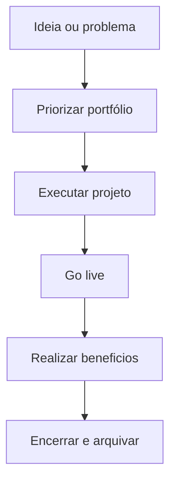

# PMO enxuto, realização de benefícios e encerramento — projeto que não vira lucro é hobby caro

**PMO** (*Project Management Office*) em supply chain pode ser **pesado** (governança corporativa) ou **enxuto** (padrões mínimos, priorização, **uma** visão de portfólio). O que não pode faltar: **benefícios** rastreados **depois** do *go-live* — *cash*, OTIF, segurança — e **encerramento formal** que libera gente e **captura lições**.

---

## Objetivos e resultado de aprendizagem

**Ao final desta aula**, você será capaz de:

- Descrever funções de um **PMO enxuto** em logística.  
- Diferenciar **entrega** de **benefício realizado**.  
- Definir **revisão** pós-projeto (30/60/90 dias) com dono financeiro ou operacional.  
- Listar itens de **encerramento** (contratos, acessos, lições aprendidas).

**Duração sugerida:** 60–75 minutos.

---

## Gancho — o WMS «entregue» sem benefício

A **TechLar** deu **verde** no projeto de WMS na data; **ninguém** mediu **acurácia** e **linhas/hora** em **T+90** com a mesma definição do *charter*. O fornecedor foi pago; o **benefício** no P&L **não apareceu** — sponsor mudou de área; PM foi realocado. **Encerramento** sem **benefício** é **encerramento de fatura**, não de valor.

**Analogia da academia:** cancelar mensalidade mas **nunca** subir na balança — «treinou».

---

## Mapa do conteúdo

- PMO enxuto: prioridade, padrão, transparência.  
- *Benefits realization*.  
- Encerramento administrativo e operacional.  
- Lições e arquivo.

---

## PMO enxuto — funções típicas

| Função | Descrição |
|--------|-----------|
| Portfólio | priorizar projetos *vs.* capacidade da operação |
| Método | *templates* de *charter*, risco, status |
| Transparência | painel de marcos e vermelho cedo |
| Pós-entrega | gate de benefícios T+30/60/90 |

**Legenda:** **B** é onde muitas empresas **pulam** — PMO enxuto **não** pula.

---

## Benefícios — exemplos logísticos

- Redução de **custo por linha** ou por entrega.  
- **OTIF** ou **lead time** com definição estável.  
- **Capital** em estoque (com *baseline* honesto).  
- **Segurança** (incidentes, near-miss).

**Hipótese pedagógica:** benefício sem **linha de base** pré-projeto é **marketing interno**.

---

## Encerramento — checklist

- Aceite formal de entregas (**sponsor**).  
- Encerrar **contratos** e **acessos** temporários.  
- Arquivar **documentação** e **runbooks**.  
- **Lições aprendidas** (o que repetir / evitar).  
- Comunicar **fim** à operação (não deixar «projeto zumbi»).

---

## Aplicação — exercício

Defina **três** benefícios mensuráveis para projeto «**automação de conferência na expedição**» com **linha de base**, **meta T+90** e **dono**. Liste **cinco** itens de encerramento administrativo.

**Gabarito pedagógico:** benefícios devem ligar a **métrica** da trilha Dados; dono não pode ser só PM; encerramento inclui **treino contínuo** e **suporte** contratual.

---

## Erros comuns e armadilhas

- PMO que **só** cobra *status report* sem decisão.  
- Benefício **atribuído** a projeto quando **S&OP** ou preço mudou.  
- **Projeto zumbi** (reuniões sem orçamento).  
- Medo de **encerrar** por culpa política.

---

## KPIs e decisão

- **% projetos** com revisão de benefício T+90 concluída.  
- **Desvio** benefício *vs.* *business case*.  
- **Satisfação** do sponsor (survey simples).

---

## Fechamento — três takeaways

1. PMO enxuto **prioriza** e **protege** a operação.  
2. Benefício é **métrica no tempo**, não slide de *go-live*.  
3. Encerrar bem é **respeito** com a equipe e o orçamento.

**Pergunta de reflexão:** qual projeto recente **nunca** teve revisão T+90?

---

## Referências

1. PMI — *PMBOK Guide* (encerramento, partes interessadas, benefícios — conforme edição).  
2. KOTTER, J. P. *Leading Change* (mudança organizacional — *tipo* para patrocínio e comunicação). Harvard Business Review Press.  
3. CSCMP — alinhamento supply chain e execução: https://cscmp.org/
