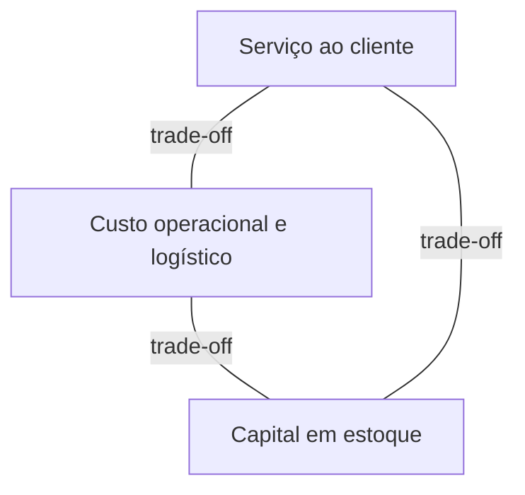
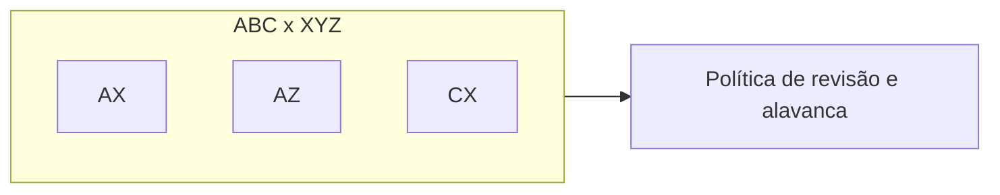

# Políticas, ABC/XYZ e o triângulo serviço–custo–capital — o estoque que quer ser tudo para todos

**Gestão de estoques** é escolher **quanto** manter, **onde**, **em qual forma** (matéria-prima, WIP, acabado, canal) e **com qual ritmo de revisão** — sabendo que cada escolha puxa **serviço ao cliente**, **custo operacional** e **capital de giro**. Esta aula não substitui o **S&OP** dos Fundamentos (ciclo e alinhamento comercial); ela dá **linguagem de política** para o que o S&OP precisa traduzir em número executável.

---

## Objetivos e resultado de aprendizagem

**Ao final desta aula**, você será capaz de:

- Explicar o **triângulo** serviço–custo–capital com exemplos de alavanca (prazo, frequência, mix, obsolescência).
- Usar **ABC** (valor/impacto) e **XYZ** (previsibilidade da demanda) como **matriz de política**, não como etiqueta cosmética.
- Descrever, em alto nível, **ponto de pedido** e **EOQ** como modelos com **pressupostos** — e dizer quando mentem.
- Propor **cadência de revisão** (diária/semanal/mensal) por segmento de SKU.

**Duração sugerida:** 60–90 minutos (com exercício e leitura de um SKU real da sua empresa).

---

## Gancho — a política única da TechLar

A **TechLar** (B2B + e-commerce) adotou «**30 dias de cobertura para tudo**» porque «fica simples no slide». Resultado previsível: SKU classe **A** com giro altíssimo ficou **curto** em picos de campanha; SKU classe **C** com baixa previsibilidade virou **cemitério** de capital e obsolescência. **Simplicidade política** sem segmentação é **complexidade financeira** disfarçada.

**Analogia da geladeira:** você não guarda iogurte, molho de tomate e vinho na mesma «regra de reposição» — não por frescura, mas porque **perecibilidade**, **frequência de uso** e **custo do erro** são diferentes.

---

## Mapa do conteúdo

- Funções do estoque (ciclo, segurança, sazonal, em trânsito, *pipeline*).  
- Triângulo serviço–custo–capital e **armadilhas** de incentivo (ex.: bônus só em fill rate).  
- ABC/XYZ como **contrato interno** de revisão.  
- Ponto de pedido e EOQ como **intuição matemática** (não como fórmula mágica).

---

## Conceito núcleo — funções do estoque

1. **Estoque de ciclo:** atende demanda **entre** reposições.  
2. **Estoque de segurança:** absorve **variabilidade** (demanda e/ou lead time).  
3. **Estoque sazonal/antecipatório:** antecipa janela cara ou indisponível.  
4. **Em trânsito / pipeline:** já «pagou o frete», ainda não disponível para promessa local.

**Hipótese pedagógica:** se você não consegue nomear **qual função** justifica o saldo, o saldo tende a ser **hábito** — e hábito não defende bem *town hall* com finanças.

**Legenda:** melhorar um vértice sem redesenhar os outros quase sempre **paga conta** em algum lugar (explícito ou oculto).

---

## ABC e XYZ — matriz de política

- **ABC** (Pareto): separa o pouco que importa muito (A) do muito que importa pouco (C).  
- **XYZ:** classifica **regularidade/previsibilidade** (X estável, Z «irregular»).

Combinações úteis (consenso de mercado em operações):

| Célula | Leitura prática |
|--------|------------------|
| AX | disciplina fina, revisão frequente, forte governança de master data |
| AZ | alto valor + imprevisível: *buffer* ou redesign de oferta/contrato |
| CX | automatizar, reduzir gesto manual, evitar tratamento VIP indevido |

---

## Ponto de pedido e EOQ — modelos com «termos de uso»

**Ponto de pedido** (ideia): reposicionar quando `estoque disponível + em trânsito` cruza um **gatilho** derivado de demanda média e variabilidade do lead time. **Pressuposto:** você sabe medir lead time e demanda com **definição estável** (ver trilha Dados).

**EOQ** (lote econômico clássico): equilibra **custo de pedido** *vs.* **custo de manter** em modelo didático. **Limites:** demanda não constante, lotes mínimos do fornecedor, capacidade de doca, campanhas — na vida, o EOQ é **ponto de partida**, não evangelho.

**Analogia do tanque:** ponto de pedido é a **marca vermelha** no medidor; EOQ é o tamanho do **galão** que você compra quando desce — se o galão não cabe no porta-malas (doca/capital), o modelo precisa de **restrição** explícita.

---

## Aplicação — exercício

Classifique **10 SKUs fictícios** (tabela fornecida em sala ou invente) em ABC e XYZ e proponha:

1. **Cadência de revisão** (diária/semanal/mensal).  
2. **Uma** alavanca não financeira (ex.: kit, MOQ com fornecedor, *postponement*) para **uma** célula AZ.

**Gabarito pedagógico:** AX deve sair com revisão **mais frequente**; CZ não pode consumir mesma atenção que AX; AZ precisa de **mitigação** de imprevisibilidade (contrato, buffer segmentado, revisão de mix) — não só «pedir para vender melhor».

---

## Erros comuns e armadilhas

- ABC só por **valor contábil** sem olhar **ruptura** ou **risco regulatório**.  
- Misturar **SKU** com **família** na política — política vira discurso vago.  
- EOQ «do Excel» com **lead time** inventado.  
- **Incentivo** que premia volume comprado sem **giro** e **obsolescência**.  
- Política escrita que **ninguém** revisa após mudança de canal (marketplace).

---

## KPIs e decisão

- **Giro** e **cobertura em dias** por classe ABC (definições na trilha Dados: [giro e cobertura](../../trilha-dados-analytics-logistica/modulo-04-indicadores-logisticos-kpis/aula-03-giro-cobertura-estoque-capital.md)).  
- **Fill rate** *vs.* **capital** por família (detectar política «bonita» demais).  
- **% SKUs** sem dono de política (owner) — sinal de governança fraca.

---

## Fechamento — três takeaways

1. Estoque é **política** materializada; política única é quase sempre **autoengano** segmentado.  
2. ABC/XYZ serve para **conversar com finanças e vendas** na mesma mesa.  
3. Modelos clássicos são **bússola**, não GPS com trânsito em tempo real.

**Pergunta de reflexão:** qual SKU classe **A** hoje está sendo gerido como **C** por preguiça de cadência?

---

## Referências

1. CHOPRA, S.; MEINDL, P. *Supply Chain Management*. Pearson.  
2. SILVER, E. A.; PYKE, D. F.; PETERSON, R. *Inventory Management and Production Planning and Scheduling*. Wiley.  
3. CSCMP — glossário: https://cscmp.org/CSCMP/cscmp/educate/scm_definitions_and_glossary_of_terms.aspx  
4. Trilha Fundamentos — [S&OP](../../trilha-fundamentos-e-estrategia/modulo-03-planejamento-demanda-sop/aula-03-sop-processo-alinhamento.md).
