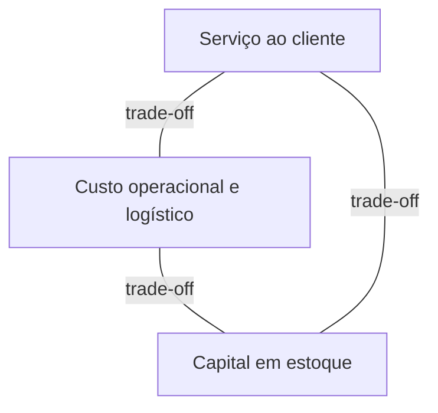
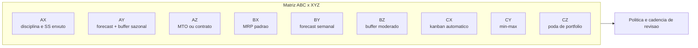

# Políticas, ABC/XYZ e o triângulo serviço–custo–capital — o estoque que quer ser tudo para todos

**Gestão de estoques** é escolher **quanto** manter, **onde**, **em qual forma** (matéria-prima, WIP, acabado, canal) e **com qual ritmo de revisão** — sabendo que cada escolha puxa **serviço ao cliente**, **custo operacional** e **capital de giro**. Esta aula não substitui o **S&OP** dos Fundamentos (ciclo e alinhamento comercial); ela dá **linguagem de política** para o que o S&OP precisa traduzir em número executável.

---

## Objetivos e resultado de aprendizagem

**Ao final desta aula**, você será capaz de:

- Explicar o **triângulo** serviço–custo–capital com exemplos de alavanca (prazo, frequência, mix, obsolescência).
- Usar **ABC** (valor/impacto) e **XYZ** (previsibilidade da demanda) como **matriz de política**, não como etiqueta cosmética.
- Descrever, em alto nível, **ponto de pedido** e **EOQ** como modelos com **pressupostos** — e dizer quando mentem.
- Propor **cadência de revisão** (diária/semanal/mensal) por segmento de SKU.

**Duração sugerida:** 60–90 minutos (com exercício e leitura de um SKU real da sua empresa).

---

## Gancho — a política única da TechLar

A **TechLar** (B2B + e-commerce) adotou «**30 dias de cobertura para tudo**» porque «fica simples no slide». Resultado previsível: SKU classe **A** com giro altíssimo ficou **curto** em picos de campanha; SKU classe **C** com baixa previsibilidade virou **cemitério** de capital e obsolescência. **Simplicidade política** sem segmentação é **complexidade financeira** disfarçada.

**Analogia da geladeira:** você não guarda iogurte, molho de tomate e vinho na mesma «regra de reposição» — não por frescura, mas porque **perecibilidade**, **frequência de uso** e **custo do erro** são diferentes.

---

## Mapa do conteúdo

- Funções do estoque (ciclo, segurança, sazonal, em trânsito, *pipeline*).  
- Triângulo serviço–custo–capital e **armadilhas** de incentivo (ex.: bônus só em fill rate).  
- ABC/XYZ como **contrato interno** de revisão.  
- Ponto de pedido e EOQ como **intuição matemática** (não como fórmula mágica).

---

## Conceito núcleo — funções do estoque

1. **Estoque de ciclo:** atende demanda **entre** reposições.  
2. **Estoque de segurança:** absorve **variabilidade** (demanda e/ou lead time).  
3. **Estoque sazonal/antecipatório:** antecipa janela cara ou indisponível.  
4. **Em trânsito / pipeline:** já «pagou o frete», ainda não disponível para promessa local.

**Hipótese pedagógica:** se você não consegue nomear **qual função** justifica o saldo, o saldo tende a ser **hábito** — e hábito não defende bem *town hall* com finanças.

**Legenda:** melhorar um vértice sem redesenhar os outros quase sempre **paga conta** em algum lugar (explícito ou oculto).

---

## ABC e XYZ — matriz de política (com tabela de corte e aplicação real)

- **ABC** (Pareto): separa o pouco que importa muito (A) do muito que importa pouco (C). Corte clássico: **A ≈ 80% do valor / 20% dos SKUs; B ≈ 15% / 30%; C ≈ 5% / 50%**. Em e-commerce de cauda longa (marketplaces tipo Magalu/Mercado Livre), a curva costuma ser mais plana: **A ≈ 60% / 10%**, e ainda aparece um quarto grupo «D» (cauda longa que fica em *dropshipping*).
- **XYZ** classifica **regularidade/previsibilidade** pela variabilidade da demanda (coeficiente de variação `CV = σ/μ`):

| Classe | CV típico | Leitura |
|--------|-----------|---------|
| **X** | < 0,25 | demanda estável, MRP/ROP funciona bem |
| **Y** | 0,25–0,50 | sazonalidade ou tendência, pede *forecast* explícito |
| **Z** | > 0,50 | esporádica/promocional, exige *buffer* ou *make-to-order* |

**Matriz 3×3 ABC × XYZ — política aplicada (consenso de mercado BR):**

| | **X (estável)** | **Y (variável)** | **Z (errático)** |
|---|---|---|---|
| **A** (alto valor) | revisão **diária**, ROP automático, *safety stock* enxuto, fill rate-alvo 98–99% | revisão **diária**, *forecast* mensal, *buffer* sazonal, fill rate 96–98% | revisão **caso a caso**, contrato com cliente, *make-to-order*, fill rate 93–95% |
| **B** | revisão **semanal**, MRP padrão, fill rate 95–97% | revisão **semanal** com *forecast*, fill rate 93–96% | *buffer* moderado + alerta de exceção |
| **C** | revisão **mensal**, lote econômico generoso, fill rate 90–93% | revisão **mensal** com mín/máx, kit/postponement | candidato a **descontinuar** ou *dropship* |

**Combinações «de bandeira»:**

- **AX:** disciplina fina, revisão frequente, forte governança de master data (cadastro de cubagem, fator de conversão, lead time vivo).
- **AZ:** alto valor + imprevisível — *buffer* ou redesign de oferta/contrato (ex.: contrato take-or-pay com cliente B2B, ou MOQ menor com fornecedor pagando capacidade reservada).
- **CX:** automatizar, reduzir gesto manual, evitar tratamento VIP indevido (Kanban visual, mín/máx, ordem automática quando descer linha).
- **CZ:** **candidato a poda** do portfólio — discutir descontinuação a cada ciclo de S&OP (alvo: ≤ 5% do mix sem giro em 12 meses).

**Legenda:** cada célula puxa **revisão**, **alavanca** (capital, contrato, automação) e **fill rate-alvo** distintos.

---

## Ponto de pedido, EOQ e *safety stock* — fórmulas com «termos de uso»

### Ponto de pedido (ROP — *reorder point*)

\[
\text{ROP} = \bar{d} \cdot LT + SS
\]

onde `d̄` é a demanda diária média, `LT` o lead time de reposição e `SS` o estoque de segurança.

### Estoque de segurança (com nível de serviço)

Quando demanda e lead time são variáveis independentes:

\[
SS = z \cdot \sqrt{LT \cdot \sigma_d^{\,2} + \bar{d}^{\,2} \cdot \sigma_{LT}^{\,2}}
\]

Tabela do fator `z` (distribuição normal — cabeceira de planilha):

| Nível de serviço (CSL) | z |
|------------------------|------|
| 90% | 1,28 |
| 95% | 1,65 |
| 97,5% | 1,96 |
| 98% | 2,05 |
| 99% | 2,33 |
| 99,5% | 2,58 |

**Atalho útil:** subir de 95% → 99% **dobra** o `SS` em muitos perfis — e o cliente raramente paga essa diferença. Daí a importância de **CSL por classe ABC/XYZ**, não global.

### EOQ — lote econômico de Wilson

\[
\text{EOQ} = \sqrt{\frac{2 \cdot D \cdot S}{H}}
\]

- `D` = demanda anual (un./ano)
- `S` = custo fixo de pedido (R$/pedido) — geralmente **R$ 80–250** em empresa média BR (frete adicional + tempo do comprador + setup);
- `H` = custo de manter por unidade-ano (R$/un./ano) — comum **18%–28% do custo do item** no Brasil (capital + armazenagem + obsolescência + seguro), com **WACC + selic** elevadas puxando para cima.

**Limites:** demanda não constante, lotes mínimos do fornecedor (MOQ), capacidade de doca, descontos por volume, campanhas — na vida, EOQ é **ponto de partida**.

### Mini-cálculo — TechLar SKU AX

Item de R$ 50/un., D = 12.000 un./ano, S = R$ 150, H = 22% × 50 = R$ 11/un./ano:

\[
\text{EOQ} = \sqrt{\frac{2 \cdot 12000 \cdot 150}{11}} \approx \sqrt{327{.}272} \approx \mathbf{572\ \text{un./pedido}}
\]

Nº de pedidos/ano: 12.000/572 ≈ **21**, ou ~ a cada **17 dias**. Confronte com MOQ do fornecedor (ex.: 1.000 un./pallet) e ajuste — é mais barato pagar `H` adicional do que multiplicar setups.

**Analogia do tanque:** ponto de pedido é a **marca vermelha** no medidor; EOQ é o tamanho do **galão** que você compra quando desce — se o galão não cabe no porta-malas (doca/capital), o modelo precisa de **restrição** explícita.

---

## Aprofundamentos — variações setoriais

| Setor | Particularidade | Política sugerida |
|-------|-----------------|-------------------|
| **Varejo alimentar** | giro alto, validade curta, ruptura percebida na hora | FEFO + revisão diária (A/B) + *replenishment* automático loja |
| **Indústria química/insumos** | MOQ alto, lead time importação 60–90 dias | EOQ ajustado a contêiner cheio, *safety stock* alto em itens críticos |
| **Farma/saúde** | rastreabilidade lote obrigatória (Anvisa RDC 657/22), validade | FEFO mandatório, quarentena, **bloqueio** de venda automático em lote vencido |
| **Agro/insumos rurais** | sazonalidade brutal (plantio/colheita) | estoque antecipatório dimensionado por safra, contrato take-or-pay |
| **E-commerce cauda longa** | mix > 50k SKUs, 80% das vendas em 5–10% do mix | A/B em CD próprio; cauda em *dropship*/*marketplace fulfilment* |
| **Frio (cold chain)** | armazenagem ~ 3–5× mais cara (R$ 200–400/posição/mês) | minimizar SKU não-A em câmara, *cross-dock* sempre que possível |

---

## Trade-offs e decisão (visual)

| Alavanca | + Serviço | + Custo OPEX | + Capital | + Risco | Sustentabilidade |
|----------|:---------:|:------------:|:---------:|:-------:|:----------------:|
| Subir CSL de 95→99% | ↑↑ | ↔ | ↑↑ | ↓ | ↓ (mais obsoleto) |
| Reduzir lead time (air vs. mar) | ↑ | ↑↑↑ | ↓↓ | ↓ | ↓↓ (CO₂) |
| Centralizar estoque | ↓ regional | ↓ | ↓ (pooling √N) | ↑ SPOF | ↑ |
| Postponement (kit no CD) | ↑ flex | ↑ leve | ↓ | ↓ | ↑ |
| Contrato VMI fornecedor | ↑ | ↔ | ↓↓ | ↓ | ↑ |

Classifique **10 SKUs fictícios** (tabela fornecida em sala ou invente) em ABC e XYZ e proponha:

1. **Cadência de revisão** (diária/semanal/mensal).  
2. **Uma** alavanca não financeira (ex.: kit, MOQ com fornecedor, *postponement*) para **uma** célula AZ.

**Gabarito pedagógico:** AX deve sair com revisão **mais frequente**; CZ não pode consumir mesma atenção que AX; AZ precisa de **mitigação** de imprevisibilidade (contrato, buffer segmentado, revisão de mix) — não só «pedir para vender melhor».

---

## Erros comuns e armadilhas

- ABC só por **valor contábil** sem olhar **ruptura** ou **risco regulatório**.  
- Misturar **SKU** com **família** na política — política vira discurso vago.  
- EOQ «do Excel» com **lead time** inventado.  
- **Incentivo** que premia volume comprado sem **giro** e **obsolescência**.  
- Política escrita que **ninguém** revisa após mudança de canal (marketplace).

---

## O que vira dado no sistema (campos/eventos em ERP/WMS)

| Campo / evento | Onde mora (típico SAP/Oracle/Protheus) | Para que serve |
|---|---|---|
| `MARC-MMSTA` (status MRP) / `lifecycle status` | dados mestres | bloquear compras de SKU descontinuado |
| `MARC-DISMM` (tipo MRP: VB/PD/V1) | dados mestres | dizer se item é ROP, MRP determinístico, *forecast* |
| `safety_stock` / `MARC-EISBE` | dados mestres por planta | base do ROP |
| `reorder_point` / `MARC-MINBE` | dados mestres | gatilho de ordem |
| `EOQ` ou `lot_size` (`MARC-DISLS`) | parametrização | tamanho de lote de planejamento |
| `service_level_target` (custom) | tabela de classificação ABC | governança |
| evento `MD04` (lista de necessidades) | transacional | leitura diária pelo planner |
| `service_class` (A/B/C) e `xyz_class` (campo Z) | tabela classificação | filtra políticas e KPI |

---

## KPIs e decisão (tabela operacional)

| KPI | Pergunta que responde | Dono | Fonte | Cadência | Playbook se vermelho |
|-----|-----------------------|------|-------|----------|----------------------|
| **Giro de estoque** (`COGS / estoque médio`) | Capital está girando? | Planejamento | ERP (custos + saldo) | Mensal | Reduzir cobertura de classe C; rever MOQ |
| **Cobertura em dias** por classe | Quanto tempo aguentamos sem reposição? | Planejamento | ERP + venda diária | Semanal | Ajustar ROP; revisar `LT` |
| **Fill rate** (linha/un./valor) | Atendemos o pedido completo? | Operações | OMS/WMS | Diário | Olhar AZ/AY com ruptura |
| **OTIF** (cliente) | Entregamos certo no prazo? | Logística | TMS + ERP | Diário | Pareto de causa raiz |
| **% SKUs sem dono de política** | Há governança? | S&OP | Cadastro mestre | Trimestral | Reuniões de adoção; padrinho de família |
| **Aging** > 180 dias | Capital virou pedra? | Planejamento + Comercial | ERP | Mensal | Promoção, revenda, baixa |
| **Lost sales** (estimado) | Quanto deixamos na mesa? | Comercial + Planej. | OMS (cancel + sub) | Mensal | Subir SS de AX/AY; rever forecast |

---

## Ferramentas e tecnologias relevantes

| Família | Quando usa | Quando **não** usa |
|---------|------------|--------------------|
| **ERP** (SAP MM, Oracle, Protheus, Sankhya) | parâmetro mestre, ROP/EOQ, MRP, ATP | execução fina de chão (deixar para WMS) |
| **APS** (Kinaxis, o9, Anaplan, OMP, SAP IBP) | *demand sensing*, S&OP integrado, multi-echelon | empresas pequenas (< 5k SKUs) — overkill |
| **VMI/CPFR** (portal fornecedor) | itens AX repetitivos com fornecedor maduro | itens AZ ou Z (volatilidade) |
| **Curva ABC em BI** (Power BI, Tableau, Metabase) | governança trimestral de classificação | substituir política — BI mostra, planner decide |

---

## Glossário rápido

- **ATP** (*available to promise*): saldo disponível para prometer ao cliente, descontando reservas.
- **Backorder:** pedido aceito sem estoque, com promessa de entrega futura.
- **CSL** (*cycle service level*): probabilidade de não ter ruptura no ciclo.
- **EOQ:** lote econômico de Wilson.
- **Fill rate:** % atendido por linha/unidade/valor — definir antes de medir.
- **MOQ:** quantidade mínima do fornecedor.
- **Postponement:** adiar customização ao máximo (ex.: kit só após pedido).
- **ROP:** ponto de pedido.
- **SS:** *safety stock* / estoque de segurança.
- **VMI:** *vendor managed inventory* — fornecedor gere o estoque do cliente.

---

## Fechamento — três takeaways

1. Estoque é **política** materializada; política única é quase sempre **autoengano** segmentado.  
2. ABC/XYZ serve para **conversar com finanças e vendas** na mesma mesa.  
3. Modelos clássicos são **bússola**, não GPS com trânsito em tempo real.

**Pergunta de reflexão:** qual SKU classe **A** hoje está sendo gerido como **C** por preguiça de cadência?

---

## Referências

1. CHOPRA, S.; MEINDL, P. *Supply Chain Management*. Pearson.  
2. SILVER, E. A.; PYKE, D. F.; PETERSON, R. *Inventory Management and Production Planning and Scheduling*. Wiley.  
3. BALLOU, R. H. *Gerenciamento da cadeia de suprimentos / logística empresarial*. Bookman.  
4. BOWERSOX, D. J.; CLOSS, D. J.; COOPER, M. B. *Supply Chain Logistics Management*. McGraw-Hill.  
5. CSCMP — glossário: https://cscmp.org/CSCMP/cscmp/educate/scm_definitions_and_glossary_of_terms.aspx  
6. ABRALOG — *Anuário Brasileiro de Logística*: https://www.abralog.com.br/  
7. ILOS — pesquisas e benchmarks BR: https://www.ilos.com.br/  
8. Fundação Vanzolini / POLI-USP — cursos de gestão de estoques.  
9. Trilha Fundamentos — [S&OP](../../trilha-fundamentos-e-estrategia/modulo-03-planejamento-demanda-sop/aula-03-sop-processo-alinhamento.md).

---

## Pontes para outras trilhas

- **Dados:** [giro e cobertura](../../trilha-dados-analytics-logistica/modulo-04-indicadores-logisticos-kpis/aula-03-giro-cobertura-estoque-capital.md), [lead time e variabilidade](../../trilha-dados-analytics-logistica/modulo-04-indicadores-logisticos-kpis/aula-02-lead-time-variabilidade-logistica.md).
- **Tecnologia:** [estoque e movimentos no ERP](../../trilha-tecnologia-e-sistemas/modulo-02-erp-aplicado-supply-chain/aula-02-stock-movimentos.md).
- **Fundamentos:** [estrutura de custos logísticos](../../trilha-fundamentos-e-estrategia/modulo-04-custos-logisticos-performance/aula-01-estrutura-custos-logisticos.md), [S&OP](../../trilha-fundamentos-e-estrategia/modulo-03-planejamento-demanda-sop/aula-03-sop-processo-alinhamento.md).
- **Operações** (esta trilha): [FIFO/FEFO](aula-02-fifo-fefo-lote-quarentena.md) e [cobertura/IRA](aula-03-cobertura-inventario-acuracia.md).
