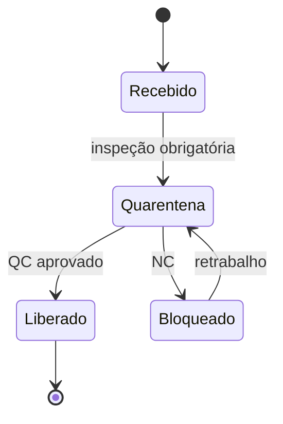

# FIFO, FEFO, lote e quarentena — física honesta *versus* relatório que «empilha»

**FIFO** (*first in, first out*) e **FEFO** (*first expired, first out*) são **regras de saída física** — dizem qual unidade sai primeiro quando há escolha. **Lote** e **validade** transformam essa escolha em **compliance** (saúde, alimento, químico, farmacêutico) e em **recall** possível. **Quarentena** é **estado**: estoque existe, mas **não promete** até liberação.

Esta aula separa com clareza **o que a doca faz** do **o que o contador mostra** — sem ensinar contabilidade tributária (varia por país e regra fiscal vigente).

---

## Objetivos e resultado de aprendizagem

**Ao final desta aula**, você será capaz de:

- Definir FIFO, FEFO e quando cada um é **mandatório** *vs.* «boa prática».  
- Relacionar **lote/validade** com rastreabilidade e decisão de bloqueio.  
- Desenhar estados de **quarentena** e handoff com qualidade.  
- Explicar por que **LIFO** aparece no debate corporativo e por que **física** e **camada contábil** não são sinônimos.

**Duração sugerida:** 60–75 minutos.

---

## Gancho — o iogurte «dentro da validade» na prateleira errada

Na **TechLar**, o WMS sugeria FIFO por endereço, mas o operador **empilhou** recebimento novo na frente do antigo em **drive-in** mal sinalizado. O FEFO «no papel» virou FIFO **na gravidade**. A falha foi **engenharia de slot** + **treino**, não «maldade» — mas o cliente sentiu como **qualidade**.

**Analogia do estacionamento:** se o carro novo bloqueia o antigo, o primeiro a entrar **não** é o primeiro a sair — a menos que você desenhe **vaga** e **regra** que tornem isso inevitável.

---

## Mapa do conteúdo

- FIFO *vs.* FEFO: decisão física e impacto em **risco**.  
- Lote/validade: **rastreabilidade** ponta a ponta.  
- Quarentena e liberação: **ATP** honesto (ponte para ERP na trilha Tecnologia).  
- LIFO: **delimitação** cuidadosa.

---

## Conceito núcleo — FIFO e FEFO

- **FIFO:** o material que entrou **primeiro** deve sair **primeiro** quando a idade importa ou quando se quer **envelhecimento uniforme** do estoque.  
- **FEFO:** prioriza **validade mais próxima**, independentemente da ordem de entrada — comum quando o risco é **vencimento**, não só idade média.

**Quando FEFO manda:** perecíveis e muitos regulados. **Quando FIFO ainda é sensato:** itens sem validade, mas com **obsolescência** por modelo/ano (moda, eletrônico) — aqui o «F» de *expired* vira **obsolescência funcional**, não data impressa.

**Legenda:** estados típicos; nomes reais variam por empresa e sistema.

---

## Lote e rastreabilidade — o fio condutor do recall

**Lote** (batch) permite **cirurgia** no problema: recolher só o que precisa. Sem lote confiável, o recall vira **medofluter** — tudo para, tudo volta, custo explode.

**Consenso de mercado:** integrar **recebimento → armazenagem → picking** com o **mesmo identificador de lote** é tanto **operação** quanto **marca** (GS1 como *tipo* de padrão de identificação: https://www.gs1.org/).

---

## LIFO — o que esta aula **não** faz

**LIFO** (*last in, first out*) aparece em discussões **contábeis/fiscais** em algumas jurisdições — **não** confunda com «empilhar caminhão mal». Do ponto de vista **físico**, muitas cadeias **operam** FIFO/FEFO por segurança e compliance, **independentemente** da camada de avaliação contábil.

**Declaração explícita:** não ensine «fazer LIFO físico» para contornar regra fiscal; isso é **área de contador e advogado**. Aqui, o aprendizado é **vocabulário** e **alinhamento** entre operações, finanças e compliance.

---

## Aplicação — exercício

Para **três** cenários (B2C perecível; B2B contratual com inspeção por lote; peça industrial sem validade mas com **rastre regulatório**), descreva em **5 passos** o fluxo «qual lote sair» incluindo **exceção** (lote bloqueado, lote em quarentena).

**Gabarito pedagógico:** em todos os casos deve aparecer **estado** (liberado/bloqueado), **prioridade** (FEFO onde aplicável) e **registro** — sem «decidir na pressa na doca».

---

## Erros comuns e armadilhas

- Misturar lotes **incompatíveis** no mesmo endereço sem política escrita.  
- FEFO «no sistema» com **endereço físico** que impede FIFO real.  
- Liberar **ATP** antes de QC «por pressa de mês».  
- SKU sem **capacidade** de capturar lote no canal (e-commerce) — rastre quebra na última milha.  
- Chamar «FIFO» o que é só **política de preço** médio no relatório.

---

## KPIs e decisão

- **% saídas** conforme regra declarada (amostragem de auditoria interna).  
- **Idade média** do estoque por família (cuidado com promoções).  
- **Incidentes** de mistura de lote / NC por fornecedor.

---

## Fechamento — três takeaways

1. FIFO/FEFO são **decisões físicas** — não slogans de ERP.  
2. Quarentena é **estado de promessa**; ignorá-la corrompe **ATP** e reputação.  
3. LIFO na conversa costuma ser **contábil** — traduza com o financeiro, não brigue na empilhadeira.

**Pergunta de reflexão:** onde na sua operação o **físico** e o **sistema** divergem mais — recebimento, picking ou expedição?

---

## Referências

1. GS1 — identificação e rastreabilidade: https://www.gs1.org/  
2. CHOPRA, S.; MEINDL, P. *Supply Chain Management*. Pearson.  
3. Trilha Tecnologia — [estoque e movimentos](../../trilha-tecnologia-e-sistemas/modulo-02-erp-aplicado-supply-chain/aula-02-stock-movimentos.md) (disponível *versus* bloqueado).
