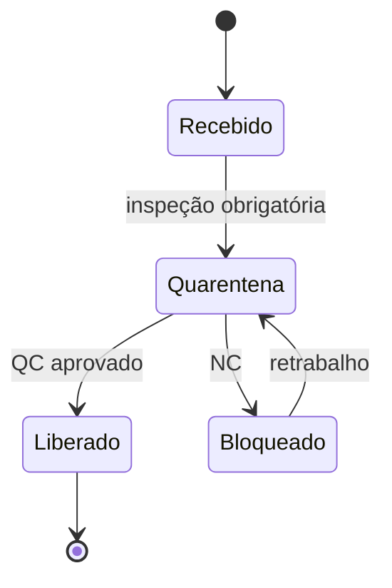
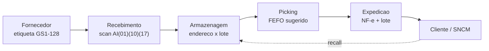

# FIFO, FEFO, lote e quarentena — física honesta *versus* relatório que «empilha»

**FIFO** (*first in, first out*) e **FEFO** (*first expired, first out*) são **regras de saída física** — dizem qual unidade sai primeiro quando há escolha. **Lote** e **validade** transformam essa escolha em **compliance** (saúde, alimento, químico, farmacêutico) e em **recall** possível. **Quarentena** é **estado**: estoque existe, mas **não promete** até liberação.

Esta aula separa com clareza **o que a doca faz** do **o que o contador mostra** — sem ensinar contabilidade tributária (varia por país e regra fiscal vigente).

---

## Objetivos e resultado de aprendizagem

**Ao final desta aula**, você será capaz de:

- Definir FIFO, FEFO e quando cada um é **mandatório** *vs.* «boa prática».  
- Relacionar **lote/validade** com rastreabilidade e decisão de bloqueio.  
- Desenhar estados de **quarentena** e handoff com qualidade.  
- Explicar por que **LIFO** aparece no debate corporativo e por que **física** e **camada contábil** não são sinônimos.

**Duração sugerida:** 60–75 minutos.

---

## Gancho — o iogurte «dentro da validade» na prateleira errada

Na **TechLar**, o WMS sugeria FIFO por endereço, mas o operador **empilhou** recebimento novo na frente do antigo em **drive-in** mal sinalizado. O FEFO «no papel» virou FIFO **na gravidade**. A falha foi **engenharia de slot** + **treino**, não «maldade» — mas o cliente sentiu como **qualidade**.

**Analogia do estacionamento:** se o carro novo bloqueia o antigo, o primeiro a entrar **não** é o primeiro a sair — a menos que você desenhe **vaga** e **regra** que tornem isso inevitável.

---

## Mapa do conteúdo

- FIFO *vs.* FEFO: decisão física e impacto em **risco**.  
- Lote/validade: **rastreabilidade** ponta a ponta.  
- Quarentena e liberação: **ATP** honesto (ponte para ERP na trilha Tecnologia).  
- LIFO: **delimitação** cuidadosa.

---

## Conceito núcleo — FIFO, FEFO, LIFO e a tabela de decisão

- **FIFO** (*first in, first out*): o material que entrou **primeiro** deve sair **primeiro** quando a idade importa ou quando se quer **envelhecimento uniforme** do estoque.  
- **FEFO** (*first expired, first out*): prioriza **validade mais próxima**, independentemente da ordem de entrada — comum quando o risco é **vencimento**, não só idade média.
- **LIFO** (*last in, first out*): física raríssima — geralmente é **camada contábil/fiscal** (proibida pelo CPC/IFRS no Brasil para avaliação fiscal de estoque, mas usada nos EUA por *cost flow assumption*). **Fisicamente** aparece em pilhas verticais sem rotação (ex.: areia, britanha, granéis a céu aberto) — e quase sempre é **acidente disfarçado de método**.

**Tabela de decisão — qual regra a doca usa?**

| Setor / categoria | Regra primária | Regra secundária | Por quê |
|-------------------|----------------|-------------------|---------|
| Farma (Anvisa RDC 430/20, 658/22) | **FEFO** | quarentena obrigatória | risco regulatório + saúde |
| Alimentos perecíveis (RDC 275/02; FSSC 22000) | **FEFO** | FIFO em ambiente | shelf life curto |
| Alimentos não perecíveis | FIFO | FEFO em campanha | prazo > 12 meses |
| Cosméticos/saúde | FEFO | rastre por lote | RDC 752/22 |
| Químicos / agrotóxicos | FEFO + segregação | classe NBR 14619 | compatibilidade |
| Eletrônicos | **FIFO funcional** | obsolescência por modelo | ciclo de produto curto |
| Moda/têxtil | FIFO de coleção | revisão sazonal | desvalorização rápida |
| Auto-peças aftermarket | FIFO | FEFO em borrachas | composição envelhece |
| Metalurgia/granel | normalmente sem regra | FIFO contábil | física = LIFO «cego» |

**Regra de bolso BR:** se o produto tem **validade impressa**, o WMS deve sugerir FEFO; se tem **número de série** (eletro), FIFO ajuda controlar revisão técnica e DSV (data de saída válida) para garantia.

**Quando FEFO manda:** perecíveis e muitos regulados. **Quando FIFO ainda é sensato:** itens sem validade, mas com **obsolescência** por modelo/ano (moda, eletrônico) — aqui o «F» de *expired* vira **obsolescência funcional**, não data impressa.

**Legenda:** estados típicos; nomes reais variam por empresa e sistema.

---

## Lote, rastreabilidade e GS1-128 — o fio condutor do recall

**Lote** (batch) permite **cirurgia** no problema: recolher só o que precisa. Sem lote confiável, o recall vira **«medo difuso»** — tudo para, tudo volta, custo explode.

**Padrão GS1-128 (ex-EAN-128) com Application Identifiers (AIs):**

| AI | Significado | Exemplo |
|----|-------------|---------|
| `(01)` | GTIN (código global do item) | `(01)07891234567890` |
| `(10)` | Lote / batch | `(10)ABC2026045` |
| `(17)` | Validade (AAMMDD) | `(17)270615` (15-jun-2027) |
| `(21)` | Número de série | `(21)SN0001234` |
| `(310n)` | Peso líquido (kg, n decimais) | `(3103)001250` (1,250 kg) |
| `(00)` | SSCC — etiqueta lógica de palete | `(00)106123412345678901` |

Em farma BR, a **rastreabilidade unitária por DataMatrix** segue **RDC 157/22 / Lei 13.410/16 (SNCM)** — todo medicamento prescrito deve carregar GTIN + lote + validade + serial em **2D**.

**Recall caso real (referência):** *recall* de iogurte da Danone Brasil em 2018 (lote específico de morango); empresas com FEFO + GS1 confiável conseguem isolar o lote em horas; sem isso, o recall escala para a marca inteira.

**Consenso de mercado:** integrar **recebimento → armazenagem → picking** com o **mesmo identificador de lote** é tanto **operação** quanto **marca** (GS1: https://www.gs1.org/, GS1 Brasil: https://www.gs1br.org/).

**Legenda:** o lote é o «DNA» da carga; sem ele, a seta de *recall* não tem para onde voltar.

---

## LIFO — o que esta aula **não** faz

**LIFO** (*last in, first out*) aparece em discussões **contábeis/fiscais** em algumas jurisdições — **não** confunda com «empilhar caminhão mal». Do ponto de vista **físico**, muitas cadeias **operam** FIFO/FEFO por segurança e compliance, **independentemente** da camada de avaliação contábil.

**Declaração explícita:** não ensine «fazer LIFO físico» para contornar regra fiscal; isso é **área de contador e advogado**. Aqui, o aprendizado é **vocabulário** e **alinhamento** entre operações, finanças e compliance.

---

## Aplicação — exercício

Para **três** cenários (B2C perecível; B2B contratual com inspeção por lote; peça industrial sem validade mas com **rastre regulatório**), descreva em **5 passos** o fluxo «qual lote sair» incluindo **exceção** (lote bloqueado, lote em quarentena).

**Gabarito pedagógico:** em todos os casos deve aparecer **estado** (liberado/bloqueado), **prioridade** (FEFO onde aplicável) e **registro** — sem «decidir na pressa na doca».

---

## Erros comuns e armadilhas

- Misturar lotes **incompatíveis** no mesmo endereço sem política escrita.  
- FEFO «no sistema» com **endereço físico** que impede FIFO real.  
- Liberar **ATP** antes de QC «por pressa de mês».  
- SKU sem **capacidade** de capturar lote no canal (e-commerce) — rastre quebra na última milha.  
- Chamar «FIFO» o que é só **política de preço** médio no relatório.

---

## Aprofundamentos — variações setoriais

| Setor | Cenário típico | Política e armadilhas |
|-------|----------------|------------------------|
| **Farma (laboratório)** | medicamento controlado lista C1 (Portaria 344/98) | quarentena obrigatória pós-recebimento; FEFO sistemático; movimentação só com QF |
| **Cold chain (vacinas)** | cadeia 2–8°C; PNI/MS | logger de temperatura por palete; FEFO **+** validade térmica; BR usou Pfizer −70°C em 2021 |
| **Alimento (carne/laticínio)** | SIF, validade 5–60 dias | FEFO + segregação SIF/SISBI; rotular CSE/CSI |
| **Agro (defensivos)** | NR-31, classe toxicológica | armazenagem segregada + EPI; FEFO + bula |
| **Auto-peças** | aftermarket + OEM | OEM = série única (sem mistura); aftermarket = FIFO funcional |
| **E-commerce moda** | obsolescência por coleção | FIFO de coleção; *outlet* na coleção n−1 |
| **Borracha/composto técnico** | envelhecimento mesmo sem uso | FEFO funcional (data de fabricação + 24 meses) |

---

## Erros comuns e armadilhas (com mitigações)

- Misturar lotes **incompatíveis** no mesmo endereço sem política escrita → política de «1 endereço = 1 lote» quando giro permite.
- FEFO «no sistema» com **endereço físico** que impede FIFO real → revisão de slot + drive-in só para AX homogêneo.
- Liberar **ATP** antes de QC «por pressa de mês» → bloqueio automático em status `Quarentena` / movimento 322 SAP.
- SKU sem **capacidade** de capturar lote no canal (e-commerce) → adicionar `batch_id` ao OMS.
- Chamar «FIFO» o que é só **política de preço médio** no relatório (custo médio ponderado) → educar finanças com glossário interno.
- **Drive-in** com FEFO declarado: a gravidade ganha sempre — usar drive-thru ou push-back.
- **Re-etiquetagem** de lote sem trilha de auditoria → bloqueio sistêmico, exige aprovação dupla.

---

## O que vira dado no sistema (campos/eventos)

| Campo / movimento | Sistema típico | Função |
|---|---|---|
| `batch` (`MCH1-CHARG`) | SAP MM | identificador de lote |
| `expiration_date` (`MCH1-VFDAT`) | SAP MM | base de FEFO |
| status `Q` (quarentena) → mov. 321/322 | SAP MM | libera/bloqueia para venda |
| `country_of_origin`, `manufacturing_date` | dados mestres lote | rastreabilidade |
| evento `LB10` (transferência) | WMS SAP EWM | rastrear movimento físico |
| `serial_number` (item-level) | OMS/WMS | farma/eletrônico |
| `recall_flag` + `recall_reason` | custom no ERP | bloqueio de venda + comunicado |

---

## KPIs e decisão (tabela)

| KPI | Pergunta | Dono | Fonte | Cadência | Playbook |
|-----|----------|------|-------|----------|----------|
| **% saídas conforme regra (FIFO/FEFO)** | A doca obedece o sistema? | WMS lead | auditoria amostral semanal | Semanal | Treinar; revisar slot |
| **Idade média do estoque** por família | Estamos envelhecendo? | Planejamento | ERP (data lote) | Mensal | Ação comercial em > X dias |
| **% lote em quarentena > SLA QC** | QC virou gargalo? | Qualidade | LIMS/ERP | Diário | Reforço QC; lote por exceção |
| **Incidentes mistura lote / NC** | Falha física ou de cadastro? | Ops + QA | NC log | Mensal | RCA por fornecedor |
| **Tempo de recall simulado** (drill anual) | Conseguimos isolar o lote? | QA | exercício GMP | Anual | Reduzir até < 4 h |
| **% lotes com validade < 30 dias** sem ação | Vamos perder? | Comercial + Plan. | ERP | Semanal | Promo, doação, baixa |

---

## Ferramentas e tecnologias relevantes

| Tecnologia | Quando usar | Limites |
|------------|-------------|---------|
| **Coletor RF + GS1-128** | qualquer CD com lote | requer master data limpo |
| **WMS com FEFO automático** (SAP EWM, Manhattan, Infor, Mecalux Easy WMS) | farma, alimento, cosmético | configuração de zona = chave |
| **DataMatrix 2D + serialização** | farma SNCM, anti-falsificação | infra de leitura unitária |
| **RFID UHF passivo** | alta movimentação, evita line-of-sight | metal/líquido distorce sinal |
| **Sensores de temperatura IoT (Sigfox/LoRa)** | cold chain | bateria + calibração trimestral |
| **LIMS** (Laboratory Information Management) | controle de QC | só faz sentido com QC interno |

---

## Glossário rápido

- **Batch / lote:** quantidade produzida sob mesmas condições.
- **Cut-off de mês:** prazo contábil para movimentos do período.
- **DSV / shelf life:** prazo de validade.
- **GS1-128:** padrão de código de barras com AIs.
- **GMP** (*good manufacturing practices*): boas práticas de fabricação.
- **NC:** não-conformidade (relatório formal).
- **QC:** controle de qualidade.
- **Quarentena:** estado físico+sistêmico que impede venda.
- **Recall:** recolhimento por defeito/risco.
- **Shrinkage:** perda total não atribuída a venda.
- **SNCM:** Sistema Nacional de Controle de Medicamentos.

---

## Fechamento — três takeaways

1. FIFO/FEFO são **decisões físicas** — não slogans de ERP.  
2. Quarentena é **estado de promessa**; ignorá-la corrompe **ATP** e reputação.  
3. LIFO na conversa costuma ser **contábil** — traduza com o financeiro, não brigue na empilhadeira.

**Pergunta de reflexão:** onde na sua operação o **físico** e o **sistema** divergem mais — recebimento, picking ou expedição?

---

## Referências

1. GS1 — identificação e rastreabilidade: https://www.gs1.org/  
2. GS1 Brasil: https://www.gs1br.org/  
3. ANVISA — RDC 430/20 (boas práticas de distribuição) e RDC 657/22 / Lei 13.410/16 (SNCM): https://www.gov.br/anvisa  
4. ABNT NBR 14619 — segregação de produtos perigosos.  
5. FRAZELLE, E. *World-Class Warehousing and Material Handling*. McGraw-Hill.  
6. BOWERSOX, D. J.; et al. *Supply Chain Logistics Management*.  
7. CHOPRA, S.; MEINDL, P. *Supply Chain Management*. Pearson.  
8. ABRALOG e ILOS — benchmarks de operações.

---

## Pontes para outras trilhas

- **Tecnologia:** [estoque e movimentos no ERP](../../trilha-tecnologia-e-sistemas/modulo-02-erp-aplicado-supply-chain/aula-02-stock-movimentos.md) (disponível × bloqueado), [WMS — recebimento e armazenagem](../../trilha-tecnologia-e-sistemas/modulo-03-wms/aula-02-recebimento-armazenagem.md).
- **Dados:** [qualidade e viés de demanda](../../trilha-dados-analytics-logistica/modulo-01-data-analytics-para-logistica/aula-02-qualidade-vies-demanda-fantasma.md).
- **Operações** (esta trilha): [ABC/XYZ](aula-01-politicas-abc-servico-custo-capital.md) e [cobertura/IRA](aula-03-cobertura-inventario-acuracia.md).
