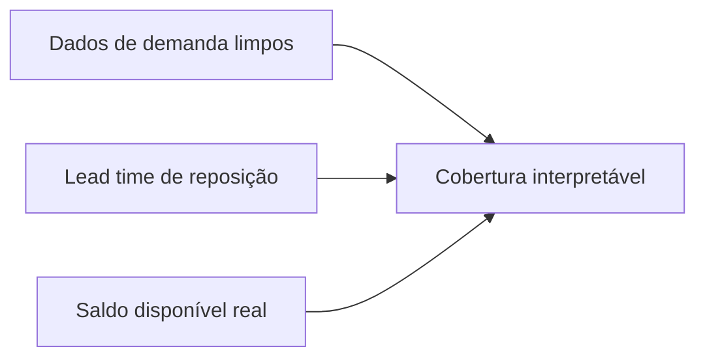
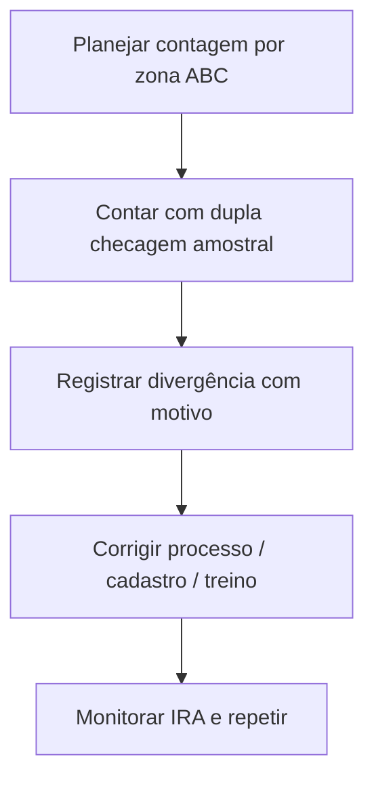

# Cobertura, inventário cíclico e acurácia — quando o número «bonito» esconde o buraco na prateleira

**Cobertura em dias** parece inofensiva: «temos 45 dias de estoque». Mas o denominador (demanda diária) pode estar **contaminado** por promoção, **backorder** mascarado ou canal errado — e aí a cobertura vira **romance**. **Inventário cíclico** e **acurácia de registro** (*inventory record accuracy*, IRA) são os **freios** que impedem o romance de virar **acidente**.

Esta aula foca **programa operacional** e **comportamento**; fórmulas detalhadas de painel ficam na trilha **Dados** (hiperlink abaixo).

---

## Objetivos e resultado de aprendizagem

**Ao final desta aula**, você será capaz de:

- Calcular e **interpretar** cobertura em dias com olho clínico para armadilhas do denominador.  
- Desenhar um programa mínimo de **inventário cíclico** por ABC.  
- Explicar **acurácia** como mérica de confiança no registro — e listar causas raiz típicas.  
- Relacionar **shrinkage** com processo, não só com «furto».

**Duração sugerida:** 60–90 minutos (inclui exercício numérico curto).

---

## Gancho — a cobertura inflada da TechLar

O painel mostrava **60 dias** de cobertura para uma família B2B. Na prateleira, **gargalo** e **mix quebrado**: o denominador usou demanda **média** de um mês com **backorder** alto — a demanda «realizável» estava subestimada, a cobertia **superestimada**. O planejamento relaxou; o **OTIF** caiu. **Métrica mal definida** é **decisão mal tomada**.

**Analogia da autonomia do celular:** «48 horas de bateria» baseada em **tela desligada** não ajuda quem usa GPS o dia inteiro.

---

## Mapa do conteúdo

- Definições operacionais de cobertura.  
- Inventário físico *vs.* cíclico *vs.* perpétuo com auditoria.  
- IRA e *shrinkage*.  
- PDCA mínimo quando a contagem diverge.

---

## Conceito núcleo — cobertura em dias

Definição pedagógica comum:

\[
\text{cobertura (dias)} \approx \frac{\text{estoque disponível (unidades)}}{\text{demanda diária média (unidades/dia)}}
\]

**Armadilhas do denominador:**

- **Promoção** que distorce a média.  
- **Canal** misturado (B2B estável + marketplace volátil).  
- **Demanda reprimida** (pedidos cancelados ou atrasados «escondem» a real necessidade).  

**Regra prática:** para decisão, compare **cobertura** com **percentis de lead time** de reposição (ver trilha Dados — [lead time e variabilidade](../../trilha-dados-analytics-logistica/modulo-04-indicadores-logisticos-kpis/aula-02-lead-time-variabilidade-logistica.md)).

**Legenda:** se **D** ou **L** estiverem sujos, **C** é arte.

---

## Inventário cíclico — ritmo, não heroísmo

**Inventário anual** «para fechar o ano» deixa o resto do ano **cego**. **Cíclico** por ABC (A mais frequente, C menos) distribui o esforço e treina **causa raiz**.

**Programa-padrão BR (consenso de mercado, calibrar com seu mix):**

| Classe | Frequência mínima | Janela | Cobertura anual de SKUs |
|--------|-------------------|--------|--------------------------|
| **A** | mensal (ou quinzenal) | 1ª segunda do mês, sem movimento na zona | 12× |
| **B** | trimestral | sábado tarde | 4× |
| **C** | semestral | janela longa | 2× |
| **A em câmara fria/farma** | semanal | turno extra | 52× |

**Esforço estimado** (regra-de-bolso): 1 contador conta **120–180 endereços/dia** em palete; **800–1.200 SKUs/dia** em pick face com coletor RF. Para um CD com **15.000 SKUs** (3.000 A, 4.500 B, 7.500 C), o programa pede ~ `3000 × 12 + 4500 × 4 + 7500 × 2 = 69.000` contagens/ano → ~ **5–6 contadores dedicados** em jornada normal.

**Tipos de inventário e quando usar:**

| Tipo | Vantagem | Limite |
|------|----------|--------|
| **Geral** (anual) | exigência fiscal antiga + cobertura total | trava operação 2–5 dias |
| **Cíclico ABC** | aprende causa raiz, sem trava | exige IRA por endereço |
| **Por exceção / dirigido** (gatilho: divergência de pick) | foco no problema | só vê o sintoma |
| **Blind count** (contador sem ver saldo) | reduz «fechar para bater» | mais lento |
| **Auditoria de 3ª contagem** | quando 1ª e 2ª divergem | ganha confiança

**Legenda:** loop PDCA; sem passo **A**, vira «passa pano» mensal.

---

## Acurácia (IRA) e *shrinkage* — fórmulas e números BR

**IRA — duas definições comuns** (escolha **uma** e seja fiel):

\[
\text{IRA}_{\text{linhas}} = \frac{\text{linhas (SKU} \times \text{endereço) sem divergência}}{\text{linhas auditadas}}
\]

\[
\text{IRA}_{\text{tolerância}} = \frac{\text{linhas com }|\Delta| \le \text{tolerância}}{\text{linhas auditadas}}
\]

A **tolerância** muda por categoria:

| Família | Tolerância típica |
|---------|-------------------|
| Eletrônico/serial | **0%** (un. única) |
| Pequeno volume embalado | ± 1 un. |
| Granel/peças porca | ± 2% do saldo |
| Líquido/pó | ± 0,5% |

**Benchmark de mercado (BR/global, ILOS/Frazelle):** WMS maduro entrega **IRA ≥ 99%** (linha) em A; **97–98%** geral é considerado «classe média». Abaixo de 95%, ATP fica romance.

***Shrinkage*** agrega perdas: **erro**, **dano**, **furto**, **processo** (pick errado não devolvido ao lugar certo), **administrativo** (cadastro errado).

\[
\text{Shrinkage \%} = \frac{\text{valor da perda}}{\text{vendas líquidas no período}}
\]

**Benchmark BR (ABRAS / Provar-FIA):**

| Setor | Shrinkage típico |
|-------|------------------|
| Supermercado BR | 1,8–2,3% das vendas |
| Drogaria BR | 1,2–1,5% |
| Farma distribuidor | 0,3–0,8% |
| E-commerce (B2C) | 0,8–1,4% (devolução-fraude inclusa) |
| Indústria CD | 0,2–0,5% |

Operações fortes tratam *shrink* como **Pareto de causas** (Tabela A: erro de picking 35%, dano interno 18%, dano transporte 15%, *missing* recebimento 12%, furto 10%, outros 10%) — **não** só «segurança patrimonial».

---

## Aplicação — exercício numérico

Estoque disponível: **900** unidades. Demanda média diária «crua» dos últimos 30 dias: **30**/dia — mas **10** dias foram promoção com média **60**/dia e os outros 20 dias média **15**/dia.

1. Calcule a cobertura usando a **média crua** dos 30 dias.  
2. Explique por que a cobertura pode **mentir** para decisão de reposição.  
3. Proponha **uma** correção de método (ex.: excluir promoção, usar demanda «regular», usar percentil).

**Gabarito pedagógico:** média total = \((10×60 + 20×15)/30 = 30\) → cobertura crua = \(900/30 = 30\) dias; a mentira está em **misturar regimes**; mitigação: segmentar demanda base *vs.* promoção ou usar **janela** representativa.

---

## Erros comuns e armadilhas

- Cobertura global para **SKU crítico** (A escondido em média).  
- Contagem sem **congelamento** de movimento ou sem regra de **corte** de horário.  
- Ajuste «para bater» sem **motivo** rastreável no ERP/WMS.  
- Culpar **operador** antes de **layout** e **master data** (endereço fantasma).  
- Inventário cíclico sem **amostragem** de qualidade nas contagens A.

---

## O que vira dado no sistema

| Campo / evento | Sistema | Função |
|---|---|---|
| `LX02` (estoque por endereço) | SAP WM/EWM | foto da posição |
| `MI01/MI04/MI07` (criar, contar, lançar) | SAP MM | ciclo de inventário |
| `count_diff` + `motivo` (custom) | WMS | causa-raiz codificada |
| `shrinkage_acct` (mov. 711/712 SAP) | ERP | escrituração da perda |
| evento `cycle_count_completed` | WMS | dispara recontagem se Δ > tol. |
| `IRA_zone_pct` (KPI BI) | BI | dashboard ops |

---

## Trade-offs — capital × serviço × esforço de contagem

| Alavanca | Capital | Serviço | OPEX inventário | Risco |
|----------|:-------:|:-------:|:---------------:|:-----:|
| Inventário só anual | ↓ esforço | ↓ confiança ATP | ↓ | ↑↑ ruptura silenciosa |
| Cíclico ABC | ↔ | ↑↑ | ↑ | ↓ |
| RFID com leitura 24/7 | ↑ CAPEX | ↑↑↑ | ↓↓ recorrente | ↓ |
| Auditoria por exceção | ↓ | ↑ | ↓ | ↑ se IRA já fraco |

---

## KPIs e decisão (tabela)

| KPI | Pergunta | Dono | Fonte | Cadência | Playbook |
|-----|----------|------|-------|----------|----------|
| **IRA por zona** | Confiança no saldo? | WMS lead | contagem cíclica | Semanal | Reforço treino + slot |
| **Cobertura em dias** por classe | Quanto durarei? | Planejamento | ERP + venda | Semanal | Ajustar ROP |
| **Divergência $ por contagem** | Tamanho do problema? | Controladoria + Ops | ERP MI | Mensal | Pareto motivos |
| **Shrinkage % vendas** | Estamos perdendo capital? | Diretor logística | finanças | Mensal | Top-3 causas com plano |
| **% endereços fantasma** (saldo > 0 sem item) | Cadastro sujo? | Master data | WMS | Mensal | Limpeza de dados |
| **Tempo médio recontagem** | Loop fechando? | WMS lead | log | Semanal | Capacitar contadores |
| **Lost sales por ruptura** | Cliente sentiu? | Comercial | OMS cancel | Mensal | Subir SS de A |

Para **giro/cobertura** em painel, alinhar com: [giro e cobertura na trilha Dados](../../trilha-dados-analytics-logistica/modulo-04-indicadores-logisticos-kpis/aula-03-giro-cobertura-estoque-capital.md).

---

## Ferramentas e tecnologias

| Tecnologia | Quando | Quando não |
|------------|--------|------------|
| **Coletor RF + WMS** | qualquer CD organizado | sem master data, vira poesia |
| **RFID UHF** | mix homogêneo, alta movimentação (varejo moda — Renner, Zara) | metal/líquido, baixo giro |
| **Visão computacional / drones** | inventário de céu de palete em CD alto (10–14 m) | layout misto |
| **Cycle count app móvel** | times distribuídos | WMS já oferece |

---

## Glossário rápido

- **ATP:** *available to promise*.
- **Cycle count:** inventário cíclico/rotativo.
- **IRA:** *inventory record accuracy*.
- **Lost sale:** venda perdida por ruptura.
- **Shrinkage:** perda total não atribuída a venda.
- **Tolerância:** desvio aceitável antes de classificar como divergência.
- **Master data:** cadastro mestre (SKU, endereço, fornecedor).

---

## Fechamento — três takeaways

1. Cobertura sem **denominador honesto** é autoengano com decimal.  
2. Inventário cíclico é **treino de musculatura** de dados e processo.  
3. IRA baixa é **imposto oculto** em tudo que depende de saldo.

**Pergunta de reflexão:** qual família de produto tem **boa cobertura no slide** e **má disponibilidade na prateleira**?

---

## Referências

1. BOWERSOX, D. J.; CLOSS, D. J.; COOPER, M. B.; BOWERSOX, J. C. *Supply Chain Logistics Management*. McGraw-Hill.  
2. FRAZELLE, E. *Inventory Strategy*. McGraw-Hill.  
3. ABRAS / Provar-FIA — *Avaliação de perdas no varejo brasileiro* (anual): https://www.abras.com.br/  
4. ILOS — *Panorama Logística Brasil* (anual): https://www.ilos.com.br/  
5. CSCMP — glossário: https://cscmp.org/CSCMP/cscmp/educate/scm_definitions_and_glossary_of_terms.aspx  
6. Trilha Dados — [giro e cobertura](../../trilha-dados-analytics-logistica/modulo-04-indicadores-logisticos-kpis/aula-03-giro-cobertura-estoque-capital.md).

---

## Pontes para outras trilhas

- **Dados:** [lead time e variabilidade](../../trilha-dados-analytics-logistica/modulo-04-indicadores-logisticos-kpis/aula-02-lead-time-variabilidade-logistica.md), [qualidade de dados](../../trilha-dados-analytics-logistica/modulo-01-data-analytics-para-logistica/aula-02-qualidade-vies-demanda-fantasma.md).
- **Tecnologia:** [WMS e movimentos](../../trilha-tecnologia-e-sistemas/modulo-03-wms/README.md).
- **Fundamentos:** [estrutura de custos](../../trilha-fundamentos-e-estrategia/modulo-04-custos-logisticos-performance/aula-01-estrutura-custos-logisticos.md).
- **Operações** (esta trilha): [ABC/XYZ](aula-01-politicas-abc-servico-custo-capital.md), [FIFO/FEFO](aula-02-fifo-fefo-lote-quarentena.md).
