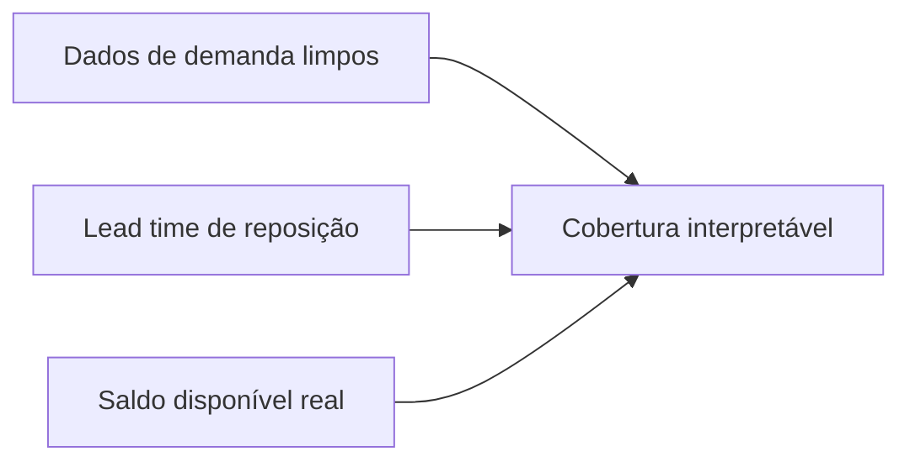
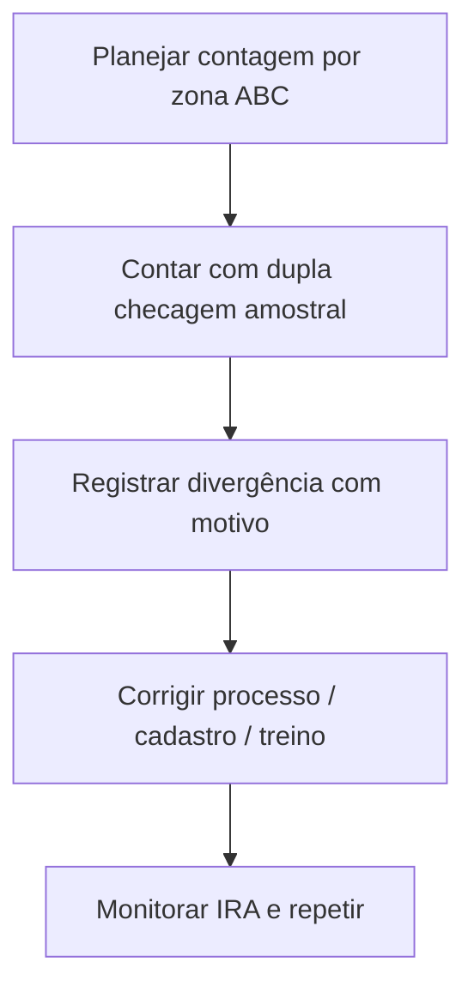

# Cobertura, inventário cíclico e acurácia — quando o número «bonito» esconde o buraco na prateleira

**Cobertura em dias** parece inofensiva: «temos 45 dias de estoque». Mas o denominador (demanda diária) pode estar **contaminado** por promoção, **backorder** mascarado ou canal errado — e aí a cobertura vira **romance**. **Inventário cíclico** e **acurácia de registro** (*inventory record accuracy*, IRA) são os **freios** que impedem o romance de virar **acidente**.

Esta aula foca **programa operacional** e **comportamento**; fórmulas detalhadas de painel ficam na trilha **Dados** (hiperlink abaixo).

---

## Objetivos e resultado de aprendizagem

**Ao final desta aula**, você será capaz de:

- Calcular e **interpretar** cobertura em dias com olho clínico para armadilhas do denominador.  
- Desenhar um programa mínimo de **inventário cíclico** por ABC.  
- Explicar **acurácia** como mérica de confiança no registro — e listar causas raiz típicas.  
- Relacionar **shrinkage** com processo, não só com «furto».

**Duração sugerida:** 60–90 minutos (inclui exercício numérico curto).

---

## Gancho — a cobertura inflada da TechLar

O painel mostrava **60 dias** de cobertura para uma família B2B. Na prateleira, **gargalo** e **mix quebrado**: o denominador usou demanda **média** de um mês com **backorder** alto — a demanda «realizável» estava subestimada, a cobertia **superestimada**. O planejamento relaxou; o **OTIF** caiu. **Métrica mal definida** é **decisão mal tomada**.

**Analogia da autonomia do celular:** «48 horas de bateria» baseada em **tela desligada** não ajuda quem usa GPS o dia inteiro.

---

## Mapa do conteúdo

- Definições operacionais de cobertura.  
- Inventário físico *vs.* cíclico *vs.* perpétuo com auditoria.  
- IRA e *shrinkage*.  
- PDCA mínimo quando a contagem diverge.

---

## Conceito núcleo — cobertura em dias

Definição pedagógica comum:

\[
\text{cobertura (dias)} \approx \frac{\text{estoque disponível (unidades)}}{\text{demanda diária média (unidades/dia)}}
\]

**Armadilhas do denominador:**

- **Promoção** que distorce a média.  
- **Canal** misturado (B2B estável + marketplace volátil).  
- **Demanda reprimida** (pedidos cancelados ou atrasados «escondem» a real necessidade).  

**Regra prática:** para decisão, compare **cobertura** com **percentis de lead time** de reposição (ver trilha Dados — [lead time e variabilidade](../../trilha-dados-analytics-logistica/modulo-04-indicadores-logisticos-kpis/aula-02-lead-time-variabilidade-logistica.md)).

**Legenda:** se **D** ou **L** estiverem sujos, **C** é arte.

---

## Inventário cíclico — ritmo, não heroísmo

**Inventário anual** «para fechar o ano» deixa o resto do ano **cego**. **Cíclico** por ABC (A mais frequente, C menos) distribui o esforço e treina **causa raiz**.

**Legenda:** loop PDCA; sem passo **A**, vira «passa pano» mensal.

---

## Acurácia e *shrinkage*

**IRA** (intuição): grau de concordância entre **registro** e **físico** por SKU/local. Baixa IRA destrói **MRP**, **ATP** e confiança no CD — mesmo com WMS caro.

***Shrinkage*** agrega perdas: **erro**, **dano**, **furto**, **processo** (pick errado não devolvido ao lugar certo). Operações fortes tratam *shrink* como **Pareto de causas**, não só «segurança patrimonial».

---

## Aplicação — exercício numérico

Estoque disponível: **900** unidades. Demanda média diária «crua» dos últimos 30 dias: **30**/dia — mas **10** dias foram promoção com média **60**/dia e os outros 20 dias média **15**/dia.

1. Calcule a cobertura usando a **média crua** dos 30 dias.  
2. Explique por que a cobertura pode **mentir** para decisão de reposição.  
3. Proponha **uma** correção de método (ex.: excluir promoção, usar demanda «regular», usar percentil).

**Gabarito pedagógico:** média total = \((10×60 + 20×15)/30 = 30\) → cobertura crua = \(900/30 = 30\) dias; a mentira está em **misturar regimes**; mitigação: segmentar demanda base *vs.* promoção ou usar **janela** representativa.

---

## Erros comuns e armadilhas

- Cobertura global para **SKU crítico** (A escondido em média).  
- Contagem sem **congelamento** de movimento ou sem regra de **corte** de horário.  
- Ajuste «para bater» sem **motivo** rastreável no ERP/WMS.  
- Culpar **operador** antes de **layout** e **master data** (endereço fantasma).  
- Inventário cíclico sem **amostragem** de qualidade nas contagens A.

---

## KPIs e decisão

- **IRA** por zona e por classe ABC.  
- **Divergência** média em valor e em linhas por evento de contagem.  
- ***Shrink*** como % de vendas ou % de movimentação (definição estável).

Para **giro/cobertura** em painel, alinhar com: [giro e cobertura na trilha Dados](../../trilha-dados-analytics-logistica/modulo-04-indicadores-logisticos-kpis/aula-03-giro-cobertura-estoque-capital.md).

---

## Fechamento — três takeaways

1. Cobertura sem **denominador honesto** é autoengano com decimal.  
2. Inventário cíclico é **treino de musculatura** de dados e processo.  
3. IRA baixa é **imposto oculto** em tudo que depende de saldo.

**Pergunta de reflexão:** qual família de produto tem **boa cobertura no slide** e **má disponibilidade na prateleira**?

---

## Referências

1. BOWERSOX, D. J.; CLOSS, D. J.; COOPER, M. B.; BOWERSOX, J. C. *Supply Chain Logistics Management*. McGraw-Hill.  
2. CSCMP — glossário: https://cscmp.org/CSCMP/cscmp/educate/scm_definitions_and_glossary_of_terms.aspx  
3. Trilha Dados — [giro e cobertura](../../trilha-dados-analytics-logistica/modulo-04-indicadores-logisticos-kpis/aula-03-giro-cobertura-estoque-capital.md).
