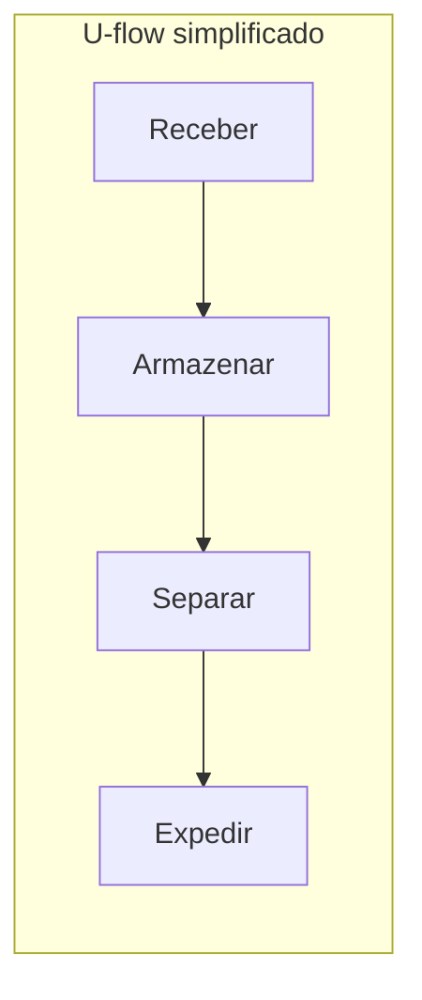
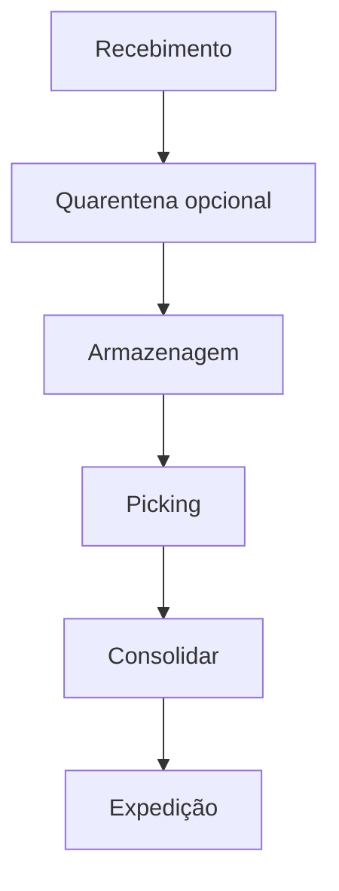

# Layout, zonas e docas — fluxo antes de boniteza

**Layout logístico** é a decisão de **quem cruza com quem** dentro do armazém: recebimento, armazenagem, picking, consolidação e expedição. Quando o fluxo é ruim, você paga em **tempo interno**, **erro de mix**, **acidente** e **capital parado** — mesmo com WMS excelente (o sistema só **registra** o caos com mais precisão).

---

## Objetivos e resultado de aprendizagem

**Ao final desta aula**, você será capaz de:

- Comparar **U-flow** e **through-flow** e dizer qual tende a reduzir cruzamento recebimento/expedição.  
- Definir **zonas** mínimas e **gargalos** típicos de doca.  
- Equilibrar **densidade de armazenagem** *vs.* **velocidade de picking** em linguagem de trade-off.  
- Propor **três KPIs** operacionais para medir «antes/depois» de mudança de layout.

**Duração sugerida:** 60–90 minutos.

---

## Gancho — a mesma doca para dois mundos

Na **TechLar**, recebimento de fornecedor **pesado** compartilhou doca com **expedição expressa**. Fila de caminhão virou atraso de **cut-off**; o comercial promoveu **OTD**; o CD virou vilão. A raiz foi **layout e janela**, não «preguiça».

**Analogia do aeroporto:** se desembarque e embarque disputam a mesma ponte sem **janela**, alguém perde voo — sempre.

---

## Mapa do conteúdo

- Objetivos de layout: **fluxo**, **segurança**, **expansibilidade**.  
- Zonas e distâncias não euclidianas (corredor, sentido único).  
- Docas: **capacidade** como recurso escasso.  
- Ponte breve para WMS (trilha Tecnologia).

---

## Conceito núcleo — U-flow *versus* through-flow

- **U-flow:** recebimento de um lado, expedição do outro, estoque no «meio» em forma de U — tende a **segregar** fluxos e reduzir interferência.  
- **Through-flow:** entrada e saída em lados opostos com travessia — pode ser ótimo para **alto throughput** linear, ruim se **misturar** fluxos sem disciplina.

**Legenda:** na vida, existem **subfluxos** (devolução, quarentena, *cross-dock*).

---

## Zonas e docas — capacidade esquecida

**Zonas** comuns: recebimento, inspeção, quarentena, armazenagem densa, picking rápido, consolidação, *staging*, expedição. **Erro clássico:** zona de *staging* pequena — vira **válvula** que trava picking mesmo com WMS verde.

**Doca** não é só «porta»: é **tempo** de ocupação, **equipamento** (rampa, *dock leveler*), **pessoas** de conferência. **Hipótese pedagógica:** muitos projetos dimensionam pallet positions e esquecem **minutos de doca por remessa**.

**Legenda:** setas são **fluxo nominal**; exceções ramificam (devolução, *cross-dock*).

---

## Densidade *versus* velocidade

Mais **densidade** (drive-in, estreitamento) frequentemente aumenta **tempo de acesso** e exige **disciplina** de endereço. Mais **velocidade** (pick face largo, redundância de face) consome **metros** e **capital** de espaço.

**Trade-off central:** metros quadrados *versus* minutos por linha — alinhar com financeiros como **custo de serviço interno**, não só aluguel.

---

## Ponte — WMS não desenha doca

O WMS executa **tarefas** em endereços; o **layout** decide se o endereço é **alcançável** com segurança. Ver: [onda e picking na trilha Tecnologia](../../trilha-tecnologia-e-sistemas/modulo-03-wms/aula-03-onda-picking-expedicao.md).

---

## Aplicação — exercício

Descreva **antes/depois** (meia página) movendo expedição expressa para **docas dedicadas** com *staging* ampliado. Liste **3 KPIs** (ex.: tempo médio doca ocupada, fila máxima, near-miss) e **meta** qualitativa.

**Gabarito pedagógico:** deve aparecer **capacidade de doca** e **fila**; se só falar de «motivar equipe», voltar ao desenho físico.

---

## Erros comuns e armadilhas

- Layout «bonito no CAD» sem **pico horário** de recebimento e expedição.  
- Misturar **B2B paletizado** com **B2C peça** na mesma corredoria sem regra.  
- Ignorar **PEV** e fluxo de empilhadeiras (near-miss vira *downtime*).  
- *Cross-dock* sem **sinalização** física clara.  
- Expandir armazenagem sem expandir **staging** de expedição.

---

## KPIs e decisão

- **Tempo interno** pedido→expedido (lead time interno).  
- **Utilização de doca** (ocupação % e fila).  
- **Congestionamento** por zona (contagem de espera ou amostragem de Gemba).

---

## Fechamento — três takeaways

1. Layout é **teoria dos jogos** interna: quem cruza com quem.  
2. Doca é **ativo** — trate como linha de produção, não como estacionamento.  
3. WMS acelera o certo; **layout** define se existe «certo» a acelerar.

**Pergunta de reflexão:** qual zona hoje é **gargalo invisível** no layout porque nunca foi desenhada — só «apareceu»?

---

## Referências

1. TOMPKINS, J. A. et al. *Facilities Planning* (como referência clássica de *facilities*).  
2. BOWERSOX, D. J.; et al. *Supply Chain Logistics Management*. McGraw-Hill.  
3. CHOPRA, S.; MEINDL, P. *Supply Chain Management*. Pearson.
