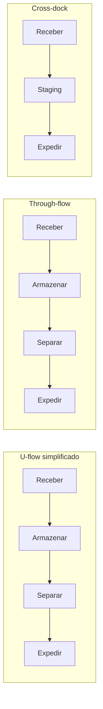
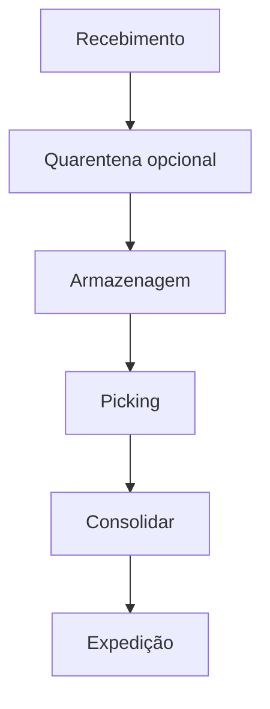

# Layout, zonas e docas — fluxo antes de boniteza

**Layout logístico** é a decisão de **quem cruza com quem** dentro do armazém: recebimento, armazenagem, picking, consolidação e expedição. Quando o fluxo é ruim, você paga em **tempo interno**, **erro de mix**, **acidente** e **capital parado** — mesmo com WMS excelente (o sistema só **registra** o caos com mais precisão).

---

## Objetivos e resultado de aprendizagem

**Ao final desta aula**, você será capaz de:

- Comparar **U-flow** e **through-flow** e dizer qual tende a reduzir cruzamento recebimento/expedição.  
- Definir **zonas** mínimas e **gargalos** típicos de doca.  
- Equilibrar **densidade de armazenagem** *vs.* **velocidade de picking** em linguagem de trade-off.  
- Propor **três KPIs** operacionais para medir «antes/depois» de mudança de layout.

**Duração sugerida:** 60–90 minutos.

---

## Gancho — a mesma doca para dois mundos

Na **TechLar**, recebimento de fornecedor **pesado** compartilhou doca com **expedição expressa**. Fila de caminhão virou atraso de **cut-off**; o comercial promoveu **OTD**; o CD virou vilão. A raiz foi **layout e janela**, não «preguiça».

**Analogia do aeroporto:** se desembarque e embarque disputam a mesma ponte sem **janela**, alguém perde voo — sempre.

---

## Mapa do conteúdo

- Objetivos de layout: **fluxo**, **segurança**, **expansibilidade**.  
- Zonas e distâncias não euclidianas (corredor, sentido único).  
- Docas: **capacidade** como recurso escasso.  
- Ponte breve para WMS (trilha Tecnologia).

---

## Conceito núcleo — U-flow, through-flow e flow-through (cross-dock)

| Layout | Como é | Quando serve | Quando dói |
|--------|--------|--------------|------------|
| **U-flow** | recebimento e expedição **no mesmo lado**, estoque «no fundo» do U | CD multi-cliente, mix médio, espaço limitado, equipe compartilhada | risco de cruzar fluxos sem disciplina |
| **Through-flow** (linear, *I-shape*) | entrada e saída em lados **opostos** | volumes altos e contínuos, pouca exceção (auto-peças) | dobra a área se há reentrada de devolução |
| **Flow-through / Cross-dock** | mercadoria entra e sai sem armazenagem (≤ 24 h) | varejo de moda fast-fashion, alimento perecível, e-commerce *fulfilment by marketplace* | exige sincronia ASN ↔ pedido |
| **L-shape** | meio termo, dobra em L | terreno irregular | layout subótimo |

**Regra de bolso (Frazelle / Tompkins):**

\[
\text{distância média de pick} \approx 0{,}5 \cdot L_{\text{corredor}} + 0{,}25 \cdot W_{\text{CD}}
\]

Reduzir essa distância em 10% costuma render **5–7%** em produtividade de picking.

**Dimensionamento típico de doca BR:**

| Parâmetro | Valor de referência |
|-----------|---------------------|
| Largura da doca | 3,3–3,7 m |
| Profundidade do *staging* atrás da doca | ≥ 1,5× a profundidade do veículo (16 m FTL → ~25 m) |
| Pé-direito útil | ≥ 12 m (CD moderno classe A); 14 m permite 5 níveis de palete BR |
| Carga útil do piso | ≥ 5 t/m² (NBR 6118 + projeto estrutural) |
| Área por palete em estoque | 1,2–1,5 m² (porta-palete frontal seletivo) |
| Densidade típica drive-in | 35–45% mais densa, mas −30% velocidade pick |
| Quantidade de docas | 1 doca / 800–1.500 m² em CD intermediário |

**Legenda:** na vida, existem **subfluxos** (devolução, quarentena, *cross-dock parcial*); o desenho deve nomear cada um.

---

## Zonas e docas — capacidade esquecida

**Zonas** comuns: recebimento, inspeção, quarentena, armazenagem densa, picking rápido, consolidação, *staging*, expedição. **Erro clássico:** zona de *staging* pequena — vira **válvula** que trava picking mesmo com WMS verde.

**Doca** não é só «porta»: é **tempo** de ocupação, **equipamento** (rampa, *dock leveler*), **pessoas** de conferência. **Hipótese pedagógica:** muitos projetos dimensionam pallet positions e esquecem **minutos de doca por remessa**.

**Legenda:** setas são **fluxo nominal**; exceções ramificam (devolução, *cross-dock*).

---

## Densidade *versus* velocidade

Mais **densidade** (drive-in, estreitamento) frequentemente aumenta **tempo de acesso** e exige **disciplina** de endereço. Mais **velocidade** (pick face largo, redundância de face) consome **metros** e **capital** de espaço.

**Comparativo de sistemas de armazenagem (BR):**

| Sistema | Densidade (palete/m²) | Acesso direto | Aluguel típico R$/posição/mês* | Indicado para |
|---------|------------------------|----------------|-------------------------------|----------------|
| Porta-palete seletivo | ~ 0,8 | 100% | 90–140 | A/B variado, FEFO |
| Drive-in | ~ 1,5 | LIFO | 70–110 | A homogêneo, longo prazo |
| Drive-thru | ~ 1,4 | FIFO | 80–120 | A homogêneo + FIFO |
| Push-back | ~ 1,2 | LIFO 4–5 fundos | 110–150 | mix médio |
| Dinâmico (gravity flow) | ~ 1,3 | FIFO | 200–300 | alto giro pick |
| Verticalizado VNA / *very narrow aisle* | ~ 1,6 | 100% | 100–150 | terreno caro (SP capital) |
| Mezanino | ~ 2× área útil | 100% | 60–90 | peça pequena |
| Câmara fria/congelado (−18°C) | ~ 0,7 | 100% | **220–400** | farma, frigorífico |
| Mini-load / AS/RS automatizado | ~ 3,0 | 100% | CAPEX 1–3 mi/mil pos. | high-throughput, mão-de-obra cara |

*Faixas indicativas para Cajamar/Embu/Extrema/Cabreúva/Santana de Parnaíba/Itapevi (eixo SP/MG); litoral RJ e portuário (Itajaí/Suape) podem somar 15–25%.

**Trade-off central:** metros quadrados *versus* minutos por linha — alinhar com financeiros como **custo de serviço interno**, não só aluguel.

**Fórmula de capacidade de doca por dia:**

\[
\text{capacidade} = \frac{T_{\text{turno}} \cdot N_{\text{docas}} \cdot \text{utilização}}{T_{\text{descarga médio}}}
\]

Exemplo: 8 docas, 16 h úteis (2 turnos), utilização 75%, descarga média 45 min = `8 × 16 × 0,75 / 0,75 = 128 caminhões/dia`. Acima disso vira **fila** que multiplica multas de janela B2B (R$ 200–800 por hora estourada em grandes redes — Carrefour, GPA, Atacadão).

---

## Ponte — WMS não desenha doca

O WMS executa **tarefas** em endereços; o **layout** decide se o endereço é **alcançável** com segurança. Ver: [onda e picking na trilha Tecnologia](../../trilha-tecnologia-e-sistemas/modulo-03-wms/aula-03-onda-picking-expedicao.md).

---

## Aplicação — exercício

Descreva **antes/depois** (meia página) movendo expedição expressa para **docas dedicadas** com *staging* ampliado. Liste **3 KPIs** (ex.: tempo médio doca ocupada, fila máxima, near-miss) e **meta** qualitativa.

**Gabarito pedagógico:** deve aparecer **capacidade de doca** e **fila**; se só falar de «motivar equipe», voltar ao desenho físico.

---

## Erros comuns e armadilhas

- Layout «bonito no CAD» sem **pico horário** de recebimento e expedição.  
- Misturar **B2B paletizado** com **B2C peça** na mesma corredoria sem regra.  
- Ignorar **PEV** e fluxo de empilhadeiras (near-miss vira *downtime*).  
- *Cross-dock* sem **sinalização** física clara.  
- Expandir armazenagem sem expandir **staging** de expedição.

---

## Aprofundamentos — variações setoriais

| Setor | Particularidade | Layout sugerido |
|-------|-----------------|-----------------|
| **E-commerce B2C** | 80% pedidos com 1–3 itens, picos 5–10× normal | mezanino + pick-to-light + cross-belt sorter; *staging* expedição enorme |
| **Varejo loja (CD abastecedor)** | janelas estritas, paletes mistos | through-flow + onda por loja; *cross-dock* para perecível |
| **Auto-peças OEM** | sequência JIT/JIS, *milk run* | docas dedicadas por linha de montagem; *kitting* no CD |
| **Frio (frigorífico)** | NR-29 + RDC 275, segregação SIF | sala-âncora −18°C; antecâmara 2°C; piso epóxi alta carga |
| **Farma 3PL** | quarentena, controlados, vault | sala segura + anti-furto + CFTV 100%; QC adjacente ao recebimento |
| **Agro (insumos)** | volume sazonal, defensivos | armazém modular conforme NBR 9843 + diques de contenção |

---

## Erros comuns e armadilhas

- Layout «bonito no CAD» sem **pico horário** de recebimento e expedição.
- Misturar **B2B paletizado** com **B2C peça** na mesma corredoria sem regra.
- Ignorar **PEV (plano de emergência)**, NR-11 (movimentação de cargas) e NR-23 (incêndio); sprinkler ESFR exige pé-direito + reservatório dimensionado pelo NFPA 13/IT 24 (BR).
- *Cross-dock* sem **sinalização** física clara → pallet «perdido» na faixa neutra.
- Expandir armazenagem sem expandir **staging** de expedição.
- Doca sem **dock leveler** + *vehicle restraint* (multa NR-12 + acidente grave de empilhadeira).
- Esquecer **rota de fuga** e largura mínima de corredor (≥ 1,2 m peatonal segregado).

---

## O que vira dado no sistema

| Campo / evento | Sistema | Função |
|---|---|---|
| `dock_door_id` | WMS/TMS | agendamento por porta |
| `dock_appointment` (booking) | TMS / portal carrier | janela com cliente/fornecedor |
| `staging_zone_id` | WMS | localizar carga «em pé» |
| evento `gate_in` / `gate_out` | TMS | medir tempo de pátio |
| `truck_dwell_time` | TMS | base de multa de detention |
| `dock_utilization_pct` | BI (TMS) | dimensionamento |
| `near_miss_count` | EHS / SST | leading indicator de segurança |

---

## KPIs e decisão (tabela)

| KPI | Pergunta | Dono | Fonte | Cadência | Playbook |
|-----|----------|------|-------|----------|----------|
| **Lead time interno** (pedido → expedido) | Quanto demora dentro? | WMS lead | WMS | Diário | Pareto por zona |
| **Utilização de doca %** | Doca é gargalo? | TMS lead | TMS | Diário | Adicionar janela / dock |
| **Truck dwell time** (min médio) | Caminhão fica parado? | Operações | TMS | Diário | Agendamento + 3PL pré-conferência |
| **Throughput (palete/h por doca)** | Doca rende? | Ops | WMS | Diário | Equipe + dock leveler |
| **% expedição no cut-off** | Cumprimos transportadora? | Logística | WMS+TMS | Diário | Rever onda |
| **Acidentes / near-miss por 1000h** | Layout é seguro? | EHS | SESMT | Mensal | Sinalização + treino NR-11 |
| **Custo R$/posição/mês ocupada** | Densidade paga? | Controladoria | financeiro | Mensal | Re-slot, condensar zona morta |

---

## Ferramentas e tecnologias

| Tecnologia | Quando usa | Fronteira |
|------------|------------|-----------|
| **WMS** (SAP EWM, Manhattan, BlueYonder, Oracle WMS, Mecalux Easy WMS, TOTVS WMS) | execução de tarefas | não desenha doca |
| **TMS Yard Management (YMS)** | controle de pátio e janela | requer integração TMS↔WMS |
| **Empilhadeira elétrica + lithium** | substituiu GLP em CD fechado | CAPEX 2× |
| **AGV/AMR** (Geek+, AutoStore, Locus, Quicktron) | mão-de-obra cara, mix repetitivo | exige piso plano + Wi-Fi denso |
| **Pick-to-light** | varejo, peça pequena | layout estável |
| **Voice picking** (Vocollect, Honeywell) | hand-free, mix variável | ruído ambiente |
| **CFTV + visão computacional** | segurança + auditoria de erro | LGPD + governança |

---

## Glossário rápido

- **Cross-dock:** entrada e saída sem armazenagem.
- **Dock leveler:** rampa hidráulica que nivela caminhão à doca.
- **Pé-direito útil:** altura entre piso e estrutura mais baixa.
- **PEV:** Plano de Emergência (NR-23, IT 11 do CB).
- **Staging:** área de espera (recebimento ou expedição).
- **VNA:** *very narrow aisle* (corredor estreito).
- **YMS:** *yard management system*.

---

## Fechamento — três takeaways

1. Layout é **teoria dos jogos** interna: quem cruza com quem.  
2. Doca é **ativo** — trate como linha de produção, não como estacionamento.  
3. WMS acelera o certo; **layout** define se existe «certo» a acelerar.

**Pergunta de reflexão:** qual zona hoje é **gargalo invisível** no layout porque nunca foi desenhada — só «apareceu»?

---

## Referências

1. TOMPKINS, J. A. et al. *Facilities Planning*. Wiley.  
2. FRAZELLE, E. *World-Class Warehousing and Material Handling*. McGraw-Hill.  
3. BARTHOLDI, J. J.; HACKMAN, S. T. *Warehouse & Distribution Science* (free): https://www.warehouse-science.com/  
4. BOWERSOX, D. J.; et al. *Supply Chain Logistics Management*. McGraw-Hill.  
5. ABNT NBR 15.524-1 (sistemas de armazenagem porta-paletes); NBR 16.552 (segurança em armazenagem).  
6. NR-11 (movimentação de materiais), NR-12 (máquinas), NR-23 (incêndio); NFPA 13 / IT 24 CB-SP (sprinkler).  
7. ABRALOG e ILOS — guias de CDs e *real estate* logístico.  
8. Buildings BR / GLP / SiiLA — relatórios de mercado de galpões logísticos classe A.

---

## Pontes para outras trilhas

- **Tecnologia:** [WMS — recebimento e armazenagem](../../trilha-tecnologia-e-sistemas/modulo-03-wms/aula-02-recebimento-armazenagem.md), [onda, picking e expedição](../../trilha-tecnologia-e-sistemas/modulo-03-wms/aula-03-onda-picking-expedicao.md).
- **Fundamentos:** [estrutura de custos](../../trilha-fundamentos-e-estrategia/modulo-04-custos-logisticos-performance/aula-01-estrutura-custos-logisticos.md).
- **Operações** (esta trilha): [slotting](aula-02-slotting-golden-zone-dados.md), [picking e ondas](aula-03-picking-ondas-fila-fisica.md).
