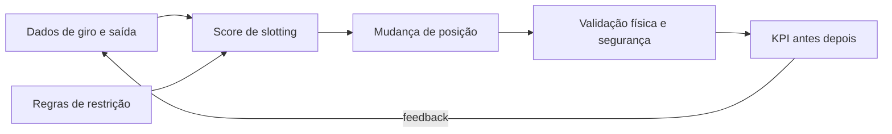

# Slotting, *golden zone* e o loop dados → posição — o endereço como decisão de negócio

**Slotting** é decidir **onde** cada SKU mora no CD em função de **giro**, **peso**, **fragilidade**, **compatibilidade de lote** e **altura ergonômica**. ***Golden zone*** (zona dourada) é a faixa de picking **mais ergonômica e rápida** — colocar SKU A errado ali é como colocar o sal **longe** do fogão: tudo funciona, mas **todo mundo perde tempo**.

---

## Objetivos e resultado de aprendizagem

**Ao final desta aula**, você será capaz de:

- Definir slotting e **critérios** mínimos (giro, peso, restrição).  
- Explicar *golden zone* e impacto em **linhas/hora** e segurança.  
- Desenhar um **loop** de revisão de slotting baseado em dados.  
- Propor slotting para um conjunto pequeno de SKUs com **restrição** (ex.: químico).

**Duração sugerida:** 60–90 minutos.

---

## Gancho — o SKU A no teto

A **TechLar** colocou um item classe **A** no nível superior de drive-in porque «cabia». O WMS gerou rota «ótima» no mapa; o corpo humano **não** concordou. Queda de produtividade e aumento de **near-miss** — **slotting** é **ergonomia + dados**, não só cubagem.

**Analogia da cozinha:** faca e tábua perto do fogão; panela de festa no alto do armário — cada coisa no lugar do **uso**.

---

## Mapa do conteúdo

- Critérios de slotting (ABC no armazém, peso, *hazard*).  
- *Golden zone* e alturas.  
- Loop PDCA de slotting com **dados de giro** limpos (ponte Dados).  
- Conflitos típicos (promoção, sazonalidade).

---

## Conceito núcleo — golden zone com altura e *cube-per-order index*

**Golden zone** é a faixa **ergonômica** entre cintura e ombros do picker — sem agachar, sem subir escada. Em CD BR (operadores 1,55–1,80 m):

| Faixa | Altura (cm) | Esforço relativo | Indicação |
|-------|-------------|------------------|-----------|
| **Golden zone** | **75–150 cm** | **1,0×** (referência) | SKUs A com pick frequente |
| Stretch zone | 150–180 cm | 1,3× | B; até 5 kg |
| Stoop zone (baixo) | 30–75 cm | 1,4× | B leve; risco lombar |
| Top zone (alto) | > 180 cm | 1,8× + escada | reserva / overstock |
| Floor zone | < 30 cm | 1,6× | reserva pesado paletizado |

Estudo clássico (Frazelle, 1996): mover SKU A da *top* para a *golden* reduz **30–45%** do tempo de pick por linha; ergonomia reduz LER/DORT (CIDs M50–M54), com impacto direto em FAP/RAT (Decreto 6.957/09).

### *Cube-per-order Index* (COI) — Frazelle

\[
\text{COI}_i = \frac{V_i}{P_i}
\]

onde `V_i` = volume armazenado do SKU `i`; `P_i` = nº de pickings/dia do SKU `i`. **Quanto menor o COI, melhor o slot perto da doca/golden** — o item «trabalha muito» por m³ ocupado.

### Score de slotting (proposta pedagógica)

\[
\text{Score}_i = w_1 \cdot \text{Pickings}_i - w_2 \cdot \text{Peso}_i - w_3 \cdot \text{Volume}_i - w_4 \cdot \text{Restricao}_i
\]

Pesos típicos `(0,5; 0,2; 0,2; 0,1)` ajustados por categoria. SKU com restrição (químico, refrigerado, alta segurança) pula golden zone independente do score.

**Critérios práticos que entram no score:**

- **Demanda** (linhas ou unidades/dia).
- **Peso/volume** por *pick* (custo físico — > 15 kg pede zona baixa próxima ao chão).
- **Fragilidade** / **valor** (controle CFTV, jaula).
- **Restrições** (temperatura, não misturar lote, classe NBR 14619, corredor VNA).
- **Afinidade de pedido** (SKUs comprados juntos → *family slotting*; ex.: cabo + carregador).
- **Sazonalidade** (slot temporário para campanha — Black Friday, Volta às Aulas).

**Legenda:** sem **K**, slotting vira projeto de ego.

---

## Ponte — medir giro certo

Definições e *grain* importam; ver [do problema ao dataset](../../trilha-dados-analytics-logistica/modulo-01-data-analytics-para-logistica/aula-01-do-problema-ao-dataset.md). Slotting ruim frequentemente é **SKU canal** misturado sem separação.

---

## Aplicação — exercício

**20 SKUs** em **3 zonas**: *golden*, média, alta/lenta. Atribua cada SKU fictício (giro alto/médio/baixo; peso leve/pesado; um SKU «químico» que não pode ir à *golden* por política). Justifique **3** exceções.

**Gabarito pedagógico:** exceções devem citar **restrição** ou **sazonalidade**; não basta «é A então golden» se peso ou *hazard* discordam.

---

## Erros comuns e armadilhas

- Slotting **anual** em negócio sazonal.  
- Usar **faturamento** sozinho sem **linhas de pedido** (A em R$ pode ser B em esforço).  
- Ignorar **replenishment** da frente de loja (*forward pick*).  
- Misturar **SKU promocional** sem plano de retorno ao slot base.  
- *Golden zone* ocupada com **SKU morto** «porque cabe».

---

## Mini-laboratório — re-slotting de 5 SKUs

Dado: 5 SKUs e 3 níveis (golden/médio/alto). Calcule COI e proponha posição.

| SKU | Pickings/dia | Volume (m³) | COI | Posição atual | Recomendação |
|-----|---------------|-------------|------|---------------|---------------|
| A1 | 80 | 0,12 | **0,0015** | golden | ✓ manter |
| A2 | 60 | 0,90 | 0,0150 | golden | mover para médio (volumoso) |
| B1 | 25 | 0,08 | 0,0032 | alto | **promover** golden |
| B2 | 15 | 0,40 | 0,0267 | alto | manter alto / reserva |
| C1 (químico) | 10 | 0,20 | 0,0200 | golden | **realocar** zona segregada (NBR 14619) |

Ganho estimado pós-troca A2↔B1 (frequência × tempo economizado): ~ `(60−25) × 4 s = 140 s/dia` por linha equivalente; ao longo de 250 dias úteis, recupera **~10 horas/ano** por par — multiplicado por 200 SKUs A, vira **2.000 horas/ano** (~ 1 FTE).

---

## Trade-offs e decisão

| Alavanca | + Velocidade pick | + Densidade | + Segurança | + Capital |
|----------|:----------------:|:-----------:|:-----------:|:---------:|
| Re-slot trimestral por dados | ↑↑ | ↔ | ↑ | ↓ |
| Family slotting (afinidade) | ↑↑ | ↔ | ↔ | ↓ |
| Forward pick + reserve | ↑↑↑ | ↑ | ↑ | ↑ (CAPEX flow rack) |
| Slot fixo eterno | ↓ | ↓ | ↔ | ↔ |
| Slot dinâmico (caótico) | ↑ | ↑↑ | ↓ | exige WMS top |

---

## O que vira dado no sistema

| Campo / evento | Sistema | Função |
|---|---|---|
| `slot_id` (`LAGP-LGPLA`) | SAP WM | endereço físico |
| `pick_face` vs `reserve` | WMS | duas zonas, mesma SKU |
| `volume_per_pick`, `weight_per_pick` | master data | base do score |
| `picks_last_30d` (KPI) | WMS | gatilho de re-slot |
| `replenishment_trigger` (mín/máx) | WMS | reposição forward |
| evento `slot_change` (auditoria) | WMS | rastrear mudanças |

---

## KPIs e decisão (tabela)

| KPI | Pergunta | Dono | Fonte | Cadência | Playbook |
|-----|----------|------|-------|----------|----------|
| **Linhas/h por picker** | Slotting acelera? | Ops lead | WMS | Diário | re-slot top-10 |
| **Tempo médio walk/pick** | Caminhada caiu? | Ops | WMS (timestamps) | Semanal | family slot |
| **% picks na golden zone** | Estamos usando? | WMS lead | WMS | Mensal | meta ≥ 65% |
| **% replenishment a tempo** | Forward não esvazia? | Ops | WMS | Diário | mín/máx ajustado |
| **Near-miss ergonômico/zona** | Risco SST? | EHS | NR-17 + relato | Mensal | ergonomia + treinamento |
| **Stockout em pick face** | Cliente sente? | Ops | WMS | Diário | reduzir intervalo de replen |
| **Aging de slot ocupado por SKU morto** | Golden poluída? | Master data | BI | Trimestral | poda de SKU |

---

## Ferramentas e tecnologias

| Ferramenta | Quando usa | Limites |
|------------|------------|---------|
| **Slotting nativo do WMS** (SAP EWM, Manhattan, BlueYonder) | re-slot por giro/COI | configuração trabalhosa |
| **Software dedicado** (CAST/Slotting Tools, Optricity) | mix > 10k SKUs, mudança trimestral | preço alto |
| **AutoStore / mini-load** (AS/RS) | slot caótico automático | CAPEX e teto |
| **Pick-to-light** | reduz erro em forward | layout estável |
| **Voice picking** | hands-free | ruído ambiente |
| **AGV/AMR** (Locus, Geek+) | leva o homem-ao-bem ou bem-ao-homem | piso plano + WiFi |

---

## Glossário rápido

- **COI:** *cube-per-order index* (volume / picks).
- **Family slotting:** SKUs comprados juntos no mesmo bloco.
- **Forward pick:** zona enxuta de picking, abastecida pela reserve.
- **Golden zone:** faixa ergonômica (75–150 cm) de menor esforço.
- **Reserve:** zona de estoque a granel/palete que reabastece a forward.
- **Slot:** endereço físico (rua–prédio–nível–posição).

---

## Fechamento — três takeaways

1. Slotting é **decisão de custo** disfarçada de «organização visual».  
2. *Golden zone* é recurso escasso — trate com política, não com achismo.  
3. Dados ruins geram **mapa bonito** para o lugar errado.

**Pergunta de reflexão:** qual SKU alto giro hoje está **longe** da *golden zone* por legado de projeto antigo?

---

## Referências

1. BARTHOLDI, J. J.; HACKMAN, S. T. *Warehouse & Distribution Science*. Free: https://www.warehouse-science.com/  
2. FRAZELLE, E. *World-Class Warehousing and Material Handling*. McGraw-Hill.  
3. TOMPKINS, J. A. et al. *Facilities Planning*.  
4. BOWERSOX, D. J.; et al. *Supply Chain Logistics Management*. McGraw-Hill.  
5. NR-17 (ergonomia) — TEM/MTb.  
6. ABRALOG e ILOS — benchmarks de produtividade de picking.  
7. WERC — *DC Measures* (anual): https://werc.org/

---

## Pontes para outras trilhas

- **Tecnologia:** [WMS — onda, picking e expedição](../../trilha-tecnologia-e-sistemas/modulo-03-wms/aula-03-onda-picking-expedicao.md).
- **Dados:** [problema → dataset](../../trilha-dados-analytics-logistica/modulo-01-data-analytics-para-logistica/aula-01-do-problema-ao-dataset.md), [qualidade de dados](../../trilha-dados-analytics-logistica/modulo-01-data-analytics-para-logistica/aula-02-qualidade-vies-demanda-fantasma.md).
- **Operações** (esta trilha): [layout](aula-01-layout-zonas-fluxo-docas.md), [picking e ondas](aula-03-picking-ondas-fila-fisica.md).
