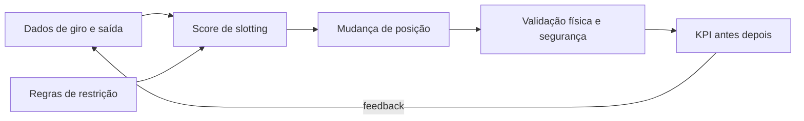

# Slotting, *golden zone* e o loop dados → posição — o endereço como decisão de negócio

**Slotting** é decidir **onde** cada SKU mora no CD em função de **giro**, **peso**, **fragilidade**, **compatibilidade de lote** e **altura ergonômica**. ***Golden zone*** (zona dourada) é a faixa de picking **mais ergonômica e rápida** — colocar SKU A errado ali é como colocar o sal **longe** do fogão: tudo funciona, mas **todo mundo perde tempo**.

---

## Objetivos e resultado de aprendizagem

**Ao final desta aula**, você será capaz de:

- Definir slotting e **critérios** mínimos (giro, peso, restrição).  
- Explicar *golden zone* e impacto em **linhas/hora** e segurança.  
- Desenhar um **loop** de revisão de slotting baseado em dados.  
- Propor slotting para um conjunto pequeno de SKUs com **restrição** (ex.: químico).

**Duração sugerida:** 60–90 minutos.

---

## Gancho — o SKU A no teto

A **TechLar** colocou um item classe **A** no nível superior de drive-in porque «cabia». O WMS gerou rota «ótima» no mapa; o corpo humano **não** concordou. Queda de produtividade e aumento de **near-miss** — **slotting** é **ergonomia + dados**, não só cubagem.

**Analogia da cozinha:** faca e tábua perto do fogão; panela de festa no alto do armário — cada coisa no lugar do **uso**.

---

## Mapa do conteúdo

- Critérios de slotting (ABC no armazém, peso, *hazard*).  
- *Golden zone* e alturas.  
- Loop PDCA de slotting com **dados de giro** limpos (ponte Dados).  
- Conflitos típicos (promoção, sazonalidade).

---

## Conceito núcleo — o que entra no score de slotting

**Hipótese pedagógica de score simples** (não é software comercial):

- **Demanda** (linhas ou unidades/dia).  
- **Peso/volume** por *pick* (custo físico).  
- **Fragilidade** / **valor** (controle).  
- **Restrições** (temperatura, não misturar lote, corredor narrow-aisle).

**Legenda:** sem **K**, slotting vira projeto de ego.

---

## Ponte — medir giro certo

Definições e *grain* importam; ver [do problema ao dataset](../../trilha-dados-analytics-logistica/modulo-01-data-analytics-para-logistica/aula-01-do-problema-ao-dataset.md). Slotting ruim frequentemente é **SKU canal** misturado sem separação.

---

## Aplicação — exercício

**20 SKUs** em **3 zonas**: *golden*, média, alta/lenta. Atribua cada SKU fictício (giro alto/médio/baixo; peso leve/pesado; um SKU «químico» que não pode ir à *golden* por política). Justifique **3** exceções.

**Gabarito pedagógico:** exceções devem citar **restrição** ou **sazonalidade**; não basta «é A então golden» se peso ou *hazard* discordam.

---

## Erros comuns e armadilhas

- Slotting **anual** em negócio sazonal.  
- Usar **faturamento** sozinho sem **linhas de pedido** (A em R$ pode ser B em esforço).  
- Ignorar **replenishment** da frente de loja (*forward pick*).  
- Misturar **SKU promocional** sem plano de retorno ao slot base.  
- *Golden zone* ocupada com **SKU morto** «porque cabe».

---

## KPIs e decisão

- **Segundos por linha** (antes/depois por zona).  
- **Caminhada** estimada por onda (amostragem).  
- **Near-miss** / incidentes ergonômicos por zona.

---

## Fechamento — três takeaways

1. Slotting é **decisão de custo** disfarçada de «organização visual».  
2. *Golden zone* é recurso escasso — trate com política, não com achismo.  
3. Dados ruins geram **mapa bonito** para o lugar errado.

**Pergunta de reflexão:** qual SKU alto giro hoje está **longe** da *golden zone* por legado de projeto antigo?

---

## Referências

1. BARTHOLDI, J. J.; HACKMAN, S. T. *Warehouse & Distribution Science* (livro-texto *open* — verificar edição e uso institucional).  
2. FRAZELLE, E. *World-Class Warehousing and Material Handling* (como referência de prática).  
3. BOWERSOX, D. J.; et al. *Supply Chain Logistics Management*. McGraw-Hill.
