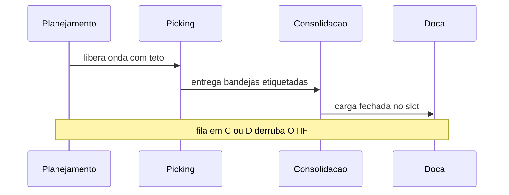
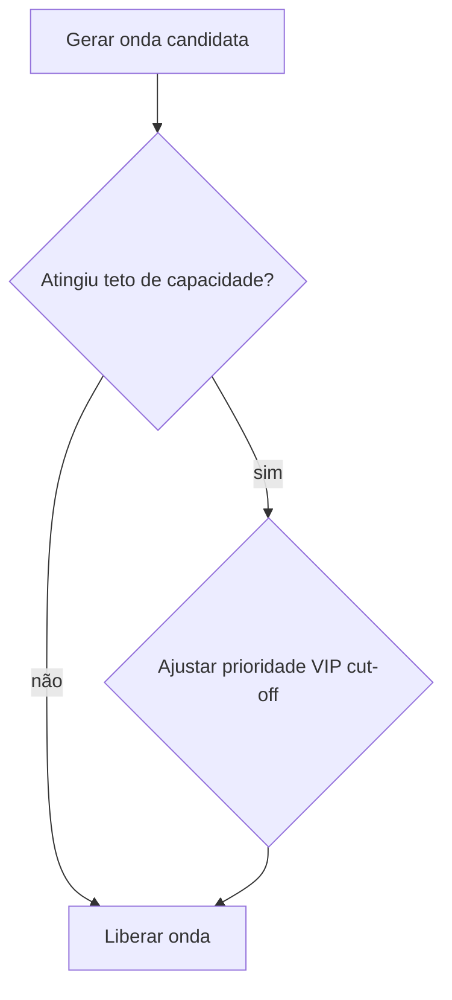

# Picking, ondas e a fila que não cabe na planilha — eficiência sem «otimizar mentira»

**Picking** é o ato de **compor** o pedido físico; **onda** (*wave*) é um **lote de trabalho** liberado para a operação. O erro clássico é tratar onda como «botão mágico do WMS» quando o gargalo é **fila humana**, **consolidação**, **embalagem** ou **doca** — isto é, **capacidade física** que a planilha não estica.

Esta aula complementa a visão **de sistema** em [onda e picking (trilha Tecnologia)](../../trilha-tecnologia-e-sistemas/modulo-03-wms/aula-03-onda-picking-expedicao.md); aqui o foco é **fila, layout e regra de prioridade**.

---

## Objetivos e resultado de aprendizagem

**Ao final desta aula**, você será capaz de:

- Comparar estratégias **por pedido**, **por zona**, **em lote por SKU** e **cluster** — com riscos de cada uma.  
- Explicar **erro de mix** e mitigação por processo e layout.  
- Dimensionar **onda** com teto de linhas por equipe **e** capacidade de embalagem.  
- Construir **matriz de prioridade** transparente (VIP, data prometida, *cut-off* de transportadora).

**Duração sugerida:** 60–90 minutos.

---

## Gancho — a onda gigante da Black Friday

Na **TechLar**, o sistema liberou **onda única** enorme antes do *cut-off* da transportadora; o picking «andou», a **consolidação** travou; etiquetas saíram atrasadas. O painel mostrou produtividade alta no meio do processo e **OTIF** baixo no fim — **otimização local** destruiu o **global**.

**Analogia do restaurante:** cozinha rápida com **balcão de passagem** minúsculo — o prato esfria na fila.

---

## Mapa do conteúdo

- Estratégias de picking e quando tender a servir.  
- Onda como decisão de **tamanho** e **prioridade**.  
- *Cut-off*, embalagem e doca.  
- Matriz de prioridade e conflitos.

---

## Estratégias de picking — âncoras

| Estratégia | Quando tende a servir | Risco principal |
|------------|-------------------------|-----------------|
| Por pedido | B2B, alto valor, poucas linhas | caminhada repetida |
| Por zona | SKU dispersos, equipes especializadas | erro de consolidação |
| Lote por SKU (*batch*) | alto volume homogêneo | **erro de mix** |
| *Cluster* | muitos pedidos pequenos (e-commerce) | complexidade de consolidação |

**Erro de mix:** juntar demais sem controle forte → cliente A recebe item de B — caro em **reputação** e **custo reverso**.

**Legenda:** sequência simplificada; gargalo pode mudar de dia para dia.

---

## Onda — tamanho, ritmo e prioridade

**Regras pedagógicas** para onda saudável:

1. **Teto** de linhas/unidades por equipe **e** por intervalo de tempo.  
2. **Alinhamento** com capacidade de **embalagem** e **impressão de etiqueta**.  
3. **Prioridade** explícita quando *cut-offs* colidem.

**Legenda:** retângulos de decisão; na prática, use dados de fila (ver trilha Dados para medição).

---

## Aplicação — exercício

Monte uma **matriz 3×3** de prioridade: linhas = **VIP**, **data prometida**, ***cut-off* carrier**; colunas = **critério absoluto**, **negociável**, **escalação**. Preencha com regras fictícias e descreva **um conflito** (ex.: VIP *vs.* *cut-off*) e como a **escalação** decide em **5 minutos** de reunião diária.

**Gabarito pedagógico:** deve existir **critério publicado**; se a decisão for «depende de quem está plantão», o sistema ainda não tem política.

---

## Erros comuns e armadilhas

- KPI de **linhas/hora** sem controle de **qualidade de picking**.  
- Etiqueta de transporte antes de **peso/cubagem** real.  
- *Cross-dock* sem **marcação física** e sem *staging* dedicado.  
- Onda sem **limite** porque «o sistema aguenta» — pessoas não são CPU.

---

## KPIs e decisão

- **OTIF interno** (doca) separado de **OTIF cliente** (última milha).  
- **Tempo em fila** de consolidação (fila física).  
- **Taxa de erro de mix** (ppm, por mil pedidos).

---

## Fechamento — três takeaways

1. Picking rápido com consolidação lenta é **ilusão** operacional.  
2. Onda é **decisão de capacidade**, não só algoritmo.  
3. Prioridade implícita vira **briga** na doca — publique a regra.

**Pergunta de reflexão:** qual *cut-off* de transportadora hoje **não** está refletido na capacidade de embalagem?

---

## Referências

1. DE KOSTER, R. et al. (artigos clássicos sobre *order picking* — usar como *tipo* de fonte acadêmica).  
2. BOWERSOX, D. J.; et al. *Supply Chain Logistics Management*. McGraw-Hill.  
3. Trilha Tecnologia — [onda, picking e expedição](../../trilha-tecnologia-e-sistemas/modulo-03-wms/aula-03-onda-picking-expedicao.md).
