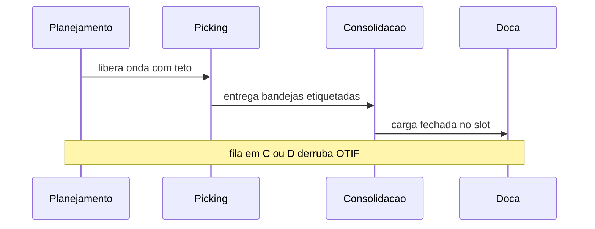
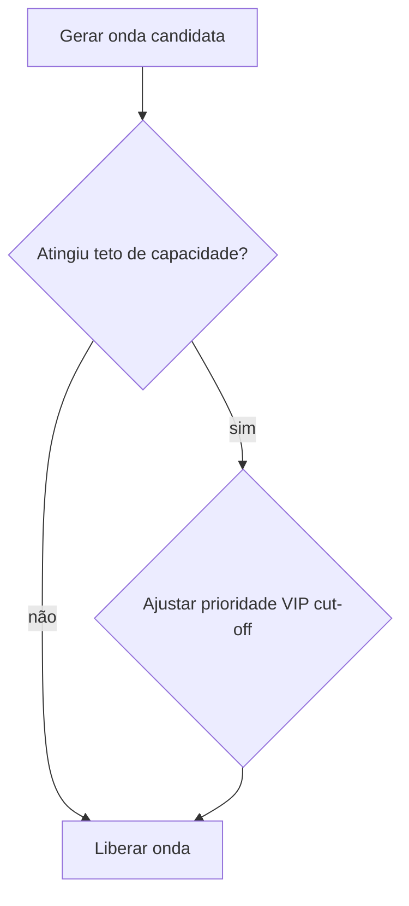

# Picking, ondas e a fila que não cabe na planilha — eficiência sem «otimizar mentira»

**Picking** é o ato de **compor** o pedido físico; **onda** (*wave*) é um **lote de trabalho** liberado para a operação. O erro clássico é tratar onda como «botão mágico do WMS» quando o gargalo é **fila humana**, **consolidação**, **embalagem** ou **doca** — isto é, **capacidade física** que a planilha não estica.

Esta aula complementa a visão **de sistema** em [onda e picking (trilha Tecnologia)](../../trilha-tecnologia-e-sistemas/modulo-03-wms/aula-03-onda-picking-expedicao.md); aqui o foco é **fila, layout e regra de prioridade**.

---

## Objetivos e resultado de aprendizagem

**Ao final desta aula**, você será capaz de:

- Comparar estratégias **por pedido**, **por zona**, **em lote por SKU** e **cluster** — com riscos de cada uma.  
- Explicar **erro de mix** e mitigação por processo e layout.  
- Dimensionar **onda** com teto de linhas por equipe **e** capacidade de embalagem.  
- Construir **matriz de prioridade** transparente (VIP, data prometida, *cut-off* de transportadora).

**Duração sugerida:** 60–90 minutos.

---

## Gancho — a onda gigante da Black Friday

Na **TechLar**, o sistema liberou **onda única** enorme antes do *cut-off* da transportadora; o picking «andou», a **consolidação** travou; etiquetas saíram atrasadas. O painel mostrou produtividade alta no meio do processo e **OTIF** baixo no fim — **otimização local** destruiu o **global**.

**Analogia do restaurante:** cozinha rápida com **balcão de passagem** minúsculo — o prato esfria na fila.

---

## Mapa do conteúdo

- Estratégias de picking e quando tender a servir.  
- Onda como decisão de **tamanho** e **prioridade**.  
- *Cut-off*, embalagem e doca.  
- Matriz de prioridade e conflitos.

---

## Estratégias de picking — âncoras com produtividade típica

| Estratégia | Como funciona | Quando serve | Risco principal | Produtividade típica BR (linhas/h) |
|------------|----------------|---------------|-----------------|-------------------------------------|
| **Discrete / por pedido** | 1 picker = 1 pedido inteiro | B2B alto valor, poucas linhas | caminhada repetida | 50–80 |
| **Por zona** (zone picking) | picker fica numa zona; pedido viaja | SKU dispersos, equipes especializadas | erro de consolidação | 80–140 |
| **Batch / lote por SKU** | picker recolhe N pedidos juntos | volume homogêneo | **erro de mix** | 120–200 |
| **Cluster** (multi-order cart) | carrinho com 6–24 caixas, picker faz todas juntas | e-commerce muitos pedidos pequenos | complexidade consolidação | 150–250 |
| **Wave + zone** combinado | onda libera em zonas paralelas, consolida no fim | varejo grande | sincronização | 180–300 |
| **Pick-to-light** (PTL) | luz no slot, picker confirma | forward + alta repetição | rigidez de slot | 350–600 (peças pequenas) |
| **Voice** (Vocollect, Honeywell) | comandos de voz, hands-free | refrigerado, mix variado | ruído | 200–350 |
| **Goods-to-person (GTP)** + AS/RS / AutoStore | robô traz a estante | mix > 20k SKUs, mão-de-obra cara | CAPEX 5–20 mi | 600–1.200 |
| **RF gun** (clássico) | coletor scan + display | versatilidade média | depende layout | 90–160 |

**Erro de mix:** juntar demais sem controle forte → cliente A recebe item de B — caro em **reputação** e **custo reverso** (R$ 25–60 por troca em e-commerce + risco de perder cliente).

**Custo de erro de mix em B2B grande conta** (Carrefour, Atacadão, Assaí): multas *retail-ready* / *vendor compliance* podem chegar a **5–15% do valor da NF** quando há divergência declarada.

**Legenda:** sequência simplificada; gargalo pode mudar de dia para dia.

---

## Onda — tamanho, ritmo, prioridade e teoria das filas

**Regras pedagógicas** para onda saudável:

1. **Teto** de linhas/unidades por equipe **e** por intervalo de tempo.
2. **Alinhamento** com capacidade de **embalagem** e **impressão de etiqueta** (ex.: impressora 4×6 a 8 ips → ~ 350 etiquetas/hora; *applicator* automático ~ 1.500/hora).
3. **Prioridade** explícita quando *cut-offs* colidem.
4. **Sequência ABC de cut-off**: liberar primeiro a transportadora cujo cut-off é mais cedo (Loggi 14 h, Total 16 h, Jadlog 17 h, Mercado Envios 17:30, Sequoia 18 h — exemplos típicos).

### Dimensionamento — fórmula de Little e fila M/M/c

**Lei de Little:**

\[
L = \lambda \cdot W
\]

onde `L` = nº de pedidos no sistema, `λ` = taxa de chegada (pedidos/h), `W` = tempo médio no sistema. Se a consolidação tem **W = 12 min** e chegam **λ = 100 pedidos/h**, há sempre **L = 20** pedidos enfileirados — tem que **caber fisicamente** (mesa, bandeja, esteira).

**Tamanho ótimo de onda** (heurística Frazelle/De Koster):

\[
N_{\text{onda}} \approx \min\left( T_{\text{ciclo cut-off}} \cdot \text{capacidade}_{\text{pick}}, \, \text{capacidade}_{\text{pack}} \cdot T_{\text{onda}} \right)
\]

— ou seja: a onda é o **mínimo** entre o que o picking entrega e o que o packing absorve. **Otimizar só o lado picking é destruir OTIF** (gancho clássico da Black Friday).

**Legenda:** retângulos de decisão; na prática, use dados de fila (ver trilha Dados para medição).

---

## Aplicação — exercício

Monte uma **matriz 3×3** de prioridade: linhas = **VIP**, **data prometida**, ***cut-off* carrier**; colunas = **critério absoluto**, **negociável**, **escalação**. Preencha com regras fictícias e descreva **um conflito** (ex.: VIP *vs.* *cut-off*) e como a **escalação** decide em **5 minutos** de reunião diária.

**Gabarito pedagógico:** deve existir **critério publicado**; se a decisão for «depende de quem está plantão», o sistema ainda não tem política.

---

## Erros comuns e armadilhas

- KPI de **linhas/hora** sem controle de **qualidade de picking**.  
- Etiqueta de transporte antes de **peso/cubagem** real.  
- *Cross-dock* sem **marcação física** e sem *staging* dedicado.  
- Onda sem **limite** porque «o sistema aguenta» — pessoas não são CPU.

---

## Aprofundamentos — variações setoriais

| Setor | Estratégia recomendada | Particularidade |
|-------|------------------------|-----------------|
| **E-commerce mass** | cluster + putwall ou cross-belt sorter | picos 10× em campanha |
| **B2B grande conta** | wave + zone + verificação 100% | multas RetailReady |
| **Farma distribuidor** | discrete + double-check + serial scan | rastreabilidade SNCM |
| **Frio** | voice (hands-free luvas) + wave curta | exposição limitada operador (NR-29) |
| **Auto-peças aftermarket** | discrete + Pareto de SKU em forward | mix amplo, baixa frequência |
| **Marketplace fulfilment** | GTP / AS/RS | promessa 24 h |

---

## Trade-offs e decisão

| Alavanca | + Velocidade | + Acurácia | + Custo | + CAPEX |
|----------|:-----------:|:----------:|:-------:|:-------:|
| Migrar discrete → cluster | ↑↑ | ↓ | ↓ | ↔ |
| Adicionar PTL | ↑↑↑ | ↑↑ | ↓ OPEX | ↑↑ |
| GTP / AutoStore | ↑↑↑↑ | ↑↑↑ | ↓↓ OPEX | ↑↑↑↑ |
| Verificação 100% | ↓ | ↑↑↑ | ↑ | ↔ |
| Onda menor + frequente | ↓ leve | ↑ | ↔ | ↔ |

---

## Erros comuns e armadilhas (com mitigações)

- KPI de **linhas/hora** sem controle de **qualidade de picking** → emparelhar com erro/mil.
- Etiqueta de transporte antes de **peso/cubagem** real → balança+cubagem em conveyor.
- *Cross-dock* sem **marcação física** → faixa pintada + flag no WMS.
- Onda sem **limite** porque «o sistema aguenta» — pessoas não são CPU.
- Picker sem **pausa programada** (NR-17 recomenda micro-pausa a cada 50 min em tarefa repetitiva).
- Conferência cega (sem PTL/voice) em pico — erro escala.
- Putwall com **slot fixo por pedido** sem reciclagem após carrier label.

---

## O que vira dado no sistema

| Campo / evento | Sistema | Função |
|---|---|---|
| `wave_id` | WMS | agrupa pedidos |
| `pick_task` (`LU03/LT03` em SAP WM) | WMS | tarefa atômica |
| `pick_confirm` evento | WMS / RF | timestamp |
| `cluster_id` / `tote_id` | WMS | rastrear cesta |
| `consolidation_slot` (putwall) | WMS | onde pedido vai esperar |
| `cut_off_carrier` (TMS↔WMS) | TMS | sincronizar onda |
| `error_pick_count` + motivo | WMS | leading indicator |

---

## KPIs e decisão (tabela)

| KPI | Pergunta | Dono | Fonte | Cadência | Playbook |
|-----|----------|------|-------|----------|----------|
| **Linhas/h por picker** (por estratégia) | Produtividade real? | Ops lead | WMS | Diário | revisar slot/onda |
| **Pick accuracy %** (1 − erro/total) | Qualidade do pick? | QA | WMS audit | Diário | retreino + PTL |
| **OTIF interno** (cut-off) | Cumprimos doca? | WMS lead | WMS | Diário | onda menor |
| **OTIF cliente** | Cumprimos cliente? | Logística | TMS+ERP | Diário | rever carrier |
| **Tempo em fila consolidação** | Onda cabe no pack? | Ops | WMS timestamp | Diário | balancear ritmo |
| **Erro de mix (ppm)** | Multa B2B? | QA | NC log | Mensal | RCA + PTL/voice |
| **% ondas concluídas no SLA** | Plano = realidade? | Ops | WMS | Diário | rever capacidade |
| **Idle pickers %** | Onda chega tarde? | Ops | WMS | Diário | onda mais cedo |

---

## Ferramentas e tecnologias

| Tecnologia | ROI típico | Quando |
|------------|-----------|--------|
| **PTL** (Lightning Pick, KNAPP) | 30–50% velocidade, 60–80% menos erro | forward estável > 1k pedidos/dia |
| **Voice** (Vocollect, Honeywell, Speech Interactive) | 20–35% velocidade, hands-free | refrigerado, mix |
| **AS/RS / mini-load** (Mecalux, Dematic, SSI Schaefer) | 3–5× velocidade GTP | mão-de-obra > R$ 6k/mês × 30 pickers |
| **AutoStore / Geek+ / Locus / Quicktron** | mix > 20k SKUs | CAPEX 5–25 mi |
| **Pick-by-vision** (Picavi smart glasses) | hands-free + visual | emergente |
| **Sorter** (cross-belt, tilt-tray) | varejo mass-market | volume > 30k pedidos/dia |
| **Putwall + sortation** | e-commerce cluster | reduz consolidação manual |

---

## Glossário rápido

- **Cut-off:** prazo final de coleta da transportadora.
- **Cluster pick:** picker recolhe vários pedidos simultaneamente.
- **GTP:** *goods-to-person*.
- **Lei de Little:** L = λ × W.
- **OTIF:** *on-time, in-full*.
- **PPM:** partes por milhão (erros).
- **Putwall:** parede de cubas para consolidação por pedido.
- **RetailReady / vendor compliance:** padrões e multas do varejo.
- **Sorter:** classificador automático.
- **Wave / onda:** lote de pedidos liberado.

---

## Fechamento — três takeaways

1. Picking rápido com consolidação lenta é **ilusão** operacional.  
2. Onda é **decisão de capacidade**, não só algoritmo.  
3. Prioridade implícita vira **briga** na doca — publique a regra.

**Pergunta de reflexão:** qual *cut-off* de transportadora hoje **não** está refletido na capacidade de embalagem?

---

## Referências

1. DE KOSTER, R.; LE-DUC, T.; ROODBERGEN, K. J. *Design and control of warehouse order picking: a literature review*. Eur. J. Operational Research, 2007.  
2. FRAZELLE, E. *World-Class Warehousing and Material Handling*. McGraw-Hill.  
3. BARTHOLDI & HACKMAN — *Warehouse & Distribution Science*: https://www.warehouse-science.com/  
4. BOWERSOX, D. J.; et al. *Supply Chain Logistics Management*. McGraw-Hill.  
5. WERC — *DC Measures*: https://werc.org/  
6. NR-17 (ergonomia) e NR-29 (frigorífico) — MTb.  
7. Trilha Tecnologia — [onda, picking e expedição](../../trilha-tecnologia-e-sistemas/modulo-03-wms/aula-03-onda-picking-expedicao.md).

---

## Pontes para outras trilhas

- **Tecnologia:** [WMS — onda, picking e expedição](../../trilha-tecnologia-e-sistemas/modulo-03-wms/aula-03-onda-picking-expedicao.md), [TMS](../../trilha-tecnologia-e-sistemas/modulo-04-tms/README.md).
- **Dados:** [lead time e variabilidade](../../trilha-dados-analytics-logistica/modulo-04-indicadores-logisticos-kpis/aula-02-lead-time-variabilidade-logistica.md).
- **Operações** (esta trilha): [layout](aula-01-layout-zonas-fluxo-docas.md), [slotting](aula-02-slotting-golden-zone-dados.md), [roteirização](../modulo-03-transporte-e-distribuicao/aula-03-roteirizacao-tsp-vrp-kpis.md).
