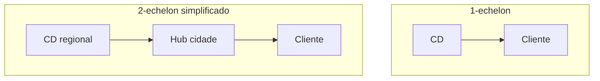

# Malha logística — hubs, prazo e estoque posicionado

**Malha** é o mapa de **nós** (CDs, fábricas, hubs, lojas) e **elos** (rotas, lead times, custos e restrições). «Melhorar a malha» quase nunca é um botão: é **trade-off** entre **prazo ao cliente**, **custo total** (não só frete visível) e **capital** em estoque posicionado.

Esta aula fica **estratégica-operacional**: suficiente para decidir com sensatez, sem substituir *network design* avançado da trilha «Logística estratégica» do catálogo.

---

## Objetivos e resultado de aprendizagem

**Ao final desta aula**, você será capaz de:

- Descrever **1-echelon** *vs.* **2-echelon** em linguagem de negócio.  
- Explicar **centralização** *vs.* **regionalização** com impacto em prazo e capital.  
- Posicionar **cross-docking** e **estoque de segurança** por nó (intuição).  
- Narrar um caso de **e-commerce** alterando promessa e custo de última milha.

**Duração sugerida:** 60–75 minutos.

---

## Gancho — o hub que virou gargalo

A **TechLar** regionalizou estoque para **ganhar prazo** em e-commerce. O **hub** novo recebeu volume sem **capacidade de triagem** compatível; o prazo médio melhorou na capital, piorou no interior — a malha **otimizada no slide** degradou **serviço percebido** em parte do país.

**Analogia de hidráulica:** desviar água para um cano maior **sem válvula** pode estourar o joelho da tubulação — vazamento vira **atraso**.

---

## Mapa do conteúdo

- Nós e elos; lead time e variabilidade.  
- Hub *vs.* direto; estoque posicionado.  
- *Cross-dock* como decisão operacional.  
- Ponte para dados (percentis de lead time).

---

## Conceito núcleo — echelons e estoque

Em **1-echelon**, o CD atende direto com seu estoque. Em **2-echelon** simplificado, um **nível** abastece lojas/hubs menores — ganha **proximidade**, paga **duplicação** de estoque e complexidade de **reposição**.

**Legenda:** setas ignoram fornecedor; foco é **última milha** e posicionamento.

---

## Centralizar *versus* regionalizar

| Centralizar | Regionalizar |
|-------------|--------------|
| Menor capital agregado em alguns desenhos | Menor prazo ao cliente regional |
| Economia de escala em operações | Mais pontos de contagem e acurácia |
| Maior risco de **single point of failure** | Maior coordenação de **mix** |
| Menos pessoas, mais tecnologia | Mais hubs, mais gente local |
| Frete *outbound* maior, *inbound* menor | Frete *inbound* maior, *outbound* menor |

### Pooling de estoque — a lei da raiz quadrada

Se você consolida estoque de **N** locais em **1**, mantendo o mesmo nível de serviço, o estoque de segurança total **cai pela raiz de N**:

\[
SS_{\text{centralizado}} \approx SS_{\text{regionalizado}} \cdot \frac{1}{\sqrt{N}}
\]

Exemplo: 4 CDs regionais com SS de 1.000 un. cada (total 4.000) → centralizado fica com **2.000** un. (50% menos capital). Mas o **frete outbound** sobe e o **prazo regional** piora — daí o trade-off.

### Mapa de CDs típico no Brasil (2025–2026)

| Polo | Vocação | Acessos |
|------|---------|---------|
| **Cajamar / Embu / Itapevi (SP)** | hub nacional e-commerce, varejo, eletroeletrônico | Anhanguera, Bandeirantes, Castello |
| **Extrema / Itatiaia (MG/RJ)** | benefício fiscal MG (Fundo Confins), atende SP e Sul | Fernão Dias |
| **Cabreúva / Louveira (SP)** | hub indústria + atacado | Bandeirantes |
| **Duque de Caxias / Resende (RJ)** | farma + automotivo | Dutra |
| **Contagem / Betim (MG)** | indústria mineira + abastece NE | BR-381 |
| **Joinville / São José dos Pinhais** | indústria sul, exportação Itajaí | BR-101 |
| **Recife / Ipojuca / Suape (PE)** | hub Nordeste, importação | BR-101 |
| **Manaus (Zona Franca)** | eletro + benefícios fiscais ZFM | aéreo + cabotagem |
| **Goiânia / Anápolis (GO)** | farma + atacado distribuição CO | BR-153 |

**Hipótese pedagógica:** e-commerce com **SLO** agressivo (Mercado Livre Mesmo Dia, Amazon Prime, Magalu Entrega Hoje) empurra regionalização para 5–8 hubs; margem baixa empurra **consolidação** — a empresa real escolhe **matrizes** por família de produto.

### Reforma Tributária (LC 214/25 — IBS/CBS) e impacto na malha

A unificação de PIS/COFINS/ICMS/ISS em **CBS+IBS** com cobrança **no destino** (transição 2027–2033) tende a **reduzir a vantagem fiscal de instalar CD em estado X só por crédito de ICMS**. Decisões de malha devem voltar a se ancorar em **prazo, custo logístico e capacidade**, não em planejamento tributário interestadual. ICMS-DIFAL e benefícios como Fomentar/Produzir (GO), TTD-409 (SC), Pró-Emprego perdem peso na decisão de longo prazo.

---

## *Cross-docking* — quando o CD não armazena

*Cross-dock* reduz **tempo de permanência** quando há **previsibilidade** de demanda e **sincronismo** recebimento/expedição. Sem dados e disciplina, vira **varanda** de caminhão.

---

## Ponte — medir cauda, não só média

Ver [lead time e variabilidade](../../trilha-dados-analytics-logistica/modulo-04-indicadores-logisticos-kpis/aula-02-lead-time-variabilidade-logistica.md). Malha boa no P50 e ruim no P90 ainda **falha** promoções.

---

## Aplicação — exercício

Desenhe (texto + lista) **duas** malhas para a mesma base de clientes: **A)** 1 CD nacional; **B)** 1 CD + 3 *forward stock locations* leves. Para cada uma, liste **3 benefícios** e **3 custos/riscos**.

**Gabarito pedagógico:** B deve citar **acurácia**, **mix** e **custo fixo**; A deve citar **prazo interior** e **risco** de ruptura regionalizada.

---

## Erros comuns e armadilhas

- Regionalizar sem **SKU** adequado em cada nó (mix errado).  
- Ignorar **capacidade** de triagem/expedição no hub.  
- Tratar **frete médio** como único KPI da malha.  
- Copiar malha de concorrente com **mix** diferente.  
- Esquecer **continuidade** (planos B de rota/fornecedor).

---

## Aprofundamentos — variações setoriais

| Setor | Estrutura típica BR |
|-------|---------------------|
| **E-commerce mass** | 1 CD nacional (Cajamar) + 4–8 *fulfilment centers* regionais + dezenas de *last-mile hubs* / agentes |
| **Varejo supermercadista** | CDs regionais (1 por bandeira × estado/cluster) + cross-docking diário para loja |
| **Indústria farma** | 1 CD-mãe + 8–12 distribuidores regionais (Profarma, Santa Cruz, Panpharma, BR Pharma) |
| **Auto-peças aftermarket** | 1 CD nacional + agentes/balcões |
| **Bens duráveis (linha branca)** | CD-fábrica + CD-regional + retiradas em loja parceira |
| **Marketplaces 3P** | seller-fulfilled + Magalu Entregas / Amazon FBA / Mercado Envios Full |

---

## Caso prático — TechLar e a malha de 4 cenários

| Cenário | CDs | Capital estoque relativo | Frete outbound | Prazo capital regional | Risco |
|---------|------|--------------------------|----------------|-------------------------|-------|
| **A** — 1 CD nacional (Cajamar) | 1 | 100% (base) | 100% | 1 dia capital, 5–7 dias N/NE | SPOF alto |
| **B** — 1 CD + 3 FSL (RJ, BH, REC) | 4 | ~ 200% (regra √N → 50% redução de SS por nó) | 75% | 1–2 dias capital + interior | Médio |
| **C** — 5 CDs regionais (SP, RJ, BH, POA, REC) | 5 | ~ 224% | 60% | 1 dia maioria | Mix |
| **D** — Cross-dock + *forward stock* leve | 1 + 8 cross-dock | 130% | 70% | 1–3 dias | Sincronia ASN |

**Decisão:** se margem é alta e SLO ≤ 24 h, vai para C; se margem baixa e SLO ≥ 72 h, vai para A; mix B é o «meio termo brasileiro» mais comum.

---

## Trade-offs

| Alavanca | + Serviço | + Capital | + OPEX | + Risco | + Sustentab. |
|----------|:---------:|:---------:|:------:|:-------:|:------------:|
| Centralizar | ↓ regional | ↓↓ | ↓ | ↑ SPOF | ↑ |
| Regionalizar | ↑↑ | ↑↑ | ↑ | ↓ | ↓ (mais frete short-haul) |
| Cross-dock | ↑ | ↓↓ | ↑ se mal | ↑ | ↑ |
| Forward Stock Location | ↑↑ | ↑ leve | ↑ leve | ↔ | ↑ |
| Marketplace fulfilment | ↑ rápido | ↓ proprio | ↑ taxa | ↓ ops | ↔ |

---

## O que vira dado no sistema

| Campo / evento | Sistema | Função |
|---|---|---|
| `node_id` (CD/hub/loja) | ERP/TMS | nó da malha |
| `service_level_node` (% promessa) | OMS | SLA por nó |
| `lead_time_node_to_node` (matriz) | TMS | base de planejamento |
| `cost_to_serve_per_segment` | BI | gestão margem |
| `capacity_throughput_max` (palete/dia) | WMS | restrição |
| evento `transfer_order` (TO entre nós) | ERP/WMS | reposição |

---

## KPIs e decisão (tabela)

| KPI | Pergunta | Dono | Fonte | Cadência | Playbook |
|-----|----------|------|-------|----------|----------|
| **OTIF** por região | Cumprimos no interior? | Logística | TMS+ERP | Diário | Cauda P90 → re-route |
| **Custo total para servir** R$/pedido por canal | Quem paga a malha? | Controladoria | BI | Mensal | Repreciar canal D |
| **Capital em estoque** por nó | Onde está parado? | Planejamento | ERP | Mensal | Re-balancear ABC |
| **Lead time P50/P90 origem→destino** | Cauda dói? | Plan. | TMS | Semanal | Re-route ou hub novo |
| **Utilização hub** (palete/dia) | Está sobrecarregado? | Ops | WMS hub | Diário | Janela ou doca extra |
| **Cobertura por região** | Falta em algum lugar? | Plan. | ERP | Semanal | Reposição interna |
| **% pedidos atendidos no nó preferencial** | Estamos quebrando o plano? | OMS | OMS | Diário | Re-slot estoque |

---

## Ferramentas e tecnologias

| Família | Quando |
|---------|--------|
| **Network Design** (Llamasoft/Coupa, AnyLogic, AIMMS) | redesenho a cada 2–3 anos |
| **OMS** (IBM Sterling, Manhattan Active Omni, Oracle Retail) | atribuir pedido ao melhor nó |
| **TMS multi-modal** (Oracle, BluJay, Mercurius, Embarcador) | execução |
| **BI de custo-para-servir** (Power BI/Tableau + ABC custeio) | governança comercial |
| **Marketplaces fulfilment** (Mercado Envios Full, Magalu Entregas, Amazon FBA, Shopee Logistics) | testar regiões sem CAPEX |
| **3PL** (DHL, FM Logistic, ID Logistics, GLP, Aliança, JSL) | flexibilidade sazonal |

---

## Glossário rápido

- **Echelon:** nível na cadeia (1-echelon = um nível de estoque entre fábrica e cliente).
- **Forward Stock Location (FSL):** mini-CD avançado, leve, perto do cliente.
- **Hub-and-spoke:** modelo concentrador.
- **Pooling:** consolidação que reduz variabilidade.
- **SPOF:** *single point of failure*.
- **Cost-to-serve:** custo total real para servir cliente/canal.
- **CD classe A:** padrão GLP/Prologis (pé-direito ≥ 12 m, piso 5–6 t/m², sprinkler ESFR).

---

## Fechamento — três takeaways

1. Malha é **decisão de serviço** com fatura em **capital e complexidade**.  
2. Hub sem capacidade operacional é **decorativo**.  
3. P90 importa — promoção lembra disso todo mês.

**Pergunta de reflexão:** qual região está **bem na média** e **mal na cauda**?

---

## Referências

1. CHOPRA, S.; MEINDL, P. *Supply Chain Management*. Pearson.  
2. DASKIN, M. S. *Network and Discrete Location*. Wiley.  
3. BALLOU, R. H. *Gerenciamento da cadeia de suprimentos*. Bookman.  
4. BOWERSOX, D. J.; et al. *Supply Chain Logistics Management*.  
5. ABRALOG — *Anuário* e *Benchmarks de CDs*: https://www.abralog.com.br/  
6. ILOS — *Custos logísticos no Brasil*: https://www.ilos.com.br/  
7. SiiLA / Buildings BR — relatórios do mercado de galpões logísticos.  
8. LC 214/2025 (Reforma Tributária — IBS/CBS); Receita Federal: https://www.gov.br/receitafederal  
9. CSCMP — glossário: https://cscmp.org/

---

## Pontes para outras trilhas

- **Fundamentos:** [estrutura de custos](../../trilha-fundamentos-e-estrategia/modulo-04-custos-logisticos-performance/aula-01-estrutura-custos-logisticos.md), [fretes e contratos](../../trilha-fundamentos-e-estrategia/modulo-04-custos-logisticos-performance/aula-02-fretes-contratos-negociacao.md).
- **Tecnologia:** [TMS](../../trilha-tecnologia-e-sistemas/modulo-04-tms/README.md).
- **Dados:** [lead time e variabilidade](../../trilha-dados-analytics-logistica/modulo-04-indicadores-logisticos-kpis/aula-02-lead-time-variabilidade-logistica.md).
- **Operações** (esta trilha): [modais e milk run](aula-02-modais-milk-run-janelas.md), [roteirização](aula-03-roteirizacao-tsp-vrp-kpis.md).
