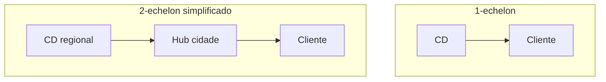

# Malha logística — hubs, prazo e estoque posicionado

**Malha** é o mapa de **nós** (CDs, fábricas, hubs, lojas) e **elos** (rotas, lead times, custos e restrições). «Melhorar a malha» quase nunca é um botão: é **trade-off** entre **prazo ao cliente**, **custo total** (não só frete visível) e **capital** em estoque posicionado.

Esta aula fica **estratégica-operacional**: suficiente para decidir com sensatez, sem substituir *network design* avançado da trilha «Logística estratégica» do catálogo.

---

## Objetivos e resultado de aprendizagem

**Ao final desta aula**, você será capaz de:

- Descrever **1-echelon** *vs.* **2-echelon** em linguagem de negócio.  
- Explicar **centralização** *vs.* **regionalização** com impacto em prazo e capital.  
- Posicionar **cross-docking** e **estoque de segurança** por nó (intuição).  
- Narrar um caso de **e-commerce** alterando promessa e custo de última milha.

**Duração sugerida:** 60–75 minutos.

---

## Gancho — o hub que virou gargalo

A **TechLar** regionalizou estoque para **ganhar prazo** em e-commerce. O **hub** novo recebeu volume sem **capacidade de triagem** compatível; o prazo médio melhorou na capital, piorou no interior — a malha **otimizada no slide** degradou **serviço percebido** em parte do país.

**Analogia de hidráulica:** desviar água para um cano maior **sem válvula** pode estourar o joelho da tubulação — vazamento vira **atraso**.

---

## Mapa do conteúdo

- Nós e elos; lead time e variabilidade.  
- Hub *vs.* direto; estoque posicionado.  
- *Cross-dock* como decisão operacional.  
- Ponte para dados (percentis de lead time).

---

## Conceito núcleo — echelons e estoque

Em **1-echelon**, o CD atende direto com seu estoque. Em **2-echelon** simplificado, um **nível** abastece lojas/hubs menores — ganha **proximidade**, paga **duplicação** de estoque e complexidade de **reposição**.

**Legenda:** setas ignoram fornecedor; foco é **última milha** e posicionamento.

---

## Centralizar *versus* regionalizar

| Centralizar | Regionalizar |
|-------------|--------------|
| Menor capital agregado em alguns desenhos | Menor prazo ao cliente regional |
| Economia de escala em operações | Mais pontos de contagem e acurácia |
| Maior risco de **single point of failure** | Maior coordenação de **mix** |

**Hipótese pedagógica:** e-commerce com **SLO** agressivo empurra regionalização; margem baixa empurra **consolidação** — a empresa real escolhe **matrizes** por família de produto.

---

## *Cross-docking* — quando o CD não armazena

*Cross-dock* reduz **tempo de permanência** quando há **previsibilidade** de demanda e **sincronismo** recebimento/expedição. Sem dados e disciplina, vira **varanda** de caminhão.

---

## Ponte — medir cauda, não só média

Ver [lead time e variabilidade](../../trilha-dados-analytics-logistica/modulo-04-indicadores-logisticos-kpis/aula-02-lead-time-variabilidade-logistica.md). Malha boa no P50 e ruim no P90 ainda **falha** promoções.

---

## Aplicação — exercício

Desenhe (texto + lista) **duas** malhas para a mesma base de clientes: **A)** 1 CD nacional; **B)** 1 CD + 3 *forward stock locations* leves. Para cada uma, liste **3 benefícios** e **3 custos/riscos**.

**Gabarito pedagógico:** B deve citar **acurácia**, **mix** e **custo fixo**; A deve citar **prazo interior** e **risco** de ruptura regionalizada.

---

## Erros comuns e armadilhas

- Regionalizar sem **SKU** adequado em cada nó (mix errado).  
- Ignorar **capacidade** de triagem/expedição no hub.  
- Tratar **frete médio** como único KPI da malha.  
- Copiar malha de concorrente com **mix** diferente.  
- Esquecer **continuidade** (planos B de rota/fornecedor).

---

## KPIs e decisão

- **OTIF** por região e canal.  
- **Custo total para servir** (ligação com Fundamentos — custos).  
- **Capital** em estoque por nó e por classe ABC.

---

## Fechamento — três takeaways

1. Malha é **decisão de serviço** com fatura em **capital e complexidade**.  
2. Hub sem capacidade operacional é **decorativo**.  
3. P90 importa — promoção lembra disso todo mês.

**Pergunta de reflexão:** qual região está **bem na média** e **mal na cauda**?

---

## Referências

1. CHOPRA, S.; MEINDL, P. *Supply Chain Management*. Pearson.  
2. DASKIN, M. S. *What You Should Know About Location Analysis* (como referência de *network science* — tipo).  
3. CSCMP — glossário: https://cscmp.org/CSCMP/cscmp/educate/scm_definitions_and_glossary_of_terms.aspx
