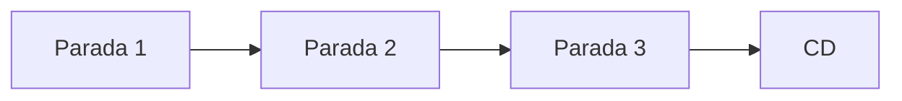
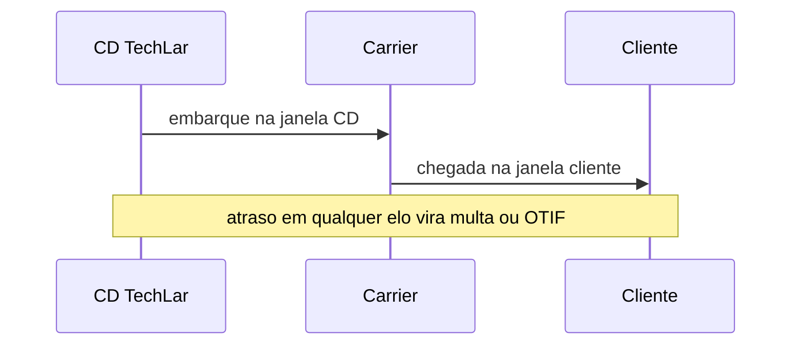

# Modais, consolidação, *milk run* e janelas — ritmo, tamanho e a doca do outro lado

**Modais** (FTL, LTL, pacote, *last mile*) respondem a perguntas diferentes: **tamanho de carga**, **urgência**, **restrito**, **custo de cauda** e **experiência**. **Consolidação** e ***milk run*** são táticas de **encher o veículo** e **cadenciar** coletas. **Janelas** em doca são **lei local** do sistema — ignorá-las destrói **P90** mesmo com TMS caro.

---

## Objetivos e resultado de aprendizagem

**Ao final desta aula**, você será capaz de:

- Escolher modal com **trade-off** explícito (custo médio *vs.* P90 *vs.* serviço).  
- Desenhar um *milk run* conceitual (paradas, tempo, risco de atraso em cascata).  
- Relacionar **janela** com OTIF e multas B2B.  
- Explicar **empty backhaul** em frota própria.

**Duração sugerida:** 60–75 minutos.

---

## Gancho — o barato que estourou a janela

A **TechLar** migrou carga para **LTL** mais barato em média; o **P90** de coleta subiu; **multas** por janela explodiram. O frete «economizou»; o **contrato** cobrou de volta — **cauda** importa.

**Analogia do voo com conexão:** economizar na tarifa e perder a conexão **sempre** custa mais caro que a planilha mostrou.

---

## Mapa do conteúdo

- FTL/LTL/pacote — âncoras operacionais (detalhe contratual nos Fundamentos).  
- Consolidação e *milk run*.  
- Janelas e agendamento.  
- Sustentabilidade como critério opcional **transparente**.

---

## Modais — decisão em cinco perguntas

1. **Peso/cubagem** e unidade de movimentação (palete, rolo, volume).  
2. **Tempo** prometido e tolerância de atraso (SLA).  
3. **Restrições** (temperatura, ADR, segurança).  
4. **Densidade** de paradas (urbano *vs.* interior).  
5. **Custo total** (tarifa + acessoriais + risco de multa).

**Ponte:** ver [fretes e contratos](../../trilha-fundamentos-e-estrategia/modulo-04-custos-logisticos-performance/aula-02-fretes-contratos-negociacao.md).

---

## *Milk run* — cadência com risco em série

***Milk run*** é rota fixa com **múltiplas coletas/entregas** pequenas — típico em **abastecimento de fábrica** ou lojas. O ganho é **regularidade**; o risco é **atraso em cascata** na terceira parada.

**Legenda:** buffers de tempo e *cut-off* internos reduzem efeito dominó.

---

## Janelas e doca — negociação operacional

Janela não é «gentileza do cliente»: é **capacidade compartilhada**. Sem **agendamento** e **penalidade interna** por atraso de descarga, a operação **importa** o caos do lado de fora.

**Legenda:** sequência pedagógica; TMS registra eventos (trilha Tecnologia).

---

## *Empty backhaul* — assimetria escondida

Frota própria com **retorno vazio** distribui custo só no trecho «cheio» na cabeça do gestor — **custo total** exige alocar **ciclo completo**.

---

## Aplicação — exercício

Para **quatro** perfis (A: FTL urgente; B: LTL regional; C: pacote e-commerce; D: refrigerado curta distância), escolha modal e justifique com **P90** hipotético (números fictícios coerentes).

**Gabarito pedagógico:** D quase sempre exige **capacidade térmica** + procedimento; C pesa **última milha**; A paga **custo** por velocidade e previsibilidade.

---

## Erros comuns e armadilhas

- Otimizar **custo médio** ignorando **multa** contratual.  
- *Milk run* sem **SLA** de parada individual.  
- Modal errado por **SKU** sem cubagem mestre (Master Data).  
- «Sustentável» sem **dado** de emissão ou sem trade-off aceito pelo cliente.

---

## KPIs e decisão

- **OTIF** por modal e por região.  
- **Custo por ton-km** e **custo por entrega** (dupla visão).  
- **% janelas** cumpridas e **tempo de espera** em doca.

---

## Fechamento — três takeaways

1. Modal é **pacote de risco + tempo + tamanho** — não só tarifa.  
2. *Milk run* sem buffer é **dominó** logístico.  
3. Janela é **capacidade** — trate como recurso escasso.

**Pergunta de reflexão:** qual modal hoje está **subdimensionado** na cauda (P90), não na média?

---

## Referências

1. BOWERSOX, D. J.; et al. *Supply Chain Logistics Management*. McGraw-Hill.  
2. CSCMP — glossário: https://cscmp.org/CSCMP/cscmp/educate/scm_definitions_and_glossary_of_terms.aspx  
3. Trilha Tecnologia — [TMS](../../trilha-tecnologia-e-sistemas/modulo-04-tms/README.md).
