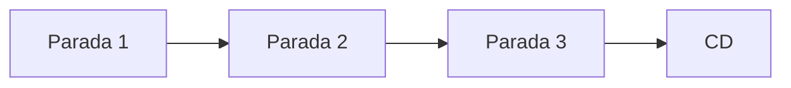
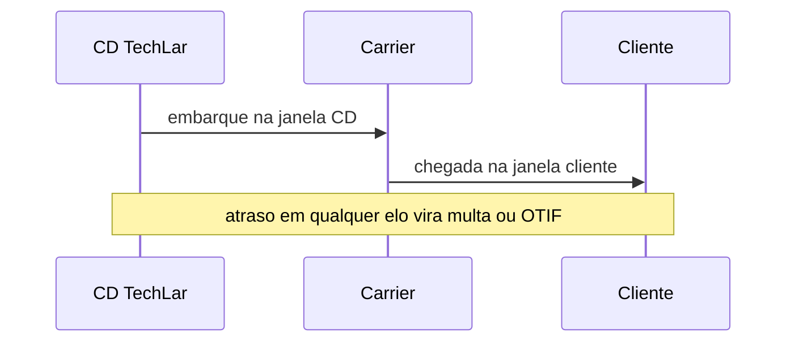

# Modais, consolidação, *milk run* e janelas — ritmo, tamanho e a doca do outro lado

**Modais** (FTL, LTL, pacote, *last mile*) respondem a perguntas diferentes: **tamanho de carga**, **urgência**, **restrito**, **custo de cauda** e **experiência**. **Consolidação** e ***milk run*** são táticas de **encher o veículo** e **cadenciar** coletas. **Janelas** em doca são **lei local** do sistema — ignorá-las destrói **P90** mesmo com TMS caro.

---

## Objetivos e resultado de aprendizagem

**Ao final desta aula**, você será capaz de:

- Escolher modal com **trade-off** explícito (custo médio *vs.* P90 *vs.* serviço).  
- Desenhar um *milk run* conceitual (paradas, tempo, risco de atraso em cascata).  
- Relacionar **janela** com OTIF e multas B2B.  
- Explicar **empty backhaul** em frota própria.

**Duração sugerida:** 60–75 minutos.

---

## Gancho — o barato que estourou a janela

A **TechLar** migrou carga para **LTL** mais barato em média; o **P90** de coleta subiu; **multas** por janela explodiram. O frete «economizou»; o **contrato** cobrou de volta — **cauda** importa.

**Analogia do voo com conexão:** economizar na tarifa e perder a conexão **sempre** custa mais caro que a planilha mostrou.

---

## Mapa do conteúdo

- FTL/LTL/pacote — âncoras operacionais (detalhe contratual nos Fundamentos).  
- Consolidação e *milk run*.  
- Janelas e agendamento.  
- Sustentabilidade como critério opcional **transparente**.

---

## Modais — decisão em cinco perguntas

1. **Peso/cubagem** e unidade de movimentação (palete, rolo, volume).
2. **Tempo** prometido e tolerância de atraso (SLA).
3. **Restrições** (temperatura, ADR/Resolução ANTT 5.998/22, segurança lista MAPA/Anvisa).
4. **Densidade** de paradas (urbano *vs.* interior).
5. **Custo total** (tarifa + acessoriais + risco de multa + ICMS-difal).

### Tabela de modais — Brasil 2025–2026 (faixas de mercado)

| Modal | Volume típico | Custo unitário | Lead time SP→exemplos | Quando usa |
|-------|----------------|----------------|------------------------|------------|
| **Rodoviário FTL** (cavalo + sider/baú 28 t) | 25–28 t / 90 m³ | **R$ 4,50–7,50/km** + pedágio | SP→RJ 1 dia, SP→POA 2 dias, SP→REC 4–5 dias | carga lotação, indústria, varejo CD |
| **Rodoviário LTL/fracionado** | < 5 t | **R$ 0,40–1,20/kg** + ad valorem 0,3–1,0% NF | SP→RJ 2 dias, SP→Curitiba 2 dias | médio porte, B2B |
| **Pacote/encomenda** (Loggi, Total, Jadlog, MELi, Sequoia) | < 30 kg | R$ 12–60 por encomenda | capital 1 dia, interior 2–4 dias | e-commerce B2C |
| **Last-mile urbano** (moto, bike, van) | < 50 kg/parada | R$ 8–25 por entrega | mesmo dia | quick commerce |
| **Aéreo doméstico** (Latam Cargo, Azul Cargo) | < 100 kg/AWB | **R$ 6–15/kg** | 1 dia para capital | farma, alta urgência |
| **Cabotagem** (Aliança/Maersk, Log-In, Mercosul Line) | contêiner 20'/40' | R$ 4.000–9.000/contêiner SP→Manaus | 8–14 dias SP→Manaus | longa distância NE/N |
| **Ferroviário** (Rumo, MRS, VLI) | granel/contêiner | **R$ 0,06–0,12 t-km** | longo prazo | commodities, grãos |
| **Aquaviário interior** (hidrovias) | granel | menor para AM/PA | dias-semanas | grãos, combustível |

### Pedágios e regulação BR

- **Pedágio rodoviário** (SP, MG, PR, ABCR): R$ 0,10–0,30 por **km** equivalente (eixo cobrado); SP→Sul costuma somar **R$ 200–400** por trecho ida.
- **CT-e** (Conhecimento de Transporte eletrônico, Ajuste SINIEF 09/07): obrigatório para qualquer transporte interestadual e intramunicipal de carga.
- **MDF-e** (Manifesto eletrônico de documentos fiscais): obrigatório acompanhar viagem com carga de mais de uma NF-e ou de mais de um remetente.
- **RNTRC** (Registro Nacional de Transportadores Rodoviários de Carga, ANTT 4.799/15): qualquer veículo > 1.500 kg PBT precisa estar inscrito.
- **Resolução ANTT 5.867/20** (piso mínimo de fretes — decisões judiciais oscilam, validar versão vigente).
- **Lei do Caminhoneiro 13.103/15**: jornada (8 h + 2 extras + 30 min descanso a cada 4 h dirigindo), seguro DPVAT, vistoria.
- **Resolução ANTT 5.232/16**: produtos perigosos (ADR-BR), classes 1–9.
- **AET** (Autorização Especial de Trânsito) p/ excedente de peso/dimensão (CIT — RJ-SP-MG).

**Ponte:** ver [fretes e contratos](../../trilha-fundamentos-e-estrategia/modulo-04-custos-logisticos-performance/aula-02-fretes-contratos-negociacao.md).

---

## *Milk run* — cadência com risco em série

***Milk run*** é rota fixa com **múltiplas coletas/entregas** pequenas — típico em **abastecimento de fábrica** ou lojas. O ganho é **regularidade**; o risco é **atraso em cascata** na terceira parada.

**Legenda:** buffers de tempo e *cut-off* internos reduzem efeito dominó.

---

## Janelas e doca — negociação operacional, multas e *RetailReady*

Janela não é «gentileza do cliente»: é **capacidade compartilhada**. Sem **agendamento** e **penalidade interna** por atraso de descarga, a operação **importa** o caos do lado de fora.

**Multas típicas BR (ordens de grandeza, não substitui contrato real):**

| Cliente / cenário | Tipo de multa | Faixa |
|-------------------|---------------|-------|
| Atacarejo nacional (Atacadão, Assaí) | atraso janela / ASN errado | **5–15% NF** + recusa |
| Carrefour / GPA | OTIF mensal abaixo da meta | desconto 2–5% nota mensal |
| Marketplace fulfilment (MELi Full, Amazon FBA) | atraso recebimento | suspensão de envio, perda de buy-box |
| Transportadora rodoviária | demurrage de descarga | R$ 60–120 por **hora** parada após franquia (2–4 h) |
| Container marítimo no porto | demurrage + detention | USD 75–250/dia/contêiner após 7–10 dias livres |

**Padrão *vendor compliance* (RetailReady):** etiqueta GS1 padrão por palete (SSCC), ASN (DESADV/EDI 856) enviado antes da chegada, pallet único por SKU/lote, peso e volume conferidos pré-embarque. Falha = recusa total na doca.

**Legenda:** sequência pedagógica; TMS registra eventos (trilha Tecnologia).

---

## *Empty backhaul* — assimetria escondida

Frota própria com **retorno vazio** distribui custo só no trecho «cheio» na cabeça do gestor — **custo total** exige alocar **ciclo completo**.

---

## Aplicação — exercício

Para **quatro** perfis (A: FTL urgente; B: LTL regional; C: pacote e-commerce; D: refrigerado curta distância), escolha modal e justifique com **P90** hipotético (números fictícios coerentes).

**Gabarito pedagógico:** D quase sempre exige **capacidade térmica** + procedimento; C pesa **última milha**; A paga **custo** por velocidade e previsibilidade.

---

## Erros comuns e armadilhas

- Otimizar **custo médio** ignorando **multa** contratual.  
- *Milk run* sem **SLA** de parada individual.  
- Modal errado por **SKU** sem cubagem mestre (Master Data).  
- «Sustentável» sem **dado** de emissão ou sem trade-off aceito pelo cliente.

---

## Aprofundamentos — variações setoriais

| Setor | Modal predominante | Particularidade |
|-------|---------------------|------------------|
| **E-commerce B2C** | pacote (carrier mix) + last-mile moto/van | cut-off rígido por carrier |
| **Varejo CD→loja** | FTL ou *milk run* CD→cluster lojas | janela rígida, multas |
| **Auto-peças OEM** | *milk run* JIS / JIT em sequência | atraso = parar linha (R$ 100k–500k/h) |
| **Cold chain (vacina/farma)** | aéreo + refrigerado dedicado | logger + RDC 430/20 |
| **Agro/grão** | ferroviário + cabotagem + FTL | safra concentra, fila portuária |
| **Mineração** | ferroviário + cabotagem | unitário, longo prazo |
| **Combustível/químico** | tanque ADR rodoviário | NR-26, ANTT 5.232/16 |

---

## Trade-offs

| Alavanca | + Custo médio | + P90 (cauda) | + CO₂ | + Risco multa |
|----------|:-------------:|:-------------:|:-----:|:-------------:|
| FTL dedicado | ↑↑ | ↓↓ | ↑ | ↓↓ |
| LTL fracionado | ↓ | ↑ | ↓ leve | ↑ |
| Aéreo doméstico | ↑↑↑↑ | ↓↓↓ | ↑↑↑ | ↓↓↓ |
| Cabotagem (NE/N) | ↓↓ | ↑ leve | ↓↓ | ↔ |
| Last-mile crowdshipping | ↓ | ↑ | ↓ | ↑ |

---

## Erros comuns e armadilhas

- Otimizar **custo médio** ignorando **multa** contratual.
- *Milk run* sem **SLA** de parada individual (uma parada atrasa tudo).
- Modal errado por **SKU sem cubagem mestre** → frete dimensional explode (Loggi/Sequoia cobram pelo maior entre peso real e peso cubado, fator 167–200 kg/m³).
- «Sustentável» sem **dado** de emissão (factor de emissão GHG Protocol — 62 g CO₂/t-km rodoviário, 22 g cabotagem, 18 g ferroviário; aéreo 600+).
- *Empty backhaul* não calculado: frota própria com 35–40% retorno vazio é regra.
- CT-e/MDF-e divergente de NF-e → **Sefaz** rejeita, caminhão para na barreira.
- Carrier sem **gerenciadora de risco** aprovada (Buonny, OnixSat, Sascar) em rotas críticas (rotas de roubo SP-RJ).

---

## O que vira dado no sistema

| Campo / evento | Sistema | Função |
|---|---|---|
| `mode_id` (FTL/LTL/aéreo/cab.) | TMS | classificação |
| `carrier_id`, `cut_off_time` | TMS | regra de onda |
| `cte_chave`, `mdfe_chave` | ERP fiscal | obrigatórios |
| `weight_actual`, `weight_dim` | TMS | maior dos dois para frete |
| `dock_appointment` | TMS/portal | janela cliente |
| evento `pickup_done`, `delivered`, `pod_received` | TMS | marcos de OTIF |
| `claim_id` (sinistro) + valor | TMS | gestão de avaria |
| `co2_kg_per_shipment` | TMS/BI | ESG |

---

## KPIs e decisão (tabela)

| KPI | Pergunta | Dono | Fonte | Cadência | Playbook |
|-----|----------|------|-------|----------|----------|
| **OTIF por modal/região** | Qual cauda dói? | Logística | TMS+ERP | Diário | Rever carrier/modal |
| **Custo por ton-km** e **R$/entrega** | Estamos pagando justo? | Controladoria | TMS+fiscal | Mensal | Cotação + leilão |
| **% janelas cumpridas** | Cliente sente? | Ops | TMS | Diário | Buffer de tempo |
| **Tempo médio descarga** (doca cliente) | Demurrage? | Ops | TMS GPS | Diário | Renegociar janela |
| **First-attempt delivery %** (last-mile) | Cliente em casa? | Last-mile | TMS BI | Diário | Janela predita |
| **Sinistros (R$ e %)** | Avarias controladas? | Logística | TMS + seguros | Mensal | Embalagem + carrier |
| **CO₂ por entrega** | ESG? | Sustentabilidade | TMS + factor | Mensal | Cabotagem/ferro |
| **Custo de multa por janela** | Vendor compliance? | Logística | finanças+TMS | Mensal | Treino + ASN |

---

## Ferramentas e tecnologias

| Tecnologia | Quando |
|------------|--------|
| **TMS** (Oracle TM, Manhattan, BluJay/E2open, Mercurius/JDA, Embarcador, IntelliShip) | gestão multi-modal |
| **YMS** (Yard Management) | pátio + agendamento doca |
| **Telemetria GPS + AVL** (OnixSat, Sascar, Maxtrack) | rastreio + jornada motorista |
| **Gerenciadora de risco** (Buonny, OnixSat) | rotas de risco |
| **Roteirizador** (Routeasy, Cargobr, Routyn, Trimble Roteirizador, ESRI Network) | última milha + JC |
| **Plataformas de fretamento** (Truckpad, Frete.com, Cargo X, Cobli) | *spot market* |
| **Cabotagem** (Aliança, Mercosul, Log-In) | rotas longas N/NE |
| **Last-mile orquestrador** (Olist Logística, Loggi Empresas, Frete Rápido) | múltiplos carriers |

---

## Glossário rápido

- **ASN** (*advance shipping notice*) / EDI 856 (DESADV): aviso prévio de embarque.
- **Cubagem (peso dimensional):** L×A×P/fator (kg/m³); fator BR rodoviário ~ 300; aéreo ~ 167.
- **CT-e:** Conhecimento de Transporte eletrônico.
- **Demurrage:** taxa por extrapolar janela.
- **FTL/LTL:** *full truck load* / *less than truck load*.
- **MDF-e:** Manifesto Eletrônico de Documentos Fiscais.
- **PBT:** peso bruto total.
- **POD:** *proof of delivery*.
- **RNTRC:** Registro Nacional de Transportadores de Carga.
- **SSCC:** *serial shipping container code* (etiqueta de palete GS1).

---

## Fechamento — três takeaways

1. Modal é **pacote de risco + tempo + tamanho** — não só tarifa.  
2. *Milk run* sem buffer é **dominó** logístico.  
3. Janela é **capacidade** — trate como recurso escasso.

**Pergunta de reflexão:** qual modal hoje está **subdimensionado** na cauda (P90), não na média?

---

## Referências

1. BOWERSOX, D. J.; et al. *Supply Chain Logistics Management*. McGraw-Hill.  
2. ANTT — Resoluções 5.232/16 (perigosos), 5.867/20 (piso de fretes), 4.799/15 (RNTRC); https://www.gov.br/antt  
3. CONFAZ / SINIEF — CT-e (Ajuste 09/07) e MDF-e (Ajuste 21/10); https://www.confaz.fazenda.gov.br  
4. Lei 13.103/15 — Lei do Caminhoneiro.  
5. ABNT NBR 7500 e 7501 — sinalização e identificação de produtos perigosos.  
6. ABRALOG / NTC&Logística / SETCESP — pesquisas de custo de frete.  
7. CSCMP — glossário: https://cscmp.org/  
8. GHG Protocol — fatores de emissão de transporte.  
9. ILOS — *Custos logísticos no Brasil* (anual).

---

## Pontes para outras trilhas

- **Tecnologia:** [TMS](../../trilha-tecnologia-e-sistemas/modulo-04-tms/README.md).
- **Fundamentos:** [fretes e contratos](../../trilha-fundamentos-e-estrategia/modulo-04-custos-logisticos-performance/aula-02-fretes-contratos-negociacao.md), [estrutura de custos](../../trilha-fundamentos-e-estrategia/modulo-04-custos-logisticos-performance/aula-01-estrutura-custos-logisticos.md), [nível de serviço e KPIs](../../trilha-fundamentos-e-estrategia/modulo-04-custos-logisticos-performance/aula-03-nivel-servico-kpis-logisticos.md).
- **Operações** (esta trilha): [malha](aula-01-malha-hubs-estoque-posicionado.md), [roteirização](aula-03-roteirizacao-tsp-vrp-kpis.md).
