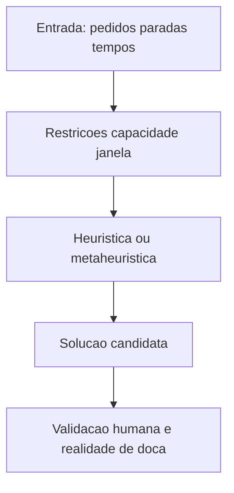

# Roteirização — TSP/VRP para gestores e KPIs

**TSP** (*traveling salesman problem*) e **VRP** (*vehicle routing problem*) são nomes intimidantes para perguntas simples: «**em que ordem** visito os pontos?» e «**com que veículos** respeito capacidade e janelas?». O software quase sempre usa **heurísticas** (soluções boas e rápidas), não mágica perfeita.

Esta aula dá **literacia** para conversar com TI/analistas e para **auditar** rotas com senso crítico.

---

## Objetivos e resultado de aprendizagem

**Ao final desta aula**, você será capaz de:

- Explicar TSP e VRP em **uma frase** cada, com exemplo.  
- Nomear **duas** heurísticas e dizer por que existem.  
- Listar **restrições** comuns (capacidade, janela, retorno ao CD).  
- Definir KPIs de rota além de «menos km».

**Duração sugerida:** 60–90 minutos (inclui exercício de papel).

---

## Gancho — a rota «mais curta» que atrasou

A **TechLar** celebrou **−8% km** na rota urbana; **OTIF** caiu. A rota **minimizou distância** mas **ignorou janela** de um cliente B2B e **tempo de serviço** (*service time*) na doca. O algoritmo fez o que mandaram; o **modelo** estava errado.

**Analogia do GPS:** «rota mais curta» que passa por escolas às 16h — distância linda, **tempo** péssimo.

---

## Mapa do conteúdo

- TSP como ideia; VRP com restrições.  
- Heurísticas (*nearest neighbor*, *savings*).  
- Validação humana e dados de entrada.  
- Última milha e falhas típicas.

---

## TSP e VRP — definições operacionais

- **TSP:** ordem de visitas com **um** veículo, minimizando **custo** (tempo, km, pedágio ponderado).  
- **VRP:** múltiplos veículos, **capacidade**, **janelas de tempo**, às vezes **restritos** (refrigerado, ADR).

**Legenda:** caixa **V** é onde boas empresas evitam «cegueira algorítmica».

---

## Heurísticas — por que não «exato sempre»?

Problemas reais são **grandes** e **dinâmicos**; solução ótima exata pode levar tempo proibitivo. **Heurísticas** trocam perfeição por **praticidade**.

- ***Nearest neighbor***: ganância simples — bom didaticamente, frágil em detalhes.  
- ***Clarke–Wright savings***: ideia de **fundir** rotas quando a economia (*savings*) compensa — muito usada didaticamente.

**Mensagem:** entender a heurística ajuda a entender **vieses** (ex.: ignorar simetrias urbanas, picos de trânsito).

---

## KPIs além do km

- **OTIF** da rota (entregas na janela).  
- **Horas motorista** e conformidade (*compliance* trabalhista — tipo de fonte: regulador local).  
- **Custo por entrega** e **custo por kg entregue**.  
- **Taxa de primeira tentativa** (*first attempt delivery*) na última milha.

---

## Aplicação — exercício de papel

Cinco paradas em formato de estrela: distâncias desiguais, uma parada com **janela apertada**. Proponha **duas** ordens: (A) minimizar km; (B) respeitar janela. Explique **custo** de cada escolha em **minutos** além de km.

**Gabarito pedagógico:** (A) pode violar janela; (B) pode aumentar km — decisão deve ser **contratual** e **com cliente**, não só «otimizador».

---

## Erros comuns e armadilhas

- Otimizar km com **tempo de serviço** fictício.  
- Rotas sem **atualização** de trânsito/fechamentos (dados).  
- **Última milha** tratada como VRP «bonito» sem **POD** e sem tentativas.  
- Confundir **polilinha** do mapa com **tempo** humano de descarga.

---

## Fechamento — três takeaways

1. Roteirização é **modelo** — lixo entra, lixo sai.  
2. Heurística é escolha de **pragmatismo** — exija transparência.  
3. km é métrica; **OTIF e custo total** são negócio.

**Pergunta de reflexão:** qual restrição real da sua operação **não está** no modelo hoje?

---

## Referências

1. TOTH, P.; VIGO, D. (orgs.) *The Vehicle Routing Problem* (mono/grafos — tipo).  
2. CHOPRA, S.; MEINDL, P. *Supply Chain Management*. Pearson.  
3. Trilha Dados — [lead time e variabilidade](../../trilha-dados-analytics-logistica/modulo-04-indicadores-logisticos-kpis/aula-02-lead-time-variabilidade-logistica.md).
