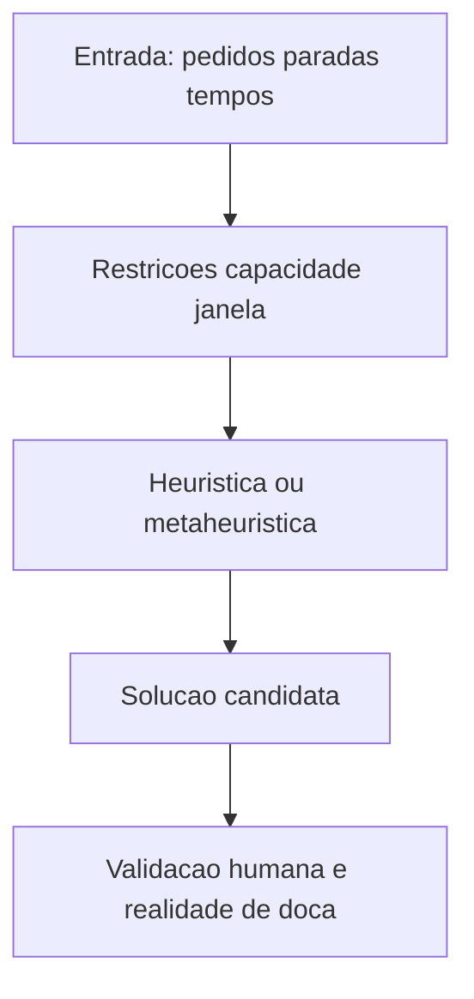

# Roteirização — TSP/VRP para gestores e KPIs

**TSP** (*traveling salesman problem*) e **VRP** (*vehicle routing problem*) são nomes intimidantes para perguntas simples: «**em que ordem** visito os pontos?» e «**com que veículos** respeito capacidade e janelas?». O software quase sempre usa **heurísticas** (soluções boas e rápidas), não mágica perfeita.

Esta aula dá **literacia** para conversar com TI/analistas e para **auditar** rotas com senso crítico.

---

## Objetivos e resultado de aprendizagem

**Ao final desta aula**, você será capaz de:

- Explicar TSP e VRP em **uma frase** cada, com exemplo.  
- Nomear **duas** heurísticas e dizer por que existem.  
- Listar **restrições** comuns (capacidade, janela, retorno ao CD).  
- Definir KPIs de rota além de «menos km».

**Duração sugerida:** 60–90 minutos (inclui exercício de papel).

---

## Gancho — a rota «mais curta» que atrasou

A **TechLar** celebrou **−8% km** na rota urbana; **OTIF** caiu. A rota **minimizou distância** mas **ignorou janela** de um cliente B2B e **tempo de serviço** (*service time*) na doca. O algoritmo fez o que mandaram; o **modelo** estava errado.

**Analogia do GPS:** «rota mais curta» que passa por escolas às 16h — distância linda, **tempo** péssimo.

---

## Mapa do conteúdo

- TSP como ideia; VRP com restrições.  
- Heurísticas (*nearest neighbor*, *savings*).  
- Validação humana e dados de entrada.  
- Última milha e falhas típicas.

---

## TSP e VRP — definições operacionais e suas variantes

- **TSP** (*traveling salesman*): ordem de visitas com **um** veículo, minimizando **custo** (tempo, km, pedágio ponderado).  
- **VRP** (*vehicle routing problem*): múltiplos veículos, capacidade, janelas — várias variantes, cada uma resolve um problema diferente:

| Sigla | Significado | Restrição-chave | Caso BR típico |
|-------|-------------|-----------------|----------------|
| **CVRP** | *Capacitated VRP* | capacidade do veículo | distribuição B2B paletizada |
| **VRPTW** | *VRP with Time Windows* | janela rígida no cliente | varejo (CD→loja) |
| **VRPPD** | *Pickup & Delivery* | coleta e entrega | reverso, e-commerce devolução |
| **MDVRP** | *Multi-Depot VRP* | vários CDs de origem | distribuidor regional |
| **VRPB** | *VRP with Backhauls* | retorno produtivo | indústria + reversa |
| **HFVRP** | *Heterogeneous Fleet* | frota mista (van+caminhão+moto) | last-mile urbano |
| **DVRP** | *Dynamic VRP* | pedidos chegam em tempo real | iFood/Rappi/Loggi |
| **EVRP** | *Electric VRP* | autonomia + recarga | last-mile elétrico (frotas urbanas SP) |
| **GVRP** | *Green VRP* | minimiza CO₂ | ESG corporativo |

### Função objetivo típica (CVRPTW)

\[
\min \sum_{k \in K} \sum_{(i,j) \in A} c_{ij} \cdot x_{ijk}
\]

sujeito a: visitar cada cliente **uma** vez; respeitar **capacidade** `Q_k`; respeitar **janela** `[a_i, b_i]`; **rota fechada** (sai e volta no depósito).

**Legenda:** caixa **V** é onde boas empresas evitam «cegueira algorítmica».

---

## Heurísticas — por que não «exato sempre»?

Problemas reais são **grandes** (centenas a milhares de paradas) e **dinâmicos**; solução ótima exata pode levar **horas–dias** computacionais. **Heurísticas** trocam perfeição por **praticidade** (resposta em segundos com 95–98% da qualidade ótima).

### Catálogo das principais

| Família | Exemplo | Como funciona | Quando |
|---------|---------|----------------|--------|
| **Construtiva gulosa** | Nearest Neighbor | sempre o ponto mais próximo | TSP didático, rota inicial |
| **Construtiva por economia** | Clarke–Wright Savings | funde rotas se `s_ij = c_0i + c_0j − c_ij > 0` | CVRP didático e prático |
| **Cluster-First, Route-Second** | Sweep, Fisher–Jaikumar | agrupa por região, depois ordena | múltiplos veículos |
| **Route-First, Cluster-Second** | Sequência única + corte | ordena tudo, depois quebra | janela apertada |
| **Melhoria local** | 2-opt, 3-opt, Or-opt, Lin-Kernighan | troca arestas se melhora | refinar rota inicial |
| **Metaheurística** | Tabu Search, Simulated Annealing, GA, ALNS | escapa de ótimo local | malhas grandes |
| **Solver comercial** | Google OR-Tools, Gurobi, CPLEX, LocalSolver | mistura tudo | engenharia OR |

### Mini-exemplo Clarke–Wright

Depósito `0`, três clientes `A, B, C`. Distâncias: `c_0A = 10`, `c_0B = 12`, `c_0C = 8`, `c_AB = 5`, `c_BC = 7`, `c_AC = 9`.

Rotas iniciais isoladas: `0-A-0` (20), `0-B-0` (24), `0-C-0` (16). Total: 60.

Calcular *savings*:

- `s_AB = 10 + 12 − 5 = 17`
- `s_AC = 10 + 8 − 9 = 9`
- `s_BC = 12 + 8 − 7 = 13`

Ordem decrescente: AB(17) → BC(13) → AC(9).

Funde A-B (rota `0-A-B-0` = 27); depois tenta funde B-C (já tem B na rota → vira `0-A-B-C-0` = 34). Total: **34** (em vez de 60). **Savings de 43%**.

**Mensagem:** entender a heurística ajuda a entender **vieses** (ex.: ignorar simetrias urbanas, picos de trânsito, restrições de mão única, *zona azul*, túneis com horário).

---

## KPIs além do km

- **OTIF** da rota (entregas na janela).
- **Horas motorista** e conformidade (Lei 13.103/15: jornada 8 h + 2 extras + descanso 30 min a cada 4 h dirigindo; CCT da categoria — geralmente Conttmaq, Federações Estaduais).
- **Custo por entrega** e **custo por kg entregue**.
- **Taxa de primeira tentativa** (*first attempt delivery*, FAD) na última milha — meta classe A: ≥ 92% B2B, ≥ 85% B2C urbano.
- **Drops por rota** (densidade) — last-mile urbano BR maduro: 25–60 drops/rota van; 80–150 drops moto.
- **Tempo médio por parada** (*service time*) — B2B paletizado 12–25 min; B2C porta 2–4 min; condomínio com portaria + 5 min.
- **Ocupação volumétrica** do veículo — meta ≥ 80%.
- **% rotas dentro do plano** (planejado vs. realizado).

### Custo de motorista BR (referência 2025–2026)

| Item | Faixa |
|------|-------|
| Salário base motorista categoria E (CCT) | R$ 3.000–4.500/mês |
| Encargos + benefícios (INSS, FGTS, VR, PCCS) | +70–85% sobre o salário |
| Hora extra (50% / 100% domingo) | proporcional |
| **Custo total mensal médio** | **R$ 6.500–9.500** |
| Custo por hora útil | ~ R$ 35–55 |

### Última milha — falhas típicas e mitigações

| Falha | Mitigação |
|-------|-----------|
| Cliente ausente | janela predita por SMS/WhatsApp + reagendamento self-service |
| Endereço errado/incompleto | validação por geocodificação no checkout (Google/HERE/Mapbox) |
| Condomínio sem portaria 24h | combinar horário ou *locker* (BoxNet, Smartlocker) |
| Roubo de carga em rota crítica | gerenciadora de risco + escolta + tecnologia GPS |
| POD não capturado | foto + assinatura digital + geolocalização |

---

## Aplicação — exercício de papel

Cinco paradas em formato de estrela: distâncias desiguais, uma parada com **janela apertada**. Proponha **duas** ordens: (A) minimizar km; (B) respeitar janela. Explique **custo** de cada escolha em **minutos** além de km.

**Gabarito pedagógico:** (A) pode violar janela; (B) pode aumentar km — decisão deve ser **contratual** e **com cliente**, não só «otimizador».

---

## Erros comuns e armadilhas

- Otimizar km com **tempo de serviço** fictício.
- Rotas sem **atualização** de trânsito/fechamentos (dados).
- **Última milha** tratada como VRP «bonito» sem **POD** e sem tentativas.
- Confundir **polilinha** do mapa com **tempo** humano de descarga.
- Não modelar **rodízio veicular** (SP capital), zona de baixa emissão, ZMRC.
- Esquecer **empty backhaul** ao calcular custo total.
- Roteirizador sem integração TMS/WMS — operador re-digita rota = 30% retrabalho.
- Subestimar **tempo de portaria** em condomínio/empresa (5–15 min).

---

## O que vira dado no sistema

| Campo / evento | Sistema | Função |
|---|---|---|
| `route_plan_id` | TMS/Roteirizador | rota planejada |
| `stop_sequence`, `eta`, `etd` | TMS | ordem e tempos |
| `service_time_min` por cliente | master data | base para VRPTW |
| `vehicle_capacity_kg`, `vol_m3` | frota | restrição |
| `time_window_open/close` | OMS/TMS | restrição cliente |
| evento `arrived`, `service_start`, `service_end`, `pod_signed` | TMS GPS+POD | leading indicators |
| `attempt_count`, `attempt_status` | TMS | gestão FAD |
| `actual_route_km`, `actual_time_min` | TMS | confronto plano×real |

---

## KPIs e decisão (tabela)

| KPI | Pergunta | Dono | Fonte | Cadência | Playbook |
|-----|----------|------|-------|----------|----------|
| **OTIF da rota** | Cumprimos janela? | Logística | TMS | Diário | Re-route, buffer |
| **FAD** (1ª tentativa) | Cliente em casa? | Last-mile | TMS POD | Diário | Janela predita |
| **Drops/rota** | Densidade boa? | Plan. transp. | TMS | Diário | Re-clusterizar |
| **Custo R$/entrega** | Margem do canal? | Controladoria | TMS+fiscal | Mensal | Renegociar carrier |
| **Plano × realizado km** | Modelo confiável? | Plan. | TMS | Semanal | Calibrar service time |
| **Ocupação volumétrica %** | Caminhão cheio? | Plan. | TMS | Diário | Onda menor / consolidar |
| **Sinistros (R$, ppm)** | Avarias? | Logística | TMS+seguros | Mensal | Treino, embalagem |
| **Horas extras motorista** | Compliance trabalhista? | RH+ops | folha+TMS | Mensal | Re-clusterizar rotas |
| **CO₂/entrega** | Meta ESG? | Sustent. | TMS+factor | Mensal | EVRP / cabotagem |

---

## Ferramentas e tecnologias

| Família | Players BR/global |
|---------|-------------------|
| **Roteirizador SaaS** (last-mile) | Routeasy, Cargobr, Routyn, Maplink, Cobli, Frete Rápido, Trimble TruRoute |
| **Roteirizador on-premise / projetos OR** | Google OR-Tools (free), Gurobi, CPLEX, LocalSolver, NextBillion |
| **Last-mile completo** (orquestrador) | Loggi Empresas, Olist Logística, Total Express, Mandaê |
| **TMS com módulo de rota** | Oracle TMS, Manhattan Active TM, BluJay, Mercurius, Embarcador |
| **Mapas e ETA** | Google Maps Platform, HERE, Mapbox, OpenStreetMap |
| **POD digital** | foto+assinatura no app do motorista (todos TMS modernos) |
| **Telemetria + jornada** | OnixSat, Sascar, Cobli, Maxtrack |
| **Crowdshipping** | iFood/Rappi parceiros, Loggi, MELi Flex |

---

## Glossário rápido

- **2-opt:** heurística de melhoria que troca pares de arestas.
- **Clarke–Wright savings:** funde rotas se a economia compensa.
- **CVRP / VRPTW / MDVRP:** variantes do VRP.
- **FAD:** *first attempt delivery*.
- **Heurística:** método aproximado, rápido.
- **Metaheurística:** estrutura genérica que coordena heurísticas.
- **POD:** *proof of delivery*.
- **Service time:** tempo no cliente (descarga + assinatura).
- **TSP:** *traveling salesman problem*.

---

## Fechamento — três takeaways

1. Roteirização é **modelo** — lixo entra, lixo sai.  
2. Heurística é escolha de **pragmatismo** — exija transparência.  
3. km é métrica; **OTIF e custo total** são negócio.

**Pergunta de reflexão:** qual restrição real da sua operação **não está** no modelo hoje?

---

## Referências

1. TOTH, P.; VIGO, D. (orgs.) *Vehicle Routing: Problems, Methods, and Applications*. SIAM/MOS.  
2. LAPORTE, G. *Fifty Years of Vehicle Routing*. Transportation Science, 2009.  
3. CLARKE, G.; WRIGHT, J. W. *Scheduling of Vehicles from a Central Depot*. 1964.  
4. Google OR-Tools (open source): https://developers.google.com/optimization  
5. CHOPRA, S.; MEINDL, P. *Supply Chain Management*. Pearson.  
6. ANTT (Lei 13.103/15) e CCT da categoria de motoristas.  
7. Trilha Dados — [lead time e variabilidade](../../trilha-dados-analytics-logistica/modulo-04-indicadores-logisticos-kpis/aula-02-lead-time-variabilidade-logistica.md).

---

## Pontes para outras trilhas

- **Tecnologia:** [TMS](../../trilha-tecnologia-e-sistemas/modulo-04-tms/README.md).
- **Dados:** [lead time e variabilidade](../../trilha-dados-analytics-logistica/modulo-04-indicadores-logisticos-kpis/aula-02-lead-time-variabilidade-logistica.md), [problema → dataset](../../trilha-dados-analytics-logistica/modulo-01-data-analytics-para-logistica/aula-01-do-problema-ao-dataset.md).
- **Fundamentos:** [fretes e contratos](../../trilha-fundamentos-e-estrategia/modulo-04-custos-logisticos-performance/aula-02-fretes-contratos-negociacao.md).
- **Operações** (esta trilha): [malha](aula-01-malha-hubs-estoque-posicionado.md), [modais e milk run](aula-02-modais-milk-run-janelas.md), [picking e ondas](../modulo-02-armazenagem-e-layout-logistico/aula-03-picking-ondas-fila-fisica.md).
