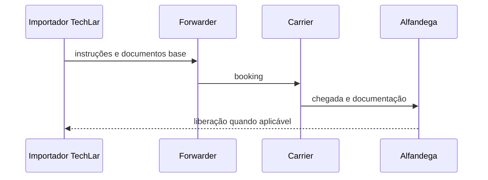
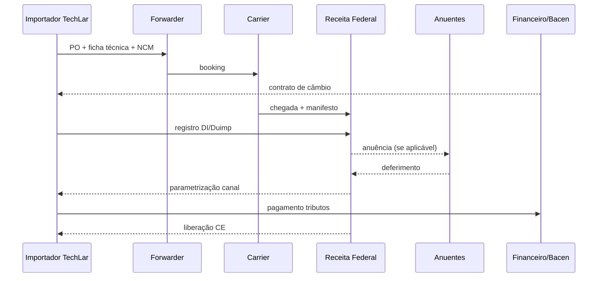

# Importar e exportar — atores, tempo e handoffs

**Comércio internacional** adiciona **atores**, **documentos** e **incerteza temporal** ao fluxo físico. Para logística, o mapa mental correto é **linha do tempo com handoffs** — não um único «pedido» monolítico. Esta aula não substitui **despachante**, **advogado** nem **contador**; ela dá **vocabulário** e **checklist mental** para não misturar papéis.

---

## Objetivos e resultado de aprendizagem

**Ao final desta aula**, você será capaz de:

- Nomear **atores** típicos (exportador, importador, *forwarder*, *carrier*, alfândega, banco).  
- Descrever **exportação** como espelho de importação em termos de risco e documento.  
- Explicar por que **classificação** (*classification*) é área de **especialista** — não improviso.  
- Montar **linha do tempo** pedido → embarque → liberação com riscos.

**Duração sugerida:** 60–75 minutos.

---

## Gancho — o Incoterm certo com o documento errado

A **TechLar** negociou **FOB** com fornecedor no exterior, mas o time logístico tratou como se o fornecedor fosse **organizar seguro internacional** «porque sempre foi assim». O embarque saiu **sem cobertura** alinhada ao contrato; a discussão financeira virou **projeto**. O problema não foi «aduana» — foi **papel** incoerente com **risco**.

**Analogia de casamento:** convite bonito (Incoterm) com **lista de presentes** (documentos) desalinhada — alguém vai dormir no sofá.

---

## Mapa do conteúdo

- Atores e incentivos.  
- Linha do tempo import/export.  
- Onde logística **para** e onde **escala** especialista.  
- Ponte para Incoterms (próxima aula).

---

## Atores — quem segura o quê (com mapa BR)

| Ator | Papel típico (alto nível) |
|------|---------------------------|
| Exportador | embarca conforme contrato; documenta origem |
| Importador | assume riscos/custos conforme contrato; paga tributos aplicáveis |
| ***Forwarder* / NVOCC** | orquestra documentos e *handling* aeroporto/porto (DHL Global Forwarding, Kuehne+Nagel, DSV, Allink, Aliança, Posidonia) |
| ***Carrier*** | transporta; emite conhecimento conforme modal (Maersk, MSC, CMA CGM, Hapag-Lloyd, Latam Cargo, Lufthansa Cargo) |
| **Despachante aduaneiro** (RFB-habilitado) | representa importador na Receita; profissional credenciado |
| **Receita Federal (RFB)** | controle aduaneiro; emite parametrização (canal verde/amarelo/vermelho/cinza) |
| **Anuentes** (quando aplicável) | Anvisa (saúde), MAPA (agro/animal), Inmetro (regulado), DECEX (cota/ex-tarifário), CNEN (radioativo), Polícia Federal (controlados), Marinha (offshore) |
| **Recintos alfandegados** (EADI/REDEX/portos secos) | armazenagem antes/depois do desembaraço (ex.: ZAL Santos, Porto Seco BH) |
| **Operador portuário** | movimentação no terminal (Santos Brasil, BTP, DP World, Portonave) |
| **Banco** | câmbio (contrato de câmbio Bacen Resolução 277/22) e financiamento |
| **Seguradora** | apólice marítima/aérea (cláusulas A/B/C, ICC) |

**Declaração:** regras **variam por país** e **mudam** — use profissionais habilitados (despachante aduaneiro registrado, advogado tributarista, contador) para operação real.

**Legenda:** sequência pedagógica; passos reais podem ramificar.

---

## Linha do tempo — importação marítima China → Brasil (caso TechLar)

| # | Etapa | Quem | T (dias) acumulado | Sistema/documento |
|---|--------|------|-------------------|---------------------|
| 1 | Pedido / PO ao fornecedor | Compras | T+0 | ERP MM |
| 2 | Lead time produção | Fornecedor | T+30–45 | — |
| 3 | Booking marítimo (Shanghai/Yantian) | Forwarder | T+30 | sistema carrier |
| 4 | Embarque + Bill of Lading (BL) | Carrier | T+45 | BL eletrônico (eBL) |
| 5 | Trânsito Ásia → Santos via Cabo | Carrier | **+30–35 dias** (eras maersk Ásia↔Santos) | telex GPS |
| 6 | Atracação Santos / desconsolidação | Operador portuário | T+78 | terminal |
| 7 | Pré-desembaraço: registro **Duimp** ou DI | Despachante | T+78 | Siscomex Importa+ / Portal Único |
| 8 | Parametrização RFB (canal V/A/V/Cinza) | RFB | T+78–80 | Pucomex |
| 9 | Conferência física (se canal vermelho) | RFB + despachante | T+79–82 | termo de verificação |
| 10 | Pagamento de tributos (II, IPI, PIS/COFINS Imp., ICMS) | Importador | T+80–82 | DARF/GLME/GNRE |
| 11 | Liberação aduaneira | RFB | T+82 | CI / DTA |
| 12 | Carregamento + frete porto→CD (rodoviário) | Carrier nacional | T+83–85 | CT-e |
| 13 | Recebimento no CD | TechLar | **T+85** | WMS |

**Lead time total típico China→CD SP:** **75–95 dias** modal marítimo Cape; **60–75 dias** Trans-Pacific direto; **5–8 dias** modal aéreo (custo 5–15× maior).

**Legenda:** sequência pedagógica; passos reais podem ramificar e há *handoffs* de informação críticos entre cada par.

---

## Exportação — espelho com outro ângulo de risco

Em exportação, a **TechLar** pode ser **exportador** — riscos de **embalagem** (NIMF-15 madeira tratada), **documentação**, **câmbio** e **compliance** de origem (listas restritivas, embargos). Documentos típicos: **DU-E** (Declaração Única de Exportação, Portal Único), **fatura comercial**, ***packing list***, **CO** (certificado de origem — Mercosul, Aladi), **AWB/BL**, **carta de crédito** ou **cobrança documentária**. Câmbio: contrato de câmbio com banco autorizado (Resolução Bacen 277/22), prazo máximo de fechamento.

---

## Classificação fiscal e regimes aduaneiros BR — só o mapa

**NCM/HS** (Nomenclatura Comum do Mercosul + Sistema Harmonizado, 8 dígitos no Brasil — ex.: `8517.13.00` para celular) define **alíquota** de:

- **II** (Imposto de Importação): 0–35% sobre valor CIF
- **IPI** (Imposto sobre Produtos Industrializados): 0–30% sobre CIF + II
- **PIS/COFINS Importação**: ~ 11,75% (LC 214/25 muda para CBS na transição)
- **ICMS Importação** (estadual): 4–25% conforme UF e produto (ex.: SP genérico 18%, RS 17%, AM ZFM diferenciado)
- **ICMS-DIFAL** quando interestadual

**Regimes aduaneiros especiais (RFB) — vale conhecer o nome:**

| Regime | Para quê |
|--------|----------|
| **Drawback** (suspensão/isenção/restituição) | exportar produtos com insumo importado sem tributo |
| **RECOF / RECOF-SPED** | indústria que importa, transforma e re-exporta (ex.: Embraer, Honda, Ford) |
| **RECOM** | repetro / setor petróleo |
| **REPETRO-SPED** | E&P offshore |
| **Ex-tarifário** | reduzir II para máquina sem similar nacional (BK/BIT) — Resolução Camex |
| **DAC / DAT** | depósito alfandegado (mercadoria armazenada sem nacionalizar) |
| **Trânsito aduaneiro** (DTA) | movimentar mercadoria não desembaraçada entre recintos |
| **Admissão temporária** | feiras, demos, aluguel, leasing — sem tributo se exportar de volta |
| **OEA** (Operador Econômico Autorizado) | empresa habilitada com canal preferencial e fluxos rápidos |

**Erro de classificação NCM** é **risco financeiro** (auto de infração + 75–150% do tributo) e de **compliance**. **Política saudável:** logística aciona **especialista** cedo, com **ficha técnica** e **amostra**.

---

## Aplicação — exercício

Escreva uma **linha do tempo** (8–12 passos) de uma importação marítima fictícia da TechLar, com **um** passo marcado como «**escalar jurídico/aduaneiro**» e **um** como «**escalar financeiro**».

**Gabarito pedagógico:** deve aparecer booking, documentos de transporte, inspeções possíveis, pagamento; escalas explícitas — não «tudo é logística».

---

## Erros comuns e armadilhas

- Misturar **comprador** e **importador** legal sem mapa de entidades.  
- Assumir que *forwarder* **assume risco** sem contrato claro.  
- «Copiar processo **do vizinho**» com **NCM** diferente.  
- Logística negociar **Incoterm** sem **financeiro** na mesa (próxima aula).  
- Tratar **LP/DU** como sinônimos universais sem validar país/região.

---

## Aprofundamentos — variações por modal e cenário

| Modal/cenário | Particularidade BR |
|---------------|---------------------|
| **Marítimo Asia→Santos** (FCL 40' HC) | 30–35 dias trânsito, ~ USD 1.500–4.500 frete dependendo do *spot rate* |
| **Marítimo via Itajaí/Navegantes (SC)** | porto importante para Sul/MG, congestionamento sazonal |
| **Marítimo Suape (PE) / Pecém (CE)** | hub Nordeste, cabotagem para SP/RJ |
| **Cabotagem (interna)** | Aliança/Log-In/Mercosul; substitui rodoviário longo NE/N |
| **Aéreo via GRU (Guarulhos)** | TECA terminal de carga; Latam Cargo, Lufthansa Cargo |
| **Aéreo via Viracopos (VCP)** | hub aéreo importação, infra alfandegada |
| **ZFM (Manaus)** | benefícios SUFRAMA (II/IPI reduzidos), modal aéreo + cabotagem |
| **Frontiera (Foz, Uruguaiana, Corumbá)** | Mercosul: livre circulação com TIPI/CO Mercosul |
| **Express courier (DHL/FedEx/UPS)** | RTS - regime de tributação simplificada para até USD 3.000 |

---

## Trade-offs — modal × custo × tempo × risco

| Modal | Custo BR (R$/kg ou USD/cont.) | Tempo CN→CD SP | Risco |
|-------|-------------------------------|----------------|-------|
| Marítimo FCL 40'HC | USD 2.500–4.500 (~ R$ 12–22/kg em FCL pesado) | 75–95 dias | demurrage, congestionamento |
| Marítimo LCL | USD 80–180/m³ + handling | 80–100 dias | desconsolidação |
| Aéreo (granel) | R$ 25–80/kg | 5–10 dias | janela aérea, cobrança volume mín |
| Express courier | R$ 80–250/kg | 4–7 dias | limite de valor (USD 3k) |
| Cabotagem (interna) | R$ 4.000–9.000/cont | 8–14 dias | porto-CD |

---

## Erros comuns e armadilhas

- Misturar **comprador** e **importador** legal sem mapa de entidades (CNPJ habilitado Radar).
- Assumir que *forwarder* **assume risco** sem contrato claro.
- «Copiar processo **do vizinho**» com **NCM** diferente.
- Logística negociar **Incoterm** sem **financeiro** na mesa (próxima aula).
- Tratar **LP/DU** como sinônimos universais sem validar país/região.
- **Habilitação Radar** insuficiente (limite USD): expressa, limitada, ilimitada — definir antes de operar.
- Esquecer **anuência** (Anvisa para cosmético, MAPA para vegetal/animal, Inmetro para regulado) → mercadoria fica retida 30+ dias.
- Embalagem de madeira **sem NIMF-15** (selo IPPC) → recusa total na origem ou destino.
- **Câmbio** travado tarde, exposição cambial alta — usar NDF (*non-deliverable forward*).

---

## O que vira dado no sistema

| Campo / evento | Sistema | Função |
|---|---|---|
| `po_id` | ERP (SAP MM) | pedido base |
| `incoterm` (`EKKO-INCO1/INCO2`) | ERP | regra de transferência |
| `bl_number`, `awb_number` | ERP custom + Forwarder | rastrear conhecimento |
| `di_number` ou `duimp_number` | Pucomex/Siscomex | declaração |
| `radar_status` (Habilitado/Suspenso) | Pucomex | status importador |
| `ncm_code` | master data | classificação |
| `landed_cost` (calculado) | ERP/BI | custo total |
| `customs_channel` (V/A/V/Cinza) | despachante | risco operacional |
| evento `customs_release` | despachante | gatilho TMS |
| `demurrage_clock` | TMS/portal carrier | risco financeiro |

---

## KPIs e decisão (tabela)

| KPI | Pergunta | Dono | Fonte | Cadência | Playbook |
|-----|----------|------|-------|----------|----------|
| **Lead time ponta a ponta** P50/P90 | Cauda dói? | Logística internac. | ERP+TMS | Mensal | Mudar carrier/modal |
| **% embarques com doc incompleto pré-cut-off** | Disciplina docs? | Compras+Forwarder | TMS | Semanal | Checklist + treino |
| **Custo de exceção / embarque** (demurrage, armazenagem, multa) | Onde sangra? | Controladoria | finanças+despachante | Mensal | Planejamento de pickup |
| **% embarques canal vermelho** | Risco RFB? | Compliance | despachante | Mensal | Revisão NCM, OEA |
| **Tempo médio desembaraço** (RFB) | Aduana fluindo? | Despachante | Pucomex | Semanal | Anuência prévia |
| **Custo R$ por TEU** | Frete competitivo? | Plan. | TMS | Mensal | Re-licitar carrier |
| **Stock-out por atraso import** | Cliente sente? | Plan. | ERP | Semanal | Buffer + air-bridge plano B |

---

## Ferramentas e tecnologias

| Família | Ex. BR/global |
|---------|---------------|
| **Portal Único / Pucomex / Duimp** (RFB) | obrigatório |
| **Siscomex Importa+ / Exporta+** | declarações |
| **Sistemas de despachante** (Conexos, ZTrade, Softway, Easycomex) | gestão DI/DU-E |
| **Forwarder digital** (Flexport, Cargo X, Cargobr Internacional, Rocket Cargo) | visibilidade ponta-a-ponta |
| **Visibility platforms** (project44, FourKites) | rastreio multi-carrier |
| **Sistema de seguro internacional** (Kuehne+Nagel, Marsh) | apólice + sinistro |
| **Bacen contrato de câmbio + NDF** | hedge cambial |

---

## Glossário rápido

- **Anuente:** órgão que precisa autorizar antes do desembaraço.
- **Canal V/A/V/Cinza:** verde (liberação automática), amarelo (doc), vermelho (físico), cinza (suspeita fraude).
- **DAT/DAC:** depósito afiançado/alfandegado.
- **DI / Duimp:** declaração de importação (Duimp é o novo modelo Portal Único).
- **DU-E:** declaração única de exportação.
- **EADI / Porto Seco:** recinto alfandegado interior.
- **Forwarder / NVOCC:** agente de carga internacional.
- **Incoterm:** ver aula 4.2.
- **NCM:** Nomenclatura Comum do Mercosul (8 dígitos).
- **NIMF-15:** norma fitossanitária para madeira.
- **OEA:** Operador Econômico Autorizado.
- **Pucomex / Portal Único:** plataforma RFB.
- **Radar:** habilitação do importador (Receita).
- **RFB:** Receita Federal do Brasil.
- **TIPI:** Tabela de Incidência do IPI.
- **ZFM / SUFRAMA:** Zona Franca de Manaus.

---

## Fechamento — três takeaways

1. Internacional é **coreografia de risco** — não só frete.  
2. Documento e **papel contratual** precisam dançar juntos.  
3. Quando em dúvida, **escale** — barato é mais caro que especialista.

**Pergunta de reflexão:** qual handoff hoje é «**telefone e WhatsApp**» sem registro?

---

## Referências

1. ICC — regras e publicações: https://iccwbo.org/  
2. RECEITA FEDERAL — Portal Único Siscomex e Duimp: https://www.gov.br/siscomex e https://www.gov.br/receitafederal  
3. MDIC / SECEX — Camex e ex-tarifário: https://www.gov.br/mdic  
4. ANVISA, MAPA, INMETRO — anuências.  
5. BACEN — Resolução 277/22 (câmbio simplificado).  
6. ICC — Incoterms® 2020 (próxima aula).  
7. CSCMP — glossário: https://cscmp.org/  
8. CHOPRA, S.; MEINDL, P. *Supply Chain Management*. Pearson.  
9. ABRACOMEX, AEB e ABRAMEC — entidades setoriais BR.

---

## Pontes para outras trilhas

- **Operações** (esta trilha): [Incoterms 2020](aula-02-incoterms-2020-logistica.md), [docs e landed cost](aula-03-documentos-landed-cost-compliance.md).
- **Fundamentos:** [estrutura de custos](../../trilha-fundamentos-e-estrategia/modulo-04-custos-logisticos-performance/aula-01-estrutura-custos-logisticos.md).
- **Tecnologia:** [TMS](../../trilha-tecnologia-e-sistemas/modulo-04-tms/README.md), [ERP — estoque e movimentos](../../trilha-tecnologia-e-sistemas/modulo-02-erp-aplicado-supply-chain/aula-02-stock-movimentos.md).
