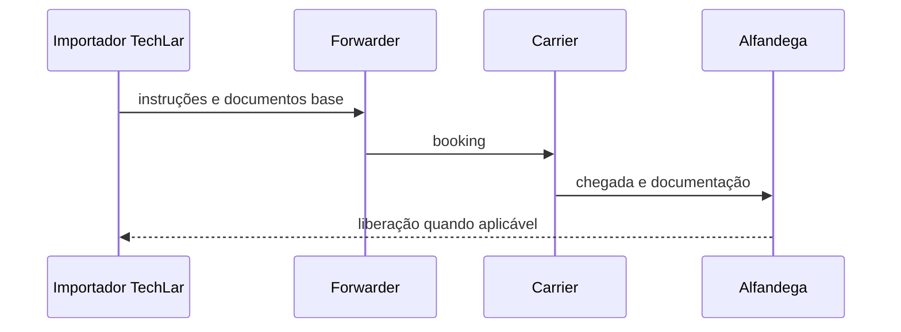

# Importar e exportar — atores, tempo e handoffs

**Comércio internacional** adiciona **atores**, **documentos** e **incerteza temporal** ao fluxo físico. Para logística, o mapa mental correto é **linha do tempo com handoffs** — não um único «pedido» monolítico. Esta aula não substitui **despachante**, **advogado** nem **contador**; ela dá **vocabulário** e **checklist mental** para não misturar papéis.

---

## Objetivos e resultado de aprendizagem

**Ao final desta aula**, você será capaz de:

- Nomear **atores** típicos (exportador, importador, *forwarder*, *carrier*, alfândega, banco).  
- Descrever **exportação** como espelho de importação em termos de risco e documento.  
- Explicar por que **classificação** (*classification*) é área de **especialista** — não improviso.  
- Montar **linha do tempo** pedido → embarque → liberação com riscos.

**Duração sugerida:** 60–75 minutos.

---

## Gancho — o Incoterm certo com o documento errado

A **TechLar** negociou **FOB** com fornecedor no exterior, mas o time logístico tratou como se o fornecedor fosse **organizar seguro internacional** «porque sempre foi assim». O embarque saiu **sem cobertura** alinhada ao contrato; a discussão financeira virou **projeto**. O problema não foi «aduana» — foi **papel** incoerente com **risco**.

**Analogia de casamento:** convite bonito (Incoterm) com **lista de presentes** (documentos) desalinhada — alguém vai dormir no sofá.

---

## Mapa do conteúdo

- Atores e incentivos.  
- Linha do tempo import/export.  
- Onde logística **para** e onde **escala** especialista.  
- Ponte para Incoterms (próxima aula).

---

## Atores — quem segura o quê

| Ator | Papel típico (alto nível) |
|------|---------------------------|
| Exportador | embarca conforme contrato; documenta origem |
| Importador | assume riscos/custos conforme contrato; paga tributos aplicáveis |
| *Forwarder* | orquestra documentos e *handling* aeroporto/porto |
| *Carrier* | transporta; emite conhecimento conforme modal |
| Alfândega | controle; liberação após conformidade |
| Banco | carta/crédito ou cobrança conforme pagamento |

**Declaração:** regras **variam por país** e **mudam** — use profissionais habilitados para operação real.

**Legenda:** sequência pedagógica; passos reais podem ramificar.

---

## Exportação — espelho com outro ângulo de risco

Em exportação, a **TechLar** pode ser **exportador** — riscos de **embalagem**, **documentação**, **câmbio** e **compliance** de origem (listas, embargos). O mapa mental é o mesmo: **quem faz o quê** e **quando o título/risco transfere** (ver aula de Incoterms).

---

## Classificação e tributos — só o mapa, não a consultoria

**NCM/HS** e interpretações locais definem **alíquotas** e **restrições**. Erro de classificação é **risco financeiro** e de **compliance**. **Política saudável:** logística aciona **especialista** cedo, com **ficha técnica** e **amostra**.

---

## Aplicação — exercício

Escreva uma **linha do tempo** (8–12 passos) de uma importação marítima fictícia da TechLar, com **um** passo marcado como «**escalar jurídico/aduaneiro**» e **um** como «**escalar financeiro**».

**Gabarito pedagógico:** deve aparecer booking, documentos de transporte, inspeções possíveis, pagamento; escalas explícitas — não «tudo é logística».

---

## Erros comuns e armadilhas

- Misturar **comprador** e **importador** legal sem mapa de entidades.  
- Assumir que *forwarder* **assume risco** sem contrato claro.  
- «Copiar processo **do vizinho**» com **NCM** diferente.  
- Logística negociar **Incoterm** sem **financeiro** na mesa (próxima aula).  
- Tratar **LP/DU** como sinônimos universais sem validar país/região.

---

## KPIs e decisão

- **Lead time** ponta a ponta import (definição estável).  
- **% embarques** com documento incompleto antes do *cut-off*.  
- **Custo de exceção** (armazenagem portuária, multa, *demurrage* — conceitos, não cálculo legal).

---

## Fechamento — três takeaways

1. Internacional é **coreografia de risco** — não só frete.  
2. Documento e **papel contratual** precisam dançar juntos.  
3. Quando em dúvida, **escale** — barato é mais caro que especialista.

**Pergunta de reflexão:** qual handoff hoje é «**telefone e WhatsApp**» sem registro?

---

## Referências

1. ICC — regras e publicações: https://iccwbo.org/  
2. CSCMP — glossário: https://cscmp.org/CSCMP/cscmp/educate/scm_definitions_and_glossary_of_terms.aspx  
3. Manuais de comércio exterior do **órgão competente** do seu país (tipo de fonte normativa/local).
