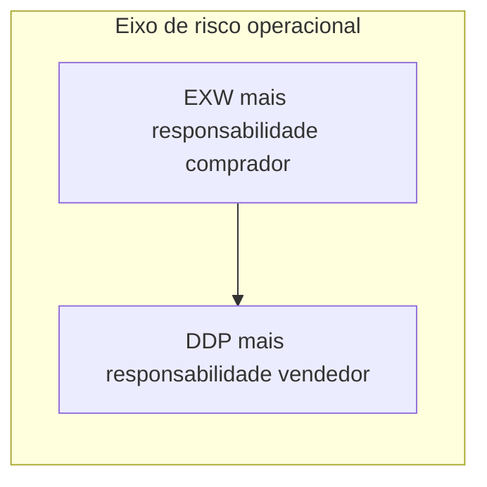

# Incoterms® 2020 — risco, custo e «quem faz o quê» na prática logística

> **Avisos legais e de marca:** **Incoterms®** é marca registrada da International Chamber of Commerce (ICC). Use sempre a **publicação oficial** vigente e valide interpretações com **jurídico** e **especialistas aduaneiros**. Este texto é **pedagógico**; **não** é assessoria jurídica, fiscal nem contratual.

**Incoterms®** são **regras voluntárias** que padronizam **onde** o risco tende a transferir e **quem paga** quais custos principais — **se** as partes as escolherem explicitamente no contrato. O contrato pode **alterar** o padrão do Incoterm; o Incoterm **não** substitui lei local nem documentação correta.

---

## Objetivos e resultado de aprendizagem

**Ao final desta aula**, você será capaz de:

- Explicar **três** arquétipos pedagógicos (EXW, FOB/CIF como famílias, DDP) em **consequências operacionais**.  
- Montar matriz **risco / custo / controle** para negociação interna.  
- Listar **erros** típicos de interpretação entre logística e comercial.  
- Saber **onde** buscar a fonte oficial (ICC).

**Duração sugerida:** 60–90 minutos.

---

## Gancho — «CIF barato» com seguro inexistente

A **TechLar** comprou **CIF** pensando que «**C** de conforto». Na prática, a cobertura mínima **não** atendia à política interna de risco; o incidente no porto virou **briga** entre compras, logística e jurídico. **Incoterm** sem **anexo** de seguro e sem **alinhamento** vira **loteria**.

**Analogia do aluguel:** «mobiliado» sem lista de itens — cada um imagina um sofá diferente.

---

## Mapa do conteúdo

- O que Incoterm **é** / **não é**.  
- Arquétipos EXW, FOB/CIF (família), DDP — **didáticos**.  
- Matriz risco/custo/controle.  
- Exercício de consequências operacionais.

---

## O que Incoterm **não** resolve sozinho

- **Propriedade intelectual**, **garantia** de qualidade, **penalidades** de atraso — isso é **contrato**.  
- **Tributação** local detalhada — **contador/aduaneiro**.  
- **Mode** (marítimo/aéreo) e versões **específicas** — validar regra escolhida (Incoterms® 2020 *vs.* versões anteriores se aplicável).

Fonte oficial: https://iccwbo.org/business-solutions/incoterms-rules/incoterms-2020/

---

## Arquétipos pedagógicos (não substituem leitura ICC)

| Arquétipo | Leitura operacional (muito resumida) |
|-----------|--------------------------------------|
| **EXW** | comprador assume **muito** do arranque físico no exterior — exige capacidade logística/compras forte |
| **FOB / CIF (família)** | divisões diferentes de **frete/seguro** e **ponto de transferência** — **nunca** tratar como sinônimos |
| **DDP** | vendedor empurra obrigações até destino — pode ser **confortável** para comprador e **pesado** para vendedor |

**Hipótese pedagógica:** use EXW/FOB/CIF/DDP como **bússola de conversa**; depois aprofunde com a tabela ICC oficial.

**Legenda:** eixo conceitual; detalhes dependem da regra escolhida e do contrato.

---

## Matriz interna — negociação saudável

| Dimensão | Pergunta para a sala |
|----------|----------------------|
| Risco | Onde o dano/perda deixa de ser «problema do outro»? |
| Custo | Quem paga frete internacional, seguro, terminal, docas especiais? |
| Controle | Quem agenda *carrier* e tem visibilidade de eventos? |
| Dados | Qual documento é **fonte da verdade** para TMS/ERP? |

---

## Aplicação — exercício

Para **três** cenários B2B (máquina pesada; insumo recorrente; *e-commerce* de importação), escolha **um** Incoterm de partida (pode ser arquétipo) e liste **5 consequências operacionais** (não só preço).

**Gabarito pedagógico:** deve aparecer **seguro**, **booking**, **doca**, **rastreio**, **responsabilidade** em avaria — não apenas «FOB porque é barato».

---

## Erros comuns e armadilhas

- Incoterm **sem** anexo de seguro e incoterms **sem** versão/ano citados no contrato.  
- Logística descobre Incoterm **no embarque** (tarde demais).  
- Misturar **porto nomeado** com **cidade** sem precisão.  
- Achar que **DDP** «resolve tudo» sem capacidade fiscal/local do vendedor.

---

## KPIs e decisão

- **Lead time** import por Incoterm (segmentado).  
- **Custo de exceção** / embarque (armazenagem, *demurrage* — como conceito).  
- **% contratos** com *playbook* logístico anexo (checklist).

---

## Fechamento — três takeaways

1. Incoterm é **contrato + operação** — não glossário solto.  
2. Conforto no preço pode ser **desconforto** no risco.  
3. Fonte oficial ICC + **jurídico** = combo mínimo sério.

**Pergunta de reflexão:** qual Incoterm hoje vocês **usam no verbal** mas não está **no papel**?

---

## Referências

1. ICC — Incoterms® 2020: https://iccwbo.org/business-solutions/incoterms-rules/incoterms-2020/  
2. CHOPRA, S.; MEINDL, P. *Supply Chain Management*. Pearson. (globalização e risco)  
3. Trilha Fundamentos — [fretes e contratos](../../trilha-fundamentos-e-estrategia/modulo-04-custos-logisticos-performance/aula-02-fretes-contratos-negociacao.md).
