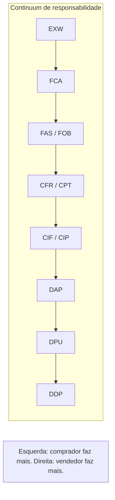

# Incoterms® 2020 — risco, custo e «quem faz o quê» na prática logística

> **Avisos legais e de marca:** **Incoterms®** é marca registrada da International Chamber of Commerce (ICC). Use sempre a **publicação oficial** vigente e valide interpretações com **jurídico** e **especialistas aduaneiros**. Este texto é **pedagógico**; **não** é assessoria jurídica, fiscal nem contratual.

**Incoterms®** são **regras voluntárias** que padronizam **onde** o risco tende a transferir e **quem paga** quais custos principais — **se** as partes as escolherem explicitamente no contrato. O contrato pode **alterar** o padrão do Incoterm; o Incoterm **não** substitui lei local nem documentação correta.

---

## Objetivos e resultado de aprendizagem

**Ao final desta aula**, você será capaz de:

- Explicar **três** arquétipos pedagógicos (EXW, FOB/CIF como famílias, DDP) em **consequências operacionais**.  
- Montar matriz **risco / custo / controle** para negociação interna.  
- Listar **erros** típicos de interpretação entre logística e comercial.  
- Saber **onde** buscar a fonte oficial (ICC).

**Duração sugerida:** 60–90 minutos.

---

## Gancho — «CIF barato» com seguro inexistente

A **TechLar** comprou **CIF** pensando que «**C** de conforto». Na prática, a cobertura mínima **não** atendia à política interna de risco; o incidente no porto virou **briga** entre compras, logística e jurídico. **Incoterm** sem **anexo** de seguro e sem **alinhamento** vira **loteria**.

**Analogia do aluguel:** «mobiliado» sem lista de itens — cada um imagina um sofá diferente.

---

## Mapa do conteúdo

- O que Incoterm **é** / **não é**.  
- Arquétipos EXW, FOB/CIF (família), DDP — **didáticos**.  
- Matriz risco/custo/controle.  
- Exercício de consequências operacionais.

---

## O que Incoterm **não** resolve sozinho

- **Propriedade intelectual**, **garantia** de qualidade, **penalidades** de atraso — isso é **contrato**.  
- **Tributação** local detalhada — **contador/aduaneiro**.  
- **Mode** (marítimo/aéreo) e versões **específicas** — validar regra escolhida (Incoterms® 2020 *vs.* versões anteriores se aplicável).

Fonte oficial: https://iccwbo.org/business-solutions/incoterms-rules/incoterms-2020/

---

## Arquétipos pedagógicos e os 11 Incoterms® 2020 (não substituem leitura ICC)

A ICC publicou em 2020 a versão vigente, com **11 regras** organizadas em dois grupos: **multimodal** (qualquer modal, incluindo combinado) e **marítimo/hidroviário** (só transporte por água).

### Tabela completa Incoterms® 2020

| Sigla | Nome | Grupo | Quem paga frete principal | Quem paga seguro | Risco transfere em | Comentário operacional |
|-------|------|-------|---------------------------|-------------------|---------------------|--------------------------|
| **EXW** | *Ex Works* | multimodal | comprador (tudo) | comprador | fábrica do vendedor | mínimo do vendedor; comprador faz desembaraço de exportação (difícil) |
| **FCA** | *Free Carrier* | multimodal | comprador | comprador | local nomeado (terminal/fábrica/transp.) | **substituto recomendado para FOB em contêineres**; ICC 2020 aceita BL «on board» com FCA |
| **CPT** | *Carriage Paid To* | multimodal | vendedor | comprador | entrega ao 1º carrier | risco passa cedo; custo vai além |
| **CIP** | *Carriage and Insurance Paid To* | multimodal | vendedor | **vendedor (cláusula A — ICC «all risks»)** | entrega ao 1º carrier | mudança 2020: CIP = seguro amplo |
| **DAP** | *Delivered At Place* | multimodal | vendedor | vendedor | local destino, no veículo, **antes** de descarregar | descarga é do comprador |
| **DPU** | *Delivered at Place Unloaded* | multimodal | vendedor | vendedor | destino, **descarregado** | substituiu o DAT 2010; vendedor descarrega |
| **DDP** | *Delivered Duty Paid* | multimodal | vendedor (tudo + tributos) | vendedor | destino, desembaraçado | máximo do vendedor; difícil para fornecedores estrangeiros sem CNPJ BR |
| **FAS** | *Free Alongside Ship* | marítimo | comprador | comprador | costado do navio (porto origem) | granel, projeto |
| **FOB** | *Free On Board* | marítimo | comprador | comprador | a bordo do navio | **só para granel**; em contêiner use FCA |
| **CFR** | *Cost and Freight* | marítimo | vendedor | comprador | a bordo do navio | sem seguro |
| **CIF** | *Cost, Insurance and Freight* | marítimo | vendedor | **vendedor (cláusula C — mínima ICC)** | a bordo do navio | seguro **mínimo** apenas — atenção |

### Grandes mudanças ICC 2020 vs. 2010

| Tema | 2010 | 2020 |
|------|------|------|
| DAT | existia | substituído por **DPU** (descarregado em qualquer lugar, não só terminal) |
| FCA + BL «on board» | não previsto | **previsto explicitamente** — possibilita carta de crédito quando comprador pede BL |
| Seguro CIP | cláusula C (mínima) | **cláusula A** (ampla, *all risks*) |
| Seguro CIF | cláusula C | mantém cláusula C (mínima) — **gap importante** |
| Segurança do transporte | citada | obrigações de segurança e custos explícitos |
| Transporte próprio do vendedor/comprador | implícito | reconhecido |

### Eixos pedagógicos

**Hipótese pedagógica:** use EXW/FCA/FOB/CIF/DAP/DDP como **bússola de conversa**; depois aprofunde com a tabela ICC oficial.

---

## Matriz interna — negociação saudável

| Dimensão | Pergunta para a sala |
|----------|----------------------|
| **Risco** | Onde o dano/perda deixa de ser «problema do outro»? |
| **Custo** | Quem paga frete internacional, seguro, terminal, docas especiais, THC, ISPS? |
| **Controle** | Quem agenda *carrier* e tem visibilidade de eventos? |
| **Dados** | Qual documento é **fonte da verdade** para TMS/ERP? |
| **Local nomeado** | A cidade/porto/terminal está **escrito** no contrato com precisão? |
| **Versão** | Está claro que é «Incoterms® **2020**» e não 2010? |
| **Seguro** | Cláusula **A** (ampla) ou **C** (mínima)? Apólice anexa? |
| **Tributos no destino** | Quem paga II, IPI, ICMS no DDP — fornecedor tem CNPJ BR? |

### Caso prático — comparação custo/risco TechLar (importação eletrônico China FCL 40' HC)

| Cenário | Incoterm | Frete USD | Seguro | Risco transfere | Total estimado USD | Comentário |
|---------|----------|-----------|--------|-----------------|--------------------|------------|
| A | **EXW** Shenzhen | TechLar paga tudo | TechLar | fábrica China | 4.200 | exige forwarder forte; risco trânsito interno China |
| B | **FCA** Shenzhen porto | TechLar | TechLar | terminal Shenzhen | 4.000 | recomendado para contêiner |
| C | **FOB** Shenzhen | TechLar | TechLar | a bordo navio | 3.900 | comum, mas tecnicamente FCA seria correto p/ FCL |
| D | **CIF** Santos | fornecedor | fornecedor (mín C) | a bordo navio China | 4.300 | conforto aparente; seguro mínimo é **gap** |
| E | **CIP** Santos | fornecedor | fornecedor (cláusula A) | terminal China | 4.500 | seguro amplo — recomendado se aceitar CIP |
| F | **DAP** CD Cajamar | fornecedor | fornecedor | CD destino antes desc. | 5.500 | TechLar só desembaraça e descarrega |
| G | **DDP** CD Cajamar | fornecedor (tudo) | fornecedor | CD desembaraçado | 6.800 | difícil — exige CNPJ BR do fornecedor |

**Decisão:** para FCL repetitivo, **FCA + apólice própria classe A** ou **CIP** (seguro vendedor classe A) tendem a ser o ponto ótimo. **CIF** parece barato mas o seguro mínimo expõe a TechLar; **DDP** só funciona com fornecedor com presença local.

---

## Aplicação — exercício

Para **três** cenários B2B (máquina pesada; insumo recorrente; *e-commerce* de importação), escolha **um** Incoterm de partida (pode ser arquétipo) e liste **5 consequências operacionais** (não só preço).

**Gabarito pedagógico:** deve aparecer **seguro**, **booking**, **doca**, **rastreio**, **responsabilidade** em avaria — não apenas «FOB porque é barato».

---

## Erros comuns e armadilhas

- Incoterm **sem** anexo de seguro e incoterms **sem** versão/ano citados no contrato.  
- Logística descobre Incoterm **no embarque** (tarde demais).  
- Misturar **porto nomeado** com **cidade** sem precisão.  
- Achar que **DDP** «resolve tudo» sem capacidade fiscal/local do vendedor.

---

## Erros comuns e armadilhas (com mitigações)

- Incoterm **sem** anexo de seguro e Incoterms **sem** versão/ano citados no contrato → cláusula padrão por escrito.
- Logística descobre Incoterm **no embarque** (tarde demais) → política «PO sem Incoterm não vai».
- Misturar **porto nomeado** com **cidade** sem precisão (ex.: «CIF Brasil» — vago) → especificar terminal exato.
- Achar que **DDP** «resolve tudo» sem capacidade fiscal/local do vendedor → exigir CNPJ BR habilitado Radar.
- **FOB para contêiner** (tecnicamente impróprio em 2020) → migrar para FCA.
- **CIF/CIP com cláusula errada** → especificar «ICC cláusula A» quando aplicável.
- Esquecer **THC** (*Terminal Handling Charge*), **ISPS** (segurança portuária), **BAF/CAF** (combustível/câmbio) — nem todo Incoterm cobre acessórios padrão.
- **Demurrage** e *detention* não modelados no custo (free time típico contêiner: 7–10 dias para descarga, 5–7 dias para devolução).

---

## O que vira dado no sistema

| Campo | Sistema (SAP MM ex.) | Função |
|-------|----------------------|--------|
| `EKKO-INCO1` | ERP | sigla Incoterm |
| `EKKO-INCO2` | ERP | local nomeado |
| `incoterm_version` (custom: 2010/2020) | ERP | versão clara |
| `insurance_clause` (A/B/C) | ERP custom | tipo cobertura |
| `incoterm_playbook_id` | governança | anexo digital |
| `risk_transfer_event` (timestamp) | TMS | marco de transferência |

---

## KPIs e decisão (tabela)

| KPI | Pergunta | Dono | Fonte | Cadência | Playbook |
|-----|----------|------|-------|----------|----------|
| **Lead time import por Incoterm** | Cauda muda por regra? | Logística internac. | ERP+TMS | Mensal | Re-licitar com FCA/CIP |
| **Custo de exceção** (demurrage, armazenagem) | Onde sangra? | Controladoria | despachante+finanças | Mensal | Pickup planejado |
| **% contratos com playbook logístico anexo** | Há governança? | Compliance | docs | Trimestral | Treinar compras |
| **% sinistros cobertos pelo seguro** | Cláusula está adequada? | Seguros | apólice | Anual | Migrar CIF→CIP |
| **% PO sem Incoterm definido** | Disciplina? | Compras | ERP | Semanal | Bloquear no ERP |
| **Custo total importado vs. *spot rate* mercado** | Pagamos justo? | Plan. | TMS+benchmark | Trimestral | Renegociar |

---

## Ferramentas e tecnologias

| Ferramenta | Para quê |
|------------|----------|
| **ICC Incoterms® 2020 (publicação oficial)** | leitura mandatória |
| **Apólice Marsh / AON / Aliança Cargo** | seguro internacional cláusula A |
| **Forwarder digital** (Flexport, Cargo X, Cargobr) | cotações multi-Incoterm |
| **ERP (SAP/Oracle/Protheus)** | armazenar Incoterm no PO |
| **Sistema do despachante** | refletir Incoterm na DI |
| **Calculadora de landed cost** | impacto fiscal por Incoterm |

---

## Glossário rápido

- **BAF / CAF:** *bunker / currency adjustment factor* (sobretaxa combustível/câmbio).
- **Cláusulas ICC A/B/C:** níveis de cobertura do seguro de carga (A = ampla, C = mínima).
- **Demurrage / detention:** taxas por contêiner além do free time.
- **Free time:** período sem cobrança de demurrage (7–14 dias típico).
- **ISPS:** *International Ship and Port Facility Security* (taxa de segurança).
- **NVOCC:** *non-vessel operating common carrier*.
- **THC:** *Terminal Handling Charge*.
- **Local nomeado:** ponto exato escrito no contrato (porto, cidade, terminal).

---

## Fechamento — três takeaways

1. Incoterm é **contrato + operação** — não glossário solto.  
2. Conforto no preço pode ser **desconforto** no risco.  
3. Fonte oficial ICC + **jurídico** = combo mínimo sério.

**Pergunta de reflexão:** qual Incoterm hoje vocês **usam no verbal** mas não está **no papel**?

---

## Referências

1. ICC — Incoterms® 2020 (publicação oficial): https://iccwbo.org/business-solutions/incoterms-rules/incoterms-2020/  
2. ICC Brasil — guia local: https://www.iccbrasil.org/  
3. CHOPRA, S.; MEINDL, P. *Supply Chain Management*. Pearson.  
4. RECEITA FEDERAL — Pucomex/Duimp.  
5. ABRACOMEX e AEB — guias práticos.  
6. Cláusulas Institute Cargo Clauses (ICC A/B/C) — Lloyd's Market Association.  
7. Trilha Fundamentos — [fretes e contratos](../../trilha-fundamentos-e-estrategia/modulo-04-custos-logisticos-performance/aula-02-fretes-contratos-negociacao.md).

---

## Pontes para outras trilhas

- **Operações** (esta trilha): [import/export](aula-01-processo-import-export-atores.md), [docs e landed cost](aula-03-documentos-landed-cost-compliance.md).
- **Fundamentos:** [estrutura de custos](../../trilha-fundamentos-e-estrategia/modulo-04-custos-logisticos-performance/aula-01-estrutura-custos-logisticos.md), [fretes e contratos](../../trilha-fundamentos-e-estrategia/modulo-04-custos-logisticos-performance/aula-02-fretes-contratos-negociacao.md).
- **Tecnologia:** [TMS](../../trilha-tecnologia-e-sistemas/modulo-04-tms/README.md).
