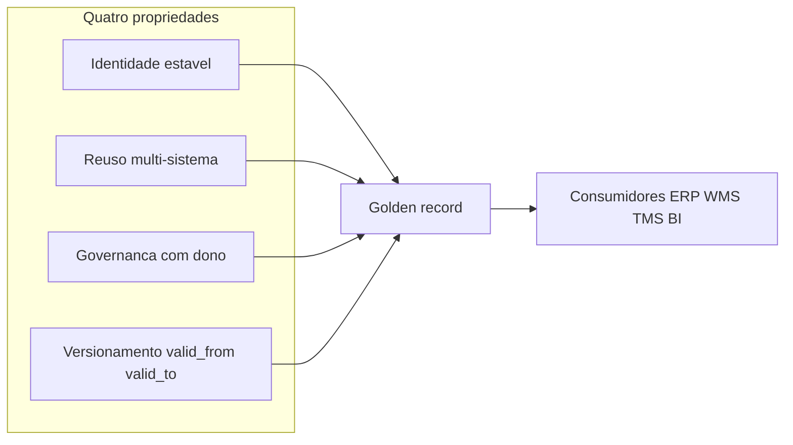
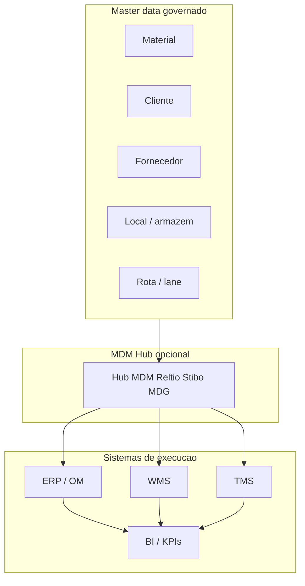
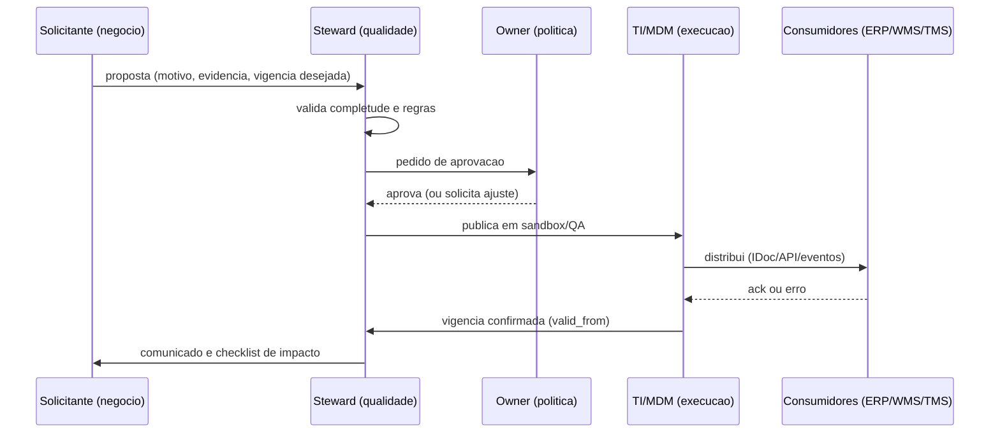
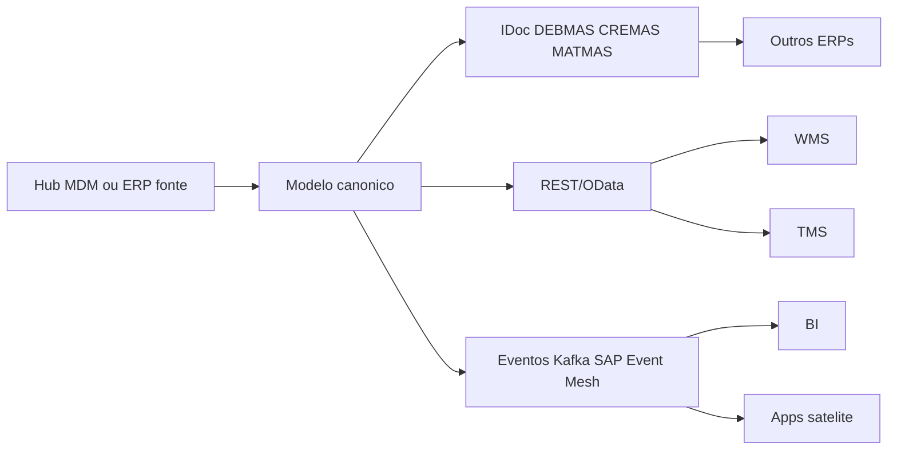

# Master data na cadeia — o CPF errado que segue todas as faturas

**Master data** são os **objetos estáveis** que descrevem «quem, o quê, onde e como medir» antes de qualquer pedido: material, cliente, fornecedor, armazém, rota, unidade de medida, tabela de frete, rota de abastecimento. **Dado transacional** é o que acontece **uma vez** (pedido, recebimento, picking, fatura, evento de transporte). Quando você mistura os dois papéis — por exemplo, «cadastrar cliente novo» dentro do pedido de urgência, sem golden record — o erro **nasce** no cadastro e **viaja** por EDI, WMS e TMS como herança tóxica.

Esta aula responde a três perguntas que todo coordenador deveria saber formular em reunião: **(1)** qual dado é «lei» e qual é «fato do dia»? **(2)** quem pode mudar a lei, com qual teste e em qual data? **(3)** como saber, às 22h de uma terça-feira, se o sistema está mentindo por causa de **cadastro** e não por causa de **operação**?

---

## Objetivos e resultado de aprendizagem

- Separar **master data** de **transacional** e explicar por que integrações «herdam» erro de cadastro.
- Desenhar uma **matriz entidade → sistemas consumidores → risco** para a sua operação.
- Definir **golden record** com **vigência**, **autoridade** e **critério de desempate** entre fontes.
- Listar **cinco** sinais de que a empresa trata planilha como fonte canônica (e o custo disso).
- Mapear papéis **owner / steward / custodian / consumidor** com RACI mínimo de mudança.

**Duração sugerida:** 60–90 minutos, com o exercício e um diagrama no papel.  
**Pré-requisitos:** trilha [Fundamentos](../../trilha-fundamentos-e-estrategia/README.md); recomendado [qualidade e viés de dados](../../trilha-dados-analytics-logistica/modulo-01-data-analytics-para-logistica/aula-02-qualidade-vies-demanda-fantasma.md).

---

## Mapa do conteúdo

1. Gancho — o mesmo SKU com dois pesos.
2. Conceito-núcleo — quatro propriedades de master data.
3. Modelo de dados — mini-ER de entidades mestras críticas (com sistema-dono).
4. Diagrama de processo — ciclo de mudança com vigência (RACI).
5. Aprofundamentos — SAP MDG, Stibo, Reltio, Informatica, planilha + Excel governado.
6. Integrações — distribuição via IDoc, eventos, canônicos, idempotência.
7. Trade-offs — MDM central *vs.* federado; build *vs.* buy.
8. Caso prático — TechLar com pacote de mudança de embalagem.
9. Erros comuns, KPIs, glossário, exercícios.

---

## Gancho — o mesmo SKU com dois pesos

Na **TechLar** (varejo B2B + marketplace), o canal digital puxou **peso cubado** do PIM de produto; o WMS operou com **peso da ficha logística** desatualizada após mudança de embalagem. A cotação no TMS saiu **agressiva**; a fatura do transportador veio **cara**; o comercial acusou a transportadora; a transportadora mostrou a tabela de peso taxado. Ninguém «mentiu»: havia **dois donos** do mesmo atributo sem **golden record** e sem **janela de vigência** comunicada à operação.

**Analogia do RG e do bilhete:** o **RG** (master) descreve quem você é por anos; o **bilhete de cinema** (transacional) só vale para uma sessão. Se o RG tiver data de nascimento errada, todo mundo que pedir identificação vai repetir o erro. Se você corrigir só o bilhete rabiscando caneta, o mundo «oficial» continua errado.

**Analogia da prefeitura:** master data é a **certidão de nascimento** emitida pelo cartório (autoridade); transacional é o **boleto de IPTU** (evento). O cartório emite poucas certidões; a prefeitura imprime milhões de boletos — e cada um herda o nome que estava na certidão.

---

## Conceito-núcleo — o que é master data «de verdade»

Em sentido **operacional** (próximo ao consenso de mercado em MDM — *Master Data Management*), master data tem quatro propriedades:

1. **Identidade estável:** chave interna que sobrevive a mudanças de nome comercial.
2. **Reuso:** o mesmo objeto alimenta vários processos (compras, estoque, expedição, fiscal).
3. **Governança:** existe **dono** de negócio e regra de mudança; não é «arquivo pessoal».
4. **Versionamento temporal:** o que vale **hoje** pode não valer **amanhã** (preço, embalagem, Incoterm, lead time).

**Hipótese pedagógica:** sem essas quatro propriedades escritas, o melhor WMS do mundo **digitaliza** o caos — com latência menor.

---

## Modelo de dados — entidades-chave (mini-ER)

| Entidade mestre | Descrição | Campos típicos | Sistema-dono típico | Tabelas/objetos exemplo |
|-----------------|-----------|----------------|---------------------|-------------------------|
| Material / SKU | Item movimentável e/ou comercializável | id, descrição, UoM base, hierarquia embalagem, classe fiscal (NCM/CEST), peso, volume, lote/serial flag | PIM ou ERP (compartilhado com PLM) | SAP `MARA` (geral), `MARC` (centro), `MARD` (depósito) |
| Cliente / Business Partner | Pessoa jurídica/física com papéis | id, nome, doc fiscal (CNPJ/CPF), endereços por papel, condição pagamento, classificação fiscal | ERP (CRM alimenta) | SAP `KNA1`/`KNVV`/`KNVP` (ECC) ou `BUT000`/`BUT020` (BP em S/4) |
| Fornecedor / Vendor | Origem de materiais ou serviços | id, doc fiscal, Incoterm padrão, lead time mestre, MOQ, banco | Compras (ERP) | SAP `LFA1`/`LFM1` (ECC) ou `BUT000` (BP em S/4) |
| Centro / Plant / Site | Unidade física com regras | id, endereço, calendário, fuso, tipo (CD/loja/fábrica) | ERP | SAP `T001W` |
| Depósito / Storage location | Subdivisão lógica de estoque | id, plant pai, ATP flag | ERP | SAP `T001L` |
| Endereço / Bin (WMS) | Localização física dentro do depósito | id, zona, tipo, capacidade, restrições | WMS/EWM | EWM `/SCWM/T331` (storage bin) |
| Transportadora / Carrier | Parceiro de transporte | id, doc fiscal, ANTT (BR), seguros, SLAs | TMS | TMS específico; SAP `LFA1` com role `CARRIER` |
| Tabela de frete / Lane | Origem-destino × modal × tarifa | origem, destino, modal, faixa de peso, tarifário | TMS | TMS específico |
| Rota / Route | Sequência operacional planejada | id, *legs*, transit time, modal | TMS / planejamento | SAP `TVRO` (rotas SD) |
| Unidade de medida / UoM | Métrica e fatores | id base, alternativas, fator | ERP / PIM | SAP `T006` |

**Legenda:** «sistema-dono» é convenção; em arquiteturas híbridas, pode haver **MDM hub** (Reltio/Stibo/MDG) entre o sistema de captura e os consumidores.

---

## Matriz entidade → sistemas consumidores

| Entidade mestre | Exemplos de consumo | Quando o erro dói |
|-----------------|---------------------|-------------------|
| Material / SKU | MRP, WMS, catálogo, TMS (cubagem), fiscal, lista técnica | ATP errado, picking impossível, frete incoerente, NCM errado → multa |
| Cliente / ship-to | OM/SD, TMS, faturação, SLA regional | OTIF, multa contratual, devolução na doca errada |
| Fornecedor / Incoterm de compra | Compras, recebimento, custo *landed* | Imposto, prazo, quem paga o frete na origem |
| Armazém / endereço | WMS, ATP, transferências | Transferência «fantasma», estoque no lugar errado |
| Transportadora / tabela de frete | TMS, auditoria, contrato | Pagamento duplicado, disputa sem evidência |
| Rota / *lane* | TMS, planejamento, promessa | P90 de lead time mentiroso |

**Legenda:** o **hub MDM** é opcional; sem ele, o ERP costuma ser «hub *de facto*», com risco de virar **fonte e cliente** ao mesmo tempo (auto-referência sem desempate).

---

## Diagrama de processo principal — ciclo de mudança com vigência

**Legenda:** «vigência» é **data de corte** — não «momento em que o cadastro foi salvo». Em operação 24/7, salvar às 14h com `valid_from = D+1 06:00` evita corromper picking em curso.

---

## Golden record, steward e dono

**Golden record** é a versão **oficial** do dado com:

- **Vigência** (*valid from* / *valid to*) — o mundo real mudou na segunda; o sistema precisa saber **a partir de quando** a nova embalagem vale.
- **Autoridade** — quem **aprova** (dono de negócio) e quem **executa** mudança técnica (TI/MDM).
- **Critério de desempate** quando há duas fontes (PIM *vs.* ERP *vs.* planilha do fornecedor).

**Papéis (RACI):**

| Papel | Responsabilidade |
|-------|------------------|
| **Owner** (dono) | Define **política**: o que pode mudar, com qual evidência, quem aprova. R/A. |
| **Steward** | Cuida da **qualidade** diária: completude, consistência, deduplicação. R. |
| **Custodian** (TI/MDM) | Executa mudança técnica, distribui aos consumidores, mantém logs. R. |
| **Consumer** | Consome o dado e reporta divergência operacional. C/I. |

---

## Aprofundamentos — ferramentas e arquiteturas de MDM

| Ferramenta / abordagem | Quando faz sentido | Limitações |
|-------------------------|---------------------|-----------|
| **SAP MDG** (*Master Data Governance*) | Empresa SAP-cêntrica, master replicado por SAP via DRF/DIF | Caro, requer expertise; foco SAP-first |
| **Stibo Systems STEP** | Forte em PIM + MDM multidomínio (cliente, produto) | Implantação longa; integrações custom |
| **Reltio** | MDM cloud-native, SaaS, APIs modernas | Modelo de licença por registro; *vendor lock-in* moderado |
| **Informatica MDM** | MDM tradicional, integração robusta com Informatica IICS | Stack pesada; TCO alto |
| **Excel + planilha governada** | Empresa pequena, baixo volume, owners bem definidos | Não escala; sem audit trail confiável; degrada em 90 dias |
| **«MDM caseiro» em ERP** | Operação simples, single-ERP, sem multi-canal | Vira feudo; sem desempate quando surgem fontes paralelas |

**SAP ECC vs. S/4HANA:** em **ECC**, cliente e fornecedor são objetos separados (`KNA1`, `LFA1`); em **S/4HANA**, ambos são **Business Partner** (`BUT000`) com **roles** (`FLCU01` cliente, `FLVN01` fornecedor). Migração ECC→S/4 obriga a **conversão BP** — projeto sério, não checkbox.

---

## Integrações — distribuição do master ao mundo

**Padrões úteis:**
- **IDocs SAP de master:** `DEBMAS` (cliente), `CREMAS` (fornecedor), `MATMAS` (material), `WPDWGR` (preço de varejo), `BLAOR` (contrato).
- **Idempotência:** chave canônica (ex.: `MATNR` + `WERKS` + `valid_from`) para evitar dupla aplicação em *retry*.
- **Reconciliação:** *snapshot* periódico (ex.: hash por entidade) entre hub e cada consumidor — divergência > 0,1% dispara alerta.
- **Coexistência de versões:** `v1`/`v2` de payload com **graceful sunset** (≥ 2 ciclos de release).

---

## Qualidade em dimensões — além de «cadastro incompleto»

Para logística, estas dimensões (próximas ao **DMBOK** da DAMA) costumam ser decisivas:

- **Exatidão:** o peso bate com a balança?
- **Completude:** ship-to tem doca, fuso e contato de emergência?
- **Consistência:** o mesmo parceiro não aparece com três códigos sem mapeamento.
- **Pontualidade:** o lead time mestre foi atualizado **antes** da safra/pico?
- **Rastreabilidade:** dá para explicar **por que** aquele valor está lá (fonte, aprovador, data)?
- **Unicidade:** sem duplicidade de cliente «Maria Silva ME» × «MARIA SILVA ME» × «Maria S. ME».

---

## Trade-offs e decisão

| Dilema | Opção A | Opção B | Critério de escolha |
|--------|---------|---------|---------------------|
| Onde mora o master | Centralizado (hub MDM) | Federado (cada sistema dono de seu domínio) | Multi-ERP/multi-canal pede hub; single-ERP pode federar |
| Build vs. buy | MDM caseiro em ERP | SaaS (Reltio) ou on-prem (MDG/Stibo) | Volume, expertise interna, time-to-value, TCO |
| OOTB vs. customização | Modelo padrão do MDM | Atributos custom por domínio | Customizar **roles** OK; customizar **modelo** explode TCO |
| Sincronização | Push (eventos/IDoc) | Pull (consulta sob demanda) | Dado quente (preço/estoque) → push; dado frio (NCM) → pull aceitável |

---

## Caso prático — TechLar muda embalagem do SKU campeão

Cenário: SKU `TL-7842` (cabo HDMI 2m) muda da caixa de 24 para caixa de 12 unidades em **15/04**, com novo peso bruto e GTIN de caixa novo.

**Pacote de mudança esperado:**

1. **Steward** valida: novo GTIN GS1 emitido, fotos da nova embalagem, peso aferido em balança.
2. **Owner** (categoria) aprova com `valid_from = 15/04 06:00`.
3. **TI** publica via `MATMAS` para SAP, atualiza PIM, dispara evento Kafka `material.packaging.changed`.
4. WMS recebe, dispara **realocação** dos endereços com novo *footprint*; TMS atualiza cubagem na próxima cotação.
5. **Comunicação**: e-mail + post no canal interno + alerta no painel de mudanças críticas.
6. **Rollback** definido: se taxa de erro de picking subir > 2 σ na primeira semana, reverter `valid_to = 22/04` e abrir RCA.

**Pegadinha BR:** se mudança envolver **NCM** ou **peso bruto** declarado em NF-e, alinhar **fiscal** antes — cliente pode rejeitar nota com peso divergente em portaria.

---

## Erros comuns e armadilhas

- Tratar **cópia** em planilha como fonte canônica.
- Alterar cadastro **sem** janela de vigência em operação 24/7 (Black Friday, fechamento fiscal).
- Misturar **código interno** e **EAN/GTIN** sem mapeamento explícito.
- «Projeto MDM» sem **caso de uso** logístico — vira catálogo bonito que a doca ignora.
- Confundir **limpeza única** com **governança**; dados degradam de novo em 90 dias sem steward.
- Mudar `MARC` (centro) sem replicar em `MARD` (depósito) → ATP fala `100`, WMS lê `0`.
- Em S/4, criar BP sem **role** correspondente → pedido SD ou compra MM **falha** sem mensagem clara.

---

## KPIs técnicos e de negócio

| KPI | Pergunta | Dono | Fonte | Cadência | Playbook se ruim |
|-----|----------|------|-------|----------|------------------|
| **Taxa de pedidos com retrabalho de cadastro** | Quanto cadastro estamos «consertando» depois do pedido? | Steward + Comercial | ERP (logs de alteração pré-faturamento) | Semanal | Pareto por entidade; bloquear pedido sem mestre completo |
| **Lead time de publicação master** | Quantos dias entre proposta e *valid_from* nos consumidores? | Custodian | MDM hub + logs IDoc/API | Quinzenal | Mapear gargalo (aprovação? distribuição? testes?) |
| **% endereços corrigidos manualmente no TMS** | Ship-to está confiável? | Steward de cliente | TMS | Semanal | Refazer onboarding de cliente com mais erros |
| **Divergência peso WMS vs. mestre (top 20 SKU frete)** | Cubagem do master é fiel? | Steward de material | WMS + master | Mensal | Reaferir + foto + GTIN nivel-caixa |
| **Duplicidade ativa (cliente, fornecedor, material)** | Quantos «gêmeos» temos vivos? | Steward | MDM (regras de match) | Mensal | Merge governado com aprovação |
| **% movimentos sem motivo/textos** | Auditoria fica órfã? | Custodian | ERP (`MSEG-SGTXT`) | Mensal | Travar transação sem texto em movimento sensível |

---

## Ferramentas e tecnologias relevantes

| Categoria | Exemplos | Quando usar |
|-----------|----------|-------------|
| MDM hub | SAP MDG, Stibo STEP, Reltio, Informatica MDM, Ataccama | Multi-ERP, multi-canal, multidomínio |
| PIM | Akeneo, Salsify, Pimcore, Stibo PIM | Enriquecimento de produto para canal digital |
| Data quality | Talend DQ, Ataccama, Informatica DQ | *Profiling*, *cleansing*, *match-merge* |
| Catálogo de dados | Collibra, Alation, DataHub, OpenMetadata | Governança transversal, *lineage* |
| Distribuição | IDoc/ALE, SAP CPI, Mulesoft, Apache Kafka, SAP Event Mesh | Push para consumidores |
| Identificação | GS1 (GTIN, GLN, SSCC), GUID interno | Padrão global de produto/parceiro |

---

## Glossário rápido

- **Golden record:** versão única, oficial, datada de uma entidade mestre.
- **Steward:** zelador de qualidade; **Owner:** dono de política; **Custodian:** executor técnico.
- **MDM:** *Master Data Management*.
- **DMBOK:** *Data Management Body of Knowledge* (DAMA).
- **GTIN:** *Global Trade Item Number* (GS1).
- **GLN:** *Global Location Number* (GS1) para parceiros/locais.
- **`valid_from`/`valid_to`:** janela de vigência temporal.
- **IDoc:** *Intermediate Document* SAP para troca estruturada (ex.: `DEBMAS`, `MATMAS`).
- **BP:** *Business Partner* (S/4HANA), substitui `KNA1`/`LFA1`.
- **NCM:** Nomenclatura Comum do Mercosul (classificação fiscal BR).

---

## Aplicação — exercícios

**Ex. 1 (15 min):** monte uma tabela com **cinco** entidades mestre da sua empresa e, para cada uma:
1. **Dois** sistemas que consomem o dado.
2. **Um** risco se o dado estiver errado (ligue a **OTIF**, **custo** ou **compliance**).
3. **Um** indicador simples que detectaria o erro cedo (ex.: divergência TMS *vs.* WMS em peso taxado).

**Ex. 2 (10 min):** identifique **um** atributo hoje sem **owner** com nome no organograma. Proponha **um** owner candidato e o RACI mínimo de mudança.

**Ex. 3 (20 min):** escolha **uma** mudança real recente (preço, embalagem, ship-to) e reconstrua o que **deveria** ter sido o pacote: vigência, aprovador, sistemas afetados, comunicação, plano de rollback.

**Gabarito pedagógico:** Ex. 1 deve ter pelo menos um risco em **OTIF**, **custo** ou **compliance** (lote, origem, embalagem). Se todos os riscos forem «incomodar o usuário», aprofunde — falta ligação com dinheiro ou contrato. Ex. 3 deve evidenciar **lacunas** reais (sem rollback escrito, sem comunicação a TMS, etc.).

---

## Pergunta de reflexão

Qual entidade hoje **não tem dono** com nome e sobrenome no organograma — e qual foi o **último incidente** atribuído a ela sem que ninguém fosse responsabilizado?

---

## Fechamento — três takeaways

1. Master data é **política** com máscara de técnica: sem política, integração só acelera o erro.
2. Golden record sem **vigência** é **foto** alegando ser **vídeo** — a cadeia muda todo dia.
3. O primeiro sintoma de master ruim quase nunca é «cadastro»; é **OTIF**, **custo de frete** ou **briga em reunião de S&OP**.

---

## Referências

1. **DAMA International** — *DMBOK 2* (governança de dados, papéis, qualidade).
2. **ASCM** — glossário e boas práticas de supply chain: https://www.ascm.org/
3. **CSCMP** — *SCM Definitions and Glossary*: https://cscmp.org/CSCMP/cscmp/educate/scm_definitions_and_glossary_of_terms.aspx
4. **GS1** — *Global Standards Management Process* (GTIN, GLN, SSCC): https://www.gs1.org/standards
5. **SAP Help Portal** — *Master Data Governance*: https://help.sap.com/docs/SAP_MASTER_DATA_GOVERNANCE
6. **Gartner** — *Magic Quadrant for Master Data Management Solutions* (atualização anual).
7. CHOPRA, S.; MEINDL, P. *Supply Chain Management*. Pearson.
8. MAGAL, S.; WORD, J. *Integrated Business Processes with ERP Systems*. Wiley.

---

## Pontes para outras trilhas

- **Dados e Analytics** → [qualidade e viés de dados](../../trilha-dados-analytics-logistica/modulo-01-data-analytics-para-logistica/aula-02-qualidade-vies-demanda-fantasma.md): a cauda do master vira viés do KPI.
- **Fundamentos** → [estrutura de custos logísticos](../../trilha-fundamentos-e-estrategia/modulo-04-custos-logisticos-performance/aula-01-estrutura-custos-logisticos.md): impacto financeiro do master ruim.
- Próxima aula desta trilha → [material, unidade e embalagem](aula-02-material-unidade-embalagem.md): aprofundamento no objeto-mestre mais usado.
