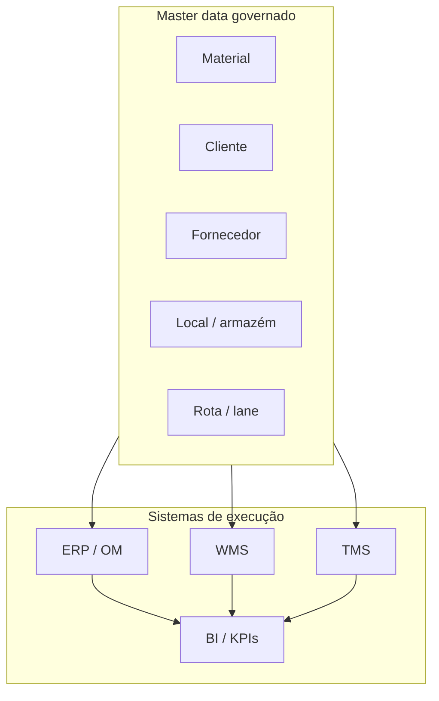
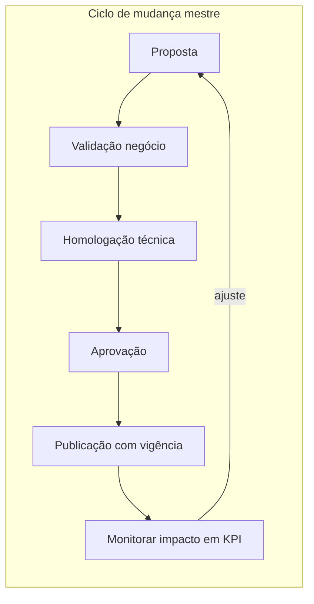

# Master data na cadeia — o CPF errado que segue todas as faturas

**Master data** são os **objetos estáveis** que descrevem «quem, o quê, onde e como medir» antes de qualquer pedido: material, cliente, fornecedor, armazém, rota, unidade de medida, tabela de frete, rota de abastecimento. **Dado transacional** é o que acontece **uma vez** (pedido, recebimento, picking, fatura, evento de transporte). Quando você mistura os dois papéis — por exemplo, «cadastrar cliente novo» dentro do pedido de urgência, sem golden record — o erro **nasce** no cadastro e **viaja** por EDI, WMS e TMS como herança tóxica.

Esta aula responde a três perguntas que todo coordenador deveria saber formular em reunião: **(1)** qual dado é «lei» e qual é «fato do dia»? **(2)** quem pode mudar a lei, com qual teste e em qual data? **(3)** como saber, às 22h de uma terça-feira, se o sistema está mentindo por causa de **cadastro** e não por causa de **operação**?

---

## Objetivos e resultado de aprendizagem

**Público:** coordenação logística, analistas de supply chain, TI de negócio, implementação júnior.

**Ao final desta aula**, você será capaz de:

- Separar **master data** de **transacional** e explicar por que integrações «herdam» erro de cadastro.
- Desenhar uma **matriz entidade → sistemas consumidores → risco** para a sua operação.
- Definir **golden record** com **vigência**, **autoridade** e **critério de desempate** entre fontes.
- Listar **cinco** sinais de que a empresa trata planilha como fonte canônica (e o custo disso).

**Duração sugerida:** 60–90 minutos, com o exercício e um diagrama no papel.

---

## Gancho — o mesmo SKU com dois pesos

Na **TechLar** (varejo B2B + marketplace), o canal digital puxou **peso cubado** do PIM de produto; o WMS operou com **peso da ficha logística** desatualizada após mudança de embalagem. A cotação no TMS saiu **agressiva**; a fatura do transportador veio **cara**; o comercial acusou a transportadora; a transportadora mostrou a tabela de peso taxado. Ninguém «mentiu»: havia **dois donos** do mesmo atributo sem **golden record** e sem **janela de vigência** comunicada à operação.

**Analogia do RG e do bilhete:** o **RG** (master) descreve quem você é por anos; o **bilhete de cinema** (transacional) só vale para uma sessão. Se o RG tiver data de nascimento errada, todo mundo que pedir identificação vai repetir o erro. Se você corrigir só o bilhete rabiscando caneta, o mundo «oficial» continua errado.

---

## Conceito núcleo — o que é master data «de verdade»

Em sentido **operacional** (próximo ao consenso de mercado em MDM — *Master Data Management*), master data tem quatro propriedades:

1. **Identidade estável:** chave interna que sobrevive a mudanças de nome comercial.
2. **Reuso:** o mesmo objeto alimenta vários processos (compras, estoque, expedição, fiscal).
3. **Governança:** existe **dono** de negócio e regra de mudança; não é «arquivo pessoal».
4. **Versionamento temporal:** o que vale **hoje** pode não valer **amanhã** (preço, embalagem, Incoterm, lead time).

**Hipótese pedagógica:** sem essas quatro propriedades escritas, o melhor WMS do mundo **digitaliza** o caos — com latência menor.

---

## Matriz entidade → sistemas consumidores

| Entidade mestre | Exemplos de consumo | Quando o erro dói |
|-----------------|---------------------|-------------------|
| Material / SKU | MRP, WMS, catálogo, TMS (cubagem), fiscal, lista técnica | ATP errado, picking impossível, frete incoerente |
| Cliente / ship-to | OM/SD, TMS, faturação, SLA regional | OTIF, multa contratual, devolução na doca errada |
| Fornecedor / Incoterm de compra | Compras, recebimento, custo *landed* | Imposto, prazo, quem paga o frete na origem |
| Armazém / endereço | WMS, ATP, transferências | Transferência «fantasma», estoque no lugar errado |
| Transportadora / tabela de frete | TMS, auditoria, contrato | Pagamento duplicado, disputa sem evidência |
| Rota / *lane* | TMS, planejamento, promessa | P90 de lead time mentiroso |

**Legenda:** as setas mostram **dependência de leitura**; KPIs herdam o ruído do cadastro com atraso — o painel «descobre» o problema depois que o cliente já gritou.

---

## Golden record, steward e dono

**Golden record** é a versão **oficial** do dado com:

- **Vigência** (*valid from* / *valid to*) — o mundo real mudou na segunda; o sistema precisa saber **a partir de quando** a nova embalagem vale.
- **Autoridade** — quem **aprova** (dono de negócio) e quem **executa** mudança técnica (TI/MDM).
- **Critério de desempate** quando há duas fontes (PIM *vs.* ERP *vs.* planilha do fornecedor).

**Steward** (guardião) cuida da **qualidade** do dado no dia a dia; **dono** decide **política** (o que é permitido mudar sem projeto). **Hipótese pedagógica:** sem dono escrito, o dado vira **feudo** de TI ou de «quem grita mais alto na segunda-feira».

---

## Qualidade em dimensões — além de «cadastro incompleto»

Para logística, estas dimensões (inspiradas em frameworks de qualidade de dados, próximas ao DMBOK da DAMA) costumam ser decisivas:

- **Exatidão:** o peso bate com a balança?
- **Completude:** ship-to tem doca, fuso e contato de emergência?
- **Consistência:** o mesmo parceiro não aparece com três códigos sem mapeamento.
- **Pontualidade:** o lead time mestre foi atualizado **antes** da safra/pico?
- **Rastreabilidade:** dá para explicar **por que** aquele valor está lá (fonte, aprovador, data)?

---

## Aplicação — exercício guiado

Monte uma tabela com **cinco** entidades mestre da sua empresa e, para cada uma:

1. **Dois** sistemas que consomem o dado.
2. **Um** risco se o dado estiver errado (ligue a **OTIF**, **custo** ou **compliance**).
3. **Um** indicador simples que detectaria o erro cedo (ex.: divergência TMS *vs.* WMS em peso taxado).

**Gabarito pedagógico:** deve aparecer pelo menos um risco em **OTIF**, **custo** ou **compliance** (lote, origem, embalagem). Se todos os riscos forem «incomodar o usuário», aprofunde — falta ligação com dinheiro ou contrato.

---

## Erros comuns e armadilhas

- Tratar **cópia** em planilha como fonte canônica.
- Alterar cadastro **sem** janela de vigência em operação 24/7 (Black Friday, fechamento fiscal).
- Misturar **código interno** e **EAN/GTIN** sem mapeamento explícito.
- «Projeto MDM» sem **caso de uso** logístico — vira catálogo bonito que a doca ignora.
- Confundir **limpeza única** com **governança**; dados degradam de novo em 90 dias sem steward.

---

## KPIs e decisão

Master data não costuma ter um «KPI único», mas estes sinais ajudam a **comprar** investimento em governança:

- **Taxa de pedidos com retrabalho de cadastro** antes de liberar expedição.
- **% de entregas com endereço corrigido manualmente** no TMS.
- **Divergência média** peso taxado (TMS) *vs.* peso WMS por SKU crítico.
- **Tempo médio** para publicar mudança de embalagem ponta a ponta (PIM → ERP → WMS).

---

## Fechamento — três takeaways

1. Master data é **política** com máscara de técnica: sem política, integração só acelera o erro.
2. Golden record sem **vigência** é **foto** alegando ser **vídeo** — a cadeia muda todo dia.
3. O primeiro sintoma de master ruim quase nunca é «cadastro»; é **OTIF**, **custo de frete** ou **briga em reunião de S&OP**.

**Pergunta de reflexão:** qual entidade hoje **não tem dono** com nome e sobrenome no organograma?

---

## Referências

1. ASCM — glossário e boas práticas de supply chain: https://www.ascm.org/  
2. CSCMP — definições e vocabulário: https://cscmp.org/CSCMP/cscmp/educate/scm_definitions_and_glossary_of_terms.aspx  
3. DAMA International — *DMBOK* (governança de dados, papéis, qualidade).  
4. CHOPRA, S.; MEINDL, P. *Supply Chain Management*. Pearson. (drivers e alinhamento dados–decisão.)
