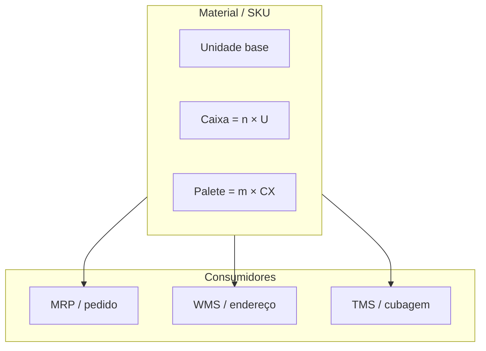

# Material, unidade, conversão e embalagem — onde o cubo mata o orçamento

O **material** (SKU) não é só descrição comercial: é um **pacote de decisões** que viaja por compras, estoque, armazém, transporte e fiscalidade. Ele carrega **UoM** base, **hierarquia** de embalagem (unidade → caixa → camada → palete), **peso**, **volume**, classes fiscais, e frequentemente regras de **lote**, **série** ou **validade**. Um erro de **fator de conversão** ou de **embalagem padrão de expedição** corrói **MRP**, **WMS** e **cotação de frete** ao mesmo tempo — porque todos leem o mesmo objeto com interpretações diferentes.

---

## Objetivos e resultado de aprendizagem

**Ao final desta aula**, você será capaz de:

- Explicar **UoM base**, **alternativa** e **fator** e por que fatores implícitos são dívida técnica.
- Relacionar **cubagem** com **peso taxado** e com decisões de TMS.
- Calcular **quebra** de pedido em múltiplos de embalagem e discutir política comercial *vs.* operação.
- Listar **cinco** pontos de reconciliação física–cadastro para SKU de alto custo de frete.

**Duração sugerida:** 60–90 minutos (inclui exercício numérico e leitura de um SKU real da sua empresa).

---

## Gancho — «vendemos ao quilo, faturamos ao metro»

Fornecedor B2B da **TechLar** negociou **rolo** de cabo; o cadastro tinha **metro** como UoM de venda sem fator estável (o metro linear mudava com tensão de bobinamento). O **ATP** prometeu o impossível; o **picking** quebrou em caixa parcial; o fiscal questionou conversão. A lição operacional: **UoM** não é etiqueta bonita — é **contrato de conversão** com exceções documentadas e, quando necessário, **SKU derivado** (rolo de 100 m *vs.* metro avulso).

**Analogia da receita:** trocar colher de sopa por colher de chá **sem número** não é «criatividade culinária»; é risco de sabor e de **custo** (e de briga na cozinha).

---

## Conceito núcleo — base, alternativa e fatores

- **UoM base:** unidade em que o estoque é **contabilizado** internamente (peça, kg, saco, rolo). É a «moeda interna» do saldo.
- **UoM alternativa:** como o cliente **compra** ou o fornecedor **entrega** (caixa, palete, rolo).
- **Fator:** quantas **bases** existem por **alternativa** — **nunca** implícito «na cabeça do expedidor».

**Hierarquia de embalagem** (empacotamento) responde: «quantas unidades num nível, e qual GTIN/etiqueta em cada nível?». Erro comum: cadastrar só o **nível retail** quando o canal B2B expede **camada** ou **palete**.

**Legenda:** cada sistema pode «preferir» um nível; se o TMS lê volume do **nível errado**, o dinheiro sai pelo frete.

---

## Cubagem, peso taxado e «SKU financeiro»

Em transporte, o **peso taxado** frequentemente segue a lógica `max(peso real, volume × fator de conversão volumétrica)` (coeficientes variam por modal, tabela e país — **não** é consultoria fiscal aqui; é alerta de **sensibilidade**).

**Consenso de mercado:** SKU com alto custo de frete merece **amostragem física** periódica (balança + fita métrica) e **foto** da embalagem real — não só planilha do fornecedor.

**Analogia da mudança de casa:** você orçamentou caixas pelo **número**; o caminhão cobrou pelo **espaço ocupado**. Quem só contou caixas sem **volume** levou susto na portaria.

---

## Aplicação — exercício numérico

SKU com **24** unidades por caixa e **48** caixas por palete.

1. Pedido de **580** unidades: quantas **caixas inteiras** e **unidades soltas**?
2. Se o WMS só movimenta **palete inteiro** de expedição B2B, qual é o **efeito colateral** em estoque residual e na **política comercial**?

**Gabarito:** \(580 = 24 \times 24 + 4\) → **24 caixas + 4 unidades soltas**. Palete inteiro força **múltiplo mínimo**, **quebra de palete** com regra escrita ou **SKU de caixa** separado — senão nasce picking de «fantasma» e sobra física mal endereçada.

---

## Trade-offs — padronizar *vs.* flexibilizar

| Estratégia | Ganho | Custo |
|------------|-------|-------|
| Poucos SKUs com muitas UoM | Catálogo simples | Fatores complexos, mais erros humanos |
| SKUs derivados por canal (B2B *vs.* B2C) | Conversão explícita | Mais manutenção de cadastro |
| Embalagem única «média» | Menos SKU | Cubagem mentirosa em picos |

**Hipótese pedagógica:** o meio-termo saudável costuma ser **poucos fatores bem governados** + **SKU derivado** quando a física diverge demais entre canais.

---

## Erros comuns e armadilhas

- Duas UoM «iguais» com nomes diferentes (`CX` *vs.* `CAIXA`) — integrações duplicam linhas.
- Embalagem de **varejo** cadastrada como padrão **B2B** — onda explode e doca vira gargalo.
- Ignorar **tara** de palete, insertos e **envelope** de proteção — o TMS subestima peso.
- Atualizar **descrição comercial** sem atualizar **ficha logística** — marketing feliz, operação furiosa.
- **Arredondamento** de fator (3 casas *vs.* 6) em integração — diferença pequena vira divergência mensal enorme em alto giro.

---

## KPIs e decisão

- **Divergência média** entre peso WMS (conferido) e peso mestre por SKU top 20 de frete.
- **% de linhas** com quebra de embalagem / ajuste de quantidade na expedição.
- **Incidentes** de ATP negativo «fantasma» após mudança de embalagem (sinal de vigência quebrada).

---

## Fechamento — três takeaways

1. Material bem cadastrado é **infraestrutura invisível**; mal cadastrado é **incêndio recorrente** em três telas ao mesmo tempo.
2. Cubagem errada não é «detalhe de transporte»; é **distorção de concorrência** entre rotas e modais.
3. Fatores implícitos são **dívida**; a conta chega em **Black Friday** ou no **fechamento** com o transportador.

**Pergunta de reflexão:** qual conversão hoje só está na **cabeça** do fornecedor — e qual seria o preço de um erro (R$ ou OTIF)?

---

## Referências

1. GS1 — identificação e embalagens (hierarquia, GTIN): https://www.gs1.org/  
2. CHOPRA, S.; MEINDL, P. *Supply Chain Management*. Pearson.  
3. Trilha Dados — [do problema ao dataset](../../trilha-dados-analytics-logistica/modulo-01-data-analytics-para-logistica/aula-01-do-problema-ao-dataset.md) (*grain* e chaves).  
4. BOWERSOX, D. J.; et al. *Supply Chain Logistics Management*. McGraw-Hill. (dimensão física da logística.)
